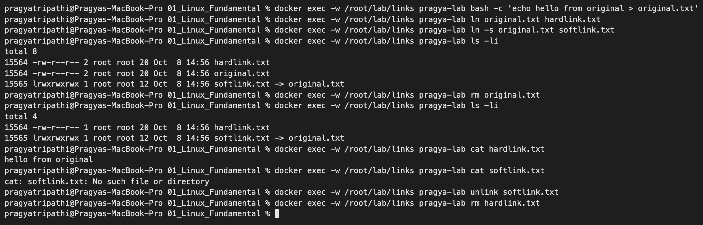
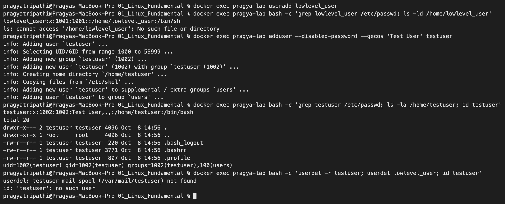
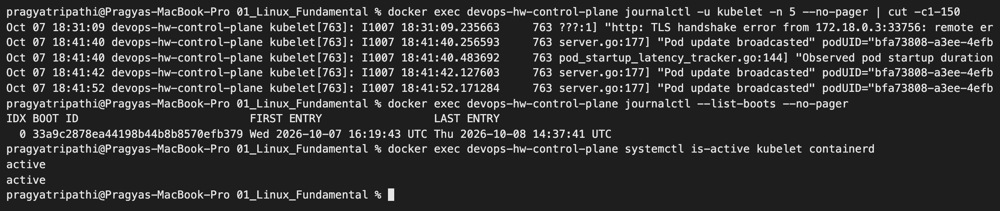
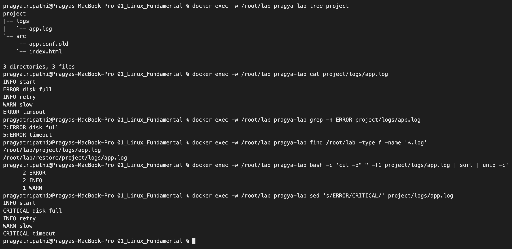
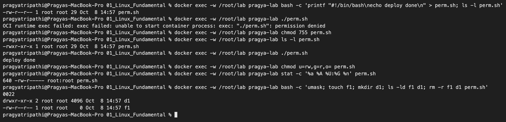
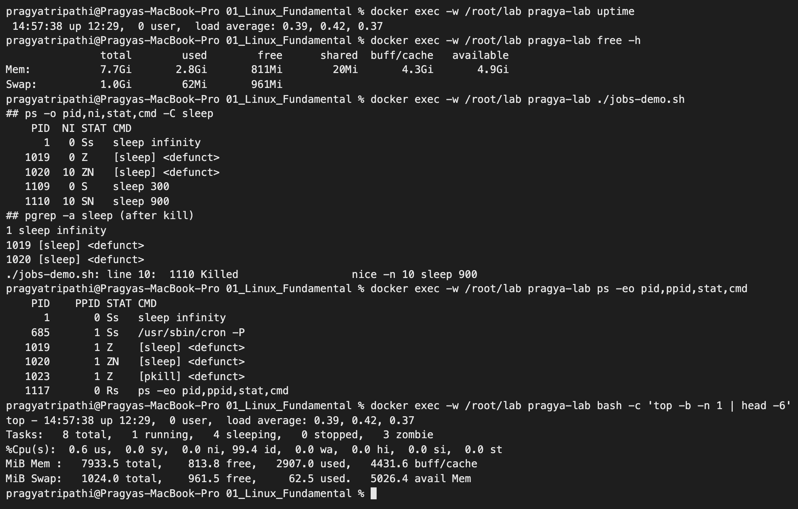
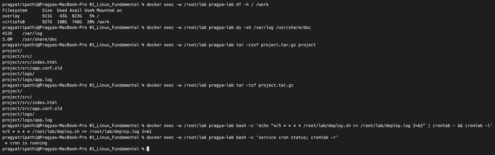

# Linux Fundamentals – Homework

**Name:** Pragya Tripathi
**Roll No:** 24BCS10032

My laptop runs macOS, so the Linux commands below were run inside an `ubuntu:24.04` Docker container (Tasks 1, 2 and 5) and on a systemd-based Linux node (Task 3). All outputs are copied from my terminal.

For Task 5 and the screenshots I used one long-running container called `pragya-lab` and ran every command with `docker exec`:

```text
$ docker run -d --name pragya-lab --hostname pragya-lab ubuntu:24.04 sleep infinity
$ docker exec pragya-lab bash -c 'apt-get update -qq && apt-get install -y -qq iproute2 iputils-ping dnsutils curl net-tools traceroute netcat-openbsd procps psmisc tree ipcalc cron less file lsof sudo zip unzip'
```

Later I saved this container as an image with `docker commit` and restarted it with my shell-scripting folder mounted at `/work` – that is the `/work` line that shows up in `df` below.

| Task | Topic |
|---|---|
| 1 | Soft link vs hard link |
| 2 | `adduser` vs `useradd` |
| 3 | `journalctl` |
| 4 | Linux command cheat sheet |
| 5 | Practising the cheat sheet on Ubuntu: files, search, permissions, users, processes, disk, archives, packages, cron |

---

## Task 1: Soft Link vs Hard Link

| | Hard link | Soft (symbolic) link |
|---|---|---|
| Points to | The same **inode** (the data itself) | The **path** of another file |
| Command | `ln original.txt hardlink.txt` | `ln -s original.txt softlink.txt` |
| Own inode? | No, shares the inode of the original | Yes, it is a separate small file |
| If the original is deleted | Data is still available through the hard link | Link becomes broken (dangling) |
| Across filesystems / partitions | Not allowed | Allowed |
| Can link a directory | No | Yes |
| Looks like in `ls -l` | A normal file, link count goes up | `l` file type and `name -> target` |

### Practice: creating and deleting both links

```text
$ echo "hello from original" > original.txt

$ ln original.txt hardlink.txt

$ ln -s original.txt softlink.txt

$ ls -li
total 8
1969593 -rw-r--r-- 2 root root 20 Sep 17 13:26 hardlink.txt
1969593 -rw-r--r-- 2 root root 20 Sep 17 13:26 original.txt
1969595 lrwxrwxrwx 1 root root 12 Sep 17 13:26 softlink.txt -> original.txt

$ stat -c "%n inode=%i links=%h type=%F" original.txt hardlink.txt softlink.txt
original.txt inode=1969593 links=2 type=regular file
hardlink.txt inode=1969593 links=2 type=regular file
softlink.txt inode=1969595 links=1 type=symbolic link

$ echo "appended via hardlink" >> hardlink.txt

$ cat original.txt
hello from original
appended via hardlink

$ rm original.txt

$ ls -li
total 4
1969593 -rw-r--r-- 1 root root 42 Sep 17 13:26 hardlink.txt
1969595 lrwxrwxrwx 1 root root 12 Sep 17 13:26 softlink.txt -> original.txt

$ cat hardlink.txt
hello from original
appended via hardlink

$ cat softlink.txt
cat: softlink.txt: No such file or directory

$ unlink softlink.txt

$ rm hardlink.txt

$ ls -la
total 8
drwxr-xr-x 2 root root 4096 Sep 17 13:26 .
drwx------ 1 root root 4096 Sep 17 13:26 ..
```

### What I understood

- `original.txt` and `hardlink.txt` have the **same inode number** and a link count of `2`. They are two names for the same data.
- `softlink.txt` has a **different inode**, its type is `symbolic link`, and its size is 12 bytes, which is just the length of the text `original.txt`.
- Writing through the hard link changed the content seen through the original name, because there is only one copy of the data.
- After `rm original.txt` the link count dropped to `1`, but `cat hardlink.txt` still worked. Data is only freed when the link count reaches `0`.
- The soft link broke with `No such file or directory` because the path it points to no longer exists.
- A link is deleted with `rm` or `unlink`. Deleting a link never deletes the other names.

I repeated the whole exercise later for the screenshot (the inode numbers are different because it is a new file, the behaviour is the same):



**Interview answer in one line:** a hard link is another name for the same inode, a soft link is a separate file that stores a path to another file.

---

## Task 2: `adduser` vs `useradd`

| | `useradd` | `adduser` |
|---|---|---|
| What it is | Low-level binary, available on every Linux distribution | High-level, friendly script on Debian/Ubuntu that calls `useradd` internally |
| Home directory | Not created unless `-m` is given | Created automatically |
| Default shell | `/bin/sh` | `/bin/bash` |
| Skeleton files (`.bashrc`, `.profile`) | Not copied unless `-m` | Copied from `/etc/skel` |
| Password / full name | Must be set separately with `passwd` | Asked interactively |
| Best for | Scripts and automation, portable across distributions | Creating users by hand on Ubuntu/Debian |

**Preferred on Ubuntu: `adduser`**, because one command gives a usable account (home directory, bash shell, skeleton files, group). With `useradd` the same result needs `useradd -m -s /bin/bash user` followed by `passwd user`.

### Practice: creating a test user with both commands

`--disabled-password --gecos` were used only so that the command does not stop and wait for interactive input inside the container.

```text
$ useradd lowlevel_user

$ grep lowlevel_user /etc/passwd
lowlevel_user:x:1001:1001::/home/lowlevel_user:/bin/sh

$ ls -ld /home/lowlevel_user
ls: cannot access '/home/lowlevel_user': No such file or directory

$ adduser --disabled-password --gecos "Test User" testuser
info: Adding user `testuser' ...
info: Selecting UID/GID from range 1000 to 59999 ...
info: Adding new group `testuser' (1002) ...
info: Adding new user `testuser' (1002) with group `testuser (1002)' ...
info: Creating home directory `/home/testuser' ...
info: Copying files from `/etc/skel' ...
info: Adding new user `testuser' to supplemental / extra groups `users' ...
info: Adding user `testuser' to group `users' ...

$ grep testuser /etc/passwd
testuser:x:1002:1002:Test User,,,:/home/testuser:/bin/bash

$ ls -la /home/testuser
total 20
drwxr-x--- 2 testuser testuser 4096 Sep 17 13:26 .
drwxr-xr-x 1 root     root     4096 Sep 17 13:26 ..
-rw-r--r-- 1 testuser testuser  220 Sep 17 13:26 .bash_logout
-rw-r--r-- 1 testuser testuser 3771 Sep 17 13:26 .bashrc
-rw-r--r-- 1 testuser testuser  807 Sep 17 13:26 .profile

$ id testuser
uid=1002(testuser) gid=1002(testuser) groups=1002(testuser),100(users)

$ ls -l $(which adduser) $(which useradd)
-rwxr-xr-x 1 root root  55191 Jul  5  2023 /usr/sbin/adduser
-rwxr-xr-x 1 root root 142784 May 30  2024 /usr/sbin/useradd

$ deluser --remove-home testuser
fatal: In order to use the --remove-home, --remove-all-files, and --backup features, you need to install the `perl' package. To accomplish that, run apt-get install perl.

$ userdel lowlevel_user
```

### What I understood

- `useradd lowlevel_user` added a line to `/etc/passwd`, but the shell is `/bin/sh` and the home directory **does not exist**.
- `adduser testuser` created the group, the home directory `/home/testuser`, copied `.bashrc`, `.profile`, `.bash_logout` from `/etc/skel`, and set the shell to `/bin/bash`.
- `adduser` is a much smaller file than `useradd` because it is a script wrapping the real binary.
- `deluser --remove-home` failed in the minimal container because that feature needs the `perl` package. On a normal Ubuntu install it works. `userdel -r` is the low-level equivalent.

Repeated for the screenshot, this time cleaning up with `userdel -r` (which worked; the only message is that the user had no mail spool file):



---

## Task 3: `journalctl`

`journalctl` reads the logs collected by `systemd-journald`. It shows kernel, boot and service logs from one place, and the logs can be filtered by service, time and priority.

A plain Docker container does not run systemd, so there is no journal inside it. I ran these commands on a Linux node that boots with systemd (the control-plane node of my local Kubernetes cluster), where `kubelet` and `containerd` run as systemd services.

```text
$ journalctl --no-pager -n 5
Sep 17 13:28:50 devops-hw-control-plane kubelet[756]: I0917 13:28:50.123854     756 server.go:177] "Pod update broadcasted" podUID="7d30ec19-f0ad-436b-a033-dcf1a00456db" type="MODIFIED"
Sep 17 13:28:50 devops-hw-control-plane kubelet[756]: I0917 13:28:50.123963     756 server.go:177] "Pod update broadcasted" podUID="7ad37049-553a-4d5c-8629-1a7733f6c1b5" type="MODIFIED"
Sep 17 13:28:50 devops-hw-control-plane kubelet[756]: I0917 13:28:50.134641     756 pod_startup_latency_tracker.go:144] "Observed pod startup duration" pod="kube-system/coredns-559f6c778d-bvm4l" podStartSLOduration=13.134622006 podStartE2EDuration="13.134622006s" totalImagesPullingTime="0s" totalInitContainerRuntime="0s" isStatefulPod=false podCreationTimestamp="2026-09-17 13:28:37 +0000 UTC" imagePullSessionsCount=0 imagePullSessionsStartsCount=0 observedRunningTime="2026-09-17 13:28:49.216680172 +0000 UTC m=+20.184326469" watchObservedRunningTime="2026-09-17 13:28:50.134622006 +0000 UTC m=+21.102268303"
Sep 17 13:28:51 devops-hw-control-plane kubelet[756]: I0917 13:28:51.125830     756 server.go:177] "Pod update broadcasted" podUID="7d30ec19-f0ad-436b-a033-dcf1a00456db" type="MODIFIED"
Sep 17 13:28:52 devops-hw-control-plane kubelet[756]: I0917 13:28:52.128964     756 server.go:177] "Pod update broadcasted" podUID="7ad37049-553a-4d5c-8629-1a7733f6c1b5" type="MODIFIED"

$ journalctl --no-pager -u kubelet -n 5
Sep 17 13:28:50 devops-hw-control-plane kubelet[756]: I0917 13:28:50.123854     756 server.go:177] "Pod update broadcasted" podUID="7d30ec19-f0ad-436b-a033-dcf1a00456db" type="MODIFIED"
Sep 17 13:28:50 devops-hw-control-plane kubelet[756]: I0917 13:28:50.123963     756 server.go:177] "Pod update broadcasted" podUID="7ad37049-553a-4d5c-8629-1a7733f6c1b5" type="MODIFIED"
Sep 17 13:28:50 devops-hw-control-plane kubelet[756]: I0917 13:28:50.134641     756 pod_startup_latency_tracker.go:144] "Observed pod startup duration" pod="kube-system/coredns-559f6c778d-bvm4l" podStartSLOduration=13.134622006 podStartE2EDuration="13.134622006s" totalImagesPullingTime="0s" totalInitContainerRuntime="0s" isStatefulPod=false podCreationTimestamp="2026-09-17 13:28:37 +0000 UTC" imagePullSessionsCount=0 imagePullSessionsStartsCount=0 observedRunningTime="2026-09-17 13:28:49.216680172 +0000 UTC m=+20.184326469" watchObservedRunningTime="2026-09-17 13:28:50.134622006 +0000 UTC m=+21.102268303"
Sep 17 13:28:51 devops-hw-control-plane kubelet[756]: I0917 13:28:51.125830     756 server.go:177] "Pod update broadcasted" podUID="7d30ec19-f0ad-436b-a033-dcf1a00456db" type="MODIFIED"
Sep 17 13:28:52 devops-hw-control-plane kubelet[756]: I0917 13:28:52.128964     756 server.go:177] "Pod update broadcasted" podUID="7ad37049-553a-4d5c-8629-1a7733f6c1b5" type="MODIFIED"

$ journalctl --no-pager -u containerd --since "10 min ago" -p warning -n 5
-- No entries --

$ journalctl --no-pager -p err -n 3
-- No entries --

$ journalctl --disk-usage
Archived and active journals take up 8M in the file system.

$ journalctl --list-boots
IDX BOOT ID                          FIRST ENTRY                 LAST ENTRY
  0 d05e5c7ce72b4e0482fff8c25622a921 Thu 2026-09-17 13:28:23 UTC Thu 2026-09-17 13:28:52 UTC

$ systemctl is-active kubelet containerd
active
active
```

Re-run on the current cluster node (the cluster was recreated, so the dates and boot ID are newer than in the text above):



### Commands I practised

| Command | Purpose |
|---|---|
| `journalctl` | All logs, oldest first |
| `journalctl -n 20` | Last 20 lines |
| `journalctl -f` | Follow new logs live, like `tail -f` |
| `journalctl -u kubelet` | Logs of one specific service (unit) |
| `journalctl -u ssh --since "1 hour ago"` | One service, filtered by time |
| `journalctl -p err` | Only priority `err` and worse |
| `journalctl -b` | Logs from the current boot |
| `journalctl --list-boots` | List recorded boots |
| `journalctl -k` | Kernel messages only |
| `journalctl --disk-usage` | Space used by the journal |
| `journalctl --no-pager` | Print directly instead of opening a pager, useful in scripts |

### What I understood

- `-u <service>` is the option used most often, to find out why a service failed after `systemctl status` shows it as failed.
- `-p err` and `--since` cut the noise down quickly. On this node there were no error-level entries, so the output was `-- No entries --`.

---

## Task 4: Linux Command Cheat Sheet

| Category | Command | Purpose |
|---|---|---|
| Navigation | `pwd`, `ls -la`, `cd` | Where am I, list files including hidden, change directory |
| Files | `touch`, `mkdir -p`, `cp -r`, `mv`, `rm -rf` | Create, copy, move/rename, delete |
| Viewing | `cat`, `less`, `head -n`, `tail -f` | Read files, follow a growing log |
| Searching | `grep -rin "text" .`, `find / -name "*.log"` | Search inside files, search for files |
| Text processing | `wc -l`, `sort`, `uniq -c`, `cut`, `awk`, `sed` | Count, sort, de-duplicate, pick columns, replace text |
| Permissions | `chmod 755`, `chown user:group`, `umask` | Change mode and owner |
| Users | `whoami`, `id`, `adduser`, `passwd`, `su -`, `sudo` | Identity and user management |
| Processes | `ps aux`, `top`, `kill -9 PID`, `jobs`, `bg`, `fg` | Inspect and control processes |
| Disk and memory | `df -h`, `du -sh *`, `free -h`, `lsblk` | Disk space, folder sizes, RAM, block devices |
| Services | `systemctl status/start/stop/enable`, `journalctl -u` | Manage services and read their logs |
| Networking | `ip a`, `ping`, `ss -tulnp`, `curl`, `dig` | Addresses, reachability, open ports, HTTP, DNS |
| Archives | `tar -czvf`, `tar -xzvf`, `zip`, `unzip` | Compress and extract |
| Packages | `apt update`, `apt install`, `apt remove` | Install software on Ubuntu/Debian |
| Links | `ln`, `ln -s`, `unlink` | Hard and soft links |
| Help | `man`, `--help`, `which`, `history` | Documentation and command lookup |

Permission numbers: `r=4`, `w=2`, `x=1`. So `chmod 755` means owner `rwx`, group `r-x`, others `r-x`.

---

## Task 5: Practising the cheat sheet on Ubuntu

The cheat sheet above is only useful if the commands are actually used, so I went through the categories from the class PDFs (basic and advanced Linux commands) inside the `pragya-lab` container.

### 5.1 System and files

```text
$ cat /etc/os-release | head -4
PRETTY_NAME="Ubuntu 24.04.5 LTS"
NAME="Ubuntu"
VERSION_ID="24.04"
VERSION="24.04.5 LTS (Noble Numbat)"

$ uname -a
Linux pragya-lab 7.0.12-linuxkit #1 SMP PREEMPT Thu Aug 27 14:02:21 UTC 2026 aarch64 aarch64 aarch64 GNU/Linux

$ pwd
/root/lab

$ mkdir -p project/{src,logs,backup}

$ touch project/src/index.html project/src/app.conf

$ ls -l project
total 12
drwxr-xr-x 2 root root 4096 Oct  8 14:55 backup
drwxr-xr-x 2 root root 4096 Oct  8 14:55 logs
drwxr-xr-x 2 root root 4096 Oct  8 14:55 src

$ tree project
project
|-- backup
|-- logs
`-- src
    |-- app.conf
    `-- index.html

4 directories, 2 files

$ cp project/src/app.conf project/backup/

$ mv project/src/app.conf project/src/app.conf.old

$ ls -la project/src project/backup
project/backup:
total 8
drwxr-xr-x 2 root root 4096 Oct  8 14:55 .
drwxr-xr-x 5 root root 4096 Oct  8 14:55 ..
-rw-r--r-- 1 root root    0 Oct  8 14:55 app.conf

project/src:
total 8
drwxr-xr-x 2 root root 4096 Oct  8 14:55 .
drwxr-xr-x 5 root root 4096 Oct  8 14:55 ..
-rw-r--r-- 1 root root    0 Oct  8 14:55 app.conf.old
-rw-r--r-- 1 root root    0 Oct  8 14:55 index.html

$ rm -r project/backup

$ ls project
logs
src
```

- `uname -a` shows `aarch64` and a `linuxkit` kernel: the container shares the kernel of the small Linux VM that Docker Desktop runs on my Mac (Apple Silicon = ARM).
- `mkdir -p project/{src,logs,backup}` – the `{}` brace expansion creates three folders in one command, `-p` creates the parent too.
- `mv` to a new name in the same folder is how Linux renames a file.

### 5.2 Viewing and searching text

I made a small fake log file to search in:

```text
$ printf "INFO start\nERROR disk full\nINFO retry\nWARN slow\nERROR timeout\n" > project/logs/app.log

$ cat project/logs/app.log
INFO start
ERROR disk full
INFO retry
WARN slow
ERROR timeout

$ head -n 2 project/logs/app.log
INFO start
ERROR disk full

$ tail -n 2 project/logs/app.log
WARN slow
ERROR timeout

$ grep ERROR project/logs/app.log
ERROR disk full
ERROR timeout

$ grep -c ERROR project/logs/app.log
2

$ grep -rin error project/
project/logs/app.log:2:ERROR disk full
project/logs/app.log:5:ERROR timeout

$ find /root/lab -type f -name "*.log"
/root/lab/project/logs/app.log

$ cut -d" " -f1 project/logs/app.log | sort | uniq -c
      2 ERROR
      2 INFO
      1 WARN

$ wc -l project/logs/app.log
5 project/logs/app.log

$ awk '{print $2}' project/logs/app.log
start
disk
retry
slow
timeout

$ sed 's/ERROR/CRITICAL/' project/logs/app.log | head -2
INFO start
CRITICAL disk full

$ file project/logs/app.log /bin/ls
project/logs/app.log: ASCII text
/bin/ls:              ELF 64-bit LSB pie executable, ARM aarch64, version 1 (SYSV), dynamically linked, interpreter /lib/ld-linux-aarch64.so.1, BuildID[sha1]=00a639537eef557c0dcb20ad52892bc84863ed94, for GNU/Linux 3.7.0, stripped
```

- `grep -rin` = recursive, ignore case (`error` matched `ERROR`), show line numbers.
- `cut | sort | uniq -c` is a quick way to count log levels; `uniq` only merges lines that are next to each other, which is why `sort` comes first.
- `sed 's/old/new/'` only prints the changed text – the file itself is not modified unless `-i` is used.



### 5.3 Permissions and ownership

```text
$ printf "#!/bin/bash\necho deploy done\n" > deploy.sh

$ ls -l deploy.sh
-rw-r--r-- 1 root root 29 Oct  8 14:55 deploy.sh

$ ./deploy.sh
/tmp/b.sh: line 1: ./deploy.sh: Permission denied

$ chmod 755 deploy.sh

$ ls -l deploy.sh
-rwxr-xr-x 1 root root 29 Oct  8 14:55 deploy.sh

$ ./deploy.sh
deploy done

$ chmod u=rw,g=r,o= deploy.sh

$ ls -l deploy.sh
-rw-r----- 1 root root 29 Oct  8 14:55 deploy.sh

$ stat -c "%a %A %n" deploy.sh
640 -rw-r----- deploy.sh

$ umask
0022

$ touch newfile && mkdir newdir && ls -ld newfile newdir
drwxr-xr-x 2 root root 4096 Oct  8 14:55 newdir
-rw-r--r-- 1 root root    0 Oct  8 14:55 newfile
```

(I ran this block as a small script, `/tmp/b.sh`, which is why the error message starts with that name.)

- A new file is not executable – even root got `Permission denied` until `chmod 755` added the `x` bits.
- `chmod u=rw,g=r,o=` is the symbolic way of writing `640`.
- `umask 0022` removes write permission for group and others from new files: files start from `666` → `644`, directories from `777` → `755`, exactly what `ls -ld` showed.



### 5.4 Users and groups

```text
$ groupadd devops

$ useradd -m -s /bin/bash -G devops pragya

$ id pragya
uid=1001(pragya) gid=1002(pragya) groups=1002(pragya),1001(devops)

$ chown pragya:devops deploy.sh

$ ls -l deploy.sh
-rw-r----- 1 pragya devops 29 Oct  8 14:55 deploy.sh

$ usermod -aG sudo pragya

$ groups pragya
pragya : pragya sudo devops

$ echo "pragya:Practice@123" | chpasswd

$ passwd -S pragya
pragya P 2026-10-08 0 99999 7 -1

$ su - pragya -c "whoami; pwd; cat /root/lab/deploy.sh"
pragya
/home/pragya
cat: /root/lab/deploy.sh: Permission denied

$ ls -ld /root
drwx------ 1 root root 4096 Oct  8 14:55 /root

$ cp -p deploy.sh /opt/deploy.sh

$ ls -l /opt/deploy.sh
-rw-r----- 1 pragya devops 29 Oct  8 14:55 /opt/deploy.sh

$ su - pragya -c "cat /opt/deploy.sh"
#!/bin/bash
echo deploy done

$ su - pragya -c "touch /etc/test.conf"
touch: cannot touch '/etc/test.conf': Permission denied

$ userdel -r pragya
userdel: pragya mail spool (/var/mail/pragya) not found

$ groupdel devops

$ rm /opt/deploy.sh

$ id pragya
id: 'pragya': no such user
```

Something I did not expect: `pragya` **owned** `deploy.sh` and still could not read it. The reason is the folder, not the file – `/root` is `drwx------`, so nobody except root may even enter it. After copying the file (with `-p` to keep owner and mode) to `/opt`, the same `cat` worked. To open a file a user needs `x` permission on **every directory in the path** plus `r` on the file.

`-aG` in `usermod` means *append* to the group list; without `-a` the user would be removed from all other supplementary groups. `passwd -S` shows `P` = a usable password is set.

### 5.5 Processes, jobs and monitoring

```text
$ uptime
 14:55:49 up 12:27,  0 user,  load average: 0.44, 0.39, 0.36

$ free -h
               total        used        free      shared  buff/cache   available
Mem:           7.7Gi       2.9Gi       780Mi        20Mi       4.3Gi       4.8Gi
Swap:          1.0Gi        62Mi       961Mi

$ nproc
15

$ vmstat 1 2
procs -----------memory---------- ---swap-- -----io---- -system-- -------cpu-------
 r  b   swpd   free   buff  cache   si   so    bi    bo   in   cs us sy id wa st gu
 1  0  63976 799344 213896 4245376    0    1   236  1035 33967   35  3  7 89  0  0  0
 0  0  63976 800588 213908 4245500    0    0     0   176 6560 8901  1  1 99  0  0  0

$ top -b -n 1 | head -12
top - 14:55:50 up 12:27,  0 user,  load average: 0.40, 0.38, 0.36
Tasks:   4 total,   1 running,   3 sleeping,   0 stopped,   0 zombie
%Cpu(s):  2.6 us,  0.6 sy,  0.0 ni, 96.8 id,  0.0 wa,  0.0 hi,  0.0 si,  0.0 st
MiB Mem :   7933.5 total,    779.5 free,   3017.9 used,   4355.0 buff/cache
MiB Swap:   1024.0 total,    961.5 free,     62.5 used.   4915.5 avail Mem

    PID USER      PR  NI    VIRT    RES    SHR S  %CPU  %MEM     TIME+ COMMAND
      1 root      20   0    2280   1216   1136 S   0.0   0.0   0:00.00 sleep
    569 root      20   0    4044   3036   2768 S   0.0   0.0   0:00.00 bash
    579 root      20   0    8500   4664   2688 R   0.0   0.1   0:00.00 top
    580 root      20   0    2292   1236   1152 S   0.0   0.0   0:00.00 head

$ sleep 300 &

$ nohup sleep 600 > /dev/null 2>&1 &

$ nice -n 10 sleep 900 &

$ jobs -l
[1]    581 Running                 sleep 300 &
[2]-   582 Running                 nohup sleep 600 > /dev/null 2>&1 &
[3]+   583 Running                 nice -n 10 sleep 900 &

$ ps aux --sort=-%mem | head -6
USER         PID %CPU %MEM    VSZ   RSS TTY      STAT START   TIME COMMAND
root         584  0.0  0.0   7640  3644 ?        R    14:55   0:00 ps aux --sort=-%mem
root         569  0.0  0.0   4044  3036 ?        Ss   14:55   0:00 bash /tmp/c.sh
root         583  0.0  0.0   2280  1284 ?        SN   14:55   0:00 sleep 900
root         582  0.0  0.0   2280  1280 ?        S    14:55   0:00 sleep 600
root         581  0.0  0.0   2280  1276 ?        S    14:55   0:00 sleep 300

$ ps -o pid,ni,cmd -C sleep
    PID  NI CMD
      1   0 sleep infinity
    581   0 sleep 300
    582   0 sleep 600
    583  10 sleep 900

$ pgrep -a sleep
1 sleep infinity
581 sleep 300
582 sleep 600
583 sleep 900

$ renice -n 5 -p $(pgrep -f "sleep 300")
581 (process ID) old priority 0, new priority 5

$ kill $(pgrep -f "sleep 300")

$ pkill -f "sleep 600"

$ kill -9 $(pgrep -f "sleep 900")

$ sleep 0.2; pgrep -a sleep
/tmp/c.sh: line 1:   583 Killed                  nice -n 10 sleep 900
1 sleep infinity
```

- `&` runs a command in the background; `jobs -l` lists them with their PIDs. `nohup` keeps a job alive after logout.
- The `N` in `SN` and `NI 10` show the lower priority from `nice -n 10`; `renice` changed a running process.
- `kill PID` / `pkill name` send SIGTERM (the process may clean up), `kill -9` sends SIGKILL (cannot be ignored – bash even printed `Killed`).
- PID 1 is `sleep infinity`, the command I started the container with. A container has its own, very small, process tree.
- Only 4 tasks in `top`, but `nproc` says 15 CPUs and `free` shows ~7.7 GiB – those are the numbers of the Docker Desktop VM, because containers share the host kernel.

**A mistake that created zombies.** For the screenshot I first put the whole demo into one command: `docker exec pragya-lab bash -c 'sleep 300 & nice -n 10 sleep 900 & ...; pkill -f "sleep 300"; kill -9 ...; pgrep -a sleep'`. The output stopped right after the first `ps`. `pkill -f` matches the **full command line**, and the command line of that `bash -c` itself contained the text `sleep 300` – so pkill killed my own shell before it reached the next commands. I moved the demo into a script file (`jobs-demo.sh`, whose command line is just `/bin/bash ./jobs-demo.sh`) and it worked. But the processes left behind by the first attempt show up as zombies:

```text
$ docker exec -w /root/lab pragya-lab ./jobs-demo.sh
## ps -o pid,ni,stat,cmd -C sleep
    PID  NI STAT CMD
      1   0 Ss   sleep infinity
   1019   0 Z    [sleep] <defunct>
   1020  10 ZN   [sleep] <defunct>
   1109   0 S    sleep 300
   1110  10 SN   sleep 900
## pgrep -a sleep (after kill)
1 sleep infinity
1019 [sleep] <defunct>
1020 [sleep] <defunct>
./jobs-demo.sh: line 10:  1110 Killed                  nice -n 10 sleep 900

$ docker exec -w /root/lab pragya-lab ps -eo pid,ppid,stat,cmd
    PID    PPID STAT CMD
      1       0 Ss   sleep infinity
    685       1 Ss   /usr/sbin/cron -P
   1019       1 Z    [sleep] <defunct>
   1020       1 ZN   [sleep] <defunct>
   1023       1 Z    [pkill] <defunct>
   1117       0 Rs   ps -eo pid,ppid,stat,cmd
```

When a parent dies, its children are adopted by PID 1 (`PPID 1`). A normal init system (`systemd`) calls `wait()` and removes finished children. Here PID 1 is `sleep`, which never does that, so the finished processes stay as `Z` / `<defunct>` entries until the container stops. That is why real images use a proper init (`docker run --init`, `tini`) when the main process starts child processes.



### 5.6 Disk, archives, packages, cron

```text
$ df -h / /work
Filesystem      Size  Used Avail Use% Mounted on
overlay         911G   43G  823G   5% /
virtiofs0       927G  180G  748G  20% /work

$ du -sh /var/log /usr/share/doc
400K	/var/log
5.6M	/usr/share/doc

$ du -sh /usr/* 2>/dev/null | sort -h | tail -4
12M	/usr/sbin
42M	/usr/share
45M	/usr/bin
204M	/usr/lib

$ mount | grep " /work "
virtiofs0 on /work type virtiofs (rw,nosuid,nodev,relatime,ignore_atime,no_xattr)

$ tar -czvf project.tar.gz project
project/
project/src/
project/src/index.html
project/src/app.conf.old
project/logs/
project/logs/app.log

$ ls -lh project.tar.gz
-rw-r--r-- 1 root root 282 Oct  8 14:56 project.tar.gz

$ tar -tzf project.tar.gz
project/
project/src/
project/src/index.html
project/src/app.conf.old
project/logs/
project/logs/app.log

$ mkdir restore && tar -xzf project.tar.gz -C restore && ls restore/project
logs
src

$ zip -qr project.zip project && unzip -l project.zip
Archive:  project.zip
  Length      Date    Time    Name
---------  ---------- -----   ----
        0  2026-10-08 14:55   project/
        0  2026-10-08 14:55   project/src/
        0  2026-10-08 14:55   project/src/index.html
        0  2026-10-08 14:55   project/src/app.conf.old
        0  2026-10-08 14:55   project/logs/
       62  2026-10-08 14:55   project/logs/app.log
---------                     -------
       62                     6 files

$ apt list --installed 2>/dev/null | grep -E "^(curl|tree|cron)/"
cron/noble,now 3.0pl1-184ubuntu2 arm64 [installed]
curl/noble-updates,noble-security,now 8.5.0-2ubuntu10.15 arm64 [installed]
tree/noble-updates,now 2.1.1-2ubuntu3.24.04.2 arm64 [installed]

$ dpkg -L tree | grep bin/
/usr/bin/tree

$ apt-get remove -y -qq tree > /dev/null && which tree; echo "tree exit code: $?"
tree exit code: 1

$ apt-get install -y -qq tree > /dev/null && which tree
debconf: delaying package configuration, since apt-utils is not installed
/usr/bin/tree

$ echo "*/5 * * * * /root/lab/deploy.sh >> /root/lab/deploy.log 2>&1" | crontab -

$ crontab -l
*/5 * * * * /root/lab/deploy.sh >> /root/lab/deploy.log 2>&1

$ service cron start
 * Starting periodic command scheduler cron
   ...done.

$ service cron status
 * cron is running

$ crontab -r && crontab -l
no crontab for root

$ find /root/lab -name "*.log" | xargs wc -l
  5 /root/lab/project/logs/app.log
  5 /root/lab/restore/project/logs/app.log
 10 total
```

- `df` = free space per filesystem; `du` = how much a folder uses. `/` is Docker's `overlay` filesystem, `/work` is my Mac folder shared into the container.
- `tar -c` create, `-x` extract, `-t` list, `-z` gzip, `-v` verbose, `-f` file name.
- After `apt-get remove`, `which tree` printed nothing and returned `1`; after `install` it was back in `/usr/bin`.
- Cron format: `minute hour day-of-month month day-of-week command` – `*/5 * * * *` = every 5 minutes. There is no systemd in the container, so I started cron with `service cron start`.
- `xargs` turns the list of file names from `find` into arguments for `wc -l`.



### 5.7 Aliases – works in my shell, not in a script

```text
$ docker exec pragya-lab bash -c "alias ll='ls -alF'; alias; type ll"
bash: line 1: type: ll: not found
alias ll='ls -alF'

$ docker exec pragya-lab bash -c "shopt -s expand_aliases; alias ll='ls -alF'; type ll"
ll is aliased to `ls -alF'

$ docker exec -w /root/lab pragya-lab bash -ic "alias ll='ls -alF'; type ll; ll project"
bash: cannot set terminal process group (-1): Inappropriate ioctl for device
bash: no job control in this shell
ll is aliased to `ls -alF'
total 16
drwxr-xr-x 4 root root 4096 Oct  8 14:55 ./
drwxr-xr-x 5 root root 4096 Oct  8 14:56 ../
drwxr-xr-x 2 root root 4096 Oct  8 14:55 logs/
drwxr-xr-x 2 root root 4096 Oct  8 14:55 src/
```

The alias was saved (`alias` lists it) but a non-interactive shell does not use aliases, so `type ll` failed. With `shopt -s expand_aliases` or an interactive shell (`bash -i`) it works. That is why aliases go into `~/.bashrc` (read by interactive shells) and scripts should use the full command.

---

## What I understood

- Everything in Linux is a file with an inode; hard links are extra names for the same inode, soft links are small files holding a path.
- `adduser` is the friendly Ubuntu wrapper; `useradd` is the portable low-level tool that needs flags (`-m -s /bin/bash`) to give the same result.
- `journalctl -u <service>` plus `-p err` / `--since` is the fastest way to find why a service failed; it needs systemd, which normal containers do not have.
- Permissions are `rwx` for user, group, others (`r=4 w=2 x=1`). To read a file you also need `x` on every directory above it.
- `ps`, `top`, `pgrep`, `kill`, `nice` cover most process work; `kill -9` is the last resort.
- PID 1 has a special job: adopting and reaping orphans. A container whose PID 1 cannot do that collects zombie processes.
- `df`/`du` for disk, `tar` for backups, `apt` for software, `crontab` for scheduled jobs – the same commands I will use on any Ubuntu server.
