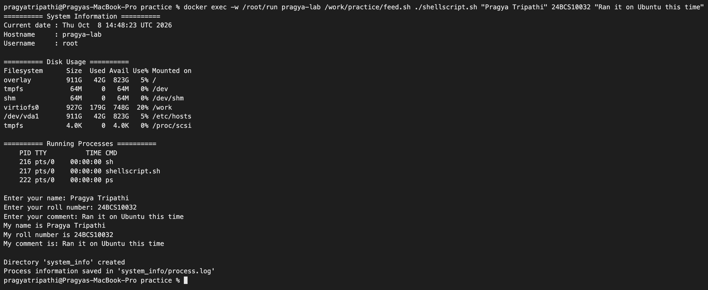
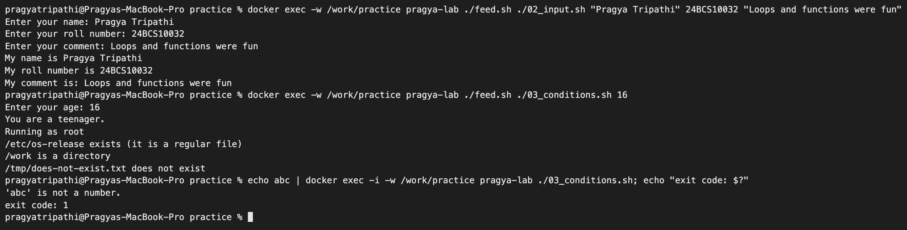
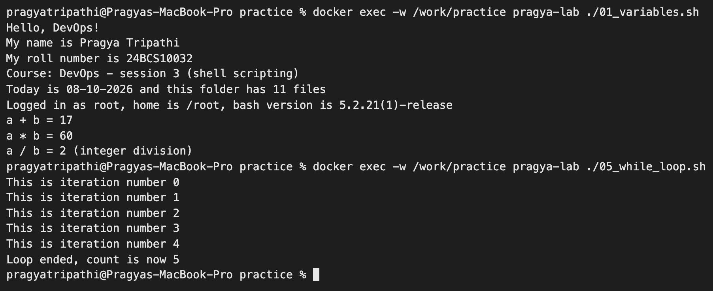
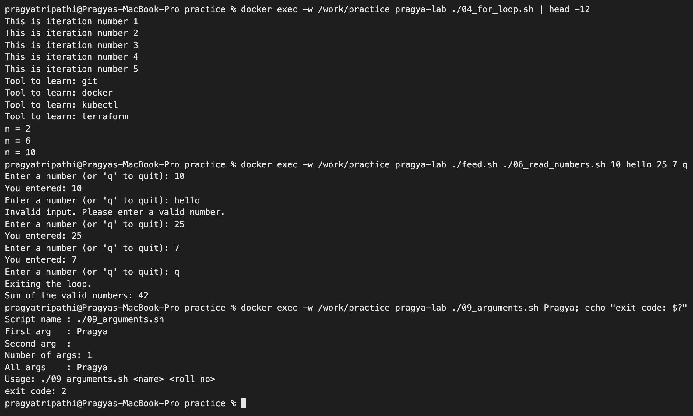
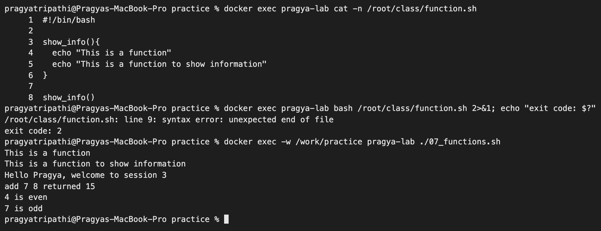
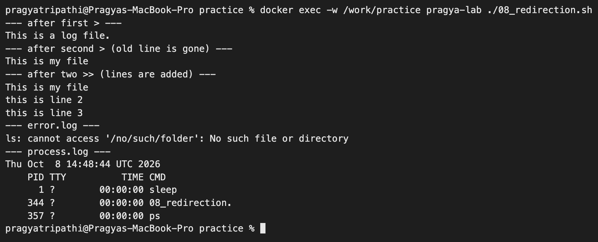

# Shell Scripting – Homework

**Name:** Pragya Tripathi
**Roll No:** 24BCS10032

This folder has two parts:

1. **The homework task** – a system information script ([shellscript.sh](shellscript.sh)). I first ran it on my Mac, then again inside an `ubuntu:24.04` container to see the Linux output.
2. **Class practice** – the small scripts from session 3 (variables, input, conditions, loops, functions, redirection) rewritten by me in [practice/](practice/) and run inside the same container.

The container was started once and reused for everything:

```text
$ docker run -d --name pragya-lab --hostname pragya-lab ubuntu:24.04 sleep infinity
$ docker exec pragya-lab bash -c 'apt-get update -qq && apt-get install -y -qq procps iproute2 iputils-ping dnsutils curl net-tools ...'
$ docker commit pragya-lab pragya-lab-img:24.04          # keep the installed tools
$ docker rm -f pragya-lab
$ docker run -d --name pragya-lab --hostname pragya-lab -v "$PWD":/work pragya-lab-img:24.04 sleep infinity
```

So inside the container `/work` is this folder and `/work/practice` is the practice folder.

## Task: System Information Script

Script: [shellscript.sh](shellscript.sh)

| Requirement | How the script does it |
|---|---|
| Print the current date | `current_date=$(date)` then `echo` |
| Print the hostname | `host_name=$(hostname)` |
| Print the username | `user_name=$(whoami)` |
| Print the disk usage | `df -h` |
| Print the running processes | `ps` |
| Use variables | `current_date`, `host_name`, `user_name`, `work_dir`, `log_file`, `name`, `roll_no`, `comment` |
| Take user input | `read -p "Enter your name: " name` |
| Create a directory | `mkdir -p "$work_dir"` |
| Create a file | `touch "$log_file"` |
| Store the processes in the file using `>` | `ps > "$log_file"` |

## The script

```bash
#!/bin/bash
# System Information Script - DevOps Homework (Shell Scripting)

# Variables to store and reuse data
current_date=$(date)
host_name=$(hostname)
user_name=$(whoami)
work_dir="system_info"
log_file="$work_dir/process.log"

echo "========== System Information =========="
echo "Current date : $current_date"
echo "Hostname     : $host_name"
echo "Username     : $user_name"

echo
echo "========== Disk Usage =========="
df -h

echo
echo "========== Running Processes =========="
ps

# Take user input using read -p
echo
read -p "Enter your name: " name
read -p "Enter your roll number: " roll_no
read -p "Enter your comment: " comment

echo "My name is $name"
echo "My roll number is $roll_no"
echo "My comment is: $comment"

# Create a directory using mkdir and a file using touch
mkdir -p "$work_dir"
touch "$log_file"

# Store the running processes in the file using > output redirection
ps > "$log_file"

echo
echo "Directory '$work_dir' created"
echo "Process information saved in '$log_file'"
```

## How to run

```bash
chmod +x shellscript.sh
./shellscript.sh
```

## Output

For this capture the three answers were sent to the script through a pipe, so the `read -p` prompts are not printed (bash only shows the prompt when the input comes from a terminal). When run by hand, the prompts `Enter your name:`, `Enter your roll number:` and `Enter your comment:` appear one by one.

```text
$ printf 'Pragya Tripathi\n24BCS10032\nShell scripting homework\n' | ./shellscript.sh
========== System Information ==========
Current date : Thu Sep 17 18:56:35 IST 2026
Hostname     : MacBook-Pro-10.local
Username     : pragyatripathi

========== Disk Usage ==========
Filesystem        Size    Used   Avail Capacity iused ifree %iused  Mounted on
/dev/disk3s1s1   926Gi    12Gi   431Gi     3%    459k  4.3G    0%   /
devfs            198Ki   198Ki     0Bi   100%     684     0  100%   /dev
/dev/disk3s6     926Gi    20Ki   431Gi     1%       0  4.5G    0%   /System/Volumes/VM
/dev/disk3s2     926Gi   8.9Gi   431Gi     3%    1.5k  4.5G    0%   /System/Volumes/Preboot
/dev/disk3s4     926Gi   3.3Mi   431Gi     1%      36  4.5G    0%   /System/Volumes/Update
/dev/disk1s2     550Mi   6.0Mi   530Mi     2%       1  5.4M    0%   /System/Volumes/xarts
/dev/disk1s1     550Mi   5.9Mi   530Mi     2%      53  5.4M    0%   /System/Volumes/iSCPreboot
/dev/disk1s3     550Mi   3.0Mi   530Mi     1%     106  5.4M    0%   /System/Volumes/Hardware
/dev/disk3s5     926Gi   471Gi   431Gi    53%    5.9M  4.5G    0%   /System/Volumes/Data
map auto_home      0Bi     0Bi     0Bi   100%       0     0     -   /System/Volumes/Data/home

========== Running Processes ==========
  PID TTY           TIME CMD
71500 ttys001    0:00.03 /bin/zsh -il

My name is Pragya Tripathi
My roll number is 24BCS10032
My comment is: Shell scripting homework

Directory 'system_info' created
Process information saved in 'system_info/process.log'
```

### Directory and file created by the script

```text
$ ls -la system_info
total 8
drwxr-xr-x  3 pragyatripathi  staff   96 Sep 17 18:56 .
drwxr-xr-x  6 pragyatripathi  staff  192 Sep 17 18:56 ..
-rw-r--r--  1 pragyatripathi  staff   67 Sep 17 18:56 process.log

$ cat system_info/process.log
  PID TTY           TIME CMD
71500 ttys001    0:00.03 /bin/zsh -il
```


### Running the same script on Ubuntu

On the Mac, `read -p` did not print its prompts because the answers came through a pipe. To see the prompts and the answers together I wrote a tiny helper, [practice/feed.sh](practice/feed.sh). It runs a script inside a pseudo-terminal (`script -qec`) and types one answer every half second, so the screen looks exactly like typing by hand. I copied `shellscript.sh` to `/root/run` in the container so that the Linux run would not overwrite the `system_info/process.log` from my Mac run.

```text
$ docker exec -w /root/run pragya-lab /work/practice/feed.sh ./shellscript.sh "Pragya Tripathi" 24BCS10032 "Ran it on Ubuntu this time"
========== System Information ==========
Current date : Thu Oct  8 14:47:56 UTC 2026
Hostname     : pragya-lab
Username     : root

========== Disk Usage ==========
Filesystem      Size  Used Avail Use% Mounted on
overlay         911G   42G  823G   5% /
tmpfs            64M     0   64M   0% /dev
shm              64M     0   64M   0% /dev/shm
virtiofs0       927G  179G  748G  20% /work
/dev/vda1       911G   42G  823G   5% /etc/hosts
tmpfs           4.0K     0  4.0K   0% /proc/scsi

========== Running Processes ==========
    PID TTY          TIME CMD
    186 pts/0    00:00:00 sh
    187 pts/0    00:00:00 shellscript.sh
    192 pts/0    00:00:00 ps

Enter your name: Pragya Tripathi
Enter your roll number: 24BCS10032
Enter your comment: Ran it on Ubuntu this time
My name is Pragya Tripathi
My roll number is 24BCS10032
My comment is: Ran it on Ubuntu this time

Directory 'system_info' created
Process information saved in 'system_info/process.log'

$ docker exec -w /root/run pragya-lab bash -c 'ls -la system_info; cat system_info/process.log'
total 12
drwxr-xr-x 2 root root 4096 Oct  8 14:47 .
drwxr-xr-x 3 root root 4096 Oct  8 14:47 ..
-rw-r--r-- 1 root root  129 Oct  8 14:47 process.log
    PID TTY          TIME CMD
    186 pts/0    00:00:00 sh
    187 pts/0    00:00:00 shellscript.sh
    197 pts/0    00:00:00 ps
```



Differences from the Mac run: the hostname is the container name, the user is `root`, `df -h` shows the overlay filesystem and my mounted folder (`/work`), and Linux `ps` prints `HH:MM:SS` times instead of the macOS format. `ps` lists `shellscript.sh` itself and the `ps` command, because they are running at that moment.

### `hostname` / `whoami` – a mistake in the class notes I tried out

The class task notes had `echo $hostname` and `echo $whoami`. I tried the variations on my Mac to see which one actually prints the hostname:

```text
$ echo $hostname

$ echo hostname
hostname
$ echo $(hostname)
Pragyas-MacBook-Pro.local
$ whoami
pragyatripathi
$ who
_mbsetupuser     console      Sep  8 15:06
pragyatripathi   console      Sep  8 15:11
$ w | head -3
20:18  up 30 days,  5:13, 2 users, load averages: 4.00 2.91 2.93
USER       TTY      FROM    LOGIN@  IDLE WHAT
_mbsetupus console  -      08Sep26 30days -
```

- `$hostname` is an empty variable (nobody set it), so `echo` prints an empty line.
- `echo hostname` just prints the word.
- `$(hostname)` runs the command and puts its output in place. That is why my script uses `host_name=$(hostname)`.
- `who` and `w` list logged-in users. Inside the container both were empty (`0 user`), because nobody logs in to a container; I only `docker exec` into it.

---

## Class practice scripts

All of these are in [practice/](practice/) and were run inside the `pragya-lab` container (bash 5.2 on Ubuntu 24.04).

| Script | Topic |
|---|---|
| [01_variables.sh](practice/01_variables.sh) | Variables, `$(...)`, arithmetic `$(( ))` |
| [02_input.sh](practice/02_input.sh) | `read -p` input |
| [03_conditions.sh](practice/03_conditions.sh) | `if / elif / else`, number, string and file tests |
| [04_for_loop.sh](practice/04_for_loop.sh) | `for` over a range, a list, C-style, and files |
| [05_while_loop.sh](practice/05_while_loop.sh) | `while` with a counter |
| [06_read_numbers.sh](practice/06_read_numbers.sh) | `while true` + `break` / `continue` |
| [07_functions.sh](practice/07_functions.sh) | Functions, arguments, `local`, return codes |
| [08_redirection.sh](practice/08_redirection.sh) | `mkdir`, `>`, `>>`, `2>` |
| [09_arguments.sh](practice/09_arguments.sh) | `$0 $1 $# $@` and `exit` codes |
| [feed.sh](practice/feed.sh) | Helper that types answers into an interactive script |

### 1. Variables

```text
$ docker exec -w /work/practice pragya-lab ./01_variables.sh
Hello, DevOps!
My name is Pragya Tripathi
My roll number is 24BCS10032
Course: DevOps - session 3 (shell scripting)
Today is 08-10-2026 and this folder has 9 files
Logged in as root, home is /root, bash version is 5.2.21(1)-release
a + b = 17
a * b = 60
a / b = 2 (integer division)
```

- No spaces around `=` when assigning (`name="Pragya"`). `name = "Pragya"` would try to run a command called `name`.
- A command name such as `ls` should not be used as a variable name.
- `$((a / b))` gives `2`, not `2.4`, because bash only does integer maths.

I use `$(whoami)` instead of `$USER` on purpose. Inside the container `$USER` is not set at all, because `docker exec` does not go through a login:

```text
$ docker exec pragya-lab bash -c 'echo "USER=[$USER] SHELL=[$SHELL] HOME=[$HOME]"'
USER=[] SHELL=[/bin/bash] HOME=[/root]
```

### 2. Input and 3. Conditions

```text
$ docker exec -w /work/practice pragya-lab ./feed.sh ./02_input.sh "Pragya Tripathi" 24BCS10032 "Loops and functions were fun"
Enter your name: Pragya Tripathi
Enter your roll number: 24BCS10032
Enter your comment: Loops and functions were fun
My name is Pragya Tripathi
My roll number is 24BCS10032
My comment is: Loops and functions were fun
```

I ran the condition script with five different ages:

```text
$ for a in 9 16 35 -4 abc; do ./feed.sh ./03_conditions.sh $a; done      (inside the container)
Enter your age: 9
You are a child.
Running as root
/etc/os-release exists (it is a regular file)
/work is a directory
/tmp/does-not-exist.txt does not exist
Enter your age: 16
You are a teenager.
...
Enter your age: 35
You are an adult.
...
Enter your age: -4
Invalid age. Please enter a valid age.
...
Enter your age: abc
'abc' is not a number.
```

(`...` = the same four file/user lines as in the first run.)

The number check at the top is there because of what happened with the class version of the script, which has no check. Giving it `abc`:

```text
$ echo abc | bash condition.sh          (class version)
condition.sh: line 5: [: abc: integer expression expected
condition.sh: line 7: [: abc: integer expression expected
condition.sh: line 9: [: abc: integer expression expected
You are an adult.
$ echo "exit code: $?"
exit code: 0

$ echo abc | ./03_conditions.sh         (my version)
'abc' is not a number.
$ echo "exit code: $?"
exit code: 1
```

`[ abc -lt 0 ]` is an error, the error counts as "false", so every test failed and the script ended up in `else` and called "abc" an adult – and still exited with `0`. My version checks the input with a regex (`[[ $age =~ ^-?[0-9]+$ ]]`) first and exits with `1`.



| Test | Meaning |
|---|---|
| `-eq -ne -lt -le -gt -ge` | Compare numbers |
| `==` / `!=` | Compare strings |
| `-f file` | Is a regular file |
| `-d dir` | Is a directory |
| `-e path` | Exists (anything) |
| `!` | Not |

### 4. Loops

```text
$ docker exec -w /work/practice pragya-lab ./04_for_loop.sh
This is iteration number 1
This is iteration number 2
This is iteration number 3
This is iteration number 4
This is iteration number 5
Tool to learn: git
Tool to learn: docker
Tool to learn: kubectl
Tool to learn: terraform
n = 2
n = 6
n = 10
01_variables.sh has 27 lines
02_input.sh has 10 lines
03_conditions.sh has 39 lines
04_for_loop.sh has 24 lines
05_while_loop.sh has 10 lines
06_read_numbers.sh has 19 lines
07_functions.sh has 38 lines
08_redirection.sh has 29 lines
09_arguments.sh has 16 lines

$ docker exec -w /work/practice pragya-lab ./05_while_loop.sh
This is iteration number 0
This is iteration number 1
This is iteration number 2
This is iteration number 3
This is iteration number 4
Loop ended, count is now 5

$ docker exec -w /work/practice pragya-lab ./feed.sh ./06_read_numbers.sh 10 hello 25 7 q
Enter a number (or 'q' to quit): 10
You entered: 10
Enter a number (or 'q' to quit): hello
Invalid input. Please enter a valid number.
Enter a number (or 'q' to quit): 25
You entered: 25
Enter a number (or 'q' to quit): 7
You entered: 7
Enter a number (or 'q' to quit): q
Exiting the loop.
Sum of the valid numbers: 42
```

- The `for` loop ran 5 times for `{1..5}`; the `while` loop also ran 5 times but started at `0`, and `count` was `5` when the condition `count < 5` became false.
- `continue` skipped `hello` and went back to the prompt; `break` left the endless `while true` loop when I typed `q`. Only `10 + 25 + 7 = 42` were added.





### 5. Functions

The function example from class did not run when I typed it in exactly:

```text
$ cat -n function.sh
     1	#!/bin/bash
     2
     3	show_info(){
     4	  echo "This is a function"
     5	  echo "This is a function to show information"
     6	}
     7
     8	show_info()
$ bash function.sh
function.sh: line 9: syntax error: unexpected end of file
$ echo "exit code: $?"
exit code: 2
```

`show_info()` with brackets on line 8 is not a call – bash reads it as the start of a **new** function definition and waits for its body `{ ... }`, which never comes, so the file "ends unexpectedly". A function is called by its name only: `show_info`. My fixed and extended version:

```text
$ docker exec -w /work/practice pragya-lab ./07_functions.sh
This is a function
This is a function to show information
Hello Pragya, welcome to session 3
add 7 8 returned 15
4 is even
7 is odd
```

- Arguments reach a function as `$1`, `$2`, … just like a script.
- `local` keeps a variable inside the function.
- To "return" a value I `echo` it and catch it with `$(add 7 8)`. `return` is only for a status code (0 = success), which is why `if is_even 4` works.



### 6. Directories, files and redirection

```text
$ docker exec -w /work/practice pragya-lab ./08_redirection.sh
--- after first > ---
This is a log file.
--- after second > (old line is gone) ---
This is my file
--- after two >> (lines are added) ---
This is my file
this is line 2
this is line 3
--- error.log ---
ls: cannot access '/no/such/folder': No such file or directory
--- process.log ---
Thu Oct  8 14:47:52 UTC 2026
    PID TTY          TIME CMD
      1 ?        00:00:00 sleep
    153 ?        00:00:00 bash
    159 ?        00:00:00 08_redirection.
    167 ?        00:00:00 ps
```

| Operator | What it does |
|---|---|
| `>` | Write stdout to a file, replacing what was there |
| `>>` | Append stdout to the end of the file |
| `2>` | Write errors (stderr) to a file |
| `2>&1` | Send errors to the same place as normal output |
| `<` | Read a file as input (`wc -l < file`) |

PID 1 in the container is `sleep` – the `sleep infinity` I started the container with – because a container has its own process tree.



### 7. Script arguments and exit codes

```text
$ docker exec -w /work/practice pragya-lab ./09_arguments.sh Pragya 24BCS10032; echo "exit code: $?"
Script name : ./09_arguments.sh
First arg   : Pragya
Second arg  : 24BCS10032
Number of args: 2
All args    : Pragya 24BCS10032
Hello Pragya (24BCS10032)
exit code: 0

$ docker exec -w /work/practice pragya-lab ./09_arguments.sh Pragya; echo "exit code: $?"
Script name : ./09_arguments.sh
First arg   : Pragya
Second arg  :
Number of args: 1
All args    : Pragya
Usage: ./09_arguments.sh <name> <roll_no>
exit code: 2

$ docker exec -w /work/practice pragya-lab ./09_arguments.sh "Pragya Tripathi" 24BCS10032 extra; echo "exit code: $?"
Script name : ./09_arguments.sh
First arg   : Pragya Tripathi
Second arg  : 24BCS10032
Number of args: 3
All args    : Pragya Tripathi 24BCS10032 extra
Hello Pragya Tripathi (24BCS10032)
exit code: 0
```

Quotes keep `"Pragya Tripathi"` as one argument. `$?` shows the exit code of the last command; a non-zero code tells the caller (another script, a CI pipeline) that something went wrong.

---

## What I understood

- A shell script is just the commands I would type, saved in a file with `#!/bin/bash` on top and made executable with `chmod +x`.
- `$(command)` stores the output of a command in a variable; `$hostname` without the brackets is just an (empty) variable.
- `read -p "text" var` prints a prompt and saves what the user types in `var`. When input is piped in, the prompt is not shown.
- `>` overwrites a file, `>>` appends to it, `2>` catches errors.
- `mkdir -p` does not fail if the directory already exists, so the script can be run many times.
- Always quote variables (`"$log_file"`) so values with spaces do not break the script.
- Validate input before using it in `[ -lt ]` tests, otherwise wrong input silently falls into the wrong branch.
- A function is defined with `name() { ... }` and called with just `name`.
- `for` is for a known list of items, `while` is for "repeat until a condition changes"; `break` and `continue` control the loop.
- Exit codes matter: `0` means success, anything else is a failure that other tools can react to.
