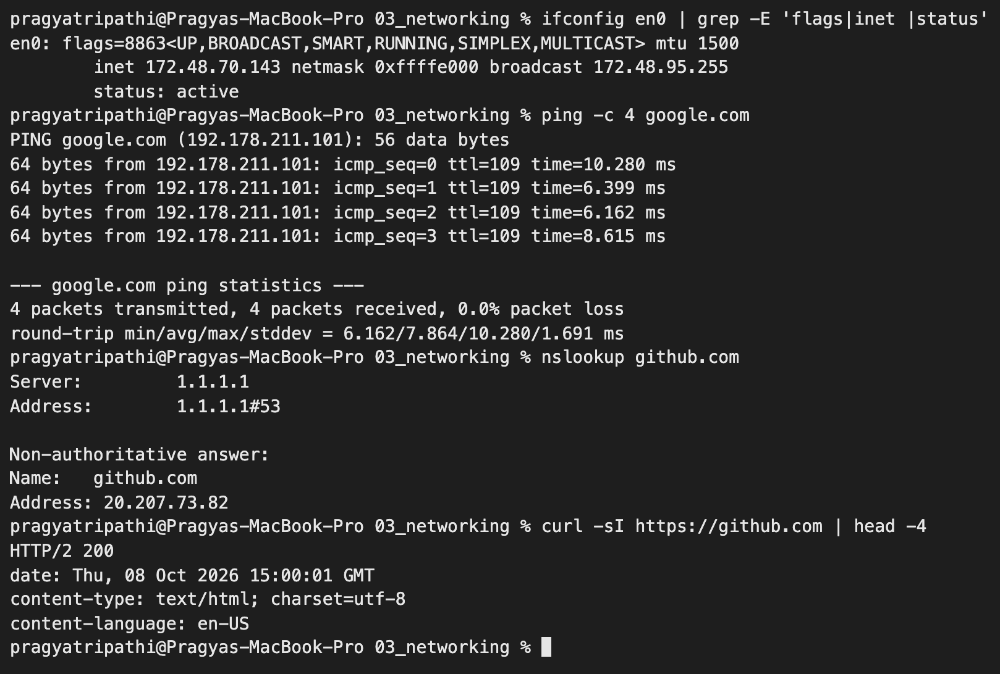
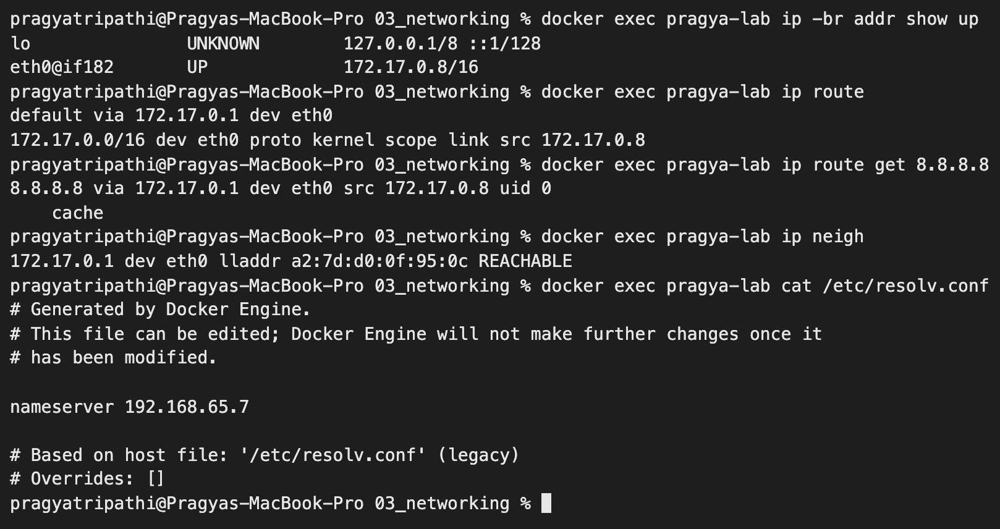
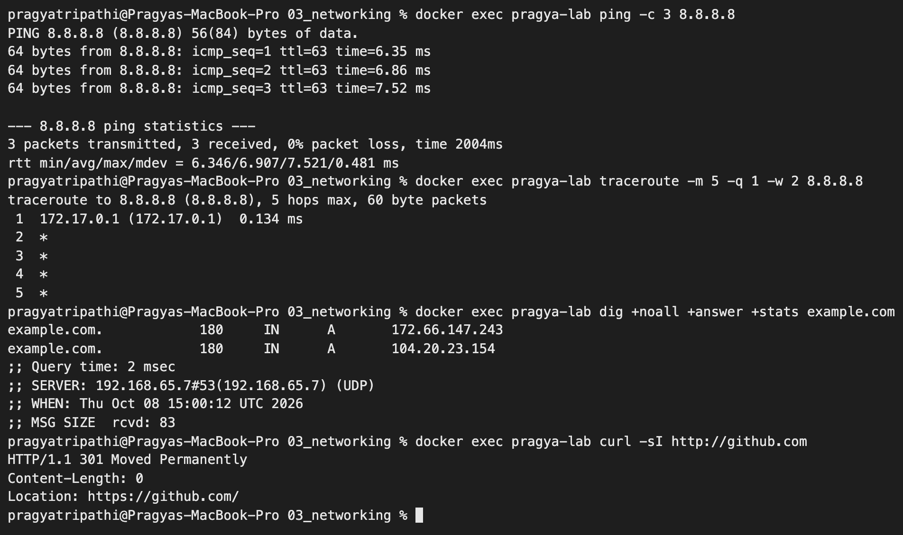
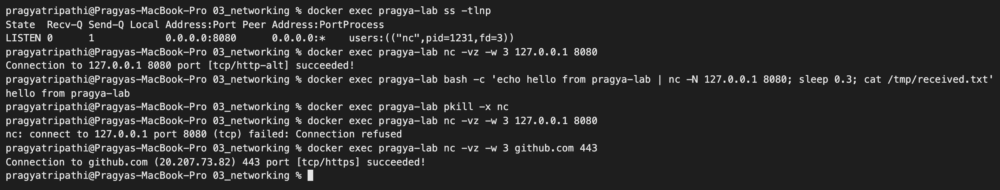
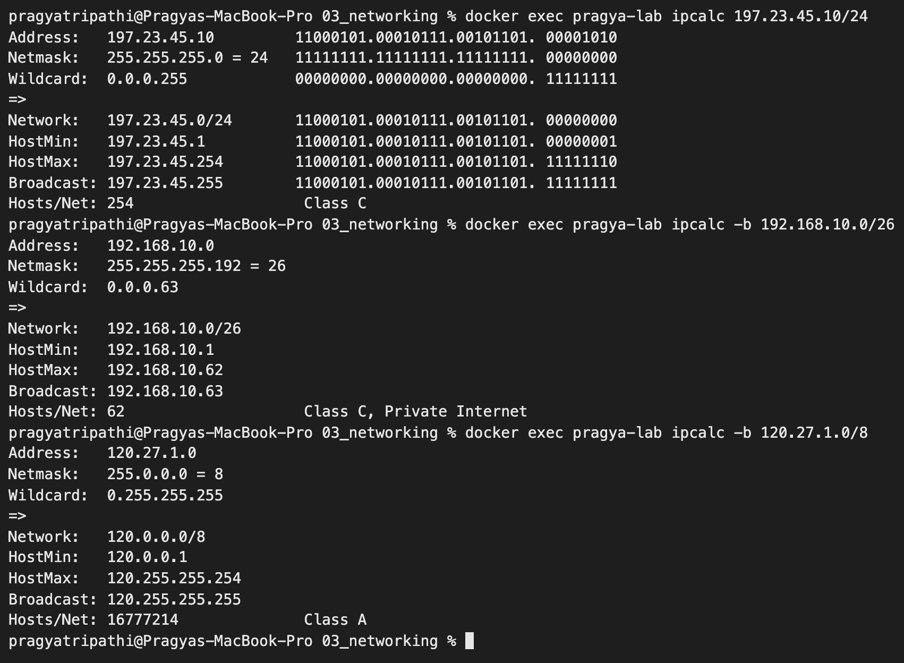

# Networking Fundamentals – Homework

**Name:** Pragya Tripathi
**Roll No:** 24BCS10032

Sections 1–7 were run on my own laptop (macOS). On macOS `ifconfig` and `netstat` are used where Linux uses `ip a` and `ss`. For privacy I have not pasted my MAC address, neighbour (ARP) table or VPN routes, so a few commands are filtered with `grep`.

Section 8 repeats the work with the **Linux** tools (`ip`, `ss`, `dig`, `traceroute`, `nc`, `ipcalc`) inside an `ubuntu:24.04` container called `pragya-lab`, because servers in DevOps are Linux, not macOS. The container got the tools with `apt-get install iproute2 iputils-ping dnsutils curl net-tools traceroute netcat-openbsd ipcalc`.

## Command summary

| Command | OSI layer it helps debug | What it answers |
|---|---|---|
| `ifconfig` / `ip a` | 2–3 | What is my IP address, netmask, is the interface up? |
| `ping` | 3 | Is the host reachable, and how long does a round trip take? |
| `traceroute` | 3 | Which routers does the packet pass through, where does it slow down? |
| `netstat -rn` / `ip route` | 3 | Where do packets go first (default gateway)? |
| `netstat -an` / `ss -tulnp` | 4 | Which ports are listening or connected? |
| `nc -vz` / `telnet` | 4 | Is a specific TCP port open on a remote host? |
| `nslookup`, `dig`, `host` | 7 (DNS) | Which IP does this name resolve to, and who answered? |
| `curl` | 7 (HTTP) | Does the web server answer, with which status and headers? |

---

## 1. `ifconfig` – my IP address

```text
$ ifconfig en0 | grep -E 'flags|inet |status'
en0: flags=8863<UP,BROADCAST,SMART,RUNNING,SIMPLEX,MULTICAST> mtu 1500
	inet 172.20.2.105 netmask 0xfffff800 broadcast 172.20.7.255
	status: active
```

**What I understood:** my laptop has the private IP `172.20.2.105`. The netmask `0xfffff800` is `255.255.248.0`, which is a `/21` network, so there are 2^11 − 2 = 2046 usable host addresses and the broadcast address is `172.20.7.255`. `172.16.0.0 – 172.31.255.255` is a private (class B) range, so this address is not visible on the internet and goes out through NAT.

## 2. `ping` – reachability and latency

```text
$ ping -c 4 google.com
PING google.com (142.251.222.142): 56 data bytes
64 bytes from 142.251.222.142: icmp_seq=0 ttl=118 time=21.236 ms
64 bytes from 142.251.222.142: icmp_seq=1 ttl=118 time=16.275 ms
64 bytes from 142.251.222.142: icmp_seq=2 ttl=118 time=62.286 ms
64 bytes from 142.251.222.142: icmp_seq=3 ttl=118 time=57.910 ms

--- google.com ping statistics ---
4 packets transmitted, 4 packets received, 0.0% packet loss
round-trip min/avg/max/stddev = 16.275/39.427/62.286/20.803 ms
```

**What I understood:** ping sends ICMP echo requests. `0.0% packet loss` means the host is reachable. `time` is the round trip time. `ttl=118` means the reply crossed some routers on the way, because every router reduces TTL by one. DNS is also tested indirectly, since `google.com` was resolved to an IP first.

## 3. `traceroute` – the path of a packet

```text
$ traceroute -m 8 -w 2 -q 1 google.com
traceroute to google.com (142.251.222.142), 8 hops max, 40 byte packets
 1  172.20.0.1 (172.20.0.1)  35.883 ms
 2  49.200.242.17 (49.200.242.17)  257.856 ms
 3  128.185.120.53 (128.185.120.53)  68.359 ms
 4  116.119.164.82 (116.119.164.82)  72.438 ms
 5  142.250.169.206 (142.250.169.206)  58.779 ms
 6  *
 7  142.251.55.62 (142.251.55.62)  25.845 ms
 8  209.85.247.251 (209.85.247.251)  106.954 ms
```

**What I understood:** traceroute sends packets with TTL 1, 2, 3 and so on. Each router that drops the packet replies, which reveals one hop at a time. Hop 1 is my default gateway `172.20.0.1`, the next hops belong to the ISP, and the last ones belong to Google. `*` means that router did not reply in time, which is normal because many routers ignore these probes. It does not mean the path is broken.

## 4. `netstat` – routing table and ports

```text
$ netstat -rn -f inet | grep -E "Destination|default" | head -2
Destination        Gateway            Flags               Netif Expire
default            172.20.0.1         UGScg                 en0

$ ifconfig en0 | grep -E 'flags|inet |status'
en0: flags=8863<UP,BROADCAST,SMART,RUNNING,SIMPLEX,MULTICAST> mtu 1500
	inet 172.20.2.105 netmask 0xfffff800 broadcast 172.20.7.255
	status: active

$ netstat -an -p tcp | grep -c LISTEN
43

$ netstat -an -p tcp | grep ESTABLISHED | wc -l
      65
```

Sample of listening sockets:

```text
$ netstat -an -p tcp | grep LISTEN | head -10
tcp4       0      0  127.0.0.1.26922        *.*                    LISTEN
tcp4       0      0  127.0.0.1.38474        *.*                    LISTEN
tcp46      0      0  *.52884                *.*                    LISTEN
tcp46      0      0  *.52883                *.*                    LISTEN
tcp6       0      0  *.54763                *.*                    LISTEN
tcp4       0      0  *.54763                *.*                    LISTEN
tcp4       0      0  127.0.0.1.57577        *.*                    LISTEN
tcp4       0      0  127.0.0.1.57575        *.*                    LISTEN
tcp4       0      0  127.0.0.1.57570        *.*                    LISTEN
tcp4       0      0  127.0.0.1.52365        *.*                    LISTEN
```

**What I understood:** the `default` route sends everything that is not local to the gateway `172.20.0.1` through `en0`. `LISTEN` means a program is waiting for connections on that port. `127.0.0.1.port` is only reachable from my own machine, while `*.port` accepts connections from the network. On Linux the modern equivalent is `ss -tulnp`.

## 5. `nslookup`, `dig` and `host` – DNS

```text
$ nslookup github.com
Server:		1.1.1.1
Address:	1.1.1.1#53

Non-authoritative answer:
Name:	github.com
Address: 20.207.73.82

$ dig +noall +answer +stats github.com
github.com.		20	IN	A	20.207.73.82
;; Query time: 106 msec
;; SERVER: 1.1.1.1#53(1.1.1.1)
;; WHEN: Thu Sep 17 18:57:05 IST 2026
;; MSG SIZE  rcvd: 55

$ dig +short MX gmail.com
20 alt2.gmail-smtp-in.l.google.com.
30 alt3.gmail-smtp-in.l.google.com.
40 alt4.gmail-smtp-in.l.google.com.
10 alt1.gmail-smtp-in.l.google.com.
5 gmail-smtp-in.l.google.com.

$ host scaler.com
scaler.com has address 54.240.162.67
scaler.com has address 54.240.162.70
scaler.com has address 54.240.162.109
scaler.com has address 54.240.162.101
scaler.com mail is handled by 1 aspmx.l.google.com.
scaler.com mail is handled by 10 aspmx2.googlemail.com.
scaler.com mail is handled by 10 aspmx3.googlemail.com.
scaler.com mail is handled by 5 alt1.aspmx.l.google.com.
scaler.com mail is handled by 5 alt2.aspmx.l.google.com.
```

**What I understood:** all three ask a DNS server to turn a name into records. `Server: 1.1.1.1` is the resolver that answered. `Non-authoritative answer` means the reply came from a cache, not from GitHub's own name server. In the `dig` output, `20` is the TTL in seconds, `IN A` is an IPv4 address record, and `Query time` tells how slow DNS is. `MX` records list the mail servers of a domain, and the lowest number has the highest priority.

## 6. `curl` – testing HTTP

```text
$ curl -sI https://github.com | head -8
HTTP/2 200
date: Thu, 17 Sep 2026 13:26:57 GMT
content-type: text/html; charset=utf-8
content-language: en-US
vary: X-PJAX, X-PJAX-Container, Turbo-Visit, Turbo-Frame, X-Requested-With, X-GitHub-Client-Version, Accept-Language, Sec-Fetch-Site,Accept-Encoding, Accept, X-Requested-With
etag: W/"bce79b00777dcf55a02caaf5d847eac4"
cache-control: max-age=0, private, must-revalidate
strict-transport-security: max-age=31536000; includeSubdomains; preload

$ curl -s -o /dev/null -w "http_code=%{http_code} dns=%{time_namelookup}s connect=%{time_connect}s tls=%{time_appconnect}s total=%{time_total}s\n" https://github.com
http_code=200 dns=0.003429s connect=0.135607s tls=0.206206s total=1.662215s
```

**What I understood:** `-I` fetches only the response headers. `HTTP/2 200` means success. The `-w` format breaks the request into DNS lookup, TCP connect, TLS handshake and total time, which shows which step is slow.

## 7. `nc` (netcat) – is a TCP port open?

`telnet` is not installed on recent macOS versions, so I used `nc -vz`, which does the same port check.

```text
$ nc -vz -w 3 github.com 443
Connection to github.com port 443 [tcp/https] succeeded!

$ nc -vz -w 3 github.com 81
nc: connectx to github.com port 81 (tcp) failed: Operation timed out
```

**What I understood:** port 443 (HTTPS) is open on github.com. Port 81 timed out, which means a firewall silently dropped the packets. A closed port on a reachable host would give `Connection refused` immediately instead of a timeout.

### Checking again on another day

A few weeks later I ran the basic checks again for the screenshot. My laptop was on a different network, so the address had changed (DHCP gives a new lease):



```text
$ netstat -rn -f inet | grep -E "^default" | head -2
default            172.48.64.1        UGScg                 en0
```

Now the address is `172.48.70.143` with mask `0xffffe000` = `255.255.224.0` = `/19`, and the gateway is `172.48.64.1`. What that means is worked out with `ipcalc` in *Checking the subnet maths* further down.

---

## 8. The same work on Linux (`ip`, `ss`, `dig`, `traceroute`)

### 8.1 `ip` – addresses, routes, neighbours

```text
$ ip -br addr
lo               UNKNOWN        127.0.0.1/8 ::1/128
tunl0@NONE       DOWN
gre0@NONE        DOWN
gretap0@NONE     DOWN
erspan0@NONE     DOWN
ip_vti0@NONE     DOWN
ip6_vti0@NONE    DOWN
sit0@NONE        DOWN
ip6tnl0@NONE     DOWN
ip6gre0@NONE     DOWN
eth0@if182       UP             172.17.0.8/16

$ ip addr show eth0
11: eth0@if182: <BROADCAST,MULTICAST,UP,LOWER_UP> mtu 65535 qdisc noqueue state UP group default
    link/ether 62:13:f3:9c:90:b2 brd ff:ff:ff:ff:ff:ff link-netnsid 0
    inet 172.17.0.8/16 brd 172.17.255.255 scope global eth0
       valid_lft forever preferred_lft forever

$ ip route
default via 172.17.0.1 dev eth0
172.17.0.0/16 dev eth0 proto kernel scope link src 172.17.0.8

$ ip route get 8.8.8.8
8.8.8.8 via 172.17.0.1 dev eth0 src 172.17.0.8 uid 0
    cache

$ ip neigh
172.17.0.1 dev eth0 lladdr a2:7d:d0:0f:95:0c STALE

$ ip -s link show eth0
11: eth0@if182: <BROADCAST,MULTICAST,UP,LOWER_UP> mtu 65535 qdisc noqueue state UP mode DEFAULT group default
    link/ether 62:13:f3:9c:90:b2 brd ff:ff:ff:ff:ff:ff link-netnsid 0
    RX:  bytes packets errors dropped  missed   mcast
         56685     192      0       0       0       0
    TX:  bytes packets errors dropped carrier collsns
          2973      44      0       0       0       0

$ cat /etc/resolv.conf
# Generated by Docker Engine.
# This file can be edited; Docker Engine will not make further changes once it
# has been modified.

nameserver 192.168.65.7

# Based on host file: '/etc/resolv.conf' (legacy)
# Overrides: []

$ cat /etc/hosts
127.0.0.1	localhost
::1	localhost ip6-localhost ip6-loopback
fe00::	ip6-localnet
ff00::	ip6-mcastprefix
ff02::1	ip6-allnodes
ff02::2	ip6-allrouters
172.17.0.8	pragya-lab
```

- The container has one real interface, `eth0`, with `172.17.0.8/16` on Docker's default bridge network; the other `DOWN` entries are unused tunnel devices of the kernel. `@if182` means the other end of this virtual cable is interface 182 on the host side.
- `default via 172.17.0.1` – the bridge (`docker0`) is the container's gateway. `ip route get 8.8.8.8` shows the exact route one packet would take.
- `ip neigh` is the ARP table: the MAC address of the gateway. `ip -s link` shows packet counters and errors (all 0 – healthy).
- DNS questions go to `192.168.65.7`, Docker Desktop's built-in resolver, and `/etc/hosts` maps the container's own hostname to its IP.

| Old (net-tools) | New (iproute2) |
|---|---|
| `ifconfig` | `ip addr` / `ip -br addr` |
| `route -n` | `ip route` |
| `arp -a` | `ip neigh` |
| `netstat -tulnp` | `ss -tulnp` |



### 8.2 `ping` and `traceroute` from the container

```text
$ ping -c 3 8.8.8.8
PING 8.8.8.8 (8.8.8.8) 56(84) bytes of data.
64 bytes from 8.8.8.8: icmp_seq=1 ttl=63 time=7.17 ms
64 bytes from 8.8.8.8: icmp_seq=2 ttl=63 time=5.92 ms
64 bytes from 8.8.8.8: icmp_seq=3 ttl=63 time=7.36 ms

--- 8.8.8.8 ping statistics ---
3 packets transmitted, 3 received, 0% packet loss, time 2012ms
rtt min/avg/max/mdev = 5.918/6.816/7.364/0.640 ms

$ ping -c 2 -W 2 10.255.255.1
PING 10.255.255.1 (10.255.255.1) 56(84) bytes of data.

--- 10.255.255.1 ping statistics ---
2 packets transmitted, 0 received, 100% packet loss, time 1046ms

$ traceroute -m 8 -q 1 -w 2 8.8.8.8
traceroute to 8.8.8.8 (8.8.8.8), 8 hops max, 60 byte packets
 1  172.17.0.1 (172.17.0.1)  0.112 ms
 2  *
 3  *
 4  *
 5  *
 6  *
 7  *
 8  *
```

- `10.255.255.1` is a private address nobody answers on, so 100% loss – this is what an unreachable host looks like.
- `traceroute` from inside the container only showed hop 1 (the Docker bridge) and then `*`, while `ping` worked fine. My understanding: on a Mac, Docker Desktop does not route container packets directly – it passes them through its own network proxy in the Docker VM, which forwards normal traffic and ping, but the "TTL expired" replies from routers on the way never come back to the container. The `ttl=63` in the ping replies also looks like the reply was created close by (64 − 1) rather than having crossed ~10 internet routers as on my Mac (`ttl=109`–`118`). To see the real path I have to run `traceroute` on the Mac itself (section 3).

### 8.3 DNS with `dig`, `nslookup`, `host`

```text
$ dig +noall +answer +stats example.com
example.com.		180	IN	A	172.66.147.243
example.com.		180	IN	A	104.20.23.154
;; Query time: 14 msec
;; SERVER: 192.168.65.7#53(192.168.65.7) (UDP)
;; WHEN: Thu Oct 08 14:59:34 UTC 2026
;; MSG SIZE  rcvd: 83

$ dig +short NS google.com
ns1.google.com.
ns2.google.com.
ns3.google.com.
ns4.google.com.

$ dig @8.8.8.8 +short github.com
20.207.73.82

$ nslookup scaler.com
Server:		192.168.65.7
Address:	192.168.65.7#53

Non-authoritative answer:
Name:	scaler.com
Address: 18.172.78.67
Name:	scaler.com
Address: 18.172.78.88
Name:	scaler.com
Address: 18.172.78.107
Name:	scaler.com
Address: 18.172.78.47

$ host -t AAAA google.com
google.com has no AAAA record
```

- `example.com` returned two A records – a client can use either (simple load balancing / redundancy).
- `NS` = which name servers are authoritative for the domain; `@8.8.8.8` asks a specific resolver instead of the default one.
- `scaler.com` now resolves to `18.172.78.x` addresses, while a few weeks ago on my Mac it was `54.240.162.x` (section 5). Big sites sit behind a CDN, so the answer changes with time and location.
- `host -t AAAA google.com` said there is no IPv6 record. I expected Google to have one, so I asked a public resolver directly – first from the Mac, then from the container, then the container's default resolver again:

```text
$ dig AAAA google.com +short @1.1.1.1                          (on the Mac)
2404:6800:4000:1010::66
2404:6800:4000:1010::65
2404:6800:4000:1010::8a
2404:6800:4000:1010::71

$ dig AAAA google.com +short @1.1.1.1                          (in the container)
2404:6800:4000:1010::65
2404:6800:4000:1010::8a
2404:6800:4000:1010::71
2404:6800:4000:1010::66

$ dig AAAA google.com +short                                   (in the container, default resolver)

```

  So the record exists; it is Docker Desktop's built-in resolver (`192.168.65.7`) that returns an empty answer for IPv6 (most likely because the container itself has no IPv6 network). Lesson: a "no record" answer depends on **which** DNS server you ask – `dig @server` is the way to compare.

### 8.4 HTTP with `curl`

```text
$ curl -sI https://example.com
HTTP/2 200
date: Thu, 08 Oct 2026 14:59:34 GMT
content-type: text/html; charset=utf-8
server: cloudflare
last-modified: Sun, 04 Oct 2026 20:44:03 GMT
allow: GET, HEAD
accept-ranges: bytes
age: 10039
cf-cache-status: HIT
cf-ray: a476029c7a7f7686-BOM
alt-svc: h3=":443"; ma=86400

$ curl -s -o /dev/null -w "code=%{http_code} ip=%{remote_ip} dns=%{time_namelookup}s connect=%{time_connect}s tls=%{time_appconnect}s total=%{time_total}s\n" https://github.com
code=200 ip=20.207.73.82 dns=0.005931s connect=0.017080s tls=0.028694s total=0.398197s

$ curl -sI http://github.com
HTTP/1.1 301 Moved Permanently
Content-Length: 0
Location: https://github.com/
```

- `cf-cache-status: HIT` and `cf-ray: ...-BOM` – the page came from Cloudflare's cache in Mumbai (BOM), not from the origin server.
- Plain `http://github.com` answers `301` and sends me to `https://` – port 80 is only used to redirect to the encrypted port 443.



### 8.5 Ports: `ss` and `nc` with my own listener

To see a `LISTEN` socket that I created myself, I started a tiny TCP server with netcat on port 8080:

```text
$ nc -lk 8080 > /tmp/received.txt &

$ ss -tlnp
State  Recv-Q Send-Q Local Address:Port Peer Address:PortProcess
LISTEN 0      1            0.0.0.0:8080      0.0.0.0:*    users:(("nc",pid=1179,fd=3))

$ nc -vz -w 3 127.0.0.1 8080
Connection to 127.0.0.1 8080 port [tcp/http-alt] succeeded!

$ echo "hello from pragya-lab" | nc -N 127.0.0.1 8080

$ cat /tmp/received.txt
hello from pragya-lab

$ ss -tan | head -5
State     Recv-Q Send-Q Local Address:Port    Peer Address:PortProcess
LISTEN    0      1            0.0.0.0:8080         0.0.0.0:*
TIME-WAIT 0      0          127.0.0.1:45026      127.0.0.1:8080
TIME-WAIT 0      0          127.0.0.1:45042      127.0.0.1:8080
TIME-WAIT 0      0         172.17.0.8:57360   20.207.73.82:22

$ pkill -x nc

$ ss -tlnp
State Recv-Q Send-Q Local Address:Port Peer Address:PortProcess
```

When I repeated this for the screenshot (listener started with `docker exec -d pragya-lab bash -c 'nc -lk 8080 > /tmp/received.txt'`), I also checked the port again after stopping it:

```text
$ docker exec pragya-lab pkill -x nc

$ docker exec pragya-lab nc -vz -w 3 127.0.0.1 8080
nc: connect to 127.0.0.1 port 8080 (tcp) failed: Connection refused

$ docker exec pragya-lab nc -vz -w 3 github.com 443
Connection to github.com (20.207.73.82) 443 port [tcp/https] succeeded!
```

Earlier in the session I had also checked SSH on GitHub:

```text
$ nc -vz -w 3 github.com 22
Connection to github.com (20.207.73.82) 22 port [tcp/ssh] succeeded!
```

- `ss -tlnp` = TCP, listening, numeric, show process. It told me exactly which program (`nc`, pid 1179) owns port 8080 – the first thing to check when "port already in use" appears.
- `0.0.0.0:8080` means it listens on all interfaces.
- `TIME-WAIT` lines are connections that just closed (my two test connections, and the earlier `nc -vz` to github.com port 22).
- With the listener stopped, the same check gives **`Connection refused`** immediately: the host is reachable but nothing listens on that port. Compare with section 7, where github.com port 81 **timed out** because a firewall dropped the packets.



---

## IP addressing notes (from the session)

| Class | First octet | Default mask | Network / host bits | Usable hosts |
|---|---|---|---|---|
| A | 1 – 127 | 255.0.0.0 (`/8`) | 8 / 24 | 2^24 − 2 |
| B | 128 – 191 | 255.255.0.0 (`/16`) | 16 / 16 | 2^16 − 2 |
| C | 192 – 223 | 255.255.255.0 (`/24`) | 24 / 8 | 2^8 − 2 = 254 |
| D | 224 – 239 | multicast | – | – |

Private ranges: `10.0.0.0/8`, `172.16.0.0/12`, `192.168.0.0/16`.

Two addresses are subtracted because the first address is the network address and the last one is the broadcast address. Example: `197.23.45.10` with mask `255.255.255.0` is class C, the network is `197.23.45.0`, the broadcast is `197.23.45.255`, and the usable hosts are `.1` to `.254`.

### Checking the subnet maths with `ipcalc`

I worked the class examples out on paper first and then checked them with `ipcalc` in the container:

```text
$ ipcalc 197.23.45.10/24
Address:   197.23.45.10         11000101.00010111.00101101. 00001010
Netmask:   255.255.255.0 = 24   11111111.11111111.11111111. 00000000
Wildcard:  0.0.0.255            00000000.00000000.00000000. 11111111
=>
Network:   197.23.45.0/24       11000101.00010111.00101101. 00000000
HostMin:   197.23.45.1          11000101.00010111.00101101. 00000001
HostMax:   197.23.45.254        11000101.00010111.00101101. 11111110
Broadcast: 197.23.45.255        11000101.00010111.00101101. 11111111
Hosts/Net: 254                   Class C

$ ipcalc -b 120.27.1.0/8
Address:   120.27.1.0
Netmask:   255.0.0.0 = 8
Wildcard:  0.255.255.255
=>
Network:   120.0.0.0/8
HostMin:   120.0.0.1
HostMax:   120.255.255.254
Broadcast: 120.255.255.255
Hosts/Net: 16777214              Class A

$ ipcalc -b 192.168.10.0/26
Address:   192.168.10.0
Netmask:   255.255.255.192 = 26
Wildcard:  0.0.0.63
=>
Network:   192.168.10.0/26
HostMin:   192.168.10.1
HostMax:   192.168.10.62
Broadcast: 192.168.10.63
Hosts/Net: 62                    Class C, Private Internet

$ ipcalc -b 172.20.2.105/21
Address:   172.20.2.105
Netmask:   255.255.248.0 = 21
Wildcard:  0.0.7.255
=>
Network:   172.20.0.0/21
HostMin:   172.20.0.1
HostMax:   172.20.7.254
Broadcast: 172.20.7.255
Hosts/Net: 2046                  Class B, Private Internet

$ ipcalc -b 172.48.70.143/19
Address:   172.48.70.143
Netmask:   255.255.224.0 = 19
Wildcard:  0.0.31.255
=>
Network:   172.48.64.0/19
HostMin:   172.48.64.1
HostMax:   172.48.95.254
Broadcast: 172.48.95.255
Hosts/Net: 8190                  Class B
```

- `197.23.45.10/24`: the binary view shows that the first 24 bits are the network part and the last 8 bits (`00001010` = 10) are the host part. 2^8 − 2 = 254 hosts – same as my paper answer. (The class notes have `197.23.34.255` as the broadcast in one line; it should be `197.23.45.255`.)
- `120.27.1.0/8`: only the first octet is the network, so the network is `120.0.0.0` and there are 2^24 − 2 = 16,777,214 hosts.
- `/26` splits a `/24` into 4 subnets of 64 addresses (62 usable) – borrowing 2 host bits for the network.
- My two Mac addresses: `172.20.2.105/21` is inside the private block `172.16.0.0/12`, and `ipcalc` agrees (`Private Internet`). But today's `172.48.70.143/19` is **outside** `172.16.0.0 – 172.31.255.255`, so `ipcalc` does not call it private, although the network clearly works like a NAT-ed LAN (gateway `172.48.64.1`). This network is using a block that is officially public address space internally. Something I would not have noticed without checking the range.



### OSI and TCP/IP layers, and the tool for each

| OSI layer | TCP/IP layer | Examples | Tool I used |
|---|---|---|---|
| 7 Application (5–7) | Application | HTTP, DNS, SSH | `curl`, `dig`, `nslookup` |
| 4 Transport | Transport | TCP, UDP, ports | `nc -vz`, `ss`, `netstat` |
| 3 Network | Internet | IP, ICMP, routing | `ping`, `traceroute`, `ip route` |
| 2 Data link | Link | Ethernet, MAC, ARP | `ip link`, `ip neigh` |
| 1 Physical | Link | Cable, Wi-Fi | `ifconfig ... status: active` |

## Troubleshooting order I learned

1. `ifconfig` – do I have an IP?
2. `ping <gateway>` – is the local network fine?
3. `ping 8.8.8.8` – is the internet reachable by IP?
4. `nslookup <name>` – is DNS working?
5. `nc -vz <host> <port>` – is the port open?
6. `curl -I <url>` – is the application answering?

## What I understood

- Every device needs an IP address, a netmask (which part is network, which is host) and a default gateway; `ip a` / `ifconfig` and `ip route` answer those three questions.
- Subnetting is just counting bits: host bits = 32 − prefix, usable hosts = 2^(host bits) − 2.
- DNS turns names into IPs, and the answer depends on which resolver I ask and when; `dig @server` lets me compare.
- `ping` tests layer 3, `nc -vz` tests a TCP port, `curl` tests the application – going up the layers tells me where a problem is.
- `Connection refused` = host reachable, nothing listening; timeout = something (often a firewall) is dropping the packets.
- `ss -tlnp` shows which process owns a port – the first check when a service will not start because the port is busy.
- Containers have their own network namespace (own IP, routes, DNS settings), and on a Mac the Docker VM sits in between, which is why `traceroute` from a container shows less than from the Mac.
