# Git and GitHub – Homework

**Name:** Pragya Tripathi
**Roll No:** 24BCS10032

Tasks 1 and 2 were done in a fresh practice repository created with `git init`. For Task 3 I made a second, bigger practice repository at `~/devops-lab/git-practice` and went through every command from the session (init, add, commit, diff, branches, merge, a merge conflict, stash, reset vs revert, remotes, push and pull). All outputs are copied from my terminal.

Git identity was set **only inside the practice repositories** (`git config` without `--global`), so nothing else on my laptop changed.

**Note about remotes:** I did not want to push practice commits to GitHub, so for `push`, `pull`, `fetch` and `clone` I used a *bare repository on my own disk* as the remote (`git init --bare`). Git talks to it exactly like it talks to GitHub; only the URL is a folder path instead of `https://github.com/...`.

## Contents

| Task | Topic |
|---|---|
| 1 | `git commit -a -m` vs `git commit -m` |
| 2 | `git cherry-pick` |
| 3.1 | `init`, `config`, `status`, `add`, `commit`, `log` |
| 3.2 | `diff`, `diff --staged`, `.gitignore`, `show` |
| 3.3 | Branches, `switch` / `checkout`, fast-forward and 3-way merge |
| 3.4 | Merge conflict and how I resolved it |
| 3.5 | `stash` |
| 3.6 | `reset` (soft / mixed / hard), `reflog`, `revert` |
| 3.7 | Remotes: `remote`, `push`, `clone`, `fetch`, `pull`, rejected push |
| 3.8 | `mv`, `rm`, `tag` |
| 4 | Git vs GitHub, and the GitHub workflow |

---

## Task 1: `git commit -a -m` vs `git commit -m`

| | `git commit -m "msg"` | `git commit -a -m "msg"` |
|---|---|---|
| What gets committed | Only what was staged with `git add` | Every **modified or deleted tracked** file, staged automatically |
| New (untracked) files | Included only if added with `git add` | **Never** included |
| Needs `git add` first | Yes | No, for files Git already tracks |
| Risk | Forgetting to stage a change | Committing changes you did not intend to include |

### Practice

I changed a tracked file and also created a brand new file, then tried both commands.

```text
$ git init -q -b main . && git config user.name "Pragya Tripathi" && git config user.email "pragya.24bcs10032@sst.scaler.com"

$ echo "line 1" > tracked.txt && git add tracked.txt && git commit -m "Add tracked.txt"
[main (root-commit) ba6f34f] Add tracked.txt
 1 file changed, 1 insertion(+)
 create mode 100644 tracked.txt

$ echo "line 2" >> tracked.txt && echo "new file" > untracked.txt

$ git status --short
 M tracked.txt
?? untracked.txt

$ git commit -m "Try commit without staging"
On branch main
Changes not staged for commit:
  (use "git add <file>..." to update what will be committed)
  (use "git restore <file>..." to discard changes in working directory)
	modified:   tracked.txt

Untracked files:
  (use "git add <file>..." to include in what will be committed)
	untracked.txt

no changes added to commit (use "git add" and/or "git commit -a")

$ git commit -a -m "Commit tracked changes with -a"
[main d839df1] Commit tracked changes with -a
 1 file changed, 1 insertion(+)

$ git status --short
?? untracked.txt

$ git show --stat --oneline HEAD
d839df1 Commit tracked changes with -a
 tracked.txt | 1 +
 1 file changed, 1 insertion(+)

$ git add untracked.txt && git commit -m "Add untracked.txt after explicit git add"
[main bf5b155] Add untracked.txt after explicit git add
 1 file changed, 1 insertion(+)
 create mode 100644 untracked.txt
```

### What I observed

- `git commit -m` alone **refused to commit**: `no changes added to commit`, because nothing was staged.
- `git commit -a -m` committed `tracked.txt` without any `git add`.
- After that commit `untracked.txt` was still shown as `??`. The `-a` flag only covers files that Git already tracks, so a new file always needs `git add` once.

I repeated the same check later in the bigger practice repo while taking this screenshot – same result: `commit -m` refused, `commit -am` took only the modified `README.md`, and the new `todo.txt` stayed untracked.

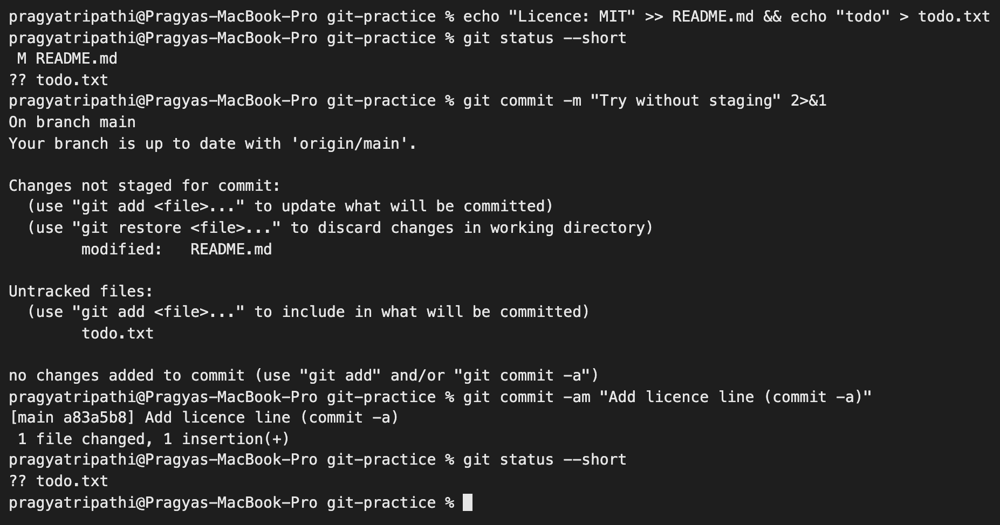

---

## Task 2: Git Cherry-Pick

`git cherry-pick <hash>` copies the change of **one** commit onto the current branch as a new commit. It is useful when only one fix from another branch is needed, not the whole branch.

### Steps

1. Made commits on `main` and checked them with `git log`.
2. Created a new branch `feature` and made 3 commits on it.
3. Used `git log --oneline` to find the hash of the commit `feature: add feature B`.
4. Switched back to `main` and cherry-picked only that commit.
5. Verified that `featureB.txt` is on `main` and that `featureA.txt` and `featureC.txt` are not.

```text
$ echo "main change 1" > main.txt && git add . && git commit -m "main: change 1"
[main 99ab43a] main: change 1
 1 file changed, 1 insertion(+)
 create mode 100644 main.txt

$ echo "main change 2" >> main.txt && git commit -a -m "main: change 2"
[main 5823f34] main: change 2
 1 file changed, 1 insertion(+)

$ git log --oneline
5823f34 main: change 2
99ab43a main: change 1
bf5b155 Add untracked.txt after explicit git add
d839df1 Commit tracked changes with -a
ba6f34f Add tracked.txt

$ git checkout -b feature
Switched to a new branch 'feature'

$ echo "Feature A" > featureA.txt && git add . && git commit -m "feature: add feature A"
[feature 4dbbf73] feature: add feature A
 1 file changed, 1 insertion(+)
 create mode 100644 featureA.txt

$ echo "Feature B" > featureB.txt && git add . && git commit -m "feature: add feature B"
[feature 5876a17] feature: add feature B
 1 file changed, 1 insertion(+)
 create mode 100644 featureB.txt

$ echo "Feature C" > featureC.txt && git add . && git commit -m "feature: add feature C"
[feature f9757cb] feature: add feature C
 1 file changed, 1 insertion(+)
 create mode 100644 featureC.txt

$ git log --oneline
f9757cb feature: add feature C
5876a17 feature: add feature B
4dbbf73 feature: add feature A
5823f34 main: change 2
99ab43a main: change 1
bf5b155 Add untracked.txt after explicit git add
d839df1 Commit tracked changes with -a
ba6f34f Add tracked.txt

$ git checkout main
Switched to branch 'main'

$ ls
main.txt
tracked.txt
untracked.txt

$ git cherry-pick 5876a17
[main 215bbf4] feature: add feature B
 Date: Thu Sep 17 18:59:10 2026 +0530
 1 file changed, 1 insertion(+)
 create mode 100644 featureB.txt

$ git log --oneline --graph --all
* f9757cb feature: add feature C
* 5876a17 feature: add feature B
* 4dbbf73 feature: add feature A
| * 215bbf4 feature: add feature B
|/
* 5823f34 main: change 2
* 99ab43a main: change 1
* bf5b155 Add untracked.txt after explicit git add
* d839df1 Commit tracked changes with -a
* ba6f34f Add tracked.txt

$ ls
featureB.txt
main.txt
tracked.txt
untracked.txt

$ cat featureB.txt
Feature B
```

### What I observed

- Before the cherry-pick, `main` had no feature files at all.
- After `git cherry-pick 5876a17`, `main` contains `featureB.txt` only. Feature A and Feature C stayed on the `feature` branch.
- The cherry-picked commit has a **new hash** on `main` (`215bbf4`) even though the message and the change are the same as `5876a17`. It is a copy, not the same commit, because its parent is different.
- The graph shows the two branches splitting after `main: change 2`.
- If the picked commit touched lines that differ on `main`, Git would stop with a conflict. Then I would fix the file, run `git add`, and finish with `git cherry-pick --continue` (or cancel with `git cherry-pick --abort`).

I also repeated the cherry-pick in the bigger practice repo. Only `featureB.txt` arrived on `main`, and the picked commit got a new hash (`ef7c89f` instead of `12f84e7`):

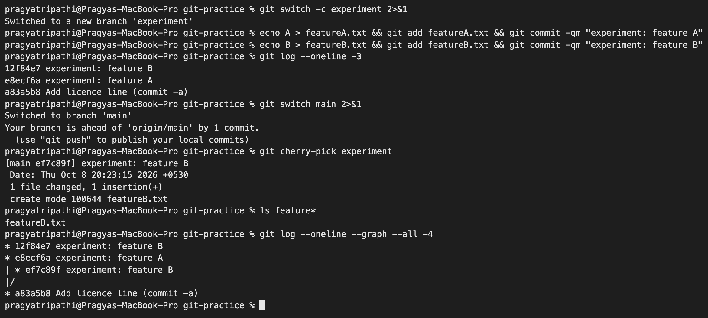

---

## Task 3: Git commands from the session, step by step

### 3.1 `init`, `config`, `status`, `add`, `commit`, `log`

```text
$ git --version
git version 2.50.1 (Apple Git-155)

$ git init -b main
Initialized empty Git repository in /Users/pragyatripathi/devops-lab/git-practice/.git/

$ git config user.name "Pragya Tripathi"

$ git config user.email "pragya.24bcs10032@sst.scaler.com"

$ git config --local --get-regexp user
user.name Pragya Tripathi
user.email pragya.24bcs10032@sst.scaler.com

$ git status
On branch main

No commits yet

nothing to commit (create/copy files and use "git add" to track)

$ echo "# Git practice - Pragya Tripathi" > README.md

$ printf "print(\"hello devops\")\n" > app.py

$ git status
On branch main

No commits yet

Untracked files:
  (use "git add <file>..." to include in what will be committed)
	README.md
	app.py

nothing added to commit but untracked files present (use "git add" to track)

$ git add README.md

$ git status --short
A  README.md
?? app.py

$ git add .

$ git status
On branch main

No commits yet

Changes to be committed:
  (use "git rm --cached <file>..." to unstage)
	new file:   README.md
	new file:   app.py

$ git commit -m "Initial commit: README and app.py"
[main (root-commit) ec0fe56] Initial commit: README and app.py
 2 files changed, 2 insertions(+)
 create mode 100644 README.md
 create mode 100644 app.py

$ git log
commit ec0fe564b2da811b07f2db2ee29e60924f677f4d
Author: Pragya Tripathi <pragya.24bcs10032@sst.scaler.com>
Date:   Thu Oct 8 20:20:37 2026 +0530

    Initial commit: README and app.py
```

The three places a change lives in:

| Area | How a file gets there | Seen in `git status --short` as |
|---|---|---|
| Working directory | I edit the file | ` M` (modified) or `??` (untracked) |
| Staging area (index) | `git add` | `M ` or `A ` (first column) |
| Repository (history) | `git commit` | not listed any more – it is saved |

`-b main` names the first branch `main` instead of the older default `master`.

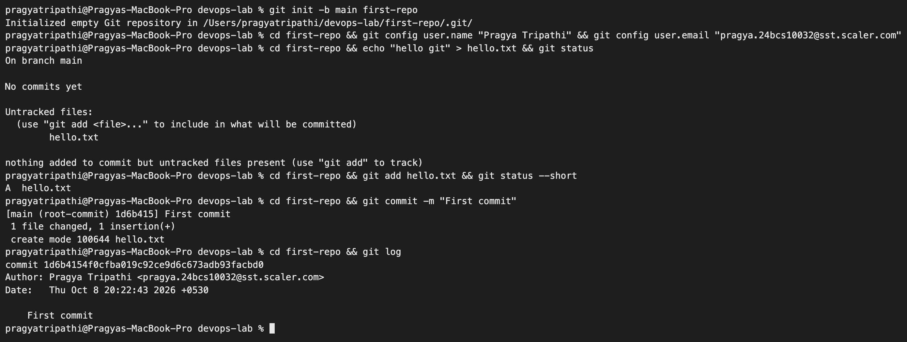

### 3.2 `diff`, `diff --staged`, `.gitignore`, `show`

```text
$ printf "print(\"hello devops\")\nprint(\"version 2\")\n" > app.py

$ echo "Author: Pragya Tripathi" >> README.md

$ git status --short
 M README.md
 M app.py

$ git diff
diff --git a/README.md b/README.md
index 72d41ee..a5ceea6 100644
--- a/README.md
+++ b/README.md
@@ -1 +1,2 @@
 # Git practice - Pragya Tripathi
+Author: Pragya Tripathi
diff --git a/app.py b/app.py
index e454f09..dbba2b5 100644
--- a/app.py
+++ b/app.py
@@ -1 +1,2 @@
 print("hello devops")
+print("version 2")

$ git add app.py

$ git diff --staged
diff --git a/app.py b/app.py
index e454f09..dbba2b5 100644
--- a/app.py
+++ b/app.py
@@ -1 +1,2 @@
 print("hello devops")
+print("version 2")

$ git status --short
 M README.md
M  app.py

$ git commit -m "Print version 2 in app.py"
[main 18acbba] Print version 2 in app.py
 1 file changed, 1 insertion(+)

$ git commit -am "Add author line to README"
[main 61b2677] Add author line to README
 1 file changed, 1 insertion(+)

$ printf "*.log\n__pycache__/\n.env\n" > .gitignore

$ echo "debug output" > app.log && echo "SECRET=abc" > .env

$ git status --short
?? .gitignore

$ git add .gitignore && git commit -m "Add .gitignore"
[main fe55b16] Add .gitignore
 1 file changed, 3 insertions(+)
 create mode 100644 .gitignore

$ git status --short --ignored
!! .env
!! app.log

$ git log --oneline
fe55b16 Add .gitignore
61b2677 Add author line to README
18acbba Print version 2 in app.py
ec0fe56 Initial commit: README and app.py
```

- `git diff` = working directory vs staging area (what I have **not** staged yet). After `git add app.py` only `README.md` was left in it.
- `git diff --staged` = staging area vs last commit (what **will** go into the next commit).
- In `git status --short` the first column is the staging area and the second is the working directory, so ` M` and `M ` mean different things.
- After adding `.gitignore`, `app.log` and `.env` disappeared from `git status`; `--ignored` shows them with `!!`. This is how secrets like `.env` are kept out of a repository.

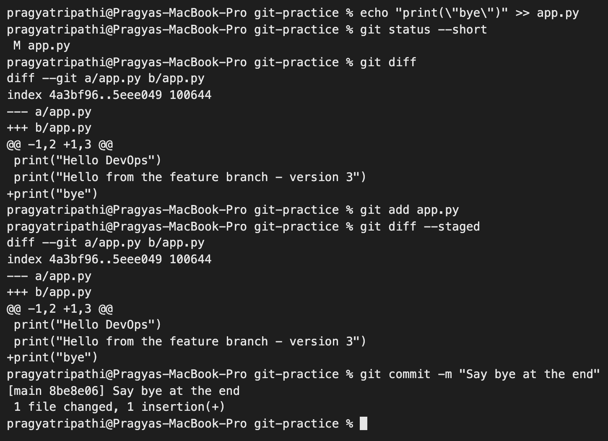

### 3.3 Branches, `switch` / `checkout`, merging

```text
$ git branch
* main

$ git switch -c feature/login
Switched to a new branch 'feature/login'

$ echo "def login(): return True" > login.py && git add login.py && git commit -m "Add login function"
[feature/login fafafaa] Add login function
 1 file changed, 1 insertion(+)
 create mode 100644 login.py

$ git branch
* feature/login
  main

$ git switch main
Switched to branch 'main'

$ ls
README.md
app.log
app.py

$ git merge feature/login
Updating fe55b16..fafafaa
Fast-forward
 login.py | 1 +
 1 file changed, 1 insertion(+)
 create mode 100644 login.py

$ git branch -d feature/login
Deleted branch feature/login (was fafafaa).

$ git checkout -b feature/signup
Switched to a new branch 'feature/signup'

$ echo "def signup(): return True" > signup.py && git add signup.py && git commit -m "Add signup function"
[feature/signup 30fa55e] Add signup function
 1 file changed, 1 insertion(+)
 create mode 100644 signup.py

$ git checkout main
Switched to branch 'main'

$ echo "Run: python app.py" >> README.md && git commit -am "Document how to run the app"
[main 1885464] Document how to run the app
 1 file changed, 1 insertion(+)

$ git log --oneline --graph --all
* 30fa55e Add signup function
| * 1885464 Document how to run the app
|/
* fafafaa Add login function
* fe55b16 Add .gitignore
* 61b2677 Add author line to README
* 18acbba Print version 2 in app.py
* ec0fe56 Initial commit: README and app.py

$ git merge feature/signup -m "Merge branch feature/signup"
Merge made by the 'ort' strategy.
 signup.py | 1 +
 1 file changed, 1 insertion(+)
 create mode 100644 signup.py

$ git log --oneline --graph --all
*   92b3e7c Merge branch feature/signup
|\
| * 30fa55e Add signup function
* | 1885464 Document how to run the app
|/
* fafafaa Add login function
* fe55b16 Add .gitignore
* 61b2677 Add author line to README
* 18acbba Print version 2 in app.py
* ec0fe56 Initial commit: README and app.py
```

| | Fast-forward merge | 3-way merge |
|---|---|---|
| When | `main` has no new commits since the branch was made | Both branches have new commits |
| What happens | `main` pointer just moves forward | Git creates a **merge commit** with two parents |
| In my repo | `feature/login` (`Updating fe55b16..fafafaa  Fast-forward`) | `feature/signup` (`Merge made by the 'ort' strategy`) |

`git switch` / `git switch -c` are the newer commands for changing / creating branches; `git checkout` / `git checkout -b` do the same thing (checkout also restores files, which is why `switch` was added to make it clearer). `git branch -d` only deletes a branch that is already merged, so no work is lost.

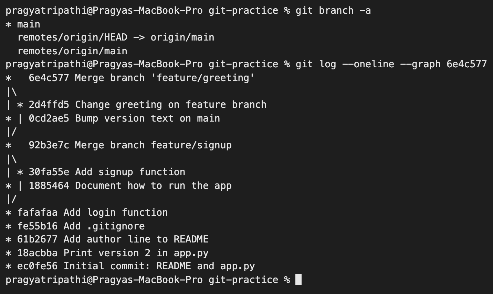

### 3.4 Merge conflict and resolution

I changed the **same line** of `app.py` on two branches:

```text
$ git switch -c feature/greeting
Switched to a new branch 'feature/greeting'

$ sed -i "" "s/version 2/Hello from the feature branch/" app.py && git commit -am "Change greeting on feature branch"
[feature/greeting 2d4ffd5] Change greeting on feature branch
 1 file changed, 1 insertion(+), 1 deletion(-)

$ git switch main
Switched to branch 'main'

$ sed -i "" "s/version 2/version 3 on main/" app.py && git commit -am "Bump version text on main"
[main 0cd2ae5] Bump version text on main
 1 file changed, 1 insertion(+), 1 deletion(-)

$ git merge feature/greeting
Auto-merging app.py
CONFLICT (content): Merge conflict in app.py
Automatic merge failed; fix conflicts and then commit the result.

$ git status
On branch main
You have unmerged paths.
  (fix conflicts and run "git commit")
  (use "git merge --abort" to abort the merge)

Unmerged paths:
  (use "git add <file>..." to mark resolution)
	both modified:   app.py

no changes added to commit (use "git add" and/or "git commit -a")

$ cat app.py
print("hello devops")
<<<<<<< HEAD
print("version 3 on main")
=======
print("Hello from the feature branch")
>>>>>>> feature/greeting
```

- Between `<<<<<<< HEAD` and `=======` is the version on my current branch (`main`).
- Between `=======` and `>>>>>>> feature/greeting` is the version from the branch being merged.

First I tried `git merge --abort` to see that it really puts everything back:

```text
$ git merge --abort

$ git status --short

$ cat app.py
print("hello devops")
print("version 3 on main")
```

Then I ran the merge again (screenshot below) and this time resolved it. I kept a combination of both lines and removed the markers:

```text
$ printf "print(\"hello devops\")\nprint(\"Hello from the feature branch - version 3\")\n" > app.py

$ cat app.py
print("hello devops")
print("Hello from the feature branch - version 3")

$ git add app.py

$ git status
On branch main
All conflicts fixed but you are still merging.
  (use "git commit" to conclude merge)

Changes to be committed:
	modified:   app.py

$ git commit --no-edit
[main 6e4c577] Merge branch 'feature/greeting'

$ git log --oneline --graph -6
*   6e4c577 Merge branch 'feature/greeting'
|\
| * 2d4ffd5 Change greeting on feature branch
* | 0cd2ae5 Bump version text on main
|/
*   92b3e7c Merge branch feature/signup
|\
| * 30fa55e Add signup function
* | 1885464 Document how to run the app
|/

$ git branch -d feature/greeting
Deleted branch feature/greeting (was 2d4ffd5).
```

Steps to resolve a conflict: open the file → decide the final content → delete the `<<<<<<<`, `=======`, `>>>>>>>` lines → `git add <file>` → `git commit`.

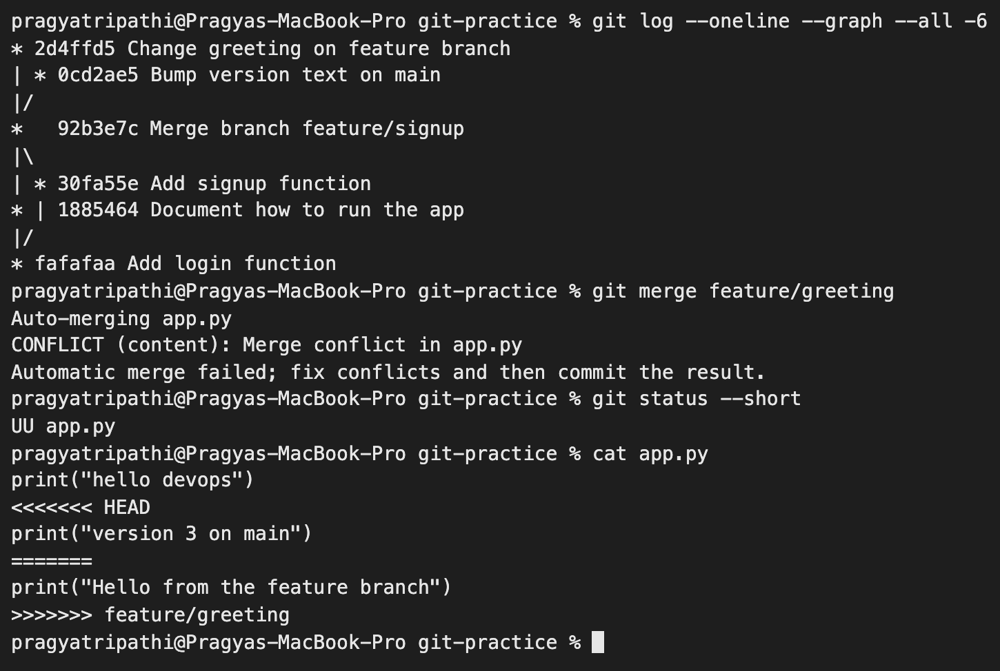

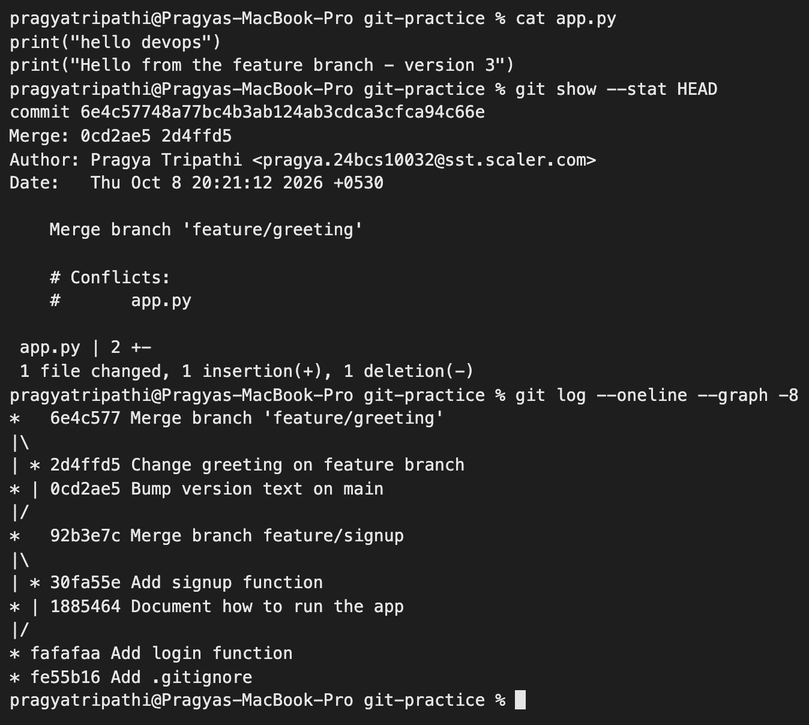

### 3.5 `git stash`

Situation: I was half-way through adding a `logout()` function when an urgent typo had to be fixed on `main`.

```text
$ echo "def logout(): return True" >> login.py

$ echo "half written notes" > notes.txt

$ git status --short
 M login.py
?? notes.txt

$ git stash push -u -m "WIP: logout and notes"
Saved working directory and index state On main: WIP: logout and notes

$ git status --short

$ git stash list
stash@{0}: On main: WIP: logout and notes

$ git switch -c hotfix/typo
Switched to a new branch 'hotfix/typo'

$ sed -i "" "s/hello devops/Hello DevOps/" app.py && git commit -am "Fix capitalisation in greeting"
[hotfix/typo e97d82f] Fix capitalisation in greeting
 1 file changed, 1 insertion(+), 1 deletion(-)

$ git switch main
Switched to branch 'main'

$ git merge hotfix/typo
Updating 6e4c577..e97d82f
Fast-forward
 app.py | 2 +-
 1 file changed, 1 insertion(+), 1 deletion(-)

$ git branch -d hotfix/typo
Deleted branch hotfix/typo (was e97d82f).

$ git stash show -p --include-untracked stash@{0}
diff --git a/login.py b/login.py
index 644dfe1..45e2fd3 100644
--- a/login.py
+++ b/login.py
@@ -1 +1,2 @@
 def login(): return True
+def logout(): return True
diff --git a/notes.txt b/notes.txt
new file mode 100644
index 0000000..2167ce9
--- /dev/null
+++ b/notes.txt
@@ -0,0 +1 @@
+half written notes

$ git stash pop
On branch main
Changes not staged for commit:
  (use "git add <file>..." to update what will be committed)
  (use "git restore <file>..." to discard changes in working directory)
	modified:   login.py

Untracked files:
  (use "git add <file>..." to include in what will be committed)
	notes.txt

no changes added to commit (use "git add" and/or "git commit -a")
Dropped refs/stash@{0} (96545fe9f7b41ce3eeb2e07d15a862bdbf7fe22b)

$ git add . && git commit -m "Add logout function and notes"
[main 31a6824] Add logout function and notes
 2 files changed, 2 insertions(+)
 create mode 100644 notes.txt
```

- `git stash` saves unfinished work and leaves a clean working directory, so I can switch branches safely.
- Without `-u` an **untracked** file such as `notes.txt` is not stashed – `-u` (`--include-untracked`) takes it too.
- `stash pop` = apply + delete from the list; `stash apply` would keep it in the list.

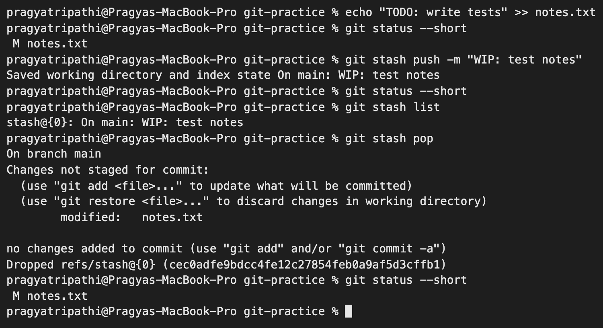

(In the screenshot I popped the stash and then threw that test change away with `git restore notes.txt`.)

### 3.6 `reset` vs `revert` (and `reflog`)

Three throwaway commits to experiment with:

```text
$ echo "step 1" > steps.txt && git add steps.txt && git commit -qm "Step 1"

$ echo "step 2" >> steps.txt && git commit -qam "Step 2"

$ echo "step 3" >> steps.txt && git commit -qam "Step 3"

$ git log --oneline -4
369d9a8 Step 3
ee42523 Step 2
16afb22 Step 1
31a6824 Add logout function and notes

$ git reset --soft HEAD~1

$ git log --oneline -3
ee42523 Step 2
16afb22 Step 1
31a6824 Add logout function and notes

$ git status --short
M  steps.txt

$ git reset --mixed HEAD~1
Unstaged changes after reset:
M	steps.txt

$ git log --oneline -2
16afb22 Step 1
31a6824 Add logout function and notes

$ git status --short
 M steps.txt

$ git diff --stat
 steps.txt | 2 ++
 1 file changed, 2 insertions(+)

$ git reset --hard HEAD
HEAD is now at 16afb22 Step 1

$ git status --short

$ cat steps.txt
step 1
```

| Mode | Moves the branch back | Staging area | Working files |
|---|---|---|---|
| `--soft` | yes | keeps the changes **staged** (`M `) | untouched |
| `--mixed` (default) | yes | changes become **unstaged** (` M`) | untouched |
| `--hard` | yes | cleared | **changes are thrown away** |

"Step 2" and "Step 3" were now gone from the log, but `git reflog` still remembers every place `HEAD` has been:

```text
$ git reflog -6
16afb22 HEAD@{0}: reset: moving to HEAD
16afb22 HEAD@{1}: reset: moving to HEAD~1
ee42523 HEAD@{2}: reset: moving to HEAD~1
369d9a8 HEAD@{3}: commit: Step 3
ee42523 HEAD@{4}: commit: Step 2
16afb22 HEAD@{5}: commit: Step 1

$ git reset --hard HEAD@{2}
HEAD is now at ee42523 Step 2

$ git log --oneline -4
ee42523 Step 2
16afb22 Step 1
31a6824 Add logout function and notes
e97d82f Fix capitalisation in greeting
```

I picked the wrong entry here: `HEAD@{2}` is where HEAD was **after** the first reset (Step 2), not before it. The commit I wanted was `HEAD@{3}` = `369d9a8`. Using the hash directly is safer because the `@{n}` numbers shift after every command:

```text
$ git reset --hard 369d9a8
HEAD is now at 369d9a8 Step 3

$ git log --oneline -4
369d9a8 Step 3
ee42523 Step 2
16afb22 Step 1
31a6824 Add logout function and notes

$ cat steps.txt
step 1
step 2
step 3
```

Now `git revert`, which undoes a commit by adding a **new** commit. I tried to revert "Step 2" (an older commit, not the last one):

```text
$ git revert --no-edit HEAD~1
Auto-merging steps.txt
CONFLICT (content): Merge conflict in steps.txt
error: could not revert ee42523... Step 2
hint: After resolving the conflicts, mark them with
hint: "git add/rm <pathspec>", then run
hint: "git revert --continue".
hint: You can instead skip this commit with "git revert --skip".
hint: To abort and get back to the state before "git revert",
hint: run "git revert --abort".
hint: Disable this message with "git config set advice.mergeConflict false"

$ cat steps.txt
step 1
<<<<<<< HEAD
step 2
step 3
=======
>>>>>>> parent of ee42523 (Step 2)
```

It conflicted because "Step 3" added its line right next to the line "Step 2" added, so Git could not decide on its own how to remove only `step 2`. I fixed it by hand and continued:

```text
$ printf "step 1\nstep 3\n" > steps.txt

$ git add steps.txt

$ GIT_EDITOR=true git revert --continue
[main 5d654a5] Revert "Step 2"
 1 file changed, 1 deletion(-)

$ git log --oneline -5
5d654a5 Revert "Step 2"
369d9a8 Step 3
ee42523 Step 2
16afb22 Step 1
31a6824 Add logout function and notes

$ cat steps.txt
step 1
step 3
```

(`GIT_EDITOR=true` just accepts the default commit message without opening an editor.) Reverting the most recent commit has nothing next to it, so it went through cleanly:

```text
$ echo "BROKEN CONFIG" > config.txt && git add config.txt && git commit -qm "Add broken config"

$ git revert --no-edit HEAD
[main cfebe0f] Revert "Add broken config"
 Date: Thu Oct 8 20:21:47 2026 +0530
 1 file changed, 1 deletion(-)
 delete mode 100644 config.txt

$ git log --oneline -4
cfebe0f Revert "Add broken config"
932b49a Add broken config
5d654a5 Revert "Step 2"
369d9a8 Step 3
```

| | `git reset` | `git revert` |
|---|---|---|
| What it does | Moves the branch pointer back; later commits disappear from the log | Adds a new commit that does the opposite of an old one |
| History | Rewritten | Kept – nothing is deleted |
| Safe on a shared/pushed branch? | **No** – others still have the removed commits | **Yes** – this is the way to undo on `main` |
| Typical use | Clean up my own local commits before pushing | Undo a bad commit that is already pushed |

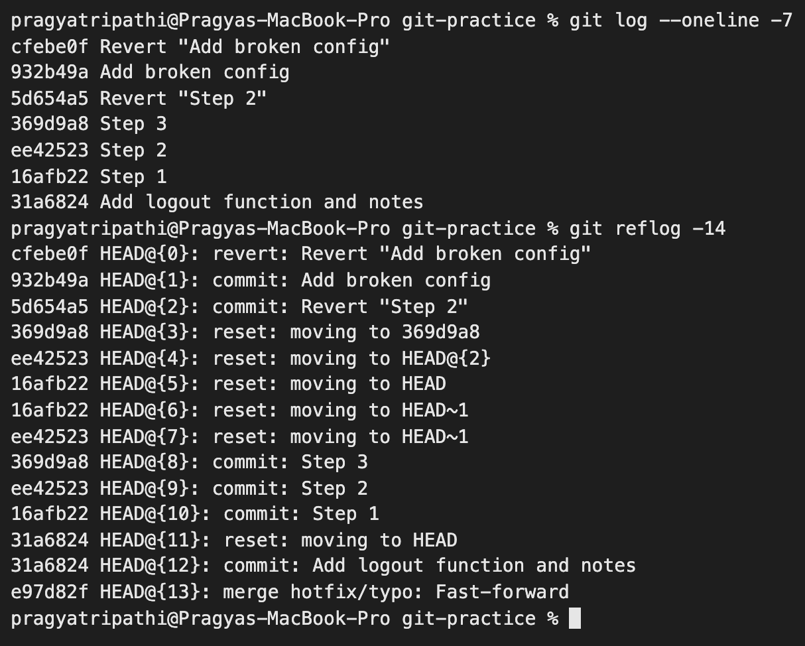

### 3.7 Remotes: `remote`, `push`, `clone`, `fetch`, `pull`

As explained at the top, the "remote" here is a bare repository in `~/devops-lab/remotes/` instead of GitHub. A second clone called `teammate` plays the role of another developer.

```text
$ git init --bare remotes/git-practice.git
Initialized empty Git repository in /Users/pragyatripathi/devops-lab/remotes/git-practice.git/

$ cd git-practice

$ git remote add origin ../remotes/git-practice.git

$ git remote -v
origin	../remotes/git-practice.git (fetch)
origin	../remotes/git-practice.git (push)

$ git push -u origin main
To ../remotes/git-practice.git
 * [new branch]      main -> main
branch 'main' set up to track 'origin/main'.

$ git branch -vv
* main cfebe0f [origin/main] Revert "Add broken config"

$ cd ..

$ git clone remotes/git-practice.git teammate
Cloning into 'teammate'...
done.

$ cd teammate

$ git config user.name "Pragya Tripathi" && git config user.email "pragya.24bcs10032@sst.scaler.com"

$ git log --oneline -3
cfebe0f Revert "Add broken config"
932b49a Add broken config
5d654a5 Revert "Step 2"

$ echo "## Contributors" >> README.md && git commit -qam "Add contributors heading (from second clone)"

$ git push
To /Users/pragyatripathi/devops-lab/remotes/git-practice.git
   cfebe0f..878190d  main -> main

$ cd ../git-practice

$ git status -sb
## main...origin/main

$ git fetch
From ../remotes/git-practice
   cfebe0f..878190d  main       -> origin/main

$ git status -sb
## main...origin/main [behind 1]

$ git log --oneline -3 origin/main
878190d Add contributors heading (from second clone)
cfebe0f Revert "Add broken config"
932b49a Add broken config

$ git pull
Updating cfebe0f..878190d
Fast-forward
 README.md | 1 +
 1 file changed, 1 insertion(+)

$ tail -2 README.md
Run: python app.py
## Contributors
```

- `git status` said "up to date" **before** `git fetch` – it only compares with the last copy of `origin/main` it downloaded. After `fetch` it showed `[behind 1]`.
- `git fetch` only downloads; `git pull` = `fetch` + merge into my branch.
- `push -u` sets the upstream once, so later a plain `git push` / `git pull` knows where to go.

**When two people push to the same branch:**

```text
$ cd git-practice
$ echo "def reset_password(): return True" >> login.py && git commit -qam "Add reset_password"

$ git push
To ../remotes/git-practice.git
   878190d..a0586fa  main -> main

$ cd ../teammate
$ echo "def delete_account(): return True" >> signup.py && git commit -qam "Add delete_account"

$ git push
To /Users/pragyatripathi/devops-lab/remotes/git-practice.git
 ! [rejected]        main -> main (fetch first)
error: failed to push some refs to '/Users/pragyatripathi/devops-lab/remotes/git-practice.git'
hint: Updates were rejected because the remote contains work that you do not
hint: have locally. This is usually caused by another repository pushing to
hint: the same ref. If you want to integrate the remote changes, use
hint: 'git pull' before pushing again.
hint: See the 'Note about fast-forwards' in 'git push --help' for details.

$ git pull
From /Users/pragyatripathi/devops-lab/remotes/git-practice
   878190d..a0586fa  main       -> origin/main
hint: You have divergent branches and need to specify how to reconcile them.
hint: You can do so by running one of the following commands sometime before
hint: your next pull:
hint:
hint:   git config pull.rebase false  # merge
hint:   git config pull.rebase true   # rebase
hint:   git config pull.ff only       # fast-forward only
hint:
hint: You can replace "git config" with "git config --global" to set a default
hint: preference for all repositories. You can also pass --rebase, --no-rebase,
hint: or --ff-only on the command line to override the configured default per
hint: invocation.
fatal: Need to specify how to reconcile divergent branches.

$ git pull --rebase
Rebasing (1/1)
Successfully rebased and updated refs/heads/main.

$ git log --oneline --graph -4
* e0b3500 Add delete_account
* a0586fa Add reset_password
* 878190d Add contributors heading (from second clone)
* cfebe0f Revert "Add broken config"

$ git push
To /Users/pragyatripathi/devops-lab/remotes/git-practice.git
   a0586fa..e0b3500  main -> main
```

- Git refuses a push that would throw away someone else's commit (`rejected ... fetch first`).
- A plain `git pull` stopped too, because my branch and the remote had **diverged** and no default (merge or rebase) is configured in this repository. I chose `--rebase`: my commit was replayed on top of the other one, so the history stays a straight line, and then the push worked.

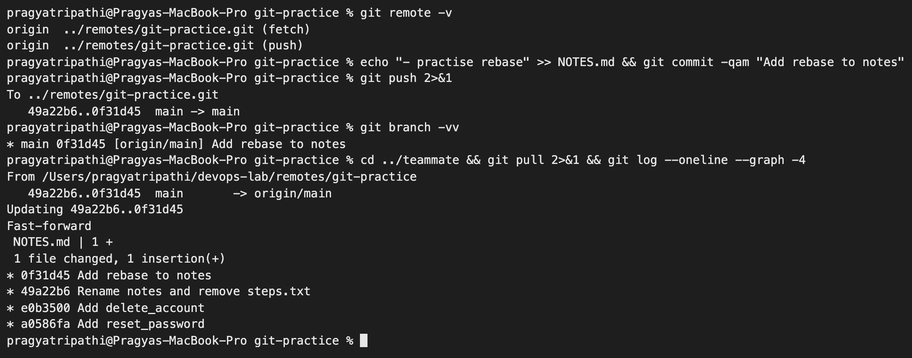

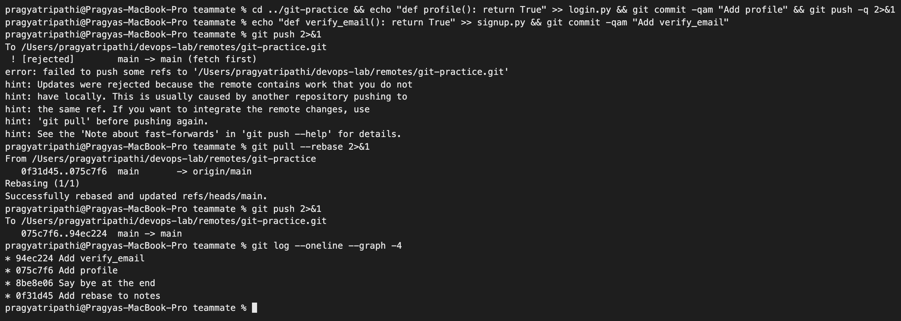

### 3.8 `git mv`, `git rm`, `git tag`

```text
$ git mv notes.txt NOTES.md

$ git rm -q steps.txt

$ git status --short
R  notes.txt -> NOTES.md
D  steps.txt

$ git commit -qm "Rename notes and remove steps.txt"

$ git tag -a v1.0 -m "First practice release"

$ git tag
v1.0

$ git push origin main v1.0
To ../remotes/git-practice.git
   e0b3500..49a22b6  main -> main
 * [new tag]         v1.0 -> v1.0

$ git ls-remote origin
49a22b6c9b61cb8889599cd88188134acb7d1659	HEAD
49a22b6c9b61cb8889599cd88188134acb7d1659	refs/heads/main
cde484e2ebe9699ab1b6f496e4a7004cd295601f	refs/tags/v1.0
49a22b6c9b61cb8889599cd88188134acb7d1659	refs/tags/v1.0^{}
```

`git mv` and `git rm` change the file **and** stage the change in one step. Tags are not pushed with a normal `git push`; they have to be pushed by name (or with `--tags`). `refs/tags/v1.0^{}` is the commit the annotated tag points to.

---

## Task 4: Git vs GitHub and the GitHub workflow

| Git | GitHub |
|---|---|
| Version control tool that runs on my laptop | Website/service that hosts Git repositories |
| Works offline: commit, branch, merge, log | Needs internet: share code, review, CI |
| Commands: `git ...` | Features: pull requests, issues, forks, Actions, Pages |

The team workflow I followed in Task 3, mapped to GitHub:

1. `git clone <url>` (or **fork** first if I do not have write access).
2. `git switch -c feature/<name>` – never work directly on `main`.
3. `git add` / `git commit` small, clear commits.
4. `git push -u origin feature/<name>`.
5. Open a **pull request** on GitHub → review → merge.
6. `git switch main && git pull` to get the merged result.

This assignment repository itself is hosted on GitHub at https://github.com/16pragyatripathi/Devops-Assignment-1, so the clone/push part with a real GitHub URL is the same as above, just with `https://github.com/...` instead of `../remotes/git-practice.git`.

### Quick reference

| Command | What it does |
|---|---|
| `git init` | Start a new repository |
| `git clone <url>` | Copy a remote repository |
| `git status` / `git status -sb` | What changed, which branch, ahead/behind |
| `git add <file>` / `git add .` | Stage changes |
| `git commit -m "msg"` / `-am` | Save staged (or all tracked) changes |
| `git log --oneline --graph --all` | Compact history with branches |
| `git diff` / `git diff --staged` | Unstaged / staged changes |
| `git branch`, `git switch -c`, `git checkout -b` | List / create branches |
| `git merge <branch>` | Join a branch into the current one |
| `git merge --abort` | Cancel a merge with conflicts |
| `git stash`, `git stash pop` | Park and bring back unfinished work |
| `git reset --soft/--mixed/--hard` | Move the branch back (rewrites history) |
| `git revert <hash>` | Undo a commit with a new commit |
| `git reflog` | Every place HEAD has been – rescue tool |
| `git cherry-pick <hash>` | Copy one commit to the current branch |
| `git remote -v`, `git fetch`, `git pull`, `git push` | Work with the remote |
| `git tag -a v1.0 -m "msg"` | Mark a release |

---

## What I understood

- Git has three areas: working directory → `git add` → staging area → `git commit` → history. `git diff` and `git diff --staged` look at the gaps between them.
- Branches are cheap pointers. A merge is fast-forward when `main` did not move, otherwise Git makes a merge commit.
- A conflict is not an error in Git – it just means two branches changed the same lines and I must choose. The markers show both sides; after editing, `git add` + `git commit` finishes the merge.
- `git stash -u` is the quick way to switch tasks without committing half-done work.
- `reset` rewrites history (fine for local commits), `revert` adds an "undo" commit (the safe choice once something is pushed). `reflog` can bring back commits that `reset --hard` hid – but use the hash, not `HEAD@{n}`, because the numbers move.
- A remote is just another copy of the repository. Push is rejected when the remote has commits I do not have; `pull --rebase` (or a merge) brings them in first.
