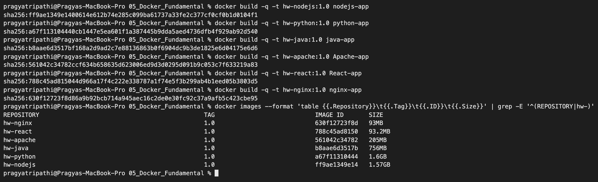
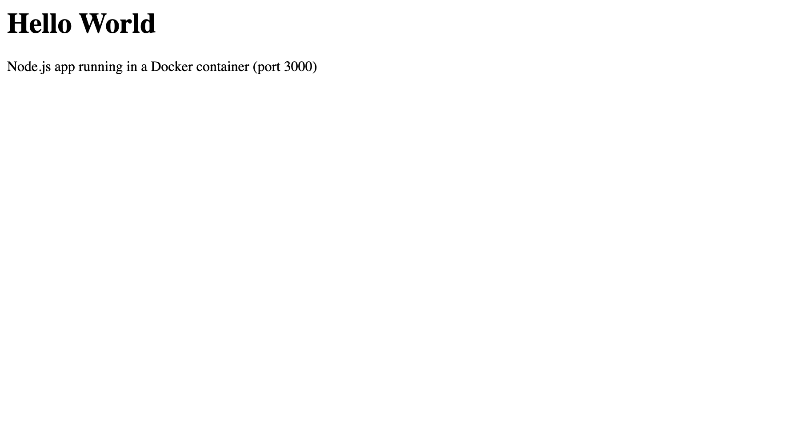
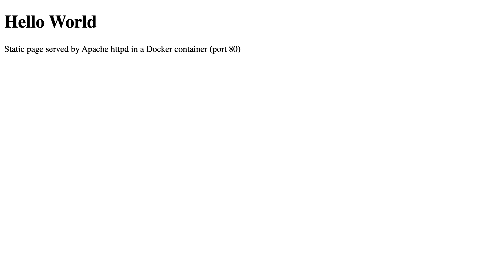
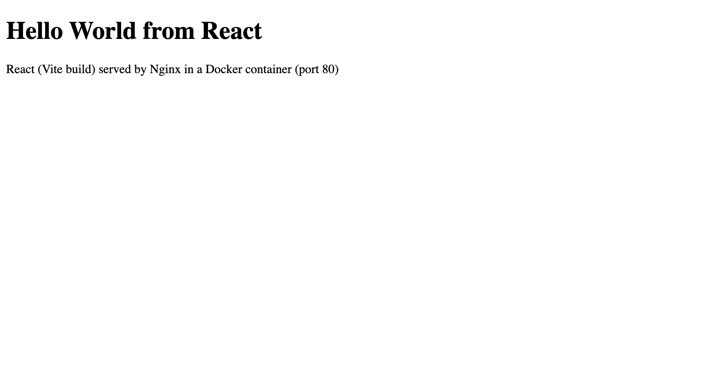
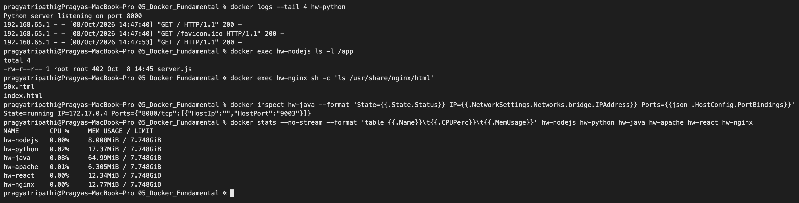

# Docker Fundamentals – Homework

**Name:** Pragya Tripathi
**Roll No:** 24BCS10032

## Task: Hello World web applications with Docker

Six applications, each in its own folder with its code and a `Dockerfile`. Every app returns a page with a **Hello World** heading plus one line saying which stack served it, so the browser screenshots can be told apart.

| # | Folder | Stack | Base image | Container port | Host port used |
|---|---|---|---|---|---|
| 1 | [nodejs-app](nodejs-app) | Node.js `http` server | `node:20` | 3000 | 9001 |
| 2 | [python-app](python-app) | Python `http.server` | `python:3.12` | 8000 | 9002 |
| 3 | [java-app](java-app) | Java `HttpServer` | `eclipse-temurin:21` | 8080 | 9003 |
| 4 | [Apache-app](Apache-app) | Apache httpd static page | `httpd:2.4` | 80 | 9004 |
| 5 | [React-app](React-app) | React + Vite, served by Nginx (multi-stage build) | `node:20-alpine` → `nginx:alpine` | 80 | 9005 |
| 6 | [nginx-app](nginx-app) | Nginx static page | `nginx:alpine` | 80 | 9006 |

I used the 9001–9006 range because 80/443 and 8081/8443 on my Mac are already used by the kind cluster from the Kubernetes sessions.

### The Dockerfiles

There are three kinds of Dockerfile in this set:

| Kind | Apps | What the Dockerfile does |
|---|---|---|
| Language runtime + my code | Node.js, Python, Java | `FROM` a runtime image, `WORKDIR /app`, `COPY` the source, `CMD` starts the server. Java also has a `RUN javac` step at build time. |
| Web server + a static file | Apache, Nginx | `FROM` the server image and `COPY index.html` into its web root. No `CMD` needed, the base image already starts the server. |
| Multi-stage | React | Stage 1 (`node:20-alpine`) runs `npm install` + `npm run build`. Stage 2 (`nginx:alpine`) copies only the built `dist/` folder. |

```dockerfile
# nodejs-app/Dockerfile
FROM node:20
WORKDIR /app
COPY server.js .
EXPOSE 3000
CMD ["node", "server.js"]
```

```dockerfile
# React-app/Dockerfile
# Stage 1: build the React app with Vite
FROM node:20-alpine AS build
WORKDIR /app
COPY package.json ./
RUN npm install
COPY . .
RUN npm run build

# Stage 2: serve the static build with Nginx
FROM nginx:alpine
COPY --from=build /app/dist /usr/share/nginx/html
EXPOSE 80
```

---

## Step 1: Build the images

I removed the old containers and rebuilt every image from its Dockerfile.

```text
$ docker rm -f hw-nodejs hw-python hw-java hw-apache hw-react hw-nginx
hw-nodejs
hw-python
hw-java
hw-apache
hw-react
hw-nginx
```

```bash
docker build -t hw-nodejs:1.0 nodejs-app
docker build -t hw-python:1.0 python-app
docker build -t hw-java:1.0   java-app
docker build -t hw-apache:1.0 Apache-app
docker build -t hw-react:1.0  React-app
docker build -t hw-nginx:1.0  nginx-app
```

Part of the Node.js build log (`--progress=plain`). The base image was already on my machine, so `FROM` is `CACHED` and only my two steps ran:

```text
#6 [1/3] FROM docker.io/library/node:20@sha256:8f693eaa7e0a8e71560c9a82b55fd54c2ae920a2ba5d2cde28bac7d1c01c9ba5
#6 CACHED
#7 [2/3] WORKDIR /app
#8 [3/3] COPY server.js .
```

Build summary (`-q` prints only the new image ID) and the resulting images:



```text
$ docker images --format 'table {{.Repository}}\t{{.Tag}}\t{{.ID}}\t{{.Size}}' | grep -E '^(REPOSITORY|hw-)'
REPOSITORY      TAG     IMAGE ID       SIZE
hw-nginx        1.0     630f12723f8d   93MB
hw-react        1.0     788c45ad8150   93.2MB
hw-apache       1.0     561042c34782   205MB
hw-java         1.0     b8aae6d3517b   756MB
hw-python       1.0     a67f11310444   1.6GB
hw-nodejs       1.0     ff9ae1349e14   1.57GB
```

(`docker images` pads its columns very wide on this machine because of long image names from other sessions. Here and below I trimmed only those extra spaces.)

**Something I noticed:** the first time, I ran the containers and then rebuilt the images once more for the screenshot above. Every layer came from cache, but each build still got a **new image ID**, because BuildKit attaches a provenance attestation with the build time. The tag `hw-nginx:1.0` moved to the new ID and `docker ps` then showed the running containers with a bare ID (`8e24b25570e2`) in the IMAGE column instead of `hw-nginx:1.0`. A running container stays on the exact image it was started from. I removed and re-ran the containers so they use the current images (Step 2).

## Step 2: Run the containers

`-d` runs in the background, `--name` gives a fixed name, `-p host:container` publishes the port.

```text
$ docker rm -f hw-nodejs hw-python hw-java hw-apache hw-react hw-nginx
hw-nodejs
hw-python
hw-java
hw-apache
hw-react
hw-nginx

$ docker run -d --name hw-nodejs -p 9001:3000 hw-nodejs:1.0
c6e3f04c34d410619a172650ec90be309f7cc327cab81a37850375377ba45de7

$ docker run -d --name hw-python -p 9002:8000 hw-python:1.0
458dbfbeaa3152e3548efc3ea4739d43ecc752366e94339775ead1a9533562e7

$ docker run -d --name hw-java -p 9003:8080 hw-java:1.0
849115c74b9d01de1bc54962a5671d9068fa1a8101ff432bb04ad572f5e0c8c2

$ docker run -d --name hw-apache -p 9004:80 hw-apache:1.0
4dccae0eea0bb5957ffa3655a64a349626e7c7d9034b1ae34eab005f9adf7deb

$ docker run -d --name hw-react -p 9005:80 hw-react:1.0
861a9db18c41b33d8e8367b6e21cf034cf2c9233c29d00fd6e90c955ce7dd5d5

$ docker run -d --name hw-nginx -p 9006:80 hw-nginx:1.0
5bf4f559c9c385e9460dc0f73e47b81ea81abb0291ab78c35d85a19ee900998d
```

## Step 3: Verify the containers are running

```text
$ docker ps --filter 'name=^hw-' --format "table {{.Names}}\t{{.Image}}\t{{.Status}}\t{{.Ports}}"
NAMES       IMAGE           STATUS         PORTS
hw-nginx    hw-nginx:1.0    Up 4 seconds   0.0.0.0:9006->80/tcp, [::]:9006->80/tcp
hw-react    hw-react:1.0    Up 4 seconds   0.0.0.0:9005->80/tcp, [::]:9005->80/tcp
hw-apache   hw-apache:1.0   Up 4 seconds   0.0.0.0:9004->80/tcp, [::]:9004->80/tcp
hw-java     hw-java:1.0     Up 4 seconds   0.0.0.0:9003->8080/tcp, [::]:9003->8080/tcp
hw-python   hw-python:1.0   Up 4 seconds   0.0.0.0:9002->8000/tcp, [::]:9002->8000/tcp
hw-nodejs   hw-nodejs:1.0   Up 4 seconds   0.0.0.0:9001->3000/tcp, [::]:9001->3000/tcp
```

`0.0.0.0:9001->3000/tcp` means: port 9001 on my Mac is forwarded to port 3000 inside the container.

## Step 4: Verify that Hello World is displayed

### In the browser

Each screenshot is the page opened in Chrome at the URL in the caption.

| | |
|---|---|
|  **1. Node.js** – <http://localhost:9001> |  **2. Python** – <http://localhost:9002> |
|  **3. Java** – <http://localhost:9003> |  **4. Apache** – <http://localhost:9004> |
|  **5. React** – <http://localhost:9005> |  **6. Nginx** – <http://localhost:9006> |

### From the terminal

```text
$ curl -s http://localhost:9001
<h1>Hello World</h1><p>Node.js app running in a Docker container (port 3000)</p>
$ curl -s http://localhost:9002
<h1>Hello World</h1><p>Python app running in a Docker container (port 8000)</p>
$ curl -s http://localhost:9003
<h1>Hello World</h1><p>Java app running in a Docker container (port 8080)</p>
$ curl -s http://localhost:9004
<!DOCTYPE html>
<html>
<head><title>Apache Hello World</title></head>
<body>
  <h1>Hello World</h1>
  <p>Static page served by Apache httpd in a Docker container (port 80)</p>
</body>
</html>

$ curl -s http://localhost:9005
<!DOCTYPE html>
<html lang="en">
  <head>
    <meta charset="UTF-8" />
    <title>React Hello World</title>
    <script type="module" crossorigin src="/assets/index-C-wlr7ky.js"></script>
  </head>
  <body>
    <div id="root"></div>
  </body>
</html>

$ curl -s http://localhost:9006
<!DOCTYPE html>
<html>
<head><title>Nginx Hello World</title></head>
<body>
  <h1>Hello World</h1>
  <p>Static page served by Nginx in a Docker container (port 80)</p>
</body>
</html>
```

The React page is an empty `<div id="root">` plus a JavaScript bundle, because React draws the heading in the browser (that is why the browser screenshot is the real proof for app 5). To confirm the text is in the bundle that Nginx serves:

```text
$ curl -s http://localhost:9005/$(curl -s http://localhost:9005 | grep -o 'assets/[^"]*\.js') | grep -o 'Hello World from React'
Hello World from React
```


---

## Step 5: Docker commands from the class cheat sheets, run on my containers

The class PDFs (`docker-basic-cmd.pdf`, `docker-advance-cmd.pdf`) list the everyday commands. I ran each one against the six containers above. Volume and network commands are covered in [07_Docker_Networking](../07_Docker_Networking/README.md); Compose, `--target`, `save/load` and tagging for a registry are in [06_DockerFiles_Images](../06_DockerFiles_Images/README.md).

### 5.1 Images: pull, run, list, inspect, tag, remove

```text
$ docker pull hello-world
Using default tag: latest
latest: Pulling from library/hello-world
Digest: sha256:5e23090353324d887c48ad5e5c56d294eab81588df9605b07d1afe895f9cc8f8
Status: Image is up to date for hello-world:latest
docker.io/library/hello-world:latest

$ docker run --rm hello-world | head -8

Hello from Docker!
This message shows that your installation appears to be working correctly.

To generate this message, Docker took the following steps:
 1. The Docker client contacted the Docker daemon.
 2. The Docker daemon pulled the "hello-world" image from the Docker Hub.
    (arm64v8)

$ docker pull nginx:alpine
alpine: Pulling from library/nginx
Digest: sha256:df221db836e1754089190208cee7eeda94f233197056426eda74a43ab1abeac2
Status: Image is up to date for nginx:alpine
docker.io/library/nginx:alpine

$ docker image inspect hw-nodejs:1.0 --format "Arch={{.Architecture}} OS={{.Os}} WorkingDir={{.Config.WorkingDir}} Cmd={{.Config.Cmd}} ExposedPorts={{.Config.ExposedPorts}}"
Arch=arm64 OS=linux WorkingDir=/app Cmd=[node server.js] ExposedPorts=map[3000/tcp:{}]

$ docker tag hw-nginx:1.0 pragya/hello-nginx:v1

$ docker images --format "table {{.Repository}}\t{{.Tag}}\t{{.ID}}\t{{.Size}}" | grep -E "^(REPOSITORY|hw-nginx|pragya/hello-nginx)"
REPOSITORY           TAG   IMAGE ID       SIZE
hw-nginx             1.0   630f12723f8d   93MB
pragya/hello-nginx   v1    630f12723f8d   93MB

$ docker rmi pragya/hello-nginx:v1
Untagged: pragya/hello-nginx:v1

$ docker images --format "{{.Repository}}:{{.Tag}}" | grep -c pragya/hello-nginx
0
```

A tag is just a second name for the same image ID (`630f12723f8d`), so `docker rmi` on the extra tag only **untags**. Nothing is deleted while another tag still points to the image.

### 5.2 Containers: ps, logs, exec, inspect, port, top, stats

```text
$ docker ps -a --filter name=^hw- --format "table {{.ID}}\t{{.Names}}\t{{.Status}}"
CONTAINER ID   NAMES       STATUS
5bf4f559c9c3   hw-nginx    Up 57 seconds
861a9db18c41   hw-react    Up 57 seconds
4dccae0eea0b   hw-apache   Up 57 seconds
849115c74b9d   hw-java     Up 57 seconds
458dbfbeaa31   hw-python   Up 58 seconds
c6e3f04c34d4   hw-nodejs   Up 58 seconds

$ docker logs hw-nodejs
Node.js server listening on port 3000
2026-10-08T14:47:37.889Z GET /
2026-10-08T14:47:37.902Z GET /favicon.ico
2026-10-08T14:47:53.943Z GET /

$ docker logs hw-python
Python server listening on port 8000
192.168.65.1 - - [08/Oct/2026 14:47:40] "GET / HTTP/1.1" 200 -
192.168.65.1 - - [08/Oct/2026 14:47:40] "GET /favicon.ico HTTP/1.1" 200 -
192.168.65.1 - - [08/Oct/2026 14:47:53] "GET / HTTP/1.1" 200 -

$ docker logs hw-java
Java server listening on port 8080

$ docker logs --tail 2 hw-apache
192.168.65.1 - - [08/Oct/2026:14:47:45 +0000] "GET /favicon.ico HTTP/1.1" 404 236
192.168.65.1 - - [08/Oct/2026:14:47:53 +0000] "GET / HTTP/1.1" 200 192
```

The requests in the logs are the browser screenshots (they also ask for `/favicon.ico`) and my `curl` calls. `192.168.65.1` is the Docker Desktop VM gateway, i.e. my Mac as seen from inside the container. Apache and Nginx answer `404` for the favicon because there is no such file; my tiny Python server answers `200` to every path.

```text
$ docker exec hw-nodejs pwd
/app

$ docker exec hw-nodejs ls -l /app
total 4
-rw-r--r-- 1 root root 402 Oct  8 14:45 server.js

$ docker exec hw-nodejs node --version
v20.20.2

$ docker exec hw-python env
PATH=/usr/local/bin:/usr/local/sbin:/usr/local/bin:/usr/sbin:/usr/bin:/sbin:/bin
HOSTNAME=458dbfbeaa31
LANG=C.UTF-8
GPG_KEY=7169605F62C751356D054A26A821E680E5FA6305
PYTHON_VERSION=3.12.15
PYTHON_SHA256=c2c4321961fab0fb999d66e0cecf521c2ab3994c7992873ea99e306c1094fd5a
HOME=/root

$ docker exec hw-nginx cat /etc/os-release | head -3
NAME="Alpine Linux"
ID=alpine
VERSION_ID=3.24.2

$ docker exec hw-nginx sh -c "ls /usr/share/nginx/html && whoami"
50x.html
index.html
root
```

`HOSTNAME` inside the container is the short container ID. For an interactive shell the command is `docker exec -it hw-nginx sh` (Alpine images have `sh`, not `bash`).

```text
$ docker inspect hw-java --format "Name={{.Name}} State={{.State.Status}} IP={{.NetworkSettings.Networks.bridge.IPAddress}} Ports={{json .HostConfig.PortBindings}}"
Name=/hw-java State=running IP=172.17.0.4 Ports={"8080/tcp":[{"HostIp":"","HostPort":"9003"}]}

$ docker port hw-java
8080/tcp -> 0.0.0.0:9003
8080/tcp -> [::]:9003

$ docker top hw-nginx -o pid,user,args | head -4
PID                 USER                COMMAND
55546               root                nginx: master process nginx -g daemon off;
55590               statd               nginx: worker process
55591               statd               nginx: worker process

$ docker stats --no-stream --format "table {{.Name}}\t{{.CPUPerc}}\t{{.MemUsage}}" hw-nodejs hw-python hw-java hw-apache hw-react hw-nginx
NAME        CPU %     MEM USAGE / LIMIT
hw-nodejs   0.02%     8.551MiB / 7.748GiB
hw-python   0.02%     17.63MiB / 7.748GiB
hw-java     0.08%     65.08MiB / 7.748GiB
hw-apache   0.01%     8.824MiB / 7.748GiB
hw-react    0.00%     12.34MiB / 7.748GiB
hw-nginx    0.00%     12.64MiB / 7.748GiB
```

- `docker top` lists processes from the Docker VM's point of view. The Nginx workers run as UID 101 (`nginx` inside the container), and in the VM that UID happens to be named `statd`. Same process, different name lookup.
- The Java app uses the most memory (65 MiB) because of the JVM. The other five stay under 18 MiB.



### 5.3 Lifecycle: stop, start, restart, pause, unpause

```text
$ docker stop hw-apache
hw-apache

$ docker ps -a --filter name=^hw-apache --format "{{.Names}}  {{.Status}}"
hw-apache  Exited (0) Less than a second ago

$ curl -s -o /dev/null -w "%{http_code}\n" http://localhost:9004 || echo "curl failed: nothing is listening on 9004"
000
curl failed: nothing is listening on 9004

$ docker start hw-apache
hw-apache

$ docker restart hw-apache
hw-apache

$ docker ps --filter name=^hw-apache --format "{{.Names}}  {{.Status}}  {{.Ports}}"
hw-apache  Up Less than a second  0.0.0.0:9004->80/tcp, [::]:9004->80/tcp

$ curl -s http://localhost:9004 | grep -o "<h1>.*</h1>"
<h1>Hello World</h1>

$ docker pause hw-nginx
hw-nginx

$ docker ps --filter name=^hw-nginx --format "{{.Names}}  {{.Status}}"
hw-nginx  Up About a minute (Paused)

$ curl -s -m 3 http://localhost:9006 || echo "curl timed out while hw-nginx was paused"
curl timed out while hw-nginx was paused

$ docker unpause hw-nginx
hw-nginx

$ curl -s -m 3 http://localhost:9006 | grep -o "<h1>.*</h1>"
<h1>Hello World</h1>
```

A **stopped** container has no process, so the port refuses at once (`000`). A **paused** container still has its process and port, but the process is frozen, so the request just hangs until the 3 second timeout.

`docker events` recorded the lifecycle changes above (times converted to my local clock):

```text
$ docker events --since 15m --until 0s --filter container=hw-apache --filter event=stop --filter event=start --filter event=restart --format "{{.Time}} {{.Action}} {{.Actor.Attributes.name}}" | while read t rest; do echo "$(date -r $t +%H:%M:%S) $rest"; done
20:17:26 start hw-apache
20:18:38 stop hw-apache
20:18:38 start hw-apache
20:18:39 stop hw-apache
20:18:39 start hw-apache
20:18:39 restart hw-apache
```

The first line is the container being started in Step 2. `docker restart` shows up as a stop + start + restart.

### 5.4 Files: diff, cp, rename, update, rm

```text
$ docker diff hw-nginx
C /etc
C /etc/nginx
C /etc/nginx/conf.d
C /etc/nginx/conf.d/default.conf
C /run
A /run/nginx.pid
C /var
C /var/cache
C /var/cache/nginx
A /var/cache/nginx/fastcgi_temp
A /var/cache/nginx/proxy_temp
A /var/cache/nginx/scgi_temp
A /var/cache/nginx/uwsgi_temp
A /var/cache/nginx/client_temp
```

`A` = added, `C` = changed, compared with the image. These are the files Nginx writes when it starts (pid file, temp dirs; the entrypoint script edits `default.conf`). They live in the container's thin writable layer and disappear with the container.

To try `rename`, `cp` into a container, `update` and `rm` without touching my six apps, I used a throw-away Nginx container with no published port:

```text
$ docker cp hw-nginx:/usr/share/nginx/html/index.html ./index-from-container.html

$ grep "<h1>" index-from-container.html
  <h1>Hello World</h1>

$ docker run -d --name scratch-web nginx:alpine
c86008a8bc0515ef35fd82738a25191bcda6b7aa0e56c562332e9417051214a0

$ docker rename scratch-web pragya-scratch

$ docker cp ./note.html pragya-scratch:/usr/share/nginx/html/note.html

$ docker exec pragya-scratch wget -qO- http://localhost/note.html
<h1>Copied in with docker cp</h1>

$ docker update --memory 64m --memory-swap 64m pragya-scratch
pragya-scratch

$ docker inspect pragya-scratch --format "Memory limit: {{.HostConfig.Memory}} bytes"
Memory limit: 67108864 bytes

$ docker stop pragya-scratch
pragya-scratch

$ docker rm pragya-scratch
pragya-scratch

$ docker ps -a --filter name=pragya-scratch --format "{{.Names}}" | wc -l
       0
```

67108864 bytes = 64 × 1024 × 1024, so the new limit was applied to the running container.

### 5.5 Layers and `docker history`

Every instruction in a Dockerfile creates a layer (or only metadata). `docker history` lists them newest first:

```text
$ docker history hw-nodejs:1.0 --format "table {{.CreatedBy}}\t{{.Size}}" | head -8
CREATED BY                                      SIZE
CMD ["node" "server.js"]                        0B
EXPOSE [3000/tcp]                               0B
COPY server.js . # buildkit                     12.3kB
WORKDIR /app                                    8.19kB
CMD ["node"]                                    0B
ENTRYPOINT ["docker-entrypoint.sh"]             0B
COPY docker-entrypoint.sh /usr/local/bin/ # …   20.5kB

$ docker image inspect hw-nodejs:1.0 --format "{{len .RootFS.Layers}} layers"
10 layers

$ docker history hw-react:1.0 --format "table {{.CreatedBy}}\t{{.Size}}" | head -6
CREATED BY                                      SIZE
EXPOSE [80/tcp]                                 0B
COPY /app/dist /usr/share/nginx/html # build…   172kB
RUN /bin/sh -c set -x     && apkArch="$(cat …   51.4MB
ENV ACME_VERSION=0.4.1                          0B
ENV NJS_RELEASE=1                               0B
```

- My own layers in `hw-nodejs` are tiny (12.3 kB). The remaining 1.57 GB is the `node:20` base image underneath.
- `CMD`, `EXPOSE` and `ENV` are 0 B: they only change the image settings, not the filesystem.
- In `hw-react` the top layer is the 172 kB React build, and right under it are the `nginx:alpine` layers. There is no trace of Node.js or `node_modules`, because they stayed in the build stage.

### 5.6 Build cache

Docker reuses a layer when the instruction and its inputs have not changed. Once one layer changes, every layer after it is rebuilt.

**Only the source changed.** When I edited `src/main.jsx` for this homework and rebuilt `hw-react:1.0`, `package.json` was the same, so the slow `npm install` layer came from cache and only `COPY . .` and `npm run build` ran:

```text
#8 [build 2/6] WORKDIR /app
#8 CACHED
#9 [build 3/6] COPY package.json ./
#9 CACHED
#10 [build 4/6] RUN npm install
#10 CACHED
#11 [build 5/6] COPY . .
#12 [build 6/6] RUN npm run build
#12 DONE 4.5s
#6 [stage-1 1/2] FROM docker.io/library/nginx:alpine@sha256:df221db836e1754089190208cee7eeda94f233197056426eda74a43ab1abeac2
#6 CACHED
#13 [stage-1 2/2] COPY --from=build /app/dist /usr/share/nginx/html
```

This is why the Dockerfile copies `package.json` and runs `npm install` **before** `COPY . .`.

**Nothing changed vs `--no-cache`.** I built the same Dockerfile under a separate tag (`hw-react:cache-demo`) so the running `hw-react:1.0` was not affected:

```text
$ time docker build --progress=plain -t hw-react:cache-demo React-app 2>&1 | grep -E "^#[0-9]+ (\[build|\[stage|CACHED)"
#5 [stage-1 1/2] FROM docker.io/library/nginx:alpine@sha256:df221db836e1754089190208cee7eeda94f233197056426eda74a43ab1abeac2
#6 [build 1/6] FROM docker.io/library/node:20-alpine@sha256:fb4cd12c85ee03686f6af5362a0b0d56d50c58a04632e6c0fb8363f609372293
#8 [build 5/6] COPY . .
#8 CACHED
#9 [build 6/6] RUN npm run build
#9 CACHED
#10 [build 2/6] WORKDIR /app
#10 CACHED
#11 [build 4/6] RUN npm install
#11 CACHED
#12 [build 3/6] COPY package.json ./
#12 CACHED
#13 [stage-1 2/2] COPY --from=build /app/dist /usr/share/nginx/html
#13 CACHED

real	0m0.618s
user	0m0.085s
sys	0m0.067s

$ time docker build --no-cache --progress=plain -t hw-react:cache-demo React-app 2>&1 | grep -E "^#[0-9]+ (\[build [4-6]|DONE [0-9]+\.[0-9]s|added)" | grep -vE "DONE 0\.[0-9]s"
#10 [build 4/6] RUN npm install
#10 DONE 90.4s
#11 [build 5/6] COPY . .
#12 [build 6/6] RUN npm run build
#12 DONE 4.2s

real	1m35.323s
user	0m0.144s
sys	0m0.123s
```

0.6 seconds with cache, 95 seconds without. Almost all of it is `npm install` downloading packages again.

### 5.7 `.dockerignore`

`React-app/.dockerignore` keeps `node_modules` and `dist` out of the build context:

```text
node_modules
dist
```

From the `hw-react` build log, the whole context sent to the builder was tiny:

```text
#7 [internal] load build context
#7 transferring context: 481B done
```

If I had run `npm install` on my Mac, `node_modules` would be tens of MB. Without `.dockerignore` it would be uploaded on every build, and `COPY . .` would overwrite the Linux `node_modules` from `RUN npm install` with my macOS one.

### 5.8 Base image size: `docker build -f` with an Alpine Dockerfile

`hw-nodejs` is 1.57 GB only because of the full Debian `node:20` image. I added [nodejs-app/Dockerfile.alpine](nodejs-app/Dockerfile.alpine), with the same steps on `node:20-alpine`, and built it with `-f`:

```text
$ docker build -f nodejs-app/Dockerfile.alpine -t hw-nodejs:alpine nodejs-app 2>&1 | grep -E "^#[0-9]+ \[|naming"
#1 [internal] load build definition from Dockerfile.alpine
#2 [internal] load metadata for docker.io/library/node:20-alpine
#3 [internal] load .dockerignore
#4 [internal] load build context
#5 [1/3] FROM docker.io/library/node:20-alpine@sha256:fb4cd12c85ee03686f6af5362a0b0d56d50c58a04632e6c0fb8363f609372293
#6 [2/3] WORKDIR /app
#7 [3/3] COPY server.js .
#8 naming to docker.io/library/hw-nodejs:alpine done

$ docker images --format "table {{.Repository}}:{{.Tag}}\t{{.Size}}" | grep -E "^(REPOSITORY|hw-nodejs)"
REPOSITORY:TAG     SIZE
hw-nodejs:alpine   194MB
hw-nodejs:1.0      1.57GB
```

Same app, **8 times smaller**. When I tested it inside the container I hit a small surprise:

```text
$ docker run --rm -d --name hw-nodejs-alpine-test hw-nodejs:alpine
a6ef4973fbf7e7df9b6576dff8230cb623c7a667ff4be2d03225be6e8157f881

$ docker exec hw-nodejs-alpine-test getent hosts localhost
::1               localhost  localhost

$ docker exec hw-nodejs-alpine-test wget -qO- http://localhost:3000
wget: can't connect to remote host: Connection refused

$ docker exec hw-nodejs-alpine-test wget -qO- http://127.0.0.1:3000
<h1>Hello World</h1><p>Node.js app running in a Docker container (port 3000)</p>
$ docker rm -f hw-nodejs-alpine-test
hw-nodejs-alpine-test
```

Inside the Alpine container, `localhost` resolves to the IPv6 address `::1` first, but my server listens on `0.0.0.0`, which is IPv4 only, so it refused. Using `127.0.0.1` works. From my Mac the published port 9001 works either way, because Docker forwards both IPv4 and IPv6 to the container.

### 5.9 Disk usage and clean-up

```text
$ docker system df
TYPE            TOTAL     ACTIVE    SIZE      RECLAIMABLE
Images          53        8         25.54GB   16.42GB (64%)
Containers      9         9         6.496MB   0B (0%)
Local Volumes   15        2         9.266GB   298.4MB (3%)
Build Cache     326       10        15.55GB   3.049GB

$ docker rmi hw-react:cache-demo hw-nodejs:alpine
Untagged: hw-react:cache-demo
Deleted: sha256:7e6197c272af69447f4897e6193d8132fcd826bdc4b05ecad437ddff1196c3bc
Untagged: hw-nodejs:alpine
Deleted: sha256:bfe555d5eafc4c6a187e6caad8edf56e73b5802e08351e6f9fa008bbe2e56b38

$ docker image prune -f
Total reclaimed space: 0B

$ docker info --format "Server {{.ServerVersion}} | {{.OperatingSystem}} | {{.Architecture}} | CPUs {{.NCPU}} | Mem {{.MemTotal}} | Running {{.ContainersRunning}} | Images {{.Images}}"
Server 29.8.0 | Docker Desktop | aarch64 | CPUs 15 | Mem 8318844928 | Running 9 | Images 51
```

The 9 running containers are my six `hw-*` apps, the two kind cluster nodes and one container from another session. `docker image prune` only removes **dangling** images (no tag), and there were none. I did **not** run `docker system prune -a` or the `docker rm -f $(docker ps -aq)` / `docker rmi -f $(docker images -q)` one-liners from the class notes (`docker.md`). On this machine they would also delete the kind cluster and the images used by other sessions.

## Step 6: Clean up

The six apps are left running. To remove them:

```bash
docker rm -f hw-nodejs hw-python hw-java hw-apache hw-react hw-nginx
docker rmi hw-nodejs:1.0 hw-python:1.0 hw-java:1.0 hw-apache:1.0 hw-react:1.0 hw-nginx:1.0
```

## What I understood

- An **image** is a read-only stack of layers built from a Dockerfile. A **container** is a running instance of an image with one thin writable layer on top (`docker diff` shows that layer).
- `FROM` picks the base, `WORKDIR` sets the folder, `COPY` adds my files, `RUN` executes at build time, `CMD` is what starts when the container runs. `EXPOSE` is only documentation. The port is reachable only because of `-p host:container`.
- The server inside the container must listen on `0.0.0.0` (or `::`), not `127.0.0.1`, or the published port will not answer. And `localhost` may mean IPv6 inside Alpine.
- Most of an image's size comes from the base image: `node:20` 1.57 GB vs `node:20-alpine` 194 MB for the same 400-byte `server.js`. Multi-stage builds (React app, 93 MB) go further by shipping only the build output.
- Order the Dockerfile from "changes rarely" to "changes often" (dependencies before source) so the build cache saves time. Here that was 0.6 s vs 95 s.
- `logs`, `exec`, `inspect`, `top`, `stats` and `events` are the first commands to reach for when a container misbehaves. `stop` and `pause` look similar from outside but are different: a stopped port refuses connections, a paused one hangs.
- Tags are just names. Rebuilding can move a tag to a new image ID while running containers keep the old one, so recreate containers after a rebuild.
