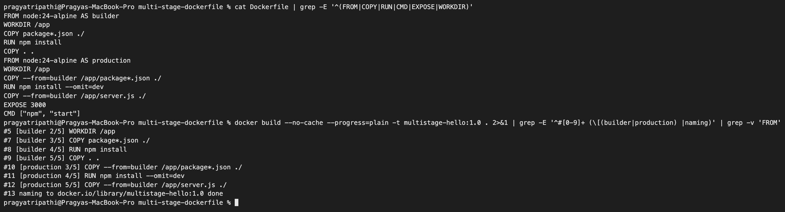
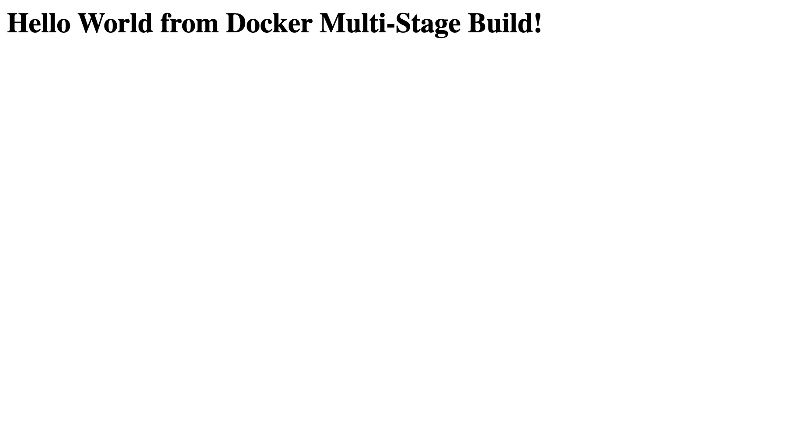
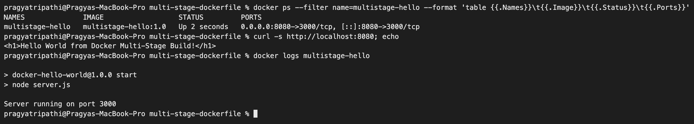
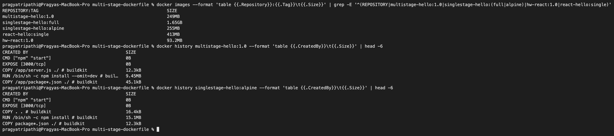
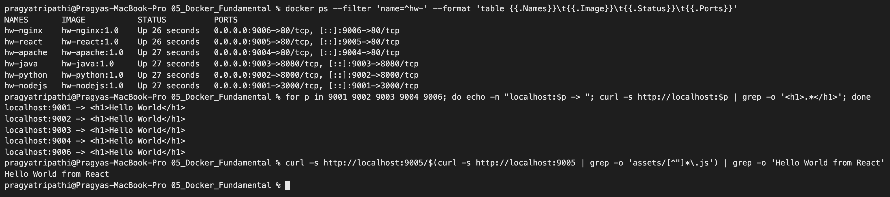

# Dockerfiles & Images – Multi-Stage Build Homework

**Name:** Pragya Tripathi
**Roll No:** 24BCS10032

---

## Task 1: Run the multi-stage Dockerfile

Source: [`session6-7-docker/multi-stage-dockerfile`](https://github.com/Nency-Ravaliya/devops-heros/tree/main/session6-7-docker/multi-stage-dockerfile) from the class repository. I cloned the class repository into a separate working folder on my laptop, **not** into this homework repository, so the class code is linked here by URL rather than copied. All commands below run inside `devops-heros/session6-7-docker/multi-stage-dockerfile`.

### 1. Clone the repository

```text
$ git clone --quiet --depth 1 https://github.com/Nency-Ravaliya/devops-heros.git

$ git -C devops-heros log -1 --format="%h %ad %s" --date=short
8376590 2026-10-05 replicas from 2 to 5

$ ls devops-heros/session6-7-docker/multi-stage-dockerfile
Dockerfile
package.json
server.js
```

The Dockerfile from class:

```dockerfile
# Stage 1: Build
FROM node:24-alpine AS builder
WORKDIR /app
COPY package*.json ./
RUN npm install
COPY . .

# Stage 2: Production
FROM node:24-alpine AS production
WORKDIR /app
COPY --from=builder /app/package*.json ./
RUN npm install --omit=dev
COPY --from=builder /app/server.js ./
EXPOSE 3000
CMD ["npm", "start"]
```

### 2. Build the image

The build log is filtered to the step headers so it stays readable.

```text
$ cd devops-heros/session6-7-docker/multi-stage-dockerfile
$ docker build --progress=plain -t multistage-hello:1.0 . 2>&1 | grep -E "^#[0-9]+ (\[|naming)"
#1 [internal] load build definition from Dockerfile
#2 [internal] load metadata for docker.io/library/node:24-alpine
#3 [internal] load .dockerignore
#4 [builder 1/5] FROM docker.io/library/node:24-alpine@sha256:ebfe2f90462722a7a4de65e91990e97fe0d401c70e0e762c5b53302f905ec1c1
#5 [builder 2/5] WORKDIR /app
#6 [internal] load build context
#7 [builder 3/5] COPY package*.json ./
#8 [builder 4/5] RUN npm install
#9 [builder 5/5] COPY . .
#10 [production 3/5] COPY --from=builder /app/package*.json ./
#11 [production 4/5] RUN npm install --omit=dev
#12 [production 5/5] COPY --from=builder /app/server.js ./
#13 naming to docker.io/library/multistage-hello:1.0 done
```

`[builder 1/5 … 5/5]` is stage 1 and `[production 3/5 … 5/5]` is stage 2. Steps `production 1/5` and `2/5` (`FROM` and `WORKDIR`) do not appear because they are the same as the builder's first two steps, so BuildKit reuses them. Both `npm install` steps took about 2–3 seconds (`#8 DONE 2.7s`, `#11 DONE 2.0s`).

The same build again with `--no-cache` (so every step really runs), as a screenshot:



### 3. Run a container on port 8080

The application listens on port 3000 inside the container, so host port **8080** is mapped to it with `-p 8080:3000`.

```text
$ docker run -d --name multistage-hello -p 8080:3000 multistage-hello:1.0
1c6a2dde9a9f087ef852681a83048dc84e621dd76e5dbae6fe364825065f2b8b
```

### 4. Verify with `docker ps` – container running on port 8080

```text
$ docker ps --filter name=multistage-hello
CONTAINER ID   IMAGE                  COMMAND                  CREATED          STATUS          PORTS                                         NAMES
1c6a2dde9a9f   multistage-hello:1.0   "docker-entrypoint.s…"   15 seconds ago   Up 15 seconds   0.0.0.0:8080->3000/tcp, [::]:8080->3000/tcp   multistage-hello
```

`0.0.0.0:8080->3000/tcp` confirms the application is published on port 8080.

### 5. Access the application



*Chrome at <http://localhost:8080>.*

```text
$ curl -s http://localhost:8080
<h1>Hello World from Docker Multi-Stage Build!</h1>
$ docker logs multistage-hello

> docker-hello-world@1.0.0 start
> node server.js

Server running on port 3000

$ docker inspect multistage-hello --format "Image={{.Config.Image}} Cmd={{.Config.Cmd}} WorkingDir={{.Config.WorkingDir}} Ports={{json .NetworkSettings.Ports}}"
Image=multistage-hello:1.0 Cmd=[npm start] WorkingDir=/app Ports={"3000/tcp":[{"HostIp":"0.0.0.0","HostPort":"8080"},{"HostIp":"::","HostPort":"8080"}]}

$ docker exec multistage-hello ls -A /app
node_modules
package-lock.json
package.json
server.js
```



**A port detail on my laptop.** Another local development tool of mine was already listening on `127.0.0.1:8080` (IPv4 loopback only). Docker could still publish 8080 on all addresses, and `localhost` on macOS tries IPv6 `::1` first, which goes to Docker:

```text
$ lsof -nP -iTCP:8080 -sTCP:LISTEN | awk "{print \$1, \$9}"
COMMAND NAME
python3.1 127.0.0.1:8080
com.docke *:8080

$ curl -s -o /dev/null -w "localhost -> %{remote_ip}:%{remote_port}\n" http://localhost:8080
localhost -> ::1:8080
```

So <http://localhost:8080> (browser and curl) reached the container, but `http://127.0.0.1:8080` would have reached the other program. If a port seems to answer with the wrong app, `lsof -iTCP:<port> -sTCP:LISTEN` shows who owns it.

### 6. Inspect the final image

```text
$ docker history multistage-hello:1.0 --format "table {{.CreatedBy}}\t{{.Size}}" | head -7
CREATED BY                                      SIZE
CMD ["npm" "start"]                             0B
EXPOSE [3000/tcp]                               0B
COPY /app/server.js ./ # buildkit               12.3kB
RUN /bin/sh -c npm install --omit=dev # buil…   9.45MB
COPY /app/package*.json ./ # buildkit           45.1kB
WORKDIR /app                                    8.19kB
```

Final image size: `multistage-hello:1.0` = **249MB** (more in Task 2).

---

## Task 2: Documentation – single-stage vs multi-stage, measured

This README is the documentation: my name and roll number, the app running (browser + curl), and `docker ps` showing the container on port 8080. To understand what the second stage actually saves, I also built the same app without it.

### Dockerfiles used for the comparison

They are in [size-comparison/](size-comparison). They are built with `-f` against the class app folder as the build context, so the app code is the same:

| Dockerfile | What it is |
|---|---|
| [Dockerfile.single-alpine](size-comparison/Dockerfile.single-alpine) | One stage on `node:24-alpine`, plain `npm install`, `COPY . .` (same as the class `node-app` Dockerfile) |
| [Dockerfile.single-full](size-comparison/Dockerfile.single-full) | Same single stage, but on the full Debian `node:24` image |
| [Dockerfile.react-single](size-comparison/Dockerfile.react-single) | My React app from session 6 built **and served** by Node (`vite preview`), with no Nginx stage |

```text
$ docker build -q -f ~/Devops-Assignment-1/06_DockerFiles_Images/size-comparison/Dockerfile.single-alpine -t singlestage-hello:alpine .
sha256:bb7825ed1476b791803b0a6b5c7c65c31d0788364d60877e50d0bca7c1c74312

$ docker build -q -f ~/Devops-Assignment-1/06_DockerFiles_Images/size-comparison/Dockerfile.single-full -t singlestage-hello:full .
sha256:779ab56b0578ff90a80301c6d89f30fe0d6a5b8fc23e84f8403310a83c6e2456

$ docker build -q --target builder -t multistage-hello:builder .
sha256:753d75abe015393e61d53629dcb5e47561ab3a0f03fec5acd7f90cf0e0fd2e8f

$ docker images --format "table {{.Repository}}:{{.Tag}}\t{{.Size}}" | grep -E "^(REPOSITORY|multistage-hello|singlestage-hello)"
REPOSITORY:TAG             SIZE
singlestage-hello:full     1.65GB
multistage-hello:1.0       249MB
multistage-hello:builder   255MB
singlestage-hello:alpine   255MB
```

`--target builder` stops the build after the stage named `builder`. That image is what stage 1 looks like on its own, and it is the same size as the single-stage build.

For the React app (run from `05_Docker_Fundamental`):

```text
$ docker build -q -f ../06_DockerFiles_Images/size-comparison/Dockerfile.react-single -t react-hello:single React-app
sha256:d2d35724ffbfb0205738c72eb4b45db036f6f47212b0bc4b91d44531a8882e04

$ docker images --format "table {{.Repository}}:{{.Tag}}\t{{.Size}}" | grep -E "^(REPOSITORY|hw-react:1.0|react-hello)"
REPOSITORY:TAG       SIZE
react-hello:single   413MB
hw-react:1.0         93.2MB

$ docker run -d --name react-single-test react-hello:single
1a0868ae6b35e6118681af6fc957fe205f098da50e5fe0e98824fbf780a9c0c3

$ sleep 3; docker exec react-single-test wget -qO- http://127.0.0.1:4173 | grep -o "<title>.*</title>"
<title>React Hello World</title>

$ docker exec react-single-test du -sh /app/node_modules
39.8M	/app/node_modules

$ docker rm -f react-single-test
react-single-test
```

(`docker images` pads its columns very wide on this machine, so I trimmed the extra spaces in these tables.)



### Results

| Image | Stages | Base | Size |
|---|---|---|---|
| `singlestage-hello:full` | 1 | `node:24` (Debian) | 1.65 GB |
| `singlestage-hello:alpine` | 1 | `node:24-alpine` | 255 MB |
| `multistage-hello:builder` (stage 1 only) | – | `node:24-alpine` | 255 MB |
| **`multistage-hello:1.0`** (class file) | 2 | `node:24-alpine` | **249 MB** |
| `react-hello:single` | 1 | `node:20-alpine` | 413 MB |
| **`hw-react:1.0`** | 2 | `node:20-alpine` → `nginx:alpine` | **93.2 MB** |

### Why the class app only saves 6 MB

```text
$ docker history singlestage-hello:alpine --format "table {{.CreatedBy}}\t{{.Size}}" | head -7
CREATED BY                                      SIZE
CMD ["npm" "start"]                             0B
EXPOSE [3000/tcp]                               0B
COPY . . # buildkit                             16.4kB
RUN /bin/sh -c npm install # buildkit           15.1MB
COPY package*.json ./ # buildkit                12.3kB
WORKDIR /app                                    8.19kB

$ docker run --rm singlestage-hello:alpine ls -A /app
Dockerfile
node_modules
package-lock.json
package.json
server.js

$ docker run --rm singlestage-hello:alpine du -sh /root/.npm
7.5M	/root/.npm

$ docker run --rm multistage-hello:1.0 du -sh /root/.npm
2.1M	/root/.npm
```

- Both final stages start from the **same** `node:24-alpine` base, and that base is most of the 249 MB.
- `express` is the only dependency and there are no devDependencies, so `npm install` and `npm install --omit=dev` install the same packages.
- The 6 MB that is saved is the npm download cache (7.5 MB vs 2.1 MB in `/root/.npm`) plus files that are not needed, like the `Dockerfile` that `COPY . .` brought in.
- The big savings come from two other things: **choosing a smaller base image** (1.65 GB → 255 MB) and **a final stage that does not need the build tool at all**. The React app shows this: built with Node, served by Nginx, 413 MB → 93 MB, and no `node_modules` in the final image.

### `.dockerignore`

The class folder has no `.dockerignore`, which is why the `Dockerfile` itself ended up in `/app` above. I added one temporarily in my clone and rebuilt:

```text
$ printf "Dockerfile\n.dockerignore\nnode_modules\n.git\n" > .dockerignore && cat .dockerignore
Dockerfile
.dockerignore
node_modules
.git

$ docker build -q -f ~/Devops-Assignment-1/06_DockerFiles_Images/size-comparison/Dockerfile.single-alpine -t singlestage-hello:ignored .
sha256:75cc30b356fb85b3601c5246f39bd493f4b4917c0506d3ea4f533510a10b8a15

$ docker run --rm singlestage-hello:ignored ls -A /app
node_modules
package-lock.json
package.json
server.js

$ rm .dockerignore
```

Ignored files are never sent to the builder, so they cannot end up in the image, and changing them does not break the build cache.

### Tagging, save and load

```text
$ docker tag multistage-hello:1.0 multistage-hello:latest

$ docker tag multistage-hello:1.0 pragya/multistage-hello:1.0

$ docker images --format "table {{.Repository}}\t{{.Tag}}\t{{.ID}}\t{{.Size}}" | grep -E "^(REPOSITORY|multistage-hello|pragya/multistage-hello)"
REPOSITORY                TAG       IMAGE ID       SIZE
multistage-hello          1.0       600bf18f1296   249MB
multistage-hello          latest    600bf18f1296   249MB
pragya/multistage-hello   1.0       600bf18f1296   249MB
multistage-hello          builder   753d75abe015   255MB

$ docker rmi multistage-hello:builder pragya/multistage-hello:1.0
Untagged: multistage-hello:builder
Deleted: sha256:753d75abe015393e61d53629dcb5e47561ab3a0f03fec5acd7f90cf0e0fd2e8f
Untagged: pragya/multistage-hello:1.0
```

Three tags, one image ID. `pragya/multistage-hello:1.0` is the `username/image:tag` form that `docker push` needs. I am not logged in to Docker Hub on this laptop, so I did not push. To move an image without a registry, `docker save` / `docker load` work with a tar file:

```text
$ docker save -o multistage-hello.tar multistage-hello:1.0 && ls -lh multistage-hello.tar | awk "{print \$5, \$9}"
61M multistage-hello.tar

$ docker rmi multistage-hello:1.0
Untagged: multistage-hello:1.0
Untagged: moby-dangling@sha256:600bf18f129658b43696fe45e37025a221596fb27d4cd37f12908938c2516fae

$ docker images multistage-hello --format "{{.Repository}}:{{.Tag}}"
multistage-hello:latest

$ docker load -i multistage-hello.tar
Loaded image: multistage-hello:1.0

$ docker images multistage-hello --format "{{.Repository}}:{{.Tag}}  {{.ID}}"
multistage-hello:1.0  600bf18f1296
multistage-hello:latest  600bf18f1296

$ rm multistage-hello.tar
```

The tar is 61 MB while `docker images` says 249 MB. The tar holds the compressed layers, and the 249 MB is the unpacked size on disk.

---

## Task 3: Deploy at least 3 different types of applications with Docker

### My six apps (session 6)

I deployed six: Node.js, Python, Java, Apache, React and Nginx. Code, Dockerfiles, build/run output and a browser screenshot of each are in [05_Docker_Fundamental](../05_Docker_Fundamental/README.md). Summary:

| App | Dockerfile | Run command | Result |
|---|---|---|---|
| Node.js | [nodejs-app/Dockerfile](../05_Docker_Fundamental/nodejs-app/Dockerfile) | `docker run -d -p 9001:3000 hw-nodejs:1.0` | `<h1>Hello World</h1>` |
| Python | [python-app/Dockerfile](../05_Docker_Fundamental/python-app/Dockerfile) | `docker run -d -p 9002:8000 hw-python:1.0` | `<h1>Hello World</h1>` |
| Java | [java-app/Dockerfile](../05_Docker_Fundamental/java-app/Dockerfile) | `docker run -d -p 9003:8080 hw-java:1.0` | `<h1>Hello World</h1>` |
| Apache | [Apache-app/Dockerfile](../05_Docker_Fundamental/Apache-app/Dockerfile) | `docker run -d -p 9004:80 hw-apache:1.0` | `<h1>Hello World</h1>` |
| React | [React-app/Dockerfile](../05_Docker_Fundamental/React-app/Dockerfile) | `docker run -d -p 9005:80 hw-react:1.0` | `Hello World from React` |
| Nginx | [nginx-app/Dockerfile](../05_Docker_Fundamental/nginx-app/Dockerfile) | `docker run -d -p 9006:80 hw-nginx:1.0` | `<h1>Hello World</h1>` |



### The class example apps (`nginx-web`, `node-app`, `python-app`)

I also built the three example folders from [session6-7-docker](https://github.com/Nency-Ravaliya/devops-heros/tree/main/session6-7-docker). To avoid clashing with the ports I already use, I ran them without `-p` and tested them from inside the container with `docker exec`. The commands run inside `devops-heros/session6-7-docker/` of my clone.

**The class `python-app` does not build as written.** First error:

```text
$ docker build --progress=plain -t class-python-app:1.0 python-app 2>&1 | grep -E '^#[0-9]+ (\[|ERROR|CANCELED)'
#1 [internal] load build definition from Dockerfile
#2 [auth] library/python:pull token for registry-1.docker.io
#3 [internal] load metadata for docker.io/library/python:3.11-slim
#4 [internal] load .dockerignore
#5 [internal] load build context
#6 [1/6] FROM docker.io/library/python:3.11-slim@sha256:0dd364ba7e10242f07755449e3a3d0e35f9efd987952737b90def6709ab0c5ce
#7 [3/6] RUN apt update && apt install -y pip3 python3
#8 [4/6] COPY requirements.txt .
#8 ERROR: failed to calculate checksum of ref eqgsbelw89rzhnv5rdlqobptb::llmcbttjutddxr1h7fmenouap: "/requirements.txt": not found
#9 [2/6] WORKDIR /app
#9 CANCELED
```

The folder has no `requirements.txt`. With an empty one added just to get past that, the next step fails too:

```text
$ touch python-app/requirements.txt

$ docker build --progress=plain -t class-python-app:1.0 python-app 2>&1 | grep -E "Unable to locate|^ERROR"
#7 8.916 Error: Unable to locate package pip3
8.916 Error: Unable to locate package pip3
ERROR: failed to build: failed to solve: process "/bin/sh -c apt update && apt install -y pip3 python3" did not complete successfully: exit code: 100

$ rm python-app/requirements.txt
```

`pip3` is not a Debian package name (the package is `python3-pip`), and `python:3.11-slim` already contains Python and pip anyway. My fixed version is in [class-python-app-fixed/Dockerfile](class-python-app-fixed/Dockerfile): no apt step, no requirements file, just `COPY app.py` and `CMD`.

```text
$ docker build -q -t class-nginx-web:1.0 nginx-web
sha256:476d1913dc8f2ab898e3db2d0c4ba9a7a68b755e321fa0b567e2817632f6bc41

$ docker build -q -t class-node-app:1.0 node-app
sha256:67794390d198cb37f23a9632606d765ddd994dce1444b3aa4ad0140ce56461dc

$ docker run -d --name class-nginx-web class-nginx-web:1.0
6a8fd3386b63d5574ba6fafe4831fa7a6938294c75e2c896758cd7223b5e917e

$ docker run -d --name class-node-app class-node-app:1.0
9ee2b31153aa812d6cea41b7061fc8fe18f56bdeba65d542588d77a787a0bbc7

$ sleep 2; docker exec class-nginx-web curl -s http://localhost | grep "<h1>"
    <h1>Hello World from Nginx + Docker!</h1>

$ docker exec class-node-app wget -qO- http://127.0.0.1:3000
<h1>Hello World from Docker!</h1>
$ docker logs class-node-app

> docker-hello-world@1.0.0 start
> node server.js

Server running on port 3000

$ docker build -q -t class-python-app:fixed ~/Devops-Assignment-1/06_DockerFiles_Images/class-python-app-fixed
sha256:1342e2bd54429a67360f92a589efb5de87b3b9575a193a8128b0731ae7e139c5

$ docker run --rm class-python-app:fixed
Hello World from Docker!

$ docker images --format "table {{.Repository}}:{{.Tag}}\t{{.Size}}" | grep -E "^(REPOSITORY|class-)"
REPOSITORY:TAG           SIZE
class-python-app:fixed   213MB
class-nginx-web:1.0      258MB
class-node-app:1.0       255MB

$ docker rm -f class-nginx-web class-node-app
class-nginx-web
class-node-app
```

The Python example is a one-line `print`, not a server. The container prints its message and exits, which is why I ran it with `--rm` and no `-d`. (The top-level `session6-7-docker/Dockerfile` in the class repo is an empty file, so there was nothing to build there.)

### Docker Compose (`docker-compose-app`)

The class Compose file starts `nginx:alpine` (published on 8080) and `redis:alpine`. Before running it I removed the `multistage-hello` container, because both want host port 8080. The commands run inside `devops-heros/session6-7-docker/docker-compose-app/`.

```text
$ docker compose config
name: docker-compose-app
services:
  redis:
    image: redis:alpine
    networks:
      default: null
  web:
    depends_on:
      redis:
        condition: service_started
        required: true
    image: nginx:alpine
    networks:
      default: null
    ports:
      - mode: ingress
        target: 80
        published: "8080"
        protocol: tcp
networks:
  default:
    name: docker-compose-app_default

$ docker compose up -d 2>&1 | grep -vE "Pulling fs layer|Waiting|Downloading|Verifying|Extracting|Download complete|Pull complete"
 Image redis:alpine Pulling 
 Image redis:alpine Pulled 
 Network docker-compose-app_default Creating 
 Network docker-compose-app_default Creating 
 Network docker-compose-app_default Created 
 Network docker-compose-app_default Created 
 Container docker-compose-app-redis-1 Creating 
 Container docker-compose-app-redis-1 Created 
 Container docker-compose-app-web-1 Creating 
 Container docker-compose-app-web-1 Created 
 Container docker-compose-app-redis-1 Starting 
 Container docker-compose-app-redis-1 Started 
 Container docker-compose-app-web-1 Starting 
 Container docker-compose-app-web-1 Started 

$ docker compose ps
NAME                         IMAGE          COMMAND                  SERVICE   CREATED                  STATUS                  PORTS
docker-compose-app-redis-1   redis:alpine   "docker-entrypoint.s…"   redis     Less than a second ago   Up Less than a second   6379/tcp
docker-compose-app-web-1     nginx:alpine   "/docker-entrypoint.…"   web       Less than a second ago   Up Less than a second   0.0.0.0:8080->80/tcp, [::]:8080->80/tcp

$ curl -s http://localhost:8080 | grep -o "<title>.*</title>"
<title>Welcome to nginx!</title>

$ docker compose exec redis redis-cli ping
PONG

$ docker compose exec web wget -qO- http://localhost | grep -o "<h1>.*</h1>"
<h1>Welcome to nginx!</h1>

$ docker compose exec web ping -c 1 redis | head -2
PING redis (172.19.0.2): 56 data bytes
64 bytes from 172.19.0.2: seq=0 ttl=64 time=0.351 ms

$ docker compose logs redis | tail -3
redis-1  | 1:M 08 Oct 2026 14:56:18.320 * Server initialized
redis-1  | 1:M 08 Oct 2026 14:56:18.320 * Ready to accept connections tcp
redis-1  | 1:M 08 Oct 2026 14:56:18.320 # WARNING: Redis does not require authentication and is not protected by network restrictions. Redis will accept connections from any IP address on any network interface.

$ docker compose down
 Container docker-compose-app-web-1 Stopping 
 Container docker-compose-app-web-1 Stopped 
 Container docker-compose-app-web-1 Removing 
 Container docker-compose-app-web-1 Removed 
 Container docker-compose-app-redis-1 Stopping 
 Container docker-compose-app-redis-1 Stopped 
 Container docker-compose-app-redis-1 Removing 
 Container docker-compose-app-redis-1 Removed 
 Network docker-compose-app_default Removing 
 Network docker-compose-app_default Removed 

$ docker compose ps -a
NAME      IMAGE     COMMAND   SERVICE   CREATED   STATUS    PORTS
```

- `docker compose config` prints the file in its full form. `depends_on: [redis]` becomes `condition: service_started`, which only waits for Redis to **start**, not to be ready.
- Compose made its own network, `docker-compose-app_default`, and `web` can reach the other service by its name (`ping redis`). Redis has no `ports:` entry, so it is reachable only on that network, not from my laptop.
- `docker compose down` removed both containers and the network in one command.

### Clean up

```bash
docker rm -f multistage-hello
docker rmi multistage-hello:1.0 multistage-hello:latest singlestage-hello:alpine singlestage-hello:full singlestage-hello:ignored \
  react-hello:single class-nginx-web:1.0 class-node-app:1.0 class-python-app:fixed
```

---

## What I understood

- A multi-stage Dockerfile has more than one `FROM`. Each `FROM` starts a new stage, and a stage can be named with `AS builder`. Only the **last** stage becomes the image, and `COPY --from=builder` picks out just the files it needs from an earlier stage.
- `docker build --target <stage>` builds only up to a named stage. That is useful for debugging a stage, or, as I did here, for measuring it.
- Multi-stage helps most when the build needs heavy tools the app does not need at runtime (compilers, bundlers, devDependencies). For the class Express app both stages are the same Alpine Node image, so it saved only 6 MB. For my React app it took the image from 413 MB to 93 MB.
- Picking a smaller base image (`alpine`, `slim`) is often the biggest single saving: 1.65 GB → 255 MB for the same code.
- `.dockerignore` keeps files out of the build context, so they never reach the image and do not break the cache.
- Tags are just names for an image ID. `username/image:tag` is the form needed for `docker push`. `docker save`/`docker load` move an image as a tar file without a registry.
- Example Dockerfiles can be broken (the class `python-app`). Reading the first `ERROR` line of the build log usually points straight at the bad instruction.
- Docker Compose describes several containers, their ports and a shared network in one file. `up -d` / `down` start and remove everything together, and services find each other by name.
