# Kubernetes Storage, HPA & Probes – Homework

**Name:** Pragya Tripathi
**Roll No:** 24BCS10032

Tasks are from the class repository ([session-13-storage-hpa-probes](https://github.com/Nency-Ravaliya/devops-heros/tree/main/session-13-storage-hpa-probes)). I ran everything on my local 2-node kind cluster (`devops-hw`, Kubernetes v1.37.0). The cluster is shared with my other homework, so every lab ran in its own namespace (`s13-storage`, `s13-hpa`, `s13-probes`, `s13-webapp`) and I used `-n <namespace>` on every command. All outputs below are copied from my terminal.

| Folder / file | What it is |
|---|---|
| [manifests/01-volumes](manifests/01-volumes) | `emptyDir` Pod (nginx + busybox writer sharing one volume), `hostPath` Pod |
| [manifests/02-persistent-storage](manifests/02-persistent-storage) | Static PV + PVC + Pod (class version) and `pvc-static.yaml` (my fix, see section 3) |
| [manifests/03-storageclass](manifests/03-storageclass) | PVC that uses the `standard` StorageClass + a Pod that writes to it |
| [manifests/04-statefulset](manifests/04-statefulset) | StatefulSet with `volumeClaimTemplates` + headless Service |
| [manifests/05-hpa](manifests/05-hpa) | nginx Deployment with CPU requests, Service, HPA (1–5 Pods at 50% CPU) |
| [manifests/06-probes](manifests/06-probes) | liveness / readiness / startup Pods and the broken versions |
| [mini-project](mini-project) | Namespace, PVC, Deployment (3 probes + volume), Service, HPA |
| [logs](logs) | The real `kubectl get hpa` readings I recorded every 15 s during the HPA tests, and the small script that recorded them |

## Storage in one table

| Type | Where the data lives | Survives container restart | Survives Pod delete | Typical use |
|---|---|---|---|---|
| Container filesystem | Inside the container layer | No | No | Nothing important |
| `emptyDir` | Node disk, folder made for the Pod | Yes | **No** | Scratch space, sharing files between containers of one Pod |
| `hostPath` | A fixed folder on the node | Yes | Yes, but only on **that** node | Node agents, local testing |
| PV + PVC | Storage outside the Pod lifecycle | Yes | **Yes** | Databases, uploads, anything that must persist |

- **PersistentVolume (PV)** = a piece of storage that exists in the cluster.
- **PersistentVolumeClaim (PVC)** = a request for storage ("I need 500Mi, RWO"). Pods only talk to the PVC.
- **StorageClass** = a recipe that lets Kubernetes create the PV automatically when a PVC asks for it (dynamic provisioning).

---

## 1. emptyDir

[emptydir-pod.yaml](manifests/01-volumes/emptydir-pod.yaml) has two containers that mount the same `emptyDir`. The busybox `writer` writes `index.html` every 5 s, and nginx serves that folder. All commands in sections 1–5 are run from the `manifests/` folder.

```text
$ kubectl create namespace s13-storage
namespace/s13-storage created

$ kubectl -n s13-storage apply -f 01-volumes/emptydir-pod.yaml
pod/emptydir-demo created

$ kubectl -n s13-storage wait --for=condition=Ready pod/emptydir-demo --timeout=180s
pod/emptydir-demo condition met

$ kubectl -n s13-storage get pod emptydir-demo
NAME            READY   STATUS    RESTARTS   AGE
emptydir-demo   2/2     Running   0          1s

$ kubectl -n s13-storage exec emptydir-demo -c web -- curl -s localhost
written by writer at 18:26:04

$ kubectl -n s13-storage exec emptydir-demo -c web -- sh -c 'echo "Hello from Pragya" > /usr/share/nginx/html/message.txt'

$ kubectl -n s13-storage exec emptydir-demo -c writer -- ls -l /data
total 8
-rw-r--r--    1 root     root            30 Oct  7 18:26 index.html
-rw-r--r--    1 root     root            18 Oct  7 18:26 message.txt

$ kubectl -n s13-storage exec emptydir-demo -c writer -- cat /data/message.txt
Hello from Pragya
```

The file written by the `web` container (at `/usr/share/nginx/html`) shows up in the `writer` container (at `/data`), so the two containers really share one volume.

**Container restart vs Pod delete:**

```text
$ kubectl -n s13-storage exec emptydir-demo -c web -- nginx -s stop
2026/10/07 18:26:13 [notice] 60#60: signal process started

$ kubectl -n s13-storage get pod emptydir-demo
NAME            READY   STATUS    RESTARTS     AGE
emptydir-demo   2/2     Running   1 (8s ago)   18s

$ kubectl -n s13-storage exec emptydir-demo -c web -- cat /usr/share/nginx/html/message.txt
Hello from Pragya

$ kubectl -n s13-storage delete pod emptydir-demo
pod "emptydir-demo" deleted from s13-storage namespace

$ kubectl -n s13-storage apply -f 01-volumes/emptydir-pod.yaml
pod/emptydir-demo created

$ kubectl -n s13-storage wait --for=condition=Ready pod/emptydir-demo --timeout=180s
pod/emptydir-demo condition met

$ kubectl -n s13-storage exec emptydir-demo -c web -- cat /usr/share/nginx/html/message.txt
cat: /usr/share/nginx/html/message.txt: No such file or directory
command terminated with exit code 1

$ kubectl -n s13-storage exec emptydir-demo -c web -- ls /usr/share/nginx/html
index.html
```

**What happened:** stopping nginx made the kubelet restart the container (`RESTARTS 1`), and `message.txt` was still there, because the `emptyDir` belongs to the Pod, not to the container. After deleting the Pod, the new Pod got a brand-new empty folder; only the `index.html` that the writer re-created is there.

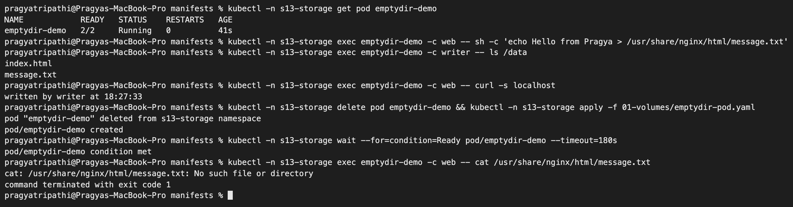

## 2. hostPath

[hostpath-pod.yaml](manifests/01-volumes/hostpath-pod.yaml) mounts `/tmp/s13-hostpath-data` from the node (`type: DirectoryOrCreate`).

```text
$ kubectl -n s13-storage apply -f 01-volumes/hostpath-pod.yaml
pod/hostpath-demo created

$ kubectl -n s13-storage wait --for=condition=Ready pod/hostpath-demo --timeout=180s
pod/hostpath-demo condition met

$ kubectl -n s13-storage get pod hostpath-demo -o wide
NAME            READY   STATUS    RESTARTS   AGE   IP            NODE               NOMINATED NODE   READINESS GATES
hostpath-demo   1/1     Running   0          0s    10.244.1.59   devops-hw-worker   <none>           <none>

$ kubectl -n s13-storage exec hostpath-demo -- sh -c 'echo "saved on the node by $(hostname)" > /data/note.txt'

$ docker exec devops-hw-worker cat /tmp/s13-hostpath-data/note.txt
saved on the node by hostpath-demo

$ kubectl -n s13-storage delete pod hostpath-demo
pod "hostpath-demo" deleted from s13-storage namespace

$ kubectl -n s13-storage apply -f 01-volumes/hostpath-pod.yaml
pod/hostpath-demo created

$ kubectl -n s13-storage wait --for=condition=Ready pod/hostpath-demo --timeout=180s
pod/hostpath-demo condition met

$ kubectl -n s13-storage exec hostpath-demo -- cat /data/note.txt
saved on the node by hostpath-demo
```

kind nodes are Docker containers, so `docker exec devops-hw-worker cat ...` reads the real node folder. The file survived the Pod delete because it is on the node. It only came back because the new Pod landed on the **same** node (my control-plane node has a `NoSchedule` taint, so everything runs on `devops-hw-worker`). On a multi-node cluster a re-created Pod can land elsewhere and see an empty folder, which is why `hostPath` is not used for real application data.

## 3. PersistentVolume and PersistentVolumeClaim (static)

I first applied the class files exactly as given: a 1Gi `hostPath` PV ([pv.yaml](manifests/02-persistent-storage/pv.yaml), renamed `s13-student-pv`) and a 500Mi PVC ([pvc.yaml](manifests/02-persistent-storage/pvc.yaml)) with **no** `storageClassName`.

```text
$ kubectl apply -f 02-persistent-storage/pv.yaml
persistentvolume/s13-student-pv created

$ kubectl get pv s13-student-pv
NAME             CAPACITY   ACCESS MODES   RECLAIM POLICY   STATUS      CLAIM   STORAGECLASS   VOLUMEATTRIBUTESCLASS   REASON   AGE
s13-student-pv   1Gi        RWO            Retain           Available                          <unset>                          0s

$ kubectl -n s13-storage apply -f 02-persistent-storage/pvc.yaml
persistentvolumeclaim/student-pvc created

$ kubectl -n s13-storage get pvc student-pvc
NAME          STATUS    VOLUME   CAPACITY   ACCESS MODES   STORAGECLASS   VOLUMEATTRIBUTESCLASS   AGE
student-pvc   Pending                                      standard       <unset>                 0s

$ kubectl -n s13-storage describe pvc student-pvc | tail -6
VolumeMode:    Filesystem
Used By:       <none>
Events:
  Type    Reason                Age   From                         Message
  ----    ------                ----  ----                         -------
  Normal  WaitForFirstConsumer  0s    persistentvolume-controller  waiting for first consumer to be created before binding

$ kubectl -n s13-storage apply -f 02-persistent-storage/pod.yaml
pod/storage-demo created

$ kubectl -n s13-storage wait --for=condition=Ready pod/storage-demo --timeout=180s
pod/storage-demo condition met

$ kubectl -n s13-storage get pvc student-pvc
NAME          STATUS   VOLUME                                     CAPACITY   ACCESS MODES   STORAGECLASS   VOLUMEATTRIBUTESCLASS   AGE
student-pvc   Bound    pvc-a3ffc6a5-0ca8-4ca3-9681-acac1f57144e   500Mi      RWO            standard       <unset>                 13s

$ kubectl get pv s13-student-pv
NAME             CAPACITY   ACCESS MODES   RECLAIM POLICY   STATUS      CLAIM   STORAGECLASS   VOLUMEATTRIBUTESCLASS   REASON   AGE
s13-student-pv   1Gi        RWO            Retain           Available                          <unset>                          13s
```

**This did not do what the class README expects.** The claim never used my PV. Kubernetes filled in `STORAGECLASS standard` (the cluster's default class) on the PVC by itself, so the local-path provisioner created a new PV (`pvc-a3ff...`). My hand-made PV has no class, and a claim only binds to a PV with the **same** class, so `s13-student-pv` stayed `Available`.

**Fix:** [pvc-static.yaml](manifests/02-persistent-storage/pvc-static.yaml) sets `storageClassName: ""`, which means "no class, do not provision dynamically". It also sets `volumeName: s13-student-pv` to point at that PV directly.

```text
$ kubectl -n s13-storage delete pod storage-demo
pod "storage-demo" deleted from s13-storage namespace

$ kubectl -n s13-storage delete pvc student-pvc
persistentvolumeclaim "student-pvc" deleted from s13-storage namespace

$ kubectl -n s13-storage apply -f 02-persistent-storage/pvc-static.yaml
persistentvolumeclaim/student-pvc created

$ kubectl -n s13-storage get pvc student-pvc
NAME          STATUS   VOLUME           CAPACITY   ACCESS MODES   STORAGECLASS   VOLUMEATTRIBUTESCLASS   AGE
student-pvc   Bound    s13-student-pv   1Gi        RWO                           <unset>                 0s

$ kubectl get pv s13-student-pv
NAME             CAPACITY   ACCESS MODES   RECLAIM POLICY   STATUS   CLAIM                     STORAGECLASS   VOLUMEATTRIBUTESCLASS   REASON   AGE
s13-student-pv   1Gi        RWO            Retain           Bound    s13-storage/student-pvc                  <unset>                          28s

$ kubectl -n s13-storage apply -f 02-persistent-storage/pod.yaml
pod/storage-demo created

$ kubectl -n s13-storage wait --for=condition=Ready pod/storage-demo --timeout=180s
pod/storage-demo condition met

$ kubectl -n s13-storage exec storage-demo -- sh -c 'echo "Kubernetes Storage - Pragya" > /data/message.txt'

$ kubectl -n s13-storage delete pod storage-demo
pod "storage-demo" deleted from s13-storage namespace

$ kubectl -n s13-storage apply -f 02-persistent-storage/pod.yaml
pod/storage-demo created

$ kubectl -n s13-storage wait --for=condition=Ready pod/storage-demo --timeout=180s
pod/storage-demo condition met

$ kubectl -n s13-storage exec storage-demo -- cat /data/message.txt
Kubernetes Storage - Pragya

$ docker exec devops-hw-worker cat /tmp/s13-student-data/message.txt
Kubernetes Storage - Pragya
```

The PVC is now `Bound` to `s13-student-pv`. Capacity shows **1Gi** even though I asked for 500Mi, because a claim gets the whole PV it binds to. The file survived deleting and re-creating the Pod.

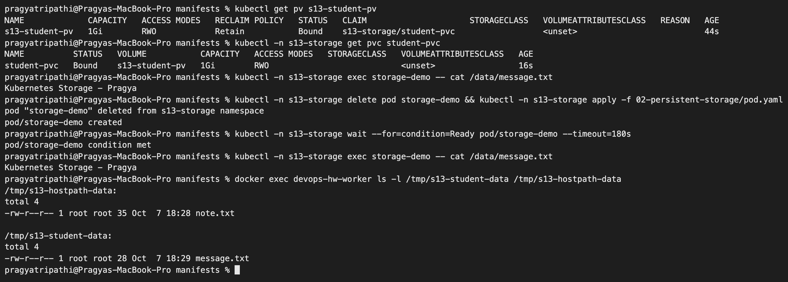

**Reclaim policy:** at the end of the storage tests I deleted both claims:

```text
$ kubectl -n s13-storage delete pod dynamic-demo storage-demo
pod "dynamic-demo" deleted from s13-storage namespace
pod "storage-demo" deleted from s13-storage namespace

$ kubectl -n s13-storage delete pvc dynamic-pvc student-pvc
persistentvolumeclaim "dynamic-pvc" deleted from s13-storage namespace
persistentvolumeclaim "student-pvc" deleted from s13-storage namespace

$ kubectl get pv | grep -E 'NAME|s13-storage/'
NAME             CAPACITY   ACCESS MODES   RECLAIM POLICY   STATUS     CLAIM                     STORAGECLASS   VOLUMEATTRIBUTESCLASS   REASON   AGE
s13-student-pv   1Gi        RWO            Retain           Released   s13-storage/student-pvc                  <unset>                          5m

$ docker exec devops-hw-worker ls /tmp/s13-student-data
message.txt
```

The dynamic PV (reclaim policy `Delete`, from section 4) disappeared together with its claim. The static PV (`Retain`) stayed as `Released` and the data stayed on disk, waiting for an admin to clean it up or reuse it.

| Access mode | Short | Meaning |
|---|---|---|
| ReadWriteOnce | RWO | read/write by one **node** (many Pods on that node can share it) |
| ReadOnlyMany | ROX | read-only by many nodes |
| ReadWriteMany | RWX | read/write by many nodes (needs NFS/cloud file storage) |
| ReadWriteOncePod | RWOP | read/write by exactly one Pod |

## 4. StorageClass and dynamic provisioning

```text
$ kubectl get storageclass
NAME                 PROVISIONER             RECLAIMPOLICY   VOLUMEBINDINGMODE      ALLOWVOLUMEEXPANSION   AGE
standard (default)   rancher.io/local-path   Delete          WaitForFirstConsumer   false                  129m

$ kubectl describe storageclass standard
Name:            standard
IsDefaultClass:  Yes
Annotations:     kubectl.kubernetes.io/last-applied-configuration={"apiVersion":"storage.k8s.io/v1","kind":"StorageClass","metadata":{"annotations":{"storageclass.kubernetes.io/is-default-class":"true"},"name":"standard"},"provisioner":"rancher.io/local-path","reclaimPolicy":"Delete","volumeBindingMode":"WaitForFirstConsumer"}
,storageclass.kubernetes.io/is-default-class=true
Provisioner:           rancher.io/local-path
Parameters:            <none>
AllowVolumeExpansion:  <unset>
MountOptions:          <none>
ReclaimPolicy:         Delete
VolumeBindingMode:     WaitForFirstConsumer
Events:                <none>

$ kubectl -n s13-storage apply -f 03-storageclass/pvc.yaml
persistentvolumeclaim/dynamic-pvc created

$ kubectl -n s13-storage get pvc dynamic-pvc
NAME          STATUS    VOLUME   CAPACITY   ACCESS MODES   STORAGECLASS   VOLUMEATTRIBUTESCLASS   AGE
dynamic-pvc   Pending                                      standard       <unset>                 0s

$ kubectl -n s13-storage apply -f 03-storageclass/pod.yaml
pod/dynamic-demo created

$ kubectl -n s13-storage wait --for=condition=Ready pod/dynamic-demo --timeout=180s
pod/dynamic-demo condition met

$ kubectl -n s13-storage get pvc dynamic-pvc
NAME          STATUS   VOLUME                                     CAPACITY   ACCESS MODES   STORAGECLASS   VOLUMEATTRIBUTESCLASS   AGE
dynamic-pvc   Bound    pvc-a79221a9-9c1b-4943-88d7-d1ea2a720e71   500Mi      RWO            standard       <unset>                 5s

$ kubectl get pv $(kubectl -n s13-storage get pvc dynamic-pvc -o jsonpath='{.spec.volumeName}')
NAME                                       CAPACITY   ACCESS MODES   RECLAIM POLICY   STATUS   CLAIM                     STORAGECLASS   VOLUMEATTRIBUTESCLASS   REASON   AGE
pvc-a79221a9-9c1b-4943-88d7-d1ea2a720e71   500Mi      RWO            Delete           Bound    s13-storage/dynamic-pvc   standard       <unset>                          2s

$ kubectl -n s13-storage exec dynamic-demo -- cat /data/log.txt
written by dynamic-demo at 18:29:49

$ kubectl get pv $(kubectl -n s13-storage get pvc dynamic-pvc -o jsonpath='{.spec.volumeName}') -o jsonpath='{.spec.hostPath.path}{"\n"}{.spec.nodeAffinity.required.nodeSelectorTerms[0].matchExpressions[0].values}{"\n"}'
/var/local-path-provisioner/pvc-a79221a9-9c1b-4943-88d7-d1ea2a720e71_s13-storage_dynamic-pvc
["devops-hw-worker"]
```

PVC events, in order:

```text
$ kubectl -n s13-storage describe pvc dynamic-pvc | tail -7
Events:
  Type    Reason                 Age              From                                                                                                Message
  ----    ------                 ----             ----                                                                                                -------
  Normal  WaitForFirstConsumer   5s               persistentvolume-controller                                                                         waiting for first consumer to be created before binding
  Normal  ExternalProvisioning   5s (x2 over 5s)  persistentvolume-controller                                                                         Waiting for a volume to be created either by the external provisioner 'rancher.io/local-path' or manually by the system administrator. If volume creation is delayed, please verify that the provisioner is running and correctly registered.
  Normal  Provisioning           5s               rancher.io/local-path_local-path-provisioner-75f7fc7dc5-j2zs8_1eec2e1e-ac21-434d-8ce1-c44b448979f0  External provisioner is provisioning volume for claim "s13-storage/dynamic-pvc"
  Normal  ProvisioningSucceeded  2s               rancher.io/local-path_local-path-provisioner-75f7fc7dc5-j2zs8_1eec2e1e-ac21-434d-8ce1-c44b448979f0  Successfully provisioned volume pvc-a79221a9-9c1b-4943-88d7-d1ea2a720e71
```

**What I understood:**

- I never wrote a PV. The PVC asked the `standard` class, and the `rancher.io/local-path` provisioner created `pvc-a792...` for me.
- `WaitForFirstConsumer`: the claim stays `Pending` until a Pod uses it. Only then does the scheduler pick a node, and the volume is created **on that node** (the PV has node affinity `devops-hw-worker`). This is why a `Pending` PVC on kind is normal until a Pod exists.
- On kind the "disk" is a folder under `/var/local-path-provisioner/` on the node. On a cloud cluster the same PVC would create an EBS/Persistent Disk instead. The YAML would not change, only the StorageClass.

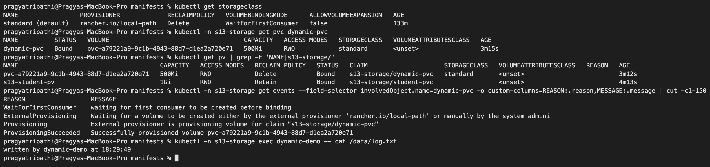

## 5. StatefulSet with volumeClaimTemplates

[statefulset.yaml](manifests/04-statefulset/statefulset.yaml): 3 nginx replicas. Each Pod appends `"<its name> started at <time>"` to `index.html` on **its own** volume every time it starts.

```text
$ kubectl -n s13-storage apply -f 04-statefulset/statefulset.yaml
service/web-headless created
statefulset.apps/web created

$ kubectl -n s13-storage rollout status statefulset/web --timeout=300s
Waiting for 3 pods to be ready...
Waiting for 2 pods to be ready...
Waiting for 2 pods to be ready...
Waiting for 1 pods to be ready...
Waiting for 1 pods to be ready...
partitioned roll out complete: 3 new pods have been updated...

$ kubectl -n s13-storage get pods -l app=sts-web -o wide
NAME    READY   STATUS    RESTARTS   AGE   IP            NODE               NOMINATED NODE   READINESS GATES
web-0   1/1     Running   0          12s   10.244.1.78   devops-hw-worker   <none>           <none>
web-1   1/1     Running   0          8s    10.244.1.80   devops-hw-worker   <none>           <none>
web-2   1/1     Running   0          4s    10.244.1.82   devops-hw-worker   <none>           <none>

$ kubectl -n s13-storage get pvc
NAME         STATUS   VOLUME                                     CAPACITY   ACCESS MODES   STORAGECLASS   VOLUMEATTRIBUTESCLASS   AGE
data-web-0   Bound    pvc-77bdffd7-509d-4a5c-82ef-7af1f74676e0   100Mi      RWO            standard       <unset>                 12s
data-web-1   Bound    pvc-ba3e035d-4ea2-44ee-b92d-f2c3b4a1fa32   100Mi      RWO            standard       <unset>                 8s
data-web-2   Bound    pvc-69cec879-3cea-49be-8023-5176e94030f6   100Mi      RWO            standard       <unset>                 4s

$ for i in 0 1 2; do kubectl -n s13-storage exec web-$i -- cat /usr/share/nginx/html/index.html; done
web-0 started at 18:33:58
web-1 started at 18:34:02
web-2 started at 18:34:06

$ kubectl -n s13-storage delete pod web-1
pod "web-1" deleted from s13-storage namespace

$ kubectl -n s13-storage wait --for=condition=Ready pod/web-1 --timeout=180s
pod/web-1 condition met

$ kubectl -n s13-storage exec web-1 -- cat /usr/share/nginx/html/index.html
web-1 started at 18:34:02
web-1 started at 18:34:08

$ kubectl -n s13-storage run dns-check --image=busybox:1.36 --restart=Never --rm -i -- nslookup web-0.web-headless.s13-storage.svc.cluster.local
Server:		10.96.0.10
Address:	10.96.0.10:53


Name:	web-0.web-headless.s13-storage.svc.cluster.local
Address: 10.244.1.78
(kubectl run also printed an attach warning and the same answer a second time; trimmed)

$ kubectl -n s13-storage scale statefulset web --replicas=1
statefulset.apps/web scaled

$ kubectl -n s13-storage get pods -l app=sts-web
NAME    READY   STATUS    RESTARTS   AGE
web-0   1/1     Running   0          41s

$ kubectl -n s13-storage get pvc
NAME         STATUS   VOLUME                                     CAPACITY   ACCESS MODES   STORAGECLASS   VOLUMEATTRIBUTESCLASS   AGE
data-web-0   Bound    pvc-77bdffd7-509d-4a5c-82ef-7af1f74676e0   100Mi      RWO            standard       <unset>                 41s
data-web-1   Bound    pvc-ba3e035d-4ea2-44ee-b92d-f2c3b4a1fa32   100Mi      RWO            standard       <unset>                 37s
data-web-2   Bound    pvc-69cec879-3cea-49be-8023-5176e94030f6   100Mi      RWO            standard       <unset>                 33s

$ kubectl -n s13-storage scale statefulset web --replicas=3
statefulset.apps/web scaled

$ kubectl -n s13-storage rollout status statefulset/web --timeout=180s | tail -1
partitioned roll out complete: 3 new pods have been updated...

$ kubectl -n s13-storage exec web-1 -- cat /usr/share/nginx/html/index.html
web-1 started at 18:34:02
web-1 started at 18:34:08
web-1 started at 18:34:45
```

**What I understood:**

- `volumeClaimTemplates` made one PVC per Pod, named `<template>-<pod>`: `data-web-0`, `data-web-1`, `data-web-2`. A Deployment cannot do this, because all its replicas share one PVC.
- Pods start in order (0, then 1, then 2), as the rollout messages show.
- When I deleted `web-1`, the new Pod had the **same name** and was attached to the **same** PVC. Its file now has two lines (old start and new start).
- Scaling down to 1 did **not** delete `data-web-1`/`data-web-2`. Scaling back to 3 re-attached them, so `web-1` now shows three start times. Kubernetes keeps StatefulSet volumes on purpose, so data is not lost by accident.
- The headless Service gives every Pod a stable DNS name like `web-0.web-headless.s13-storage.svc.cluster.local`.

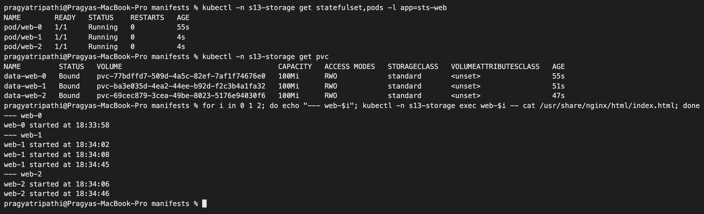

---

## 6. metrics-server (needed for HPA)

The HPA reads CPU usage from the Metrics API, and kind does not ship metrics-server.

```text
$ kubectl top nodes
error: Metrics API not available

$ kubectl apply -f https://github.com/kubernetes-sigs/metrics-server/releases/latest/download/components.yaml
serviceaccount/metrics-server created
clusterrole.rbac.authorization.k8s.io/system:aggregated-metrics-reader created
clusterrole.rbac.authorization.k8s.io/system:metrics-server created
rolebinding.rbac.authorization.k8s.io/metrics-server-auth-reader created
clusterrolebinding.rbac.authorization.k8s.io/metrics-server:system:auth-delegator created
clusterrolebinding.rbac.authorization.k8s.io/system:metrics-server created
service/metrics-server created
deployment.apps/metrics-server created
apiservice.apiregistration.k8s.io/v1beta1.metrics.k8s.io created

$ kubectl -n kube-system patch deployment metrics-server --type=json -p '[{"op":"add","path":"/spec/template/spec/containers/0/args/-","value":"--kubelet-insecure-tls"}]'
deployment.apps/metrics-server patched

$ kubectl -n kube-system get deployment metrics-server
NAME             READY   UP-TO-DATE   AVAILABLE   AGE
metrics-server   1/1     1            1           11m

$ kubectl top nodes
NAME                      CPU(cores)   CPU(%)   MEMORY(bytes)   MEMORY(%)   
devops-hw-control-plane   311m         2%       960Mi           12%         
devops-hw-worker          268m         1%       528Mi           6%          
```

`--kubelet-insecure-tls` is needed on kind because the kubelet serving certificates are self-signed and do not contain the node IPs. Without it metrics-server cannot scrape the kubelets. This flag is fine for a local lab, but not for production. (On Minikube the same thing is `minikube addons enable metrics-server`.) The metrics-server Pod sat in `ContainerCreating` for a few minutes while its image downloaded, so I pre-pulled it with Docker and imported it into the kind nodes.

## 7. HPA hands-on

[deployment.yaml](manifests/05-hpa/deployment.yaml) is nginx with `requests.cpu: 100m` / `limits.cpu: 200m`. [hpa.yaml](manifests/05-hpa/hpa.yaml) keeps between 1 and 5 replicas and targets 50% average CPU. **50% of a 100m request is 50m**, so the HPA adds Pods when the average Pod uses more than 50 millicores.

```text
$ kubectl create namespace s13-hpa
namespace/s13-hpa created

$ kubectl -n s13-hpa apply -f 05-hpa/deployment.yaml -f 05-hpa/service.yaml
deployment.apps/hpa-demo created
service/hpa-demo-service created

$ kubectl -n s13-hpa rollout status deployment/hpa-demo --timeout=180s
Waiting for deployment "hpa-demo" rollout to finish: 0 of 1 updated replicas are available...
deployment "hpa-demo" successfully rolled out

$ kubectl -n s13-hpa apply -f 05-hpa/hpa.yaml
horizontalpodautoscaler.autoscaling/hpa-demo created

$ kubectl -n s13-hpa get deploy,svc,hpa
NAME                       READY   UP-TO-DATE   AVAILABLE   AGE
deployment.apps/hpa-demo   1/1     1            1           2s

NAME                       TYPE        CLUSTER-IP   EXTERNAL-IP   PORT(S)   AGE
service/hpa-demo-service   ClusterIP   10.96.4.90   <none>        80/TCP    2s

NAME                                           REFERENCE             TARGETS              MINPODS   MAXPODS   REPLICAS   AGE
horizontalpodautoscaler.autoscaling/hpa-demo   Deployment/hpa-demo   cpu: <unknown>/50%   1         5         0          0s
```

`<unknown>` at first is normal. The HPA needs one or two metric scrapes (15 s resolution) before it has numbers.

To get a `kubectl get hpa -w` style history that I could keep, I ran [logs/hpa-watch.sh](logs/hpa-watch.sh). It prints one timestamped `kubectl get hpa` line every 15 s into [logs/hpa-scale-up.log](logs/hpa-scale-up.log) and [logs/hpa-scale-down.log](logs/hpa-scale-down.log).

**Load generator** (same command as the class README):

```text
$ date +%H:%M:%S
00:06:14

$ kubectl -n s13-hpa run load-generator --image=busybox:1.36 --restart=Never -- /bin/sh -c "while true; do wget -q -O- http://hpa-demo-service > /dev/null; done"
pod/load-generator created
```

Recorded HPA history (from `logs/hpa-scale-up.log`):

```text
TIME      NAME       REFERENCE             TARGETS              MINPODS   MAXPODS   REPLICAS   AGE
00:05:23  hpa-demo   Deployment/hpa-demo   cpu: <unknown>/50%   1     5     1     10s
00:05:53  hpa-demo   Deployment/hpa-demo   cpu: 0%/50%   1     5     1     40s
00:06:38  hpa-demo   Deployment/hpa-demo   cpu: 0%/50%   1     5     1     85s
00:06:54  hpa-demo   Deployment/hpa-demo   cpu: 74%/50%   1     5     1     101s
00:07:09  hpa-demo   Deployment/hpa-demo   cpu: 58%/50%   1     5     2     116s
00:07:24  hpa-demo   Deployment/hpa-demo   cpu: 37%/50%   1     5     3     2m11s
00:07:39  hpa-demo   Deployment/hpa-demo   cpu: 30%/50%   1     5     3     2m26s
00:08:09  hpa-demo   Deployment/hpa-demo   cpu: 27%/50%   1     5     3     2m56s
00:09:24  hpa-demo   Deployment/hpa-demo   cpu: 29%/50%   1     5     3     4m11s
```

One busybox loop pushed the single Pod to 74% (≈74m of its 100m request). The HPA went 1 → 2 → 3 and then settled at 3 Pods with ~27% each. It did not go to 5, because with 3 Pods the average is already below 50%.

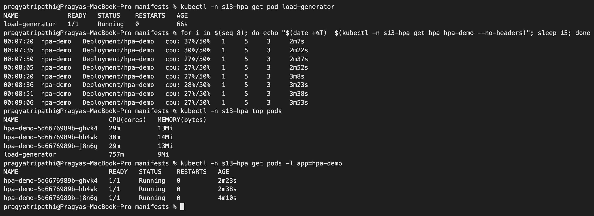

**More load:** I started two more load generators to see it reach the maximum.

```text
$ kubectl -n s13-hpa describe hpa hpa-demo | grep SuccessfulRescale
  Normal   SuccessfulRescale             2m57s  horizontal-pod-autoscaler  New size: 2; reason: cpu resource utilization (percentage of request) above target
  Normal   SuccessfulRescale             2m42s  horizontal-pod-autoscaler  New size: 3; reason: cpu resource utilization (percentage of request) above target

$ date +%H:%M:%S
00:09:40

$ for n in 2 3; do kubectl -n s13-hpa run load-generator-$n --image=busybox:1.36 --restart=Never -- /bin/sh -c "while true; do wget -q -O- http://hpa-demo-service > /dev/null; done"; done
pod/load-generator-2 created
pod/load-generator-3 created
```

```text
00:09:54  hpa-demo   Deployment/hpa-demo   cpu: 34%/50%   1     5     3     4m41s
00:10:09  hpa-demo   Deployment/hpa-demo   cpu: 58%/50%   1     5     3     4m56s
00:10:24  hpa-demo   Deployment/hpa-demo   cpu: 72%/50%   1     5     4     5m11s
00:10:39  hpa-demo   Deployment/hpa-demo   cpu: 54%/50%   1     5     5     5m26s
00:10:54  hpa-demo   Deployment/hpa-demo   cpu: 36%/50%   1     5     5     5m42s
00:11:25  hpa-demo   Deployment/hpa-demo   cpu: 49%/50%   1     5     5     6m12s
00:12:26  hpa-demo   Deployment/hpa-demo   cpu: 52%/50%   1     5     5     7m13s
```

The screenshot below was taken live while this happened (the loop runs `kubectl get hpa` every 15 s):

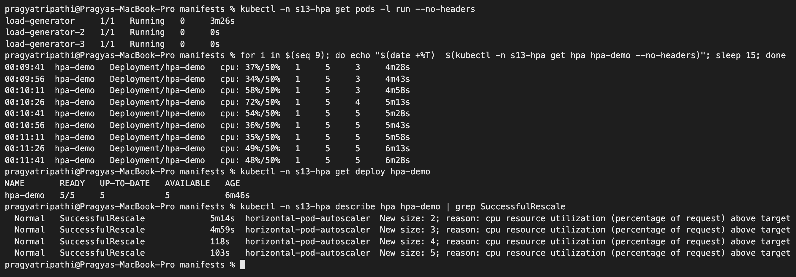

At 5 replicas the average hovered around 48–52%. The HPA cannot add a 6th Pod because `maxReplicas: 5`. If load kept growing, CPU per Pod would rise past the target and the extra demand would simply be throttled by the 200m limit.

**Scale down.** My laptop was asleep overnight, so the load generators kept running. The next morning I stopped them:

```text
$ kubectl -n s13-hpa get hpa hpa-demo
NAME       REFERENCE             TARGETS        MINPODS   MAXPODS   REPLICAS   AGE
hpa-demo   Deployment/hpa-demo   cpu: 44%/50%   1         5         5          7h15m

$ date +%H:%M:%S
07:21:12

$ kubectl -n s13-hpa delete pod load-generator load-generator-2 load-generator-3
pod "load-generator" deleted from s13-hpa namespace
pod "load-generator-2" deleted from s13-hpa namespace
pod "load-generator-3" deleted from s13-hpa namespace
```

From [logs/hpa-scale-down.log](logs/hpa-scale-down.log):

```text
TIME      NAME       REFERENCE             TARGETS        MINPODS   MAXPODS   REPLICAS   AGE
07:21:43  hpa-demo   Deployment/hpa-demo   cpu: 42%/50%   1     5     5     7h16m
07:21:58  hpa-demo   Deployment/hpa-demo   cpu: 26%/50%   1     5     5     7h16m
07:22:13  hpa-demo   Deployment/hpa-demo   cpu: 0%/50%   1     5     5     7h17m
07:24:13  hpa-demo   Deployment/hpa-demo   cpu: 0%/50%   1     5     5     7h19m
07:26:44  hpa-demo   Deployment/hpa-demo   cpu: 0%/50%   1     5     5     7h21m
07:26:59  hpa-demo   Deployment/hpa-demo   cpu: 0%/50%   1     5     3     7h21m
07:27:14  hpa-demo   Deployment/hpa-demo   cpu: 0%/50%   1     5     1     7h22m
07:27:30  hpa-demo   Deployment/hpa-demo   cpu: 0%/50%   1     5     1     7h22m
```

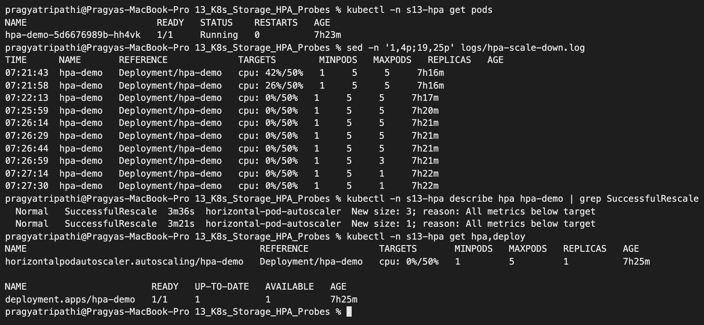

**What I understood:**

- Formula: `desired = ceil(current × currentUtilization / target)`. For example, 1 Pod at 74% → ceil(1 × 74/50) = 2. With 3 Pods at 58% → ceil(3 × 58/50) = 4, which matches what I saw.
- **Scale-up is fast** (a new size within 15–30 s of the CPU going over target). **Scale-down is slow on purpose.** CPU was 0% from 07:22:13, but replicas stayed at 5 until 07:26:59, about **5 minutes**. That is the default `scaleDown.stabilizationWindowSeconds: 300`, which stops the Deployment from flapping when traffic dips briefly. After the window it removed Pods quickly (5 → 3 → 1).
- It never went below `minReplicas: 1`.
- The HPA only works because the container has `resources.requests.cpu`. The percentage is "usage ÷ request".
- The class `hpa/` folder (yatri-backend) uses a private application image that I do not have, so I did the HPA with the class `04-hpa` nginx manifests instead. The concept is the same.

---

## 8. Probes

| Probe | Question it asks | What happens when it fails |
|---|---|---|
| **startup** | Has the app finished starting? | Container is restarted after `failureThreshold × periodSeconds`; liveness/readiness are paused until it passes once |
| **readiness** | Can it take traffic right now? | Pod becomes `NotReady` and is removed from the Service. **No restart** |
| **liveness** | Is it still healthy? | kubelet kills and restarts the container |

### Healthy liveness and readiness

```text
$ kubectl create namespace s13-probes
namespace/s13-probes created

$ kubectl -n s13-probes apply -f 06-probes/liveness.yaml -f 06-probes/readiness.yaml
pod/liveness-demo created
pod/readiness-demo created

$ kubectl -n s13-probes expose pod readiness-demo --name=readiness-service --port=80
service/readiness-service exposed

$ kubectl -n s13-probes wait --for=condition=Ready pod/liveness-demo pod/readiness-demo --timeout=120s
pod/liveness-demo condition met
pod/readiness-demo condition met

$ kubectl -n s13-probes get pods
NAME             READY   STATUS    RESTARTS   AGE
liveness-demo    1/1     Running   0          7s
readiness-demo   1/1     Running   0          7s

$ kubectl -n s13-probes describe pod liveness-demo | grep -E 'Liveness|Readiness'
    Liveness:       http-get http://:80/ delay=5s timeout=2s period=5s #success=1 #failure=3

$ kubectl -n s13-probes get endpointslices -l kubernetes.io/service-name=readiness-service
NAME                      ADDRESSTYPE   PORTS   ENDPOINTS      AGE
readiness-service-hlkr5   IPv4          80      10.244.1.111   7s
```

### Breaking readiness

The class README says to change the path to `/wrong-path` and `kubectl apply` again. On a bare Pod that is not allowed:

```text
$ kubectl -n s13-probes apply -f 06-probes/readiness-broken.yaml 2>&1 | cut -c1-300
The Pod "readiness-demo" is invalid: spec: Forbidden: pod updates may not change fields other than `spec.containers[*].image`,`spec.initContainers[*].image`,`spec.activeDeadlineSeconds`,`spec.tolerations` (only additions to existing tolerations),`spec.terminationGracePeriodSeconds` (allow it to be s
@@ -136,7 +136,7 @@
    "ReadinessProbe": {
     "Exec": null,
     "HTTPGet": {
-     "Path": "/",
+     "Path": "/wrong-path",
      "Port": 80,
      "Host": "",
      "Scheme": "HTTP",
```

A Pod's probes cannot be changed after it is created (a Deployment would handle this by creating new Pods). So I deleted the Pod and created it again from [readiness-broken.yaml](manifests/06-probes/readiness-broken.yaml):

```text
$ kubectl -n s13-probes delete pod readiness-demo
pod "readiness-demo" deleted from s13-probes namespace

$ kubectl -n s13-probes apply -f 06-probes/readiness-broken.yaml
pod/readiness-demo created

$ kubectl -n s13-probes get pod readiness-demo
NAME             READY   STATUS    RESTARTS   AGE
readiness-demo   0/1     Running   0          30s

$ kubectl -n s13-probes describe pod readiness-demo | sed -n '/Conditions:/,/Volumes:/p'
Conditions:
  Type                        Status
  PodReadyToStartContainers   True 
  Initialized                 True 
  Ready                       False 
  ContainersReady             False 
  PodScheduled                True 
Volumes:

$ kubectl -n s13-probes events --for pod/readiness-demo | tail -3
30s                Normal    Created     Pod/readiness-demo   Container created
30s                Normal    Started     Pod/readiness-demo   Container started
4s (x5 over 24s)   Warning   Unhealthy   Pod/readiness-demo   Readiness probe failed: HTTP probe failed with statuscode: 404

$ kubectl -n s13-probes exec readiness-demo -- curl -s -o /dev/null -w '%{http_code}\n' localhost/wrong-path
404

$ kubectl -n s13-probes get endpointslices -l kubernetes.io/service-name=readiness-service
NAME                      ADDRESSTYPE   PORTS   ENDPOINTS      AGE
readiness-service-hlkr5   IPv4          80      10.244.1.112   55s

$ kubectl -n s13-probes get endpointslices -l kubernetes.io/service-name=readiness-service -o jsonpath='{range .items[*].endpoints[*]}{.addresses[0]}  ready={.conditions.ready}{"\n"}{end}'
10.244.1.112  ready=false

$ kubectl -n s13-probes get endpoints readiness-service
Warning: v1 Endpoints is deprecated in v1.33+; use discovery.k8s.io/v1 EndpointSlice
NAME                ENDPOINTS   AGE
readiness-service               67s

$ kubectl -n s13-probes run tester --image=busybox:1.36 --restart=Never --rm -i --quiet -- wget -T 3 -qO- http://readiness-service
wget: can't connect to remote host (10.96.213.230): Connection refused
pod s13-probes/tester terminated (Error)
```

**What I understood:** the Pod stays `Running` with `RESTARTS 0`, but `READY 0/1`. The plain `get endpointslices` table still lists the IP, which confused me at first. The EndpointSlice keeps not-ready Pods with `ready=false` (I checked with jsonpath), and the old `Endpoints` object shows nothing. Traffic through the Service is refused because there is no ready backend.

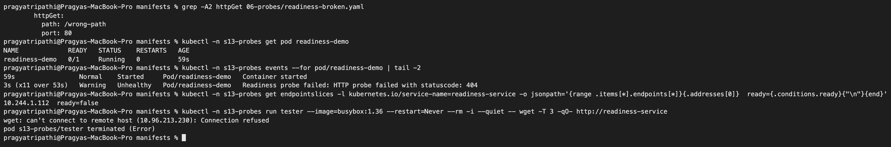

### Breaking liveness – probe failure and restart

[liveness-broken.yaml](manifests/06-probes/liveness-broken.yaml) probes `/wrong-path` (nginx returns 404):

```text
$ kubectl -n s13-probes apply -f 06-probes/liveness-broken.yaml
pod/liveness-broken created

$ kubectl -n s13-probes get pod liveness-broken --no-headers
liveness-broken   1/1   Running   0     10s

$ kubectl -n s13-probes get pod liveness-broken --no-headers
liveness-broken   1/1   Running   1 (10s ago)   25s

$ kubectl -n s13-probes get pod liveness-broken --no-headers
liveness-broken   1/1   Running   2 (10s ago)   40s

$ kubectl -n s13-probes get pod liveness-broken --no-headers
liveness-broken   1/1   Running   3 (15s ago)   60s

$ kubectl -n s13-probes get pod liveness-broken --no-headers
liveness-broken   0/1   CrashLoopBackOff   3 (20s ago)   80s

$ kubectl -n s13-probes describe pod liveness-broken | sed -n '/State:/,/Restart Count/p'
    State:          Waiting
      Reason:       CrashLoopBackOff
    Last State:     Terminated
      Reason:       Completed
      Exit Code:    0
      Started:      Thu, 08 Oct 2026 07:25:36 +0530
      Finished:     Thu, 08 Oct 2026 07:25:51 +0530
    Ready:          False
    Restart Count:  3

$ kubectl -n s13-probes events --for pod/liveness-broken | tail -6
35s (x4 over 80s)    Normal    Pulled      Pod/liveness-broken   Container image "nginx:1.27" already present on machine and can be accessed by the pod
35s (x4 over 80s)    Normal    Created     Pod/liveness-broken   Container created
35s (x4 over 80s)    Normal    Started     Pod/liveness-broken   Container started
20s (x12 over 75s)   Warning   Unhealthy   Pod/liveness-broken   Liveness probe failed: HTTP probe failed with statuscode: 404
20s (x4 over 65s)    Normal    Killing     Pod/liveness-broken   Container nginx failed liveness probe, will be restarted
19s (x2 over 20s)    Warning   BackOff     Pod/liveness-broken   Back-off restarting failed container nginx in pod liveness-broken_s13-probes(4cfe68ca-cb0d-4861-ab9d-6ce349962c00)
```

**What happened:** every 5 s the probe got a 404. After 3 failures in a row (≈15 s) the kubelet logged `Killing ... failed liveness probe` and restarted nginx. The restart count went up by about 1 every 15 s, exactly as the class bonus challenge predicts. After a few restarts the kubelet added a growing back-off delay, so the status became `CrashLoopBackOff`. `Exit Code: 0 / Completed` shows that nginx did not crash: it was stopped politely (SIGTERM) by the kubelet. The application was fine; only the health check was wrong.

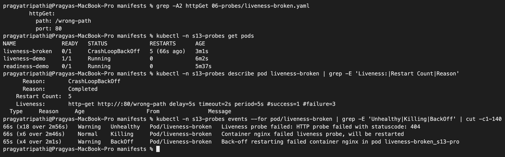

### Startup probe – why it matters

To make the startup probe meaningful I made nginx "slow": the container sleeps 20 s before nginx starts listening. I ran two versions side by side:

- [startup.yaml](manifests/06-probes/startup.yaml): startup probe allows up to 30 × 2 s = 60 s, then liveness + readiness take over.
- [startup-missing.yaml](manifests/06-probes/startup-missing.yaml): no startup probe, strict liveness (`initialDelaySeconds: 2`, `periodSeconds: 3`, `failureThreshold: 3`).

```text
$ kubectl -n s13-probes apply -f 06-probes/startup.yaml -f 06-probes/startup-missing.yaml
pod/startup-demo created
pod/no-startup-demo created

$ kubectl -n s13-probes get pod startup-demo no-startup-demo --no-headers
startup-demo      0/1   Running   0     10s
no-startup-demo   1/1   Running   0     10s

$ kubectl -n s13-probes get pod startup-demo no-startup-demo --no-headers
startup-demo      1/1   Running   0     25s
no-startup-demo   1/1   Running   0     25s

$ kubectl -n s13-probes get pod startup-demo no-startup-demo --no-headers
startup-demo      1/1   Running   0            40s
no-startup-demo   1/1   Running   1 (0s ago)   40s

$ kubectl -n s13-probes get pod startup-demo no-startup-demo --no-headers
startup-demo      1/1   Running   0            81s
no-startup-demo   1/1   Running   2 (2s ago)   81s

$ kubectl -n s13-probes describe pod startup-demo | grep -E 'Startup:|Liveness:|Readiness:'
    Liveness:       http-get http://:80/ delay=0s timeout=1s period=5s #success=1 #failure=3
    Readiness:      http-get http://:80/ delay=0s timeout=1s period=5s #success=1 #failure=3
    Startup:        http-get http://:80/ delay=0s timeout=1s period=2s #success=1 #failure=30

$ kubectl -n s13-probes events --for pod/startup-demo | grep -E 'Unhealthy' 
61s (x10 over 79s)   Warning   Unhealthy   Pod/startup-demo   Startup probe failed: Get "http://10.244.1.117:80/": dial tcp 10.244.1.117:80: connect: connection refused

$ kubectl -n s13-probes logs startup-demo | head -3
warming up for 20s...
2026/10/08 02:00:47 [notice] 1#1: using the "epoll" event method
2026/10/08 02:00:47 [notice] 1#1: nginx/1.27.5

$ kubectl -n s13-probes events --for pod/no-startup-demo | grep -E 'Unhealthy|Killing'
33s (x6 over 78s)   Warning   Unhealthy   Pod/no-startup-demo   Liveness probe failed: Get "http://10.244.1.116:80/": dial tcp 10.244.1.116:80: connect: connection refused
33s (x2 over 72s)   Normal    Killing     Pod/no-startup-demo   Container nginx failed liveness probe, will be restarted

$ kubectl -n s13-probes get pod startup-demo no-startup-demo
NAME              READY   STATUS    RESTARTS      AGE
startup-demo      1/1     Running   0             2m33s
no-startup-demo   1/1     Running   3 (35s ago)   2m33s

$ kubectl -n s13-probes describe pod no-startup-demo | sed -n '/Last State/,/Restart Count/p'
    Last State:     Terminated
      Reason:       Error
      Exit Code:    137
      Started:      Thu, 08 Oct 2026 07:31:45 +0530
      Finished:     Thu, 08 Oct 2026 07:32:24 +0530
    Ready:          True
    Restart Count:  3

$ kubectl -n s13-probes get pod no-startup-demo -o jsonpath='{.spec.terminationGracePeriodSeconds}{"\n"}'
30
```

**What I understood:**

- `startup-demo`: the startup probe failed 10 times ("connection refused" while the app warmed up). That is allowed because the threshold is 30. It then passed, liveness took over, and the Pod has **0 restarts**. During startup it was `0/1`, so it got no traffic.
- `no-startup-demo`: liveness started checking 2 s after start, failed 3 times, and the kubelet killed the container before nginx ever came up. This repeats forever, so the app never gets a chance to finish starting.
- Two extra things I noticed. First, `Exit Code 137` and ~39 s between Started and Finished: my `sh -c "sleep 20; ..."` wrapper ignores SIGTERM, so the kubelet waited the full 30 s grace period and then sent SIGKILL (137 = 128 + 9). Second, this Pod shows `READY 1/1` even while nginx was not listening, because it has **no readiness probe**, and without one Kubernetes assumes "ready" as soon as the container runs.

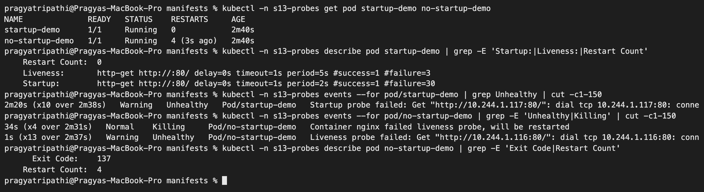

I deleted the `s13-probes` namespace after this so the restart loops would stop.

---

## 9. Mini project – production-style web app

Class files in [mini-project](mini-project). The only change I made was the namespace: I used `s13-webapp` instead of `production-webapp` (my own prefix on the shared cluster). I also wrote `storageClassName: standard` explicitly in the PVC. The Deployment has 2 replicas, CPU requests/limits, all three probes, `strategy: Recreate`, and mounts PVC `web-data` at `/data`. The HPA scales between 2 and 5 replicas at 50% CPU.

```text
$ kubectl apply -f namespace.yaml
namespace/s13-webapp created

$ kubectl apply -f pvc.yaml
persistentvolumeclaim/web-data created

$ kubectl get pvc -n s13-webapp
NAME       STATUS    VOLUME   CAPACITY   ACCESS MODES   STORAGECLASS   VOLUMEATTRIBUTESCLASS   AGE
web-data   Pending                                      standard       <unset>                 0s

$ kubectl apply -f deployment.yaml -f service.yaml
deployment.apps/web-app created
service/web-service created

$ kubectl -n s13-webapp rollout status deployment/web-app --timeout=180s
Waiting for deployment "web-app" rollout to finish: 0 of 2 updated replicas are available...
Waiting for deployment "web-app" rollout to finish: 1 of 2 updated replicas are available...
deployment "web-app" successfully rolled out

$ kubectl get pods,pvc -n s13-webapp -o wide
NAME                          READY   STATUS    RESTARTS   AGE   IP             NODE               NOMINATED NODE   READINESS GATES
pod/web-app-d45775485-dzh4s   1/1     Running   0          13s   10.244.1.120   devops-hw-worker   <none>           <none>
pod/web-app-d45775485-wd8nx   1/1     Running   0          13s   10.244.1.119   devops-hw-worker   <none>           <none>

NAME                             STATUS   VOLUME                                     CAPACITY   ACCESS MODES   STORAGECLASS   VOLUMEATTRIBUTESCLASS   AGE   VOLUMEMODE
persistentvolumeclaim/web-data   Bound    pvc-2c486727-fb96-4206-ac1f-35b9a492a32e   500Mi      RWO            standard       <unset>                 13s   Filesystem

$ kubectl apply -f hpa.yaml
horizontalpodautoscaler.autoscaling/web-app-hpa created

$ kubectl get hpa -n s13-webapp
NAME          REFERENCE            TARGETS       MINPODS   MAXPODS   REPLICAS   AGE
web-app-hpa   Deployment/web-app   cpu: 1%/50%   2         5         2          40s

$ kubectl -n s13-webapp describe pod -l app=web-app | grep -E '^Name:|Liveness:|Readiness:|Startup:|ClaimName|Requests|cpu:' | head -14
Name:             web-app-d45775485-dzh4s
      cpu:     200m
    Requests:
      cpu:        100m
    Liveness:     http-get http://:80/ delay=5s timeout=2s period=5s #success=1 #failure=3
    Readiness:    http-get http://:80/ delay=5s timeout=2s period=5s #success=1 #failure=2
    Startup:      http-get http://:80/ delay=0s timeout=1s period=2s #success=1 #failure=30
    ClaimName:  web-data
(the second Pod printed the same lines; trimmed)
```

### Task 1 – storage persistence

```text
$ POD_NAME=$(kubectl get pods -n s13-webapp -l app=web-app -o jsonpath='{.items[0].metadata.name}'); echo $POD_NAME
web-app-d45775485-dzh4s

$ kubectl exec -n s13-webapp "$POD_NAME" -- sh -c 'echo "Student: Pragya Tripathi (24BCS10032)" > /data/student.txt'

$ kubectl exec -n s13-webapp "$POD_NAME" -- cat /data/student.txt
Student: Pragya Tripathi (24BCS10032)

$ kubectl exec -n s13-webapp web-app-d45775485-wd8nx -- cat /data/student.txt
Student: Pragya Tripathi (24BCS10032)

$ kubectl delete pod -n s13-webapp "$POD_NAME"
pod "web-app-d45775485-dzh4s" deleted from s13-webapp namespace

$ kubectl -n s13-webapp rollout status deployment/web-app --timeout=120s
Waiting for deployment "web-app" rollout to finish: 1 of 2 updated replicas are available...
deployment "web-app" successfully rolled out

$ kubectl get pods -n s13-webapp -l app=web-app
NAME                      READY   STATUS    RESTARTS   AGE
web-app-d45775485-dnt4m   1/1     Running   0          9s
web-app-d45775485-wd8nx   1/1     Running   0          73s

$ NEW_POD=$(kubectl get pods -n s13-webapp -l app=web-app --sort-by=.metadata.creationTimestamp -o jsonpath='{.items[-1].metadata.name}'); echo $NEW_POD
web-app-d45775485-dnt4m

$ kubectl exec -n s13-webapp "$NEW_POD" -- cat /data/student.txt
Student: Pragya Tripathi (24BCS10032)
```

Both replicas see the same file, because they mount the same RWO volume. RWO means "one **node**", and both Pods are on `devops-hw-worker`. The replacement Pod read the file straight away.

### Task 2 – Service verification

My first port-forward used `8080:80`, but something else on my Mac was already listening on `127.0.0.1:8080` (kubectl could only bind `[::1]:8080`). To make sure I was really testing my Service, I used port 18080:

```text
$ kubectl port-forward -n s13-webapp svc/web-service 18080:80   (in another terminal)
Forwarding from 127.0.0.1:18080 -> 80
Forwarding from [::1]:18080 -> 80

$ curl -s http://localhost:18080 | grep -E '<title>|<h1>'
<title>Welcome to nginx!</title>
<h1>Welcome to nginx!</h1>

$ curl -s -o /dev/null -w 'HTTP %{http_code}\n' http://127.0.0.1:18080/
HTTP 200
```

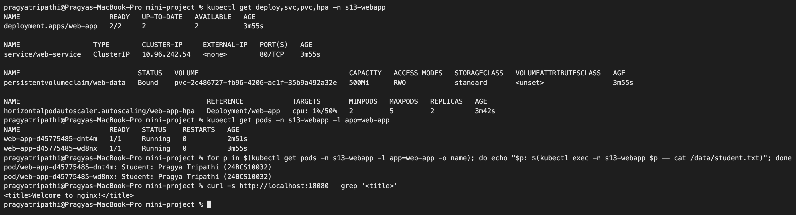

### Task 3 – HPA elastic scaling

I started the class load generator (one busybox loop) and recorded the HPA every 15 s ([logs/mini-project-hpa.log](logs/mini-project-hpa.log)):

```text
$ date +%H:%M:%S
07:37:41

$ kubectl run load-generator -n s13-webapp --image=busybox:1.36 --restart=Never -- /bin/sh -c "while true; do wget -q -O- http://web-service > /dev/null; done"
pod/load-generator created
```

```text
TIME      NAME          REFERENCE            TARGETS       MINPODS   MAXPODS   REPLICAS   AGE
07:37:42  web-app-hpa   Deployment/web-app   cpu: 1%/50%   2     5     2     4m3s
07:37:57  web-app-hpa   Deployment/web-app   cpu: 13%/50%   2     5     2     4m18s
07:38:27  web-app-hpa   Deployment/web-app   cpu: 42%/50%   2     5     2     4m48s
07:38:42  web-app-hpa   Deployment/web-app   cpu: 44%/50%   2     5     2     5m3s
07:39:12  web-app-hpa   Deployment/web-app   cpu: 40%/50%   2     5     2     5m33s
```

```text
$ kubectl top pods -n s13-webapp
NAME                      CPU(cores)   MEMORY(bytes)   
load-generator            808m         11Mi            
web-app-d45775485-dnt4m   43m          13Mi            
web-app-d45775485-wd8nx   43m          13Mi            
```

**It did not scale.** One busybox loop produces roughly 80–85m of nginx CPU in total. Spread over the **2** minimum replicas that is ~43m each, which is 40–44% of the 100m request, just under the 50% target. (In section 7 the same single loop was enough only because the HPA started from 1 Pod.) So I added two more generators:

```text
$ date +%H:%M:%S
07:39:28

$ for n in 2 3; do kubectl run load-generator-$n -n s13-webapp --image=busybox:1.36 --restart=Never -- /bin/sh -c "while true; do wget -q -O- http://web-service > /dev/null; done"; done
pod/load-generator-2 created
pod/load-generator-3 created
```

```text
07:39:27  web-app-hpa   Deployment/web-app   cpu: 43%/50%   2     5     2     5m48s
07:39:42  web-app-hpa   Deployment/web-app   cpu: 77%/50%   2     5     2     6m3s
07:39:57  web-app-hpa   Deployment/web-app   cpu: 116%/50%   2     5     4     6m18s
07:40:12  web-app-hpa   Deployment/web-app   cpu: 61%/50%   2     5     5     6m33s
07:40:27  web-app-hpa   Deployment/web-app   cpu: 56%/50%   2     5     5     6m48s
07:40:42  web-app-hpa   Deployment/web-app   cpu: 40%/50%   2     5     5     7m3s
```

```text
$ kubectl get pods -n s13-webapp -l app=web-app -o wide | cut -c1-110
NAME                      READY   STATUS    RESTARTS   AGE     IP             NODE               NOMINATED NOD
web-app-d45775485-2gc2f   1/1     Running   0          103s    10.244.1.134   devops-hw-worker   <none>       
web-app-d45775485-dnt4m   1/1     Running   0          7m7s    10.244.1.121   devops-hw-worker   <none>       
web-app-d45775485-fhpmn   1/1     Running   0          118s    10.244.1.125   devops-hw-worker   <none>       
web-app-d45775485-m98nv   1/1     Running   0          118s    10.244.1.126   devops-hw-worker   <none>       
web-app-d45775485-wd8nx   1/1     Running   0          8m11s   10.244.1.119   devops-hw-worker   <none>       

$ for p in $(kubectl get pods -n s13-webapp -l app=web-app -o name); do echo "$p: $(kubectl exec -n s13-webapp $p -- cat /data/student.txt)"; done
pod/web-app-d45775485-2gc2f: Student: Pragya Tripathi (24BCS10032)
pod/web-app-d45775485-dnt4m: Student: Pragya Tripathi (24BCS10032)
pod/web-app-d45775485-fhpmn: Student: Pragya Tripathi (24BCS10032)
pod/web-app-d45775485-m98nv: Student: Pragya Tripathi (24BCS10032)
pod/web-app-d45775485-wd8nx: Student: Pragya Tripathi (24BCS10032)

$ kubectl describe hpa web-app-hpa -n s13-webapp | grep SuccessfulRescale
  Normal   SuccessfulRescale             118s   horizontal-pod-autoscaler  New size: 4; reason: cpu resource utilization (percentage of request) above target
  Normal   SuccessfulRescale             103s   horizontal-pod-autoscaler  New size: 5; reason: cpu resource utilization (percentage of request) above target
```

The HPA acted on the 77% reading: ceil(2 × 77/50) = 4 Pods. The next reading, 116%, asked for ceil(4 × 116/50) = 10, capped at `maxReplicas: 5`, so it reached the maximum fifteen seconds later. All 5 replicas mounted the same PVC and read the same file. This only works because local-path volumes are RWO per **node** and every Pod is on the one worker node. On a real multi-node cluster, RWO + 5 replicas would leave some Pods stuck in `ContainerCreating` with a multi-attach error, and you would need RWX storage or a StatefulSet.

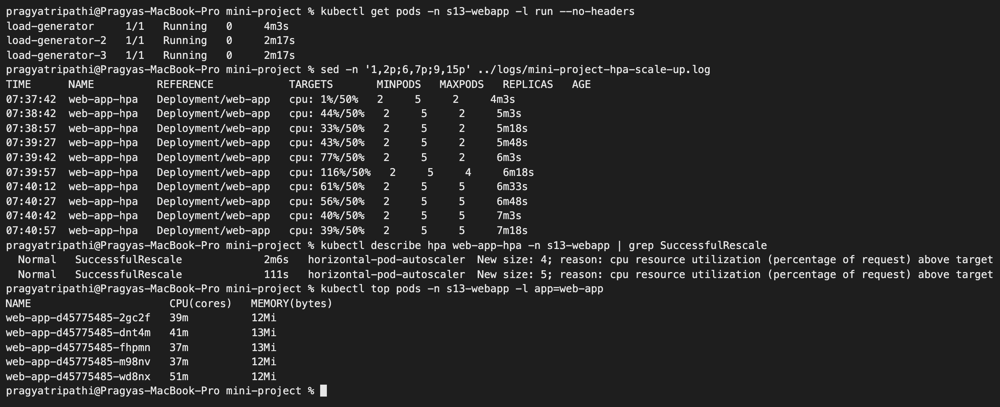

Stopping the load:

```text
$ date +%H:%M:%S
07:41:55

$ kubectl delete pod -n s13-webapp load-generator load-generator-2 load-generator-3
pod "load-generator" deleted from s13-webapp namespace
pod "load-generator-2" deleted from s13-webapp namespace
pod "load-generator-3" deleted from s13-webapp namespace
```

CPU was ~1% from 07:43:13, and the HPA went 5 → 4 → 2 at 07:47:43–07:47:58, again after the 5-minute stabilization window. It stopped at `minReplicas: 2`, not 1.

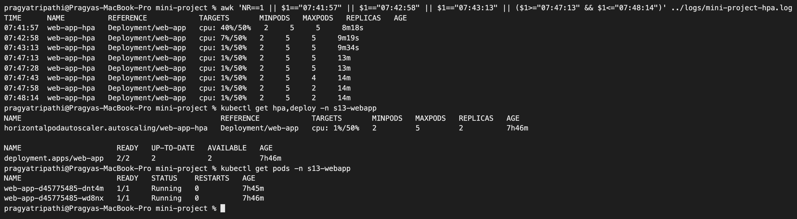

### Mini project – probe reference and troubleshooting notes

| Probe | In my Deployment | Action on failure |
|---|---|---|
| startup | `/` every 2 s, up to 30 failures | restart container; other probes wait until it passes |
| readiness | `/` every 5 s, 2 failures | Pod removed from `web-service` endpoints, **no restart** (shown in section 8) |
| liveness | `/` every 5 s, 3 failures | kubelet restarts the container (shown in section 8) |

| Problem I could hit | How to check | Cause / fix |
|---|---|---|
| PVC `Pending` | `kubectl describe pvc web-data -n s13-webapp` | On kind `WaitForFirstConsumer` is normal until a Pod uses it. Otherwise check `kubectl get sc` for a default class |
| HPA `TARGETS <unknown>/50%` | `kubectl top pods -n s13-webapp` | metrics-server missing/not ready, or the container has no `resources.requests.cpu` (I saw `<unknown>` for the first ~30 s after creating the HPA) |
| Static PVC binds to a new volume instead of my PV | `kubectl get pvc` shows `STORAGECLASS standard` | Default StorageClass got filled in. Use `storageClassName: ""` (section 3) |
| HPA does not scale under load | `kubectl top pods` | Load too small for the number of min replicas (Task 3). Add load or lower the target |
| Restart loop | `kubectl describe pod`, look for `Killing ... failed liveness probe` | Wrong probe path/port, or a slow start without a startup probe (section 8) |

## Clean up

```text
$ kubectl delete namespace s13-storage s13-hpa s13-webapp
namespace "s13-storage" deleted
namespace "s13-hpa" deleted
namespace "s13-webapp" deleted

$ kubectl delete pv s13-student-pv
persistentvolume "s13-student-pv" deleted

$ docker exec devops-hw-worker rm -rf /tmp/s13-hostpath-data /tmp/s13-student-data

$ kubectl get pv | grep -c s13- || true
0

$ kubectl -n kube-system get deployment metrics-server
NAME             READY   UP-TO-DATE   AVAILABLE   AGE
metrics-server   1/1     1            1           15h
```

The `s13-probes` namespace was deleted earlier. metrics-server stays installed for later sessions.

## What I learned

- **Where data lives decides how long it lives.** Container layer < `emptyDir` (Pod lifetime) < `hostPath` (node lifetime) < PV (independent of Pods).
- **The default StorageClass silently changes PVCs** that do not name a class. To bind a hand-made PV you must say `storageClassName: ""`.
- **StatefulSets give each replica its own volume** and keep those volumes even after scaling down.
- **HPA needs CPU requests and metrics-server.** It scales up within seconds and scales down only after a 5-minute calm period. How much load you need depends on `minReplicas`.
- **Readiness ≠ liveness.** A readiness failure removes the Pod from the Service and keeps it running. A liveness failure restarts the container. A slow app needs a startup probe, or liveness will kill it before it ever starts.
