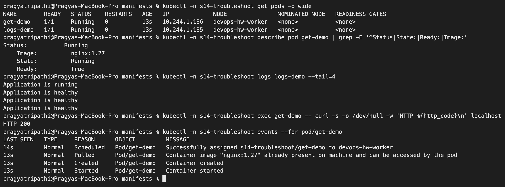
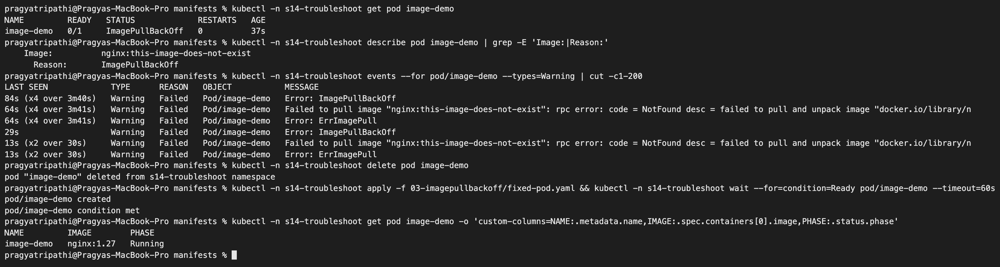
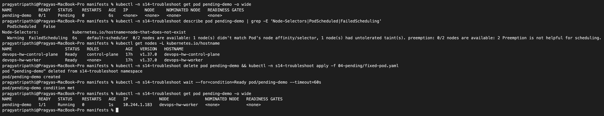
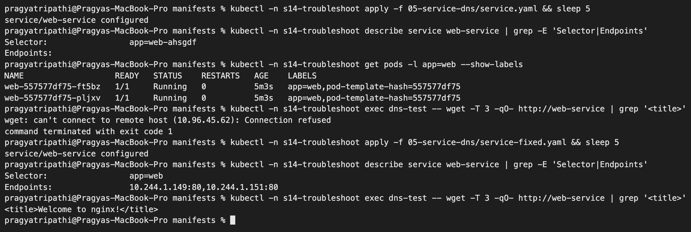
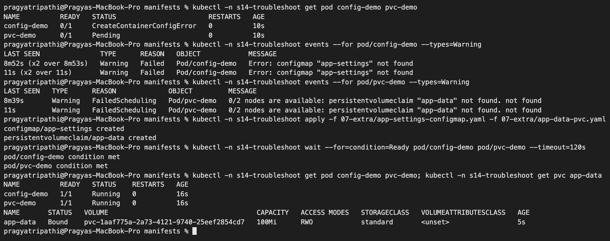
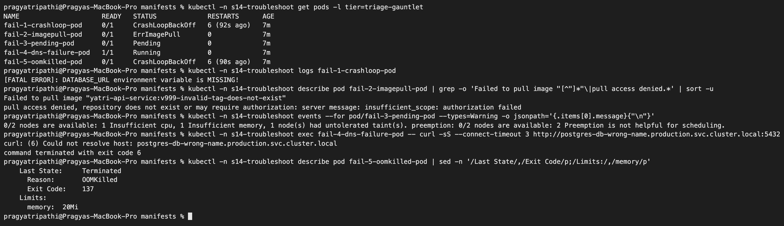
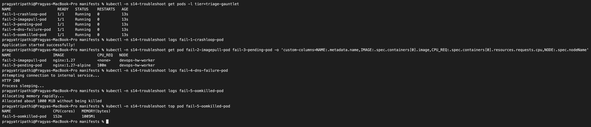
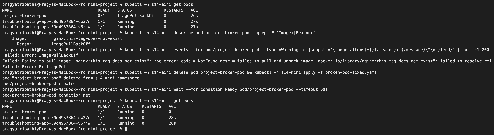
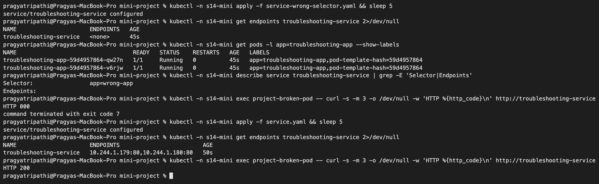

# Kubernetes Troubleshooting – Homework

**Name:** Pragya Tripathi
**Roll No:** 24BCS10032

Tasks are from the class repository ([session-14-kubernetes-troubleshooting](https://github.com/Nency-Ravaliya/devops-heros/tree/main/session-14-kubernetes-troubleshooting)). I broke things on purpose on my local kind cluster (`devops-hw`, Kubernetes v1.37.0, 1 control-plane + 1 worker), then found each root cause with `get` / `describe` / `logs` / `exec` / events and fixed it. Everything ran in my own namespaces `s14-troubleshoot` and `s14-mini`. All outputs are copied from my terminal. The error messages are the real ones my cluster printed.

| Folder | Contents |
|---|---|
| [manifests/01-basics](manifests/01-basics) | `get-demo` (nginx) and `logs-demo` (busybox that prints log lines) |
| [manifests/02-crashloopbackoff](manifests/02-crashloopbackoff) | class broken/fixed Pod |
| [manifests/03-imagepullbackoff](manifests/03-imagepullbackoff) | class broken/fixed Pod + `broken-pod-mirror.yaml` (see section 3) |
| [manifests/04-pending](manifests/04-pending) | class broken (bad `nodeSelector`) / fixed Pod |
| [manifests/05-service-dns](manifests/05-service-dns) | class Deployment, Service, broken Service, DNS test Pod + my `service-fixed.yaml` |
| [manifests/06-scenarios](manifests/06-scenarios) | the five class "triage gauntlet" Pods, and my fixes in [fixed/](manifests/06-scenarios/fixed) |
| [manifests/07-extra](manifests/07-extra) | extra failures: wrong `targetPort`, missing ConfigMap, missing PVC (+ the objects that fix them) |
| [mini-project](mini-project) | class Deployment/Service/broken Pod + `broken-pod-fixed.yaml` and `service-wrong-selector.yaml` |

Two small changes to class files, both because of my environment:

- `05-service-dns/dns-test-pod.yaml` used `registry.k8s.io/e2e-test-images/dnsutils:1.3`. `docker pull` of that tag returned `not found` (for both arm64 and amd64), so I used `busybox:1.36`, which also has `nslookup` and `wget`.
- `06-scenarios/scenario-4-dns-failure.yaml` used `curlimages/curl:8.6.0`. I used `8.5.0`, which was already cached on my kind node, because Docker Hub pulls were very slow on my network.

## The troubleshooting flow I followed

```text
kubectl get            -> WHAT is the status? (STATUS, READY, RESTARTS, NODE)
kubectl describe       -> WHY? (State / Last State / Exit Code / Conditions / Events)
kubectl events / get events -> what did Kubernetes TRY and what failed?
kubectl logs [--previous]   -> what did the APPLICATION say?
kubectl exec           -> test from INSIDE (curl localhost, nslookup, cat config)
fix -> verify with the same commands
```

| Status I see | First place to look | Usually means |
|---|---|---|
| `CrashLoopBackOff` / `Error` with restarts | `logs`, `logs --previous`, `describe` (Exit Code) | the app starts and exits |
| `ErrImagePull` / `ImagePullBackOff` | `describe` → Events | wrong image name/tag, private registry, network |
| `Pending`, NODE `<none>` | `describe` → `FailedScheduling` event | no node fits: resources, selector, taint, missing PVC |
| `CreateContainerConfigError` | `describe` → Events | referenced ConfigMap/Secret/key does not exist |
| `OOMKilled`, exit 137 | `describe` → Last State, Limits | memory limit too small for the program |
| `Running 1/1` but Service fails | `describe svc`, endpoints, `exec` + `wget` | selector / targetPort / DNS name wrong |

---

## 1. The five commands (class folders 01–05)

All commands in sections 1–6 run from the `manifests/` folder.

```text
$ kubectl create namespace s14-troubleshoot
namespace/s14-troubleshoot created

$ kubectl -n s14-troubleshoot apply -f 01-basics/get-demo.yaml -f 01-basics/logs-demo.yaml
pod/get-demo created
pod/logs-demo created

$ kubectl -n s14-troubleshoot get pods
NAME        READY   STATUS    RESTARTS   AGE
get-demo    1/1     Running   0          1s
logs-demo   1/1     Running   0          1s

$ kubectl -n s14-troubleshoot get pods -o wide
NAME        READY   STATUS    RESTARTS   AGE   IP             NODE               NOMINATED NODE   READINESS GATES
get-demo    1/1     Running   0          1s    10.244.1.136   devops-hw-worker   <none>           <none>
logs-demo   1/1     Running   0          1s    10.244.1.135   devops-hw-worker   <none>           <none>

$ kubectl -n s14-troubleshoot get all
NAME            READY   STATUS    RESTARTS   AGE
pod/get-demo    1/1     Running   0          1s
pod/logs-demo   1/1     Running   0          1s
```

**describe** (only the most useful parts, cut with `sed`):

```text
$ kubectl -n s14-troubleshoot describe pod get-demo | sed -n '1,12p;/Containers:/,/Ready:/p;/Conditions:/,/PodScheduled/p;/Events:/,$p'
Name:             get-demo
Namespace:        s14-troubleshoot
Priority:         0
Service Account:  default
Node:             devops-hw-worker/172.18.0.3
Start Time:       Thu, 08 Oct 2026 15:20:05 +0530
Labels:           app=get-demo
Annotations:      <none>
Status:           Running
IP:               10.244.1.136
IPs:
  IP:  10.244.1.136
Containers:
  nginx:
    Container ID:   containerd://204b4de5ec336a9e9e933e0d287e8cfe28e51539993d99ccfc6102abe9268873
    Image:          nginx:1.27
    Image ID:       sha256:7791402a0bf5691936db0f42d40032ac6fb8441867416053f3ea06199de3e7e4
    Port:           80/TCP
    Host Port:      0/TCP
    State:          Running
      Started:      Thu, 08 Oct 2026 15:20:06 +0530
    Ready:          True
Conditions:
  Type                        Status
  PodReadyToStartContainers   True 
  Initialized                 True 
  Ready                       True 
  ContainersReady             True 
  PodScheduled                True 
Events:
  Type    Reason     Age   From               Message
  ----    ------     ----  ----               -------
  Normal  Scheduled  1s    default-scheduler  Successfully assigned s14-troubleshoot/get-demo to devops-hw-worker
  Normal  Pulled     0s    kubelet            spec.containers{nginx}: Container image "nginx:1.27" already present on machine and can be accessed by the pod
  Normal  Created    0s    kubelet            spec.containers{nginx}: Container created
  Normal  Started    0s    kubelet            spec.containers{nginx}: Container started
```

**logs, exec, events:**

```text
$ kubectl -n s14-troubleshoot logs logs-demo
Application started
Connecting to database...
Database connection successful
Application is running
Application is healthy

$ kubectl -n s14-troubleshoot logs logs-demo --tail=2 --timestamps
2026-10-08T09:50:06.178939463Z Application is running
2026-10-08T09:50:06.178939921Z Application is healthy

$ kubectl -n s14-troubleshoot exec get-demo -- hostname
get-demo

$ kubectl -n s14-troubleshoot exec get-demo -- ls /usr/share/nginx/html
50x.html
index.html

$ kubectl -n s14-troubleshoot exec get-demo -- curl -s -o /dev/null -w 'HTTP %{http_code}\n' localhost
HTTP 200

$ kubectl -n s14-troubleshoot exec get-demo -- nginx -T 2>/dev/null | grep -E 'listen|root' | head -4
    listen       80;
    listen  [::]:80;
        root   /usr/share/nginx/html;
        root   /usr/share/nginx/html;

$ kubectl -n s14-troubleshoot get events --sort-by=.lastTimestamp | tail -8
1s          Normal   Scheduled   pod/get-demo    Successfully assigned s14-troubleshoot/get-demo to devops-hw-worker
1s          Normal   Scheduled   pod/logs-demo   Successfully assigned s14-troubleshoot/logs-demo to devops-hw-worker
0s          Normal   Pulled      pod/get-demo    Container image "nginx:1.27" already present on machine and can be accessed by the pod
0s          Normal   Created     pod/get-demo    Container created
0s          Normal   Started     pod/get-demo    Container started
0s          Normal   Pulled      pod/logs-demo   Container image "busybox:1.36" already present on machine and can be accessed by the pod
0s          Normal   Created     pod/logs-demo   Container created
0s          Normal   Started     pod/logs-demo   Container started

$ kubectl -n s14-troubleshoot events --for pod/get-demo
LAST SEEN   TYPE     REASON      OBJECT         MESSAGE
2s          Normal   Scheduled   Pod/get-demo   Successfully assigned s14-troubleshoot/get-demo to devops-hw-worker
1s          Normal   Pulled      Pod/get-demo   Container image "nginx:1.27" already present on machine and can be accessed by the pod
1s          Normal   Created     Pod/get-demo   Container created
1s          Normal   Started     Pod/get-demo   Container started
```

`curl localhost` from inside the Pod returning 200 is a very useful check: if it works, the application is fine, and any remaining problem is in the Service, DNS or network.



---

## 2. CrashLoopBackOff (class 06)

[broken-pod.yaml](manifests/02-crashloopbackoff/broken-pod.yaml) prints two lines and runs `exit 1`.

```text
$ kubectl -n s14-troubleshoot apply -f 02-crashloopbackoff/broken-pod.yaml -f 03-imagepullbackoff/broken-pod.yaml -f 04-pending/broken-pod.yaml
pod/crash-demo created
pod/image-demo created
pod/pending-demo created

$ kubectl -n s14-troubleshoot get pods crash-demo image-demo pending-demo
NAME           READY   STATUS              RESTARTS     AGE
crash-demo     0/1     Error               1 (6s ago)   6s
image-demo     0/1     ContainerCreating   0            6s
pending-demo   0/1     Pending             0            6s

$ kubectl -n s14-troubleshoot describe pod crash-demo | sed -n '/State:/,/Restart Count/p'
    State:          Terminated
      Reason:       Error
      Exit Code:    1
      Started:      Thu, 08 Oct 2026 15:21:03 +0530
      Finished:     Thu, 08 Oct 2026 15:21:03 +0530
    Last State:     Terminated
      Reason:       Error
      Exit Code:    1
      Started:      Thu, 08 Oct 2026 15:20:41 +0530
      Finished:     Thu, 08 Oct 2026 15:20:41 +0530
    Ready:          False
    Restart Count:  3

$ kubectl -n s14-troubleshoot events --for pod/crash-demo | tail -4
28s (x4 over 63s)   Normal    Pulled      Pod/crash-demo   Container image "busybox:1.36" already present on machine and can be accessed by the pod
28s (x4 over 63s)   Normal    Created     Pod/crash-demo   Container created
28s (x4 over 63s)   Normal    Started     Pod/crash-demo   Container started
27s (x3 over 61s)   Warning   BackOff     Pod/crash-demo   Back-off restarting failed container app in pod crash-demo_s14-troubleshoot(23aa2129-dc63-4e0d-af2b-d759494835ab)

$ kubectl -n s14-troubleshoot logs crash-demo
Application starting...
Something went wrong!

$ kubectl -n s14-troubleshoot logs crash-demo --previous
unable to retrieve container logs for containerd://74f8a6e044cffbd11dee74be0a06c112a35c1d0e412524cc6c6011bad2fabe3b

$ kubectl -n s14-troubleshoot exec crash-demo -- sh -c 'echo hi'
error: unable to upgrade connection: container not found ("app")

$ kubectl -n s14-troubleshoot get pod crash-demo -o jsonpath='{.spec.containers[0].command}{"\n"}'
["sh","-c","echo \"Application starting...\"\necho \"Something went wrong!\"\nexit 1\n"]

$ kubectl -n s14-troubleshoot get pod crash-demo -o jsonpath='{.status.containerStatuses[0].state}{"\n"}'
{"terminated":{"containerID":"containerd://8f49630a2c7c65e35dff0aee6da93ef19394074879f09bea891d43df73ab4c1c","exitCode":1,"finishedAt":"2026-10-08T09:51:45Z","reason":"Error","startedAt":"2026-10-08T09:51:45Z"}}
```

**Root cause:** the command ends with `exit 1`, so the container exits with code 1 every time and the kubelet keeps restarting it with a growing back-off.

Things I noticed on my cluster:

- `kubectl get` showed **`Error`** most of the time instead of `CrashLoopBackOff`. The container's last state is `terminated / Error` while it waits for the next restart, and the "it keeps restarting" part is only visible in the `RESTARTS` count and the `BackOff` event. In the gauntlet below, the same kind of failure showed `CrashLoopBackOff` in the STATUS column. Both mean the same thing here.
- `logs --previous` failed with `unable to retrieve container logs`. The container exits instantly, so the kubelet had already cleaned up the previous instance. Plain `logs` still showed the output of the latest dead container, which was enough.
- `exec` cannot help with a crashing container (`container not found`), because there is nothing running to enter.

**Fix:** [fixed-pod.yaml](manifests/02-crashloopbackoff/fixed-pod.yaml) keeps running (`sleep 3600`). Pods cannot be edited in place, so I deleted the Pod and re-applied it.

```text
$ kubectl -n s14-troubleshoot delete pod crash-demo
pod "crash-demo" deleted from s14-troubleshoot namespace

$ kubectl -n s14-troubleshoot apply -f 02-crashloopbackoff/fixed-pod.yaml
pod/crash-demo created

$ kubectl -n s14-troubleshoot get pod crash-demo
NAME         READY   STATUS    RESTARTS   AGE
crash-demo   1/1     Running   0          0s

$ kubectl -n s14-troubleshoot logs crash-demo
Application starting...
Application is healthy
```

## 3. ImagePullBackOff (class 07) – and a pull that hung

[broken-pod.yaml](manifests/03-imagepullbackoff/broken-pod.yaml) uses `nginx:this-image-does-not-exist`. The first time, it did **not** fail. It sat in `ContainerCreating` with only a `Pulling` event for more than 10 minutes:

```text
$ kubectl -n s14-troubleshoot describe pod image-demo | sed -n '/State:/,/Ready:/p;/Events:/,$p'
    State:          Waiting
      Reason:       ContainerCreating
    Ready:          False
Events:
  Type    Reason     Age   From               Message
  ----    ------     ----  ----               -------
  Normal  Scheduled  2m6s  default-scheduler  Successfully assigned s14-troubleshoot/image-demo to devops-hw-worker
  Normal  Pulling    2m6s  kubelet            spec.containers{app}: Pulling image "nginx:this-image-does-not-exist"

$ kubectl -n s14-troubleshoot get pod image-demo
NAME         READY   STATUS              RESTARTS   AGE
image-demo   0/1     ContainerCreating   0          10m
```

**Investigating the hang.** First I checked that the node can reach Docker Hub. On the first try the auth server timed out; a few minutes later both answered:

```text
$ docker exec devops-hw-worker sh -c 'curl -s -m 10 -o /dev/null -w "%{http_code} %{time_total}\n" https://registry-1.docker.io/v2/; curl -s -m 10 -o /dev/null -w "%{http_code} %{time_total}\n" https://auth.docker.io/token?service=registry.docker.io'
401 4.379458
000 10.002483

$ docker exec devops-hw-worker curl -s -m 10 -o /dev/null -w '%{http_code}\n' https://registry-1.docker.io/v2/
401

$ docker exec devops-hw-worker curl -s -m 10 -o /dev/null -w '%{http_code}\n' 'https://auth.docker.io/token?service=registry.docker.io'
200
```

Pulling a non-existent tag **directly with `crictl` on the node** (bypassing the kubelet) failed quickly with the expected error:

```text
$ docker exec devops-hw-worker bash -c 'for i in registry.k8s.io/pause:this-tag-does-not-exist mirror.gcr.io/library/nginx:this-image-does-not-exist; do s=$(date +%s); crictl --timeout 40s pull $i 2>&1 | tail -1 | cut -c1-250; echo "took $(( $(date +%s)-s ))s"; done'
time="2026-10-08T10:00:44Z" level=fatal msg="pulling image: rpc error: code = NotFound desc = failed to pull and unpack image \"registry.k8s.io/pause:this-tag-does-not-exist\": failed to resolve reference \"registry.k8s.io/pause:this-tag-does-not-exi
took 6s
time="2026-10-08T10:00:46Z" level=fatal msg="pulling image: rpc error: code = NotFound desc = failed to pull and unpack image \"mirror.gcr.io/library/nginx:this-image-does-not-exist\": failed to resolve reference \"mirror.gcr.io/library/nginx:this-im
took 2s
```

So I tried the same wrong tag through Google's Docker Hub mirror in a Pod ([broken-pod-mirror.yaml](manifests/03-imagepullbackoff/broken-pod-mirror.yaml)). That Pod **also** stayed in `ContainerCreating` with only a `Pulling` event. The containerd log on the node explained it. The kubelet had not sent containerd a pull for either of my Pods. Apart from my two manual `crictl` tests, the only pull containerd had started in the last 15 minutes (09:50 UTC, just before my Pods were created) was a large image that another workload on the shared cluster was downloading. My `grep` for a `serializeImagePulls` setting in the kubelet config printed nothing:

```text
$ docker exec devops-hw-worker sh -c 'grep -iE "serializeImagePulls|maxParallel" /var/lib/kubelet/config.yaml; journalctl -u containerd --since "15 min ago" --no-pager | grep -iE "PullImage|pull" | tail -15 | cut -c1-260'
Oct 08 09:50:16 devops-hw-worker containerd[129]: time="2026-10-08T09:50:16.243075676Z" level=info msg="PullImage \"grafana/grafana:12.1.1\""
Oct 08 10:00:38 devops-hw-worker containerd[129]: time="2026-10-08T10:00:38.198095506Z" level=info msg="PullImage \"registry.k8s.io/pause:this-tag-does-not-exist\""
Oct 08 10:00:44 devops-hw-worker containerd[129]: time="2026-10-08T10:00:44.221020550Z" level=error msg="PullImage \"registry.k8s.io/pause:this-tag-does-not-exist\" failed" error="rpc error: code = NotFound desc = failed to pull and unpack image \"registry.k8s
Oct 08 10:00:44 devops-hw-worker containerd[129]: time="2026-10-08T10:00:44.222477384Z" level=info msg="stop pulling image registry.k8s.io/pause:this-tag-does-not-exist: active requests=0, bytes read=0"
Oct 08 10:00:44 devops-hw-worker containerd[129]: time="2026-10-08T10:00:44.242417134Z" level=info msg="PullImage \"mirror.gcr.io/library/nginx:this-image-does-not-exist\""
Oct 08 10:00:46 devops-hw-worker containerd[129]: time="2026-10-08T10:00:46.179570551Z" level=error msg="PullImage \"mirror.gcr.io/library/nginx:this-image-does-not-exist\" failed" error="rpc error: code = NotFound desc = failed to pull and unpack image \"mirr
Oct 08 10:00:46 devops-hw-worker containerd[129]: time="2026-10-08T10:00:46.179626260Z" level=info msg="stop pulling image mirror.gcr.io/library/nginx:this-image-does-not-exist: active requests=0, bytes read=0"

$ docker exec devops-hw-worker grep -i serializeImagePulls /var/lib/kubelet/config.yaml || echo 'serializeImagePulls not set -> default true'
serializeImagePulls not set -> default true
```

**Root cause of the hang:** by default the kubelet pulls **one image at a time per node** (`serializeImagePulls: true`). One slow pull of a big image blocks every other Pod on that node in `ContainerCreating`, even Pods whose image would fail instantly. The `Pulling` event only means "the kubelet decided to pull", not "the download is in progress". About 15 minutes after I created `image-demo`, the queue moved on and both of my Pods failed the normal way:

```text
$ kubectl -n s14-troubleshoot get pod image-demo image-demo-mirror
NAME                READY   STATUS             RESTARTS   AGE
image-demo          0/1     ImagePullBackOff   0          18m
image-demo-mirror   0/1     ImagePullBackOff   0          8m8s

$ kubectl -n s14-troubleshoot events --for pod/image-demo | cut -c1-400
LAST SEEN             TYPE      REASON      OBJECT           MESSAGE
18m                   Normal    Scheduled   Pod/image-demo   Successfully assigned s14-troubleshoot/image-demo to devops-hw-worker
21s (x4 over 2m37s)   Normal    BackOff     Pod/image-demo   Back-off pulling image "nginx:this-image-does-not-exist"
21s (x4 over 2m37s)   Warning   Failed      Pod/image-demo   Error: ImagePullBackOff
7s (x4 over 18m)      Normal    Pulling     Pod/image-demo   Pulling image "nginx:this-image-does-not-exist"
1s (x4 over 2m38s)    Warning   Failed      Pod/image-demo   Failed to pull image "nginx:this-image-does-not-exist": rpc error: code = NotFound desc = failed to pull and unpack image "docker.io/library/nginx:this-image-does-not-exist": failed to resolve reference "docker.io/library/nginx:this-image-does-not-exist": docker.io/library/nginx:this-image-does-not-exist: not found
1s (x4 over 2m38s)    Warning   Failed      Pod/image-demo   Error: ErrImagePull
```

**Root cause of the image error:** the tag `this-image-does-not-exist` is not in the `nginx` repository (`code = NotFound ... not found`). The sequence is `ErrImagePull` (one attempt failed), then `ImagePullBackOff` (the kubelet waits longer and longer between retries).

**Fix:** use a tag that exists ([fixed-pod.yaml](manifests/03-imagepullbackoff/fixed-pod.yaml), `nginx:1.27`). For the screenshot I re-created the broken Pod once more. This time it reached `ImagePullBackOff` after 24 s because the queue was free. The events list also includes the earlier Pod with the same name, since events are kept per object name for a while.



## 4. Pending – nodeSelector that matches no node (class 08)

```text
$ kubectl -n s14-troubleshoot get pod pending-demo -o wide
NAME           READY   STATUS    RESTARTS   AGE     IP       NODE     NOMINATED NODE   READINESS GATES
pending-demo   0/1     Pending   0          2m14s   <none>   <none>   <none>           <none>

$ kubectl -n s14-troubleshoot describe pod pending-demo | sed -n '/Node-Selectors/,/Tolerations/p;/Conditions:/,/PodScheduled/p;/Events:/,$p'
Conditions:
  Type           Status
  PodScheduled   False 
Node-Selectors:              kubernetes.io/hostname=node-that-does-not-exist
Tolerations:                 node.kubernetes.io/not-ready:NoExecute op=Exists for 300s
Events:
  Type     Reason            Age    From               Message
  ----     ------            ----   ----               -------
  Warning  FailedScheduling  2m14s  default-scheduler  0/2 nodes are available: 1 node(s) didn't match Pod's node affinity/selector, 1 node(s) had untolerated taint(s). preemption: 0/2 nodes are available: 2 Preemption is not helpful for scheduling.

$ kubectl get nodes -L kubernetes.io/hostname
NAME                      STATUS   ROLES           AGE   VERSION   HOSTNAME
devops-hw-control-plane   Ready    control-plane   17h   v1.37.0   devops-hw-control-plane
devops-hw-worker          Ready    <none>          17h   v1.37.0   devops-hw-worker

$ kubectl -n s14-troubleshoot delete pod pending-demo
pod "pending-demo" deleted from s14-troubleshoot namespace

$ kubectl -n s14-troubleshoot apply -f 04-pending/fixed-pod.yaml
pod/pending-demo created

$ kubectl -n s14-troubleshoot get pod pending-demo -o wide
NAME           READY   STATUS    RESTARTS   AGE   IP             NODE               NOMINATED NODE   READINESS GATES
pending-demo   1/1     Running   0          0s    10.244.1.146   devops-hw-worker   <none>           <none>
```

**How to read the scheduler message:** it gives one reason per node. The worker "didn't match Pod's node affinity/selector" (its hostname label is `devops-hw-worker`, not `node-that-does-not-exist`). The control-plane "had untolerated taint(s)" (the `NoSchedule` control-plane taint). `NODE <none>` plus `PodScheduled False` tells you the Pod never got past the scheduler, so there are no container logs to look at. **Fix:** remove the bad `nodeSelector` (or use a real label).



## 5. Service and DNS (class 09)

```text
$ kubectl -n s14-troubleshoot apply -f 05-service-dns/deployment.yaml -f 05-service-dns/service.yaml -f 05-service-dns/dns-test-pod.yaml
deployment.apps/web created
service/web-service created
pod/dns-test created

$ kubectl -n s14-troubleshoot get pods -l app=web
NAME                   READY   STATUS    RESTARTS   AGE
web-557577df75-ft5bz   1/1     Running   0          1s
web-557577df75-pljxv   1/1     Running   0          1s

$ kubectl -n s14-troubleshoot get service web-service
NAME          TYPE        CLUSTER-IP    EXTERNAL-IP   PORT(S)   AGE
web-service   ClusterIP   10.96.45.62   <none>        80/TCP    1s

$ kubectl -n s14-troubleshoot exec dns-test -- nslookup web-service
Server:		10.96.0.10
Address:	10.96.0.10:53

** server can't find web-service.cluster.local: NXDOMAIN

** server can't find web-service.svc.cluster.local: NXDOMAIN


Name:	web-service.s14-troubleshoot.svc.cluster.local
Address: 10.96.45.62

** server can't find web-service.svc.cluster.local: NXDOMAIN

** server can't find web-service.cluster.local: NXDOMAIN

command terminated with exit code 1

$ kubectl -n s14-troubleshoot exec dns-test -- wget -T 3 -qO- http://web-service
wget: can't connect to remote host (10.96.45.62): Connection refused
command terminated with exit code 1
```

**DNS works** (the name resolves to the ClusterIP `10.96.45.62`). The `NXDOMAIN` lines are busybox's `nslookup` trying every search domain from `/etc/resolv.conf`, and it exits 1 even though one of them matched. **But HTTP is refused.** The class README warns about exactly this case: "DNS works, Service does not, so don't blame DNS". Next step, the Service:

```text
$ kubectl -n s14-troubleshoot describe service web-service | grep -E 'Selector|Port|Endpoints'
Selector:                 app=web-ahsgdf
Port:                     <unset>  80/TCP
TargetPort:               80/TCP
Endpoints:                

$ kubectl -n s14-troubleshoot get endpointslices -l kubernetes.io/service-name=web-service
NAME                ADDRESSTYPE   PORTS     ENDPOINTS   AGE
web-service-pjz6r   IPv4          <unset>   <unset>     2s

$ kubectl -n s14-troubleshoot get pods -l app=web --show-labels
NAME                   READY   STATUS    RESTARTS   AGE   LABELS
web-557577df75-ft5bz   1/1     Running   0          2s    app=web,pod-template-hash=557577df75
web-557577df75-pljxv   1/1     Running   0          2s    app=web,pod-template-hash=557577df75
```

**Root cause:** the class `service.yaml` has selector `app: web-ahsgdf`, but the Pods are labelled `app=web`, so there are no endpoints. A ClusterIP with no endpoints rejects connections. **Fix:** [service-fixed.yaml](manifests/05-service-dns/service-fixed.yaml) (selector `app: web`):

```text
$ kubectl -n s14-troubleshoot apply -f 05-service-dns/service-fixed.yaml
service/web-service configured

$ kubectl -n s14-troubleshoot describe service web-service | grep -E 'Selector|Endpoints'
Selector:                 app=web
Endpoints:                10.244.1.151:80,10.244.1.149:80

$ kubectl -n s14-troubleshoot exec dns-test -- nslookup web-service.s14-troubleshoot.svc.cluster.local
Server:		10.96.0.10
Address:	10.96.0.10:53

Name:	web-service.s14-troubleshoot.svc.cluster.local
Address: 10.96.45.62

$ kubectl -n s14-troubleshoot exec dns-test -- wget -T 3 -qO- http://web-service | grep '<title>'
<title>Welcome to nginx!</title>

$ kubectl -n s14-troubleshoot exec dns-test -- cat /etc/resolv.conf
search s14-troubleshoot.svc.cluster.local svc.cluster.local cluster.local
nameserver 10.96.0.10
options ndots:5
```

The class [broken-service.yaml](manifests/05-service-dns/broken-service.yaml) (`selector: app: does-not-exist`) behaved the same way:

```text
$ kubectl -n s14-troubleshoot apply -f 05-service-dns/broken-service.yaml
service/broken-service created

$ kubectl -n s14-troubleshoot get endpoints broken-service
Warning: v1 Endpoints is deprecated in v1.33+; use discovery.k8s.io/v1 EndpointSlice
NAME             ENDPOINTS   AGE
broken-service   <none>      0s

$ kubectl -n s14-troubleshoot exec dns-test -- wget -T 3 -qO- http://broken-service
wget: can't connect to remote host (10.96.151.17): Connection refused
command terminated with exit code 1

$ kubectl -n s14-troubleshoot delete service broken-service
service "broken-service" deleted from s14-troubleshoot namespace
```

**CoreDNS check:**

```text
$ kubectl -n kube-system get pods -l k8s-app=kube-dns
NAME                       READY   STATUS    RESTARTS   AGE
coredns-559f6c778d-vv6nb   1/1     Running   0          17h
coredns-559f6c778d-w7ddz   1/1     Running   0          17h

$ kubectl -n kube-system logs -l k8s-app=kube-dns --tail=3
[ERROR] plugin/errors: 2 3805558047137198813.2517541285124355582. HINFO: read udp 10.244.0.2:45927->192.168.65.254:53: i/o timeout
[ERROR] plugin/errors: 2 3805558047137198813.2517541285124355582. HINFO: read udp 10.244.0.2:51322->192.168.65.254:53: i/o timeout
[ERROR] plugin/errors: 2 3805558047137198813.2517541285124355582. HINFO: read udp 10.244.0.2:52101->192.168.65.254:53: i/o timeout
[ERROR] plugin/errors: 2 798833054038528269.3895188333179466178. HINFO: read udp 10.244.0.3:52857->192.168.65.254:53: i/o timeout
[ERROR] plugin/errors: 2 798833054038528269.3895188333179466178. HINFO: read udp 10.244.0.3:55653->192.168.65.254:53: i/o timeout
[ERROR] plugin/errors: 2 798833054038528269.3895188333179466178. HINFO: read udp 10.244.0.3:43462->192.168.65.254:53: i/o timeout
```

Both CoreDNS Pods are running. The `[ERROR]` lines are old: they are the random `HINFO` self-test queries CoreDNS sends at startup to its upstream (`192.168.65.254`, Docker Desktop's DNS), which timed out at that moment. Cluster-internal names (`*.svc.cluster.local`) are answered by CoreDNS itself, so in-cluster resolution was fine, as the successful `nslookup` above shows.

The screenshot re-runs the break and the fix. The first time I took it, `wget` right after switching to the broken selector still returned the nginx page, because kube-proxy needs a moment to remove the old rules. So I added `sleep 5` after each `apply`:



## 6. More failure modes I added

### 6a. Wrong targetPort – everything looks healthy

[wrong-targetport-service.yaml](manifests/07-extra/wrong-targetport-service.yaml): the selector is right, but `targetPort: 8080` while nginx listens on 80.

```text
$ kubectl -n s14-troubleshoot apply -f 07-extra/wrong-targetport-service.yaml
service/web-badport created

$ kubectl -n s14-troubleshoot get endpointslices -l kubernetes.io/service-name=web-badport
NAME                ADDRESSTYPE   PORTS   ENDPOINTS                   AGE
web-badport-52kjs   IPv4          8080    10.244.1.149,10.244.1.151   3s

$ kubectl -n s14-troubleshoot exec dns-test -- wget -T 3 -qO- http://web-badport
wget: can't connect to remote host (10.96.22.229): Connection refused
command terminated with exit code 1

$ kubectl -n s14-troubleshoot get pods -l app=web -o jsonpath='{.items[0].spec.containers[0].ports}{"\n"}'
[{"containerPort":80,"protocol":"TCP"}]

$ kubectl -n s14-troubleshoot exec dns-test -- wget -T 3 -qO- http://$(kubectl -n s14-troubleshoot get pods -l app=web -o jsonpath='{.items[0].status.podIP}'):80 | grep '<title>'
<title>Welcome to nginx!</title>

$ kubectl -n s14-troubleshoot patch service web-badport -p '{"spec":{"ports":[{"port":80,"targetPort":80}]}}'
service/web-badport patched

$ kubectl -n s14-troubleshoot get endpointslices -l kubernetes.io/service-name=web-badport
NAME                ADDRESSTYPE   PORTS   ENDPOINTS                   AGE
web-badport-52kjs   IPv4          80      10.244.1.151,10.244.1.149   6s

$ kubectl -n s14-troubleshoot exec dns-test -- wget -T 3 -qO- http://web-badport | grep '<title>'
<title>Welcome to nginx!</title>
```

This is harder to spot than a wrong selector because the endpoints are **not** empty. The clue is the `PORTS 8080` column compared with the container's `containerPort: 80`. Calling the Pod IP directly on port 80 worked, which proved the app was fine and the Service port mapping was wrong.

### 6b. CreateContainerConfigError and Pending on a missing PVC

[missing-configmap-pod.yaml](manifests/07-extra/missing-configmap-pod.yaml) uses `envFrom` on ConfigMap `app-settings`. [missing-pvc-pod.yaml](manifests/07-extra/missing-pvc-pod.yaml) mounts PVC `app-data`. Neither object existed yet.

```text
$ kubectl -n s14-troubleshoot get pod config-demo
NAME          READY   STATUS                       RESTARTS   AGE
config-demo   0/1     CreateContainerConfigError   0          8s

$ kubectl -n s14-troubleshoot events --for pod/config-demo --types=Warning
LAST SEEN         TYPE      REASON   OBJECT            MESSAGE
7s (x2 over 8s)   Warning   Failed   Pod/config-demo   Error: configmap "app-settings" not found

$ kubectl -n s14-troubleshoot get configmap app-settings
Error from server (NotFound): configmaps "app-settings" not found

$ kubectl -n s14-troubleshoot apply -f 07-extra/app-settings-configmap.yaml
configmap/app-settings created

$ kubectl -n s14-troubleshoot get pod config-demo
NAME          READY   STATUS    RESTARTS   AGE
config-demo   1/1     Running   0          14s

$ kubectl -n s14-troubleshoot exec config-demo -- printenv APP_MODE APP_OWNER
production
pragya

$ kubectl -n s14-troubleshoot get pod pvc-demo
NAME       READY   STATUS    RESTARTS   AGE
pvc-demo   0/1     Pending   0          6s

$ kubectl -n s14-troubleshoot events --for pod/pvc-demo --types=Warning
LAST SEEN   TYPE      REASON             OBJECT         MESSAGE
6s          Warning   FailedScheduling   Pod/pvc-demo   0/2 nodes are available: persistentvolumeclaim "app-data" not found. not found

$ kubectl -n s14-troubleshoot get pvc
No resources found in s14-troubleshoot namespace.

$ kubectl -n s14-troubleshoot apply -f 07-extra/app-data-pvc.yaml
persistentvolumeclaim/app-data created

$ kubectl -n s14-troubleshoot get pod pvc-demo
NAME       READY   STATUS    RESTARTS   AGE
pvc-demo   1/1     Running   0          11s
```

Creating the missing object was enough. I did not have to delete these Pods, because the kubelet/scheduler keep retrying and picked the objects up within a few seconds. (The screenshot is a second run of the same test, which is why the events show two occurrences.)



---

## 7. Triage gauntlet – the five class scenarios

I applied the whole [06-scenarios](manifests/06-scenarios) folder (same as the class `triage_all.sh`) and diagnosed each Pod.

```text
$ kubectl -n s14-troubleshoot apply -f 06-scenarios/
pod/fail-1-crashloop-pod created
pod/fail-2-imagepull-pod created
pod/fail-3-pending-pod created
pod/fail-4-dns-failure-pod created
pod/fail-5-oomkilled-pod created

$ kubectl -n s14-troubleshoot get pods -l tier=triage-gauntlet
NAME                     READY   STATUS             RESTARTS      AGE
fail-1-crashloop-pod     0/1     Error              2 (20s ago)   21s
fail-2-imagepull-pod     0/1     ImagePullBackOff   0             21s
fail-3-pending-pod       0/1     Pending            0             21s
fail-4-dns-failure-pod   1/1     Running            0             21s
fail-5-oomkilled-pod     0/1     OOMKilled          2 (20s ago)   21s
```

```text
# 1 - crash loop
$ kubectl -n s14-troubleshoot logs fail-1-crashloop-pod
[FATAL ERROR]: DATABASE_URL environment variable is MISSING!

$ kubectl -n s14-troubleshoot describe pod fail-1-crashloop-pod | grep -E 'Exit Code|Restart Count|Environment' -A0
      Exit Code:    1
      Exit Code:    1
    Restart Count:  6
    Environment:    <none>

# 2 - image pull
$ kubectl -n s14-troubleshoot events --for pod/fail-2-imagepull-pod --types=Warning | cut -c1-420
LAST SEEN               TYPE      REASON   OBJECT                     MESSAGE
4m22s                   Warning   Failed   Pod/fail-2-imagepull-pod   Failed to pull image "yatri-api-service:v999-invalid-tag-does-not-exist": failed to pull and unpack image "docker.io/library/yatri-api-service:v999-invalid-tag-does-not-exist": failed to resolve reference "docker.io/library/yatri-api-service:v999-invalid-tag-does-not-exist": failed to do request: Head "https://registry-1.docker.io/v2/library/yatri-
2m27s (x4 over 6m19s)   Warning   Failed   Pod/fail-2-imagepull-pod   Failed to pull image "yatri-api-service:v999-invalid-tag-does-not-exist": failed to pull and unpack image "docker.io/library/yatri-api-service:v999-invalid-tag-does-not-exist": failed to resolve reference "docker.io/library/yatri-api-service:v999-invalid-tag-does-not-exist": pull access denied, repository does not exist or may require authorization
2m27s (x5 over 6m19s)   Warning   Failed   Pod/fail-2-imagepull-pod   Error: ErrImagePull
77s (x16 over 6m19s)    Warning   Failed   Pod/fail-2-imagepull-pod   Error: ImagePullBackOff

# 3 - pending
$ kubectl -n s14-troubleshoot events --for pod/fail-3-pending-pod --types=Warning
LAST SEEN               TYPE      REASON             OBJECT                   MESSAGE
4m47s (x5 over 6m22s)   Warning   FailedScheduling   Pod/fail-3-pending-pod   0/2 nodes are available: 1 Insufficient cpu, 1 Insufficient memory, 1 node(s) had untolerated taint(s). preemption: 0/2 nodes are available: 2 Preemption is not helpful for scheduling.

$ kubectl describe node devops-hw-worker | grep -A6 Allocatable
Allocatable:
  cpu:                15
  ephemeral-storage:  977843695616
  hugepages-1Gi:      0
  hugepages-2Mi:      0
  hugepages-32Mi:     0
  hugepages-64Ki:     0

# 4 - dns failure (the Pod is Running!)
$ kubectl -n s14-troubleshoot logs fail-4-dns-failure-pod
Attempting connection to internal database...
Process sleeping...

$ kubectl -n s14-troubleshoot exec fail-4-dns-failure-pod -- nslookup postgres-db-wrong-name.production.svc.cluster.local
Server:		10.96.0.10
Address:	10.96.0.10:53

** server can't find postgres-db-wrong-name.production.svc.cluster.local: NXDOMAIN

** server can't find postgres-db-wrong-name.production.svc.cluster.local: NXDOMAIN

command terminated with exit code 1

$ kubectl -n s14-troubleshoot exec fail-4-dns-failure-pod -- curl -sS --connect-timeout 3 http://postgres-db-wrong-name.production.svc.cluster.local:5432
curl: (6) Could not resolve host: postgres-db-wrong-name.production.svc.cluster.local
command terminated with exit code 6

$ kubectl get namespace production
Error from server (NotFound): namespaces "production" not found

# 5 - OOMKilled
$ kubectl -n s14-troubleshoot describe pod fail-5-oomkilled-pod | sed -n '/State:/,/Restart Count/p;/Limits:/,/memory/p'
    State:          Terminated
      Reason:       OOMKilled
      Exit Code:    137
      Started:      Thu, 08 Oct 2026 15:44:18 +0530
      Finished:     Thu, 08 Oct 2026 15:44:18 +0530
    Last State:     Terminated
      Reason:       OOMKilled
      Exit Code:    137
      Started:      Thu, 08 Oct 2026 15:41:36 +0530
      Finished:     Thu, 08 Oct 2026 15:41:36 +0530
    Ready:          False
    Restart Count:  6
    Limits:
      memory:  20Mi

$ kubectl -n s14-troubleshoot logs fail-5-oomkilled-pod
```



**Root causes and fixes** (fixed manifests in [06-scenarios/fixed](manifests/06-scenarios/fixed)):

1. **crashloop:** the app exits with code 1 when `DATABASE_URL` is missing, and `describe` shows `Environment: <none>`. Fix: add the `env` entry. I also made the script keep running after "started", because a script that finishes would be restarted forever too (`restartPolicy: Always`).
2. **imagepull:** `yatri-api-service` is not a repository on Docker Hub (`pull access denied, repository does not exist`). The first attempt also hit a Docker Hub network error (`failed to do request: Head ...`). Fix: point at an image that exists (`nginx:1.27` in my lab; in real life, the correct `registry/repo:tag`, plus an `imagePullSecret` if the registry is private).
3. **pending:** it requests `cpu: "500"` (500 cores) and `memory: 1000Gi`, but my worker has 15 CPUs and ~8 GiB. `Insufficient cpu, Insufficient memory`. Fix: realistic requests (`100m`, `64Mi`).
4. **dns-failure:** the sneakiest one, because the Pod is `Running 1/1`. The script uses `curl -s ... || true`, which hides the error, so the logs look harmless. `exec` + `nslookup`/`curl` showed `NXDOMAIN` / `Could not resolve host`, and the namespace `production` does not even exist. Fix: use a real `<service>.<namespace>.svc.cluster.local` name (my `web-service`) and stop hiding errors.
5. **oomkilled:** the program allocates 100 × 10 MiB ≈ 1000 MiB (the class comment says 200MB, but the loop actually allocates about 1 GB) with a 20Mi limit. The kernel kills it: `OOMKilled`, exit code **137** (= 128 + SIGKILL 9). The logs are empty because the process died before Python flushed its `print`. Fix: a limit that fits the real usage (1200Mi). `kubectl top` then showed 1005Mi used.

```text
$ kubectl -n s14-troubleshoot delete pod -l tier=triage-gauntlet
pod "fail-1-crashloop-pod" deleted from s14-troubleshoot namespace
pod "fail-2-imagepull-pod" deleted from s14-troubleshoot namespace
pod "fail-3-pending-pod" deleted from s14-troubleshoot namespace
pod "fail-4-dns-failure-pod" deleted from s14-troubleshoot namespace
pod "fail-5-oomkilled-pod" deleted from s14-troubleshoot namespace

$ kubectl -n s14-troubleshoot apply -f 06-scenarios/fixed/
pod/fail-1-crashloop-pod created
pod/fail-2-imagepull-pod created
pod/fail-3-pending-pod created
pod/fail-4-dns-failure-pod created
pod/fail-5-oomkilled-pod created

$ kubectl -n s14-troubleshoot wait --for=condition=Ready pod -l tier=triage-gauntlet --timeout=180s
pod/fail-1-crashloop-pod condition met
pod/fail-2-imagepull-pod condition met
pod/fail-3-pending-pod condition met
pod/fail-4-dns-failure-pod condition met
pod/fail-5-oomkilled-pod condition met

$ kubectl -n s14-troubleshoot get pods -l tier=triage-gauntlet
NAME                     READY   STATUS    RESTARTS   AGE
fail-1-crashloop-pod     1/1     Running   0          12s
fail-2-imagepull-pod     1/1     Running   0          12s
fail-3-pending-pod       1/1     Running   0          12s
fail-4-dns-failure-pod   1/1     Running   0          12s
fail-5-oomkilled-pod     1/1     Running   0          12s

$ kubectl -n s14-troubleshoot logs fail-1-crashloop-pod
Application started successfully!

$ kubectl -n s14-troubleshoot logs fail-4-dns-failure-pod
Attempting connection to internal service...
HTTP 200
Process sleeping...

$ kubectl -n s14-troubleshoot logs fail-5-oomkilled-pod
Allocating memory rapidly...
Allocated about 1000 MiB without being killed

$ kubectl -n s14-troubleshoot top pod -l tier=triage-gauntlet
NAME                     CPU(cores)   MEMORY(bytes)   
fail-1-crashloop-pod     5m           3Mi             
fail-2-imagepull-pod     6m           11Mi            
fail-3-pending-pod       8m           11Mi            
fail-4-dns-failure-pod   3m           0Mi             
fail-5-oomkilled-pod     152m         1005Mi          
```



## 8. Summary – symptom → command → root cause → fix

| # | Symptom I saw | Command that found it | Root cause | Fix |
|---|---|---|---|---|
| 1 | `Error` / `CrashLoopBackOff`, restarts climbing | `logs`, `describe` (Exit Code 1) | script runs `exit 1` | command that keeps running |
| 2 | `ContainerCreating` for 10+ min, only a `Pulling` event | node `journalctl -u containerd`, kubelet config | kubelet pulls one image at a time; most likely a big image for another workload was blocking the queue | wait / pre-pull images; then the real error appeared |
| 3 | `ErrImagePull` → `ImagePullBackOff` | `describe` / `events` | tag `this-image-does-not-exist` → `not found` | `nginx:1.27` |
| 4 | `Pending`, NODE `<none>` | `describe` → `FailedScheduling` | `nodeSelector` hostname matches no node | remove/fix selector |
| 5 | Pods Running, Service `Connection refused` | `describe svc` (Endpoints empty), `get pods --show-labels` | selector `app=web-ahsgdf` ≠ label `app=web` | selector `app: web` |
| 6 | Endpoints present but `Connection refused` | `get endpointslices` (PORTS 8080) vs `containerPort` | `targetPort: 8080`, app on 80 | `targetPort: 80` |
| 7 | `CreateContainerConfigError` | `events` → `configmap "app-settings" not found` | missing ConfigMap | create it |
| 8 | `Pending` | `events` → `persistentvolumeclaim "app-data" not found` | missing PVC | create it |
| 9 | crash, `DATABASE_URL ... MISSING!` | `logs` | env var not set | add `env` |
| 10 | `ImagePullBackOff` | `events` → `pull access denied, repository does not exist` | wrong repository name | correct image |
| 11 | `Pending` | `events` → `Insufficient cpu, Insufficient memory` | requests 500 CPU / 1000Gi | sane requests |
| 12 | `Running`, but app cannot reach DB | `exec` + `nslookup` / `curl` → `NXDOMAIN` | wrong service name / namespace | correct FQDN |
| 13 | `OOMKilled`, exit 137 | `describe` (Last State, Limits) | 20Mi limit, program needs ~1 GiB | 1200Mi limit |

---

## 9. Mini project – troubleshooting challenge

Class files in [mini-project](mini-project), namespace `s14-mini`, commands run from `mini-project/`.

### Deploy and check the healthy app

```text
$ kubectl create namespace s14-mini
namespace/s14-mini created

$ kubectl -n s14-mini apply -f deployment.yaml -f service.yaml
deployment.apps/troubleshooting-app created
service/troubleshooting-service created

$ kubectl -n s14-mini rollout status deployment/troubleshooting-app --timeout=120s
Waiting for deployment "troubleshooting-app" rollout to finish: 0 of 2 updated replicas are available...
Waiting for deployment "troubleshooting-app" rollout to finish: 1 of 2 updated replicas are available...
deployment "troubleshooting-app" successfully rolled out

$ kubectl -n s14-mini get pods -o wide
NAME                                   READY   STATUS    RESTARTS   AGE   IP             NODE               NOMINATED NODE   READINESS GATES
troubleshooting-app-59d4957864-qw27n   1/1     Running   0          0s    10.244.1.179   devops-hw-worker   <none>           <none>
troubleshooting-app-59d4957864-v6rjw   1/1     Running   0          0s    10.244.1.180   devops-hw-worker   <none>           <none>

$ kubectl -n s14-mini get service
NAME                      TYPE        CLUSTER-IP     EXTERNAL-IP   PORT(S)   AGE
troubleshooting-service   ClusterIP   10.96.95.250   <none>        80/TCP    0s

$ kubectl -n s14-mini describe pod troubleshooting-app-59d4957864-qw27n | grep -E '^Status|Image:|State:|Ready:|Labels'
Labels:           app=troubleshooting-app
Status:           Running
    Image:          nginx:1.27
    State:          Running
    Ready:          True

$ kubectl -n s14-mini logs troubleshooting-app-59d4957864-qw27n | tail -3
2026/10/08 10:17:26 [notice] 1#1: start worker process 45
2026/10/08 10:17:26 [notice] 1#1: start worker process 46
2026/10/08 10:17:26 [notice] 1#1: start worker process 47

$ kubectl -n s14-mini exec troubleshooting-app-59d4957864-qw27n -- curl -s localhost | grep '<title>'
<title>Welcome to nginx!</title>

$ kubectl -n s14-mini describe service troubleshooting-service | grep -E 'Selector|TargetPort|Endpoints'
Selector:                 app=troubleshooting-app
TargetPort:               80/TCP
Endpoints:                10.244.1.180:80,10.244.1.179:80

$ kubectl -n s14-mini get endpoints troubleshooting-service
Warning: v1 Endpoints is deprecated in v1.33+; use discovery.k8s.io/v1 EndpointSlice
NAME                      ENDPOINTS                         AGE
troubleshooting-service   10.244.1.179:80,10.244.1.180:80   1s
```

### The broken Pod

```text
$ kubectl -n s14-mini apply -f broken-pod.yaml
pod/project-broken-pod created

$ kubectl -n s14-mini get pod project-broken-pod
NAME                 READY   STATUS             RESTARTS   AGE
project-broken-pod   0/1     ImagePullBackOff   0          18s

$ kubectl -n s14-mini describe pod project-broken-pod | sed -n '/Containers:/,/Ready:/p;/Events:/,$p' | cut -c1-330
Containers:
  app:
    Container ID:   
    Image:          nginx:this-tag-does-not-exist
    Image ID:       
    Port:           <none>
    Host Port:      <none>
    State:          Waiting
      Reason:       ImagePullBackOff
    Ready:          False
Events:
  Type     Reason     Age               From               Message
  ----     ------     ----              ----               -------
  Normal   Scheduled  18s               default-scheduler  Successfully assigned s14-mini/project-broken-pod to devops-hw-worker
  Warning  Failed     16s               kubelet            spec.containers{app}: Failed to pull image "nginx:this-tag-does-not-exist": rpc error: code = NotFound desc = failed to pull and unpack image "docker.io/library/nginx:this-tag-does-not-exist": failed to resolve reference "docker.io/library/nginx:this-tag-does-not-exist":
  Warning  Failed     16s               kubelet            spec.containers{app}: Error: ErrImagePull
  Normal   BackOff    15s               kubelet            spec.containers{app}: Back-off pulling image "nginx:this-tag-does-not-exist"
  Warning  Failed     15s               kubelet            spec.containers{app}: Error: ImagePullBackOff
  Normal   Pulling    0s (x2 over 18s)  kubelet            spec.containers{app}: Pulling image "nginx:this-tag-does-not-exist"
```

**Answers (section 7 of the class README):**

1. **What is the Pod status?** `ImagePullBackOff` (`READY 0/1`, `RESTARTS 0`). Before that it was briefly `ErrImagePull`.
2. **What is the actual error?** `Failed to pull image "nginx:this-tag-does-not-exist": rpc error: code = NotFound ... failed to resolve reference "docker.io/library/nginx:this-tag-does-not-exist"`.
3. **Which command helped find the reason?** `kubectl describe pod project-broken-pod` (the Events section). `kubectl events --for pod/project-broken-pod --types=Warning` shows the same thing in a shorter form.
4. **What is wrong with the image?** The repository `nginx` is fine, but the **tag** `this-tag-does-not-exist` does not exist in it.
5. **How would you fix it?** Use a tag that exists. A Pod's spec cannot be changed in place for this, so I deleted it and applied [broken-pod-fixed.yaml](mini-project/broken-pod-fixed.yaml) with `nginx:1.27`:



### Service selector challenge

[service-wrong-selector.yaml](mini-project/service-wrong-selector.yaml) changes the selector to `app: wrong-app`. The screenshot below is the real run: break, diagnose, fix, verify.

```text
$ kubectl -n s14-mini apply -f service-wrong-selector.yaml && sleep 5
service/troubleshooting-service configured
$ kubectl -n s14-mini get endpoints troubleshooting-service 2>/dev/null
NAME                      ENDPOINTS   AGE
troubleshooting-service   <none>      45s
$ kubectl -n s14-mini get pods -l app=troubleshooting-app --show-labels
NAME                                   READY   STATUS    RESTARTS   AGE   LABELS
troubleshooting-app-59d4957864-qw27n   1/1     Running   0          45s   app=troubleshooting-app,pod-template-hash=59d4957864
troubleshooting-app-59d4957864-v6rjw   1/1     Running   0          45s   app=troubleshooting-app,pod-template-hash=59d4957864
$ kubectl -n s14-mini describe service troubleshooting-service | grep -E 'Selector|Endpoints'
Selector:                 app=wrong-app
Endpoints:                
$ kubectl -n s14-mini exec project-broken-pod -- curl -s -m 3 -o /dev/null -w 'HTTP %{http_code}\n' http://troubleshooting-service
HTTP 000
command terminated with exit code 7
$ kubectl -n s14-mini apply -f service.yaml && sleep 5
service/troubleshooting-service configured
$ kubectl -n s14-mini get endpoints troubleshooting-service 2>/dev/null
NAME                      ENDPOINTS                         AGE
troubleshooting-service   10.244.1.179:80,10.244.1.180:80   50s
$ kubectl -n s14-mini exec project-broken-pod -- curl -s -m 3 -o /dev/null -w 'HTTP %{http_code}\n' http://troubleshooting-service
HTTP 200
```

(`curl` exit code 7 = "failed to connect".) The Pods are labelled `app=troubleshooting-app` but the Service selected `app=wrong-app`, so the endpoints became `<none>`. Putting the selector back restored both endpoints and `HTTP 200`.



### Troubleshooting table (class section 11)

| Problem | What I saw | Command I used | Root cause | Fix |
|---|---|---|---|---|
| **Broken Pod** | `project-broken-pod 0/1 ImagePullBackOff` | `kubectl describe pod project-broken-pod` (Events) | image tag does not exist | delete Pod, re-create with `nginx:1.27` |
| **Service Problem** | Endpoints `<none>`, `curl` → `HTTP 000` / exit 7 | `kubectl get endpoints`, `get pods --show-labels`, `describe service` | selector `app=wrong-app` does not match label `app=troubleshooting-app` | selector back to `app: troubleshooting-app` |
| **Image Problem** | `Failed to pull image ... code = NotFound ... not found` | `kubectl events --for pod/... --types=Warning` | wrong tag `this-tag-does-not-exist` | use a published tag |

### README questions (class section 12), in my own words

1. **What does `kubectl get` tell us?** The current state at a glance: whether the object exists, STATUS, READY count, RESTARTS, age, and with `-o wide` the Pod IP and node. It says *what* is wrong, not *why*.
2. **Difference between `get` and `describe`?** `get` is a one-line summary per object. `describe` is the detailed report for one object: container state and last state with exit codes, probes, mounts, conditions, and the **Events**, which usually contain the actual reason.
3. **Why `kubectl logs`?** To read what the application itself printed (stdout/stderr). This is how I found `DATABASE_URL ... MISSING!`. `--previous` shows the container before the last restart, and `-c` picks a container in a multi-container Pod.
4. **When `kubectl exec`?** When the container is running and I need to test from inside: `curl localhost` to check the app, `nslookup`/`wget` to check DNS and Services, `printenv` / `cat` to check config. It does not work on a container that keeps crashing.
5. **`CrashLoopBackOff`?** The container starts, exits (crash or just finishes), and the kubelet restarts it with an increasing delay (10 s, 20 s, 40 s ... up to 5 min). It is a symptom; the cause is in logs and exit codes.
6. **`ImagePullBackOff`?** The kubelet could not pull the image (wrong name/tag, private registry without credentials, network) and is waiting before the next try. `ErrImagePull` is a single failure; `ImagePullBackOff` is the waiting state between retries.
7. **Why can a Pod stay `Pending`?** The scheduler cannot place it (not enough CPU/memory, `nodeSelector`/affinity that matches no node, taints, a PVC that is missing or unbound), or there is no node at all. The `FailedScheduling` event names the reason per node.
8. **Why can a Service have no endpoints?** Its selector matches no Pod labels (typo, wrong label), the matching Pods are in another namespace, or the Pods exist but are not Ready (failing readiness probe).
9. **Service selector vs Pod labels?** The Service keeps an EndpointSlice of every **ready** Pod in its namespace whose labels contain all of the selector's key/value pairs. Traffic to the Service IP is load-balanced to those Pod IPs on `targetPort`. If labels and selector do not match, the Service exists but sends traffic nowhere.
10. **What is Kubernetes DNS?** CoreDNS, running in `kube-system` behind the `10.96.0.10` Service, gives every Service a name `<service>.<namespace>.svc.cluster.local`. Pods get this server and search domains in `/etc/resolv.conf`, so inside the same namespace the short name `web-service` works.

## Clean up

```text
$ kubectl delete namespace s14-troubleshoot s14-mini
namespace "s14-troubleshoot" deleted
namespace "s14-mini" deleted

$ kubectl get namespace | grep -E 's1[34]-' || echo 'no s13/s14 namespaces left'
no s13/s14 namespaces left
```

## What I learned

- **Status → describe → events → logs → exec, in that order.** Almost every failure in this session was explained by one Events line or one log line. I never had to guess.
- **`Running` does not mean working.** The DNS scenario and the wrong `targetPort` both had perfectly healthy-looking Pods. Testing from inside with `exec` + `wget`/`nslookup` is what exposed them.
- **Empty endpoints = selector problem; endpoints present but refused = port problem.**
- **Exit codes tell a story:** 1 = the app chose to fail, 137 = killed (OOM or SIGKILL after the grace period), 0 = stopped normally (e.g. by a liveness kill).
- **The environment can be the problem too.** My image pull "hang" was not caused by the image at all. It was the kubelet's one-pull-at-a-time queue, blocked by a big download for another workload. `Pulling` in the events does not prove that bytes are flowing.
