# Helm – Homework

**Name:** Pragya Tripathi
**Roll No:** 24BCS10032

The tasks come from the class repository ([session-15-helm](https://github.com/Nency-Ravaliya/devops-heros/tree/main/session-15-helm)). Instead of building five tiny throw-away charts (`simple-chart`, `app-chart`, `guestbook-chart`, `notes-chart` ...) I built **one chart of my own, [`pragya-webapp/`](pragya-webapp)**, and used it for every topic: chart structure, `Chart.yaml`, `values.yaml`, templates, install, upgrade, history, a broken upgrade, rollback, `helm test`, dev/prod values files and uninstall.

Everything ran on my local 2-node kind cluster (`kind-devops-hw`) with **Helm v4.3.0**, inside my own namespaces `s15-helm`, `s15-helm-dev` and `s15-helm-prod`. All outputs below are copied from my terminal.

## Helm in one table

| Word | Meaning | Analogy from class |
|---|---|---|
| **Chart** | A folder (or `.tgz`) of Kubernetes YAML templates + default values + metadata | the recipe |
| **Values** | The variables that fill the templates (`values.yaml`, `-f file`, `--set`) | the ingredients |
| **Release** | One installed copy of a chart in a namespace, with a name (`web`, `notes`) | the cooked meal |
| **Revision** | A numbered snapshot of a release. Every install / upgrade / rollback adds one | version history |

Why bother: without Helm, three environments means three copies of every YAML file and a lot of copy-paste drift. With Helm there is one chart and one small values file per environment.

**Helm 2 vs Helm 3/4:** Helm 2 needed a server pod called Tiller with cluster-admin rights. Helm 3 removed Tiller; Helm is only a client that uses my kubeconfig permissions and stores release state as **Secrets in the release namespace** (I show those secrets in section 6). Helm 4 (which I have) keeps the same model; the visible differences I hit were that `--atomic` is now called `--rollback-on-failure` and that `--wait` takes a strategy (`hookOnly` is the default when the flag is not given).

---

## 1. `helm create` and the chart structure

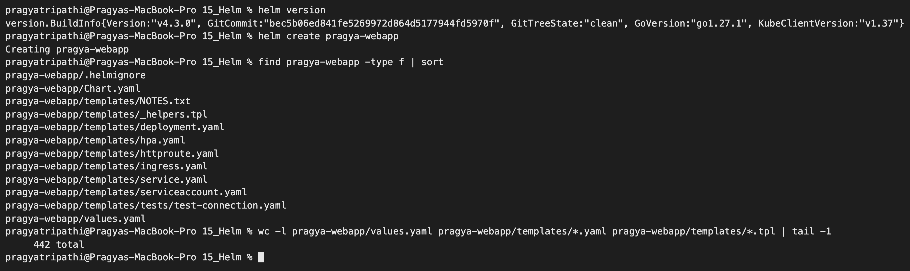

```text
$ helm version
version.BuildInfo{Version:"v4.3.0", GitCommit:"bec5b06ed841fe5269972d864d5177944fd5970f", GitTreeState:"clean", GoVersion:"go1.27.1", KubeClientVersion:"v1.37"}

$ helm create pragya-webapp
Creating pragya-webapp

$ find pragya-webapp -type f | sort
pragya-webapp/.helmignore
pragya-webapp/Chart.yaml
pragya-webapp/templates/NOTES.txt
pragya-webapp/templates/_helpers.tpl
pragya-webapp/templates/deployment.yaml
pragya-webapp/templates/hpa.yaml
pragya-webapp/templates/httproute.yaml
pragya-webapp/templates/ingress.yaml
pragya-webapp/templates/service.yaml
pragya-webapp/templates/serviceaccount.yaml
pragya-webapp/templates/tests/test-connection.yaml
pragya-webapp/values.yaml

$ wc -l pragya-webapp/values.yaml
     161 pragya-webapp/values.yaml
```

The generated skeleton is a full working nginx chart, but it is big (the default `values.yaml` alone is 161 lines with 22 top-level keys such as `podSecurityContext`, `httpRoute`, `autoscaling`, `tolerations`...). The Helm 4 skeleton also contains an empty `charts/` folder and a new `httproute.yaml` (Gateway API) next to `ingress.yaml`.

What each piece is for, and what I did with it:

| Path | Purpose | What I did |
|---|---|---|
| `Chart.yaml` | Who the chart is: name, chart `version`, `appVersion`, type | Rewrote it (section 2) |
| `values.yaml` | Default values for every `{{ .Values.x }}` | Rewrote it, about 50 lines (section 3) |
| `values-dev.yaml`, `values-prod.yaml` | Not generated - my per-environment override files | Added (section 9) |
| `templates/_helpers.tpl` | Named snippets (`define`) re-used with `include`. Files starting with `_` do not produce objects | Kept the standard helpers, added an `image` helper and an environment label |
| `templates/deployment.yaml`, `service.yaml`, `serviceaccount.yaml` | The real Kubernetes objects | Trimmed and adapted |
| `templates/configmap.yaml` | Not generated - my app config + the HTML page | Added |
| `templates/NOTES.txt` | Text printed after install/upgrade (also a template) | Rewrote it |
| `templates/tests/test-connection.yaml` | Pod with the `helm.sh/hook: test` annotation, only runs on `helm test` | Made it check the page content, not just the connection |
| `templates/hpa.yaml`, `ingress.yaml`, `httproute.yaml` | Autoscaler / Ingress / Gateway route, all switched off by default | **Deleted** - not needed for this homework, and less code to read |
| `charts/` | Dependency (sub-)charts go here | Empty, left as it is |
| `.helmignore` | Files to leave out of `helm package` (like `.dockerignore`) | Kept |

Final chart:

```text
pragya-webapp/
├── .helmignore
├── Chart.yaml
├── values.yaml
├── values-dev.yaml
├── values-prod.yaml
├── charts/                        (empty)
└── templates/
    ├── _helpers.tpl
    ├── configmap.yaml             (2 ConfigMaps: env vars + index.html)
    ├── deployment.yaml
    ├── service.yaml
    ├── serviceaccount.yaml
    ├── NOTES.txt
    └── tests/test-connection.yaml
```

The app itself is plain `nginx`; the chart renders an HTML page into a ConfigMap and mounts it over `/usr/share/nginx/html`, so the page shows which release, revision, image and environment is running. That makes every upgrade and rollback visible.

## 2. `Chart.yaml`

[pragya-webapp/Chart.yaml](pragya-webapp/Chart.yaml):

```yaml
apiVersion: v2
name: pragya-webapp
description: Small nginx web page for the Session 15 Helm homework (Pragya Tripathi, 24BCS10032)
type: application
version: 0.1.0
appVersion: "1.27-alpine"
keywords: [nginx, helm-homework]
home: https://github.com/16pragyatripathi/Devops-Assignment-1
maintainers:
  - name: Pragya Tripathi
    email: pragya.24bcs10032@sst.scaler.com
```

| Field | Meaning in my chart |
|---|---|
| `apiVersion: v2` | Chart format for Helm 3+ (v1 was Helm 2) |
| `type: application` | Deployable chart (the other type, `library`, only shares helpers) |
| `version: 0.1.0` | Version of the **chart files**. Should be bumped when templates change |
| `appVersion: "1.27-alpine"` | Version of the **app inside**. My template uses it as the image tag when `image.tag` is empty |

One thing I noticed later: `helm list` / `helm history` show `APP VERSION 1.27-alpine` for every revision even after I upgraded the image to `1.28-alpine` with `--set image.tag`. The column is read from `Chart.yaml`, not from the running image, so it only changes when the chart itself is re-versioned.

## 3. `values.yaml` and how overrides are layered

[pragya-webapp/values.yaml](pragya-webapp/values.yaml) (short version):

```yaml
replicaCount: 2
image:
  repository: nginx
  tag: ""                 # empty -> falls back to .Chart.AppVersion
  pullPolicy: IfNotPresent
app:
  owner: "Pragya Tripathi"
  rollNo: "24BCS10032"
  environment: "default"
  message: "Hello from Helm - first install"
  colour: "#0f766e"
  features: [...]          # list, rendered with range
service: { type: ClusterIP, port: 80 }
serviceAccount: { create: true, name: "" }
resources: { requests: {cpu: 10m, memory: 16Mi}, limits: {cpu: 100m, memory: 64Mi} }
readinessProbe: { httpGet: {path: /, port: http}, periodSeconds: 3 }
```

Priority, lowest to highest: `values.yaml` in the chart → `-f file.yaml` (later files win over earlier) → `--set key=value`. I checked it with `helm template` (no cluster needed):

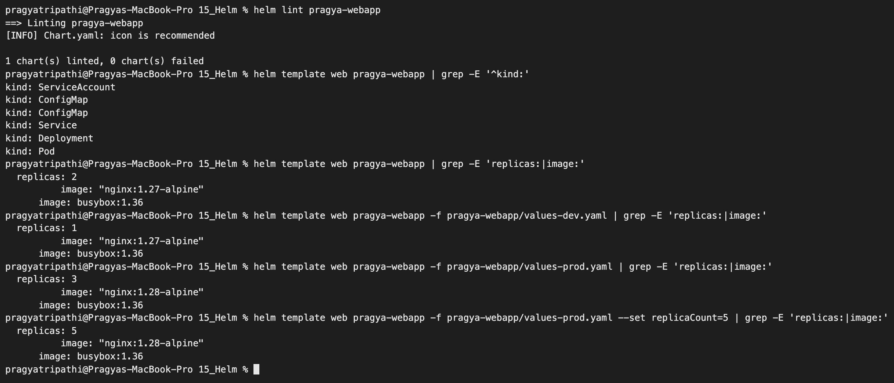

```text
$ helm template web pragya-webapp | grep -E 'replicas:|image:'
  replicas: 2
          image: "nginx:1.27-alpine"
      image: busybox:1.36

$ helm template web pragya-webapp -f pragya-webapp/values-dev.yaml | grep -E 'replicas:|image:'
  replicas: 1
          image: "nginx:1.27-alpine"
      image: busybox:1.36

$ helm template web pragya-webapp -f pragya-webapp/values-prod.yaml | grep -E 'replicas:|image:'
  replicas: 3
          image: "nginx:1.28-alpine"
      image: busybox:1.36

$ helm template web pragya-webapp -f pragya-webapp/values-prod.yaml --set replicaCount=5 | grep -E 'replicas:|image:'
  replicas: 5
          image: "nginx:1.28-alpine"
      image: busybox:1.36
```

- defaults: 2 replicas, and the image tag came from `appVersion` because `image.tag` is empty.
- the prod file changed both replicas and the tag; `--set replicaCount=5` then beat the prod file.
- the `busybox:1.36` line is the `helm test` pod.

## 4. Templates and helpers

Template features I used, with where they are:

| Feature | Example from my chart | Where |
|---|---|---|
| Built-in objects | `{{ .Release.Name }}`, `.Release.Namespace`, `.Release.Revision`, `.Chart.Name`, `.Chart.AppVersion` | `configmap.yaml`, `NOTES.txt` |
| Values | `{{ .Values.replicaCount }}` | `deployment.yaml` |
| Named template + `include` | `{{ include "pragya-webapp.fullname" . }}` | every file |
| Indentation helper | `{{- include "pragya-webapp.labels" . \| nindent 4 }}` | every file |
| `default` | `.Values.image.tag \| default .Chart.AppVersion` | `_helpers.tpl` (`pragya-webapp.image`) |
| `quote` / `squote` / `upper` | `{{ .Values.app.message \| quote }}`, `{{ .Values.app.environment \| upper }}` | `configmap.yaml`, test |
| `if` | `{{- if .Values.serviceAccount.create -}}` and `{{- if eq .Values.app.environment "production" }}` (red banner) | `serviceaccount.yaml`, `configmap.yaml` |
| `with` + `toYaml` | `{{- with .Values.resources }} resources: {{- toYaml . \| nindent 12 }}` | `deployment.yaml` |
| `range` | `{{- range .Values.app.features }}<li>{{ . }}</li>{{- end }}` | `configmap.yaml` |
| checksum trick | `checksum/config: {{ include (print $.Template.BasePath "/configmap.yaml") . \| sha256sum }}` | `deployment.yaml` |

The helpers in [`_helpers.tpl`](pragya-webapp/templates/_helpers.tpl) build the object names and labels in one place:

- `pragya-webapp.fullname` → `<release>-pragya-webapp` (e.g. `web-pragya-webapp`), cut to 63 characters because of the Kubernetes name limit.
- `pragya-webapp.selectorLabels` → only `app.kubernetes.io/name` + `app.kubernetes.io/instance`. Selector labels of a Deployment cannot change after creation, so they must not contain anything that changes on upgrade (like the version).
- `pragya-webapp.labels` → selector labels plus `helm.sh/chart`, version, `managed-by: Helm` and my `environment` label.
- `pragya-webapp.image` → `repository:tag`, with the `appVersion` fallback.

The checksum annotation matters because changing a ConfigMap does **not** restart pods by itself. With the hash of the ConfigMaps in the pod template, a new message gives a new hash, so the Deployment rolls out new pods.

Rendered Deployment (`helm template web pragya-webapp -n s15-helm --show-only templates/deployment.yaml`, trimmed):

```text
---
# Source: pragya-webapp/templates/deployment.yaml
apiVersion: apps/v1
kind: Deployment
metadata:
  name: web-pragya-webapp
  labels:
    helm.sh/chart: pragya-webapp-0.1.0
    app.kubernetes.io/name: pragya-webapp
    app.kubernetes.io/instance: web
    app.kubernetes.io/version: "1.27-alpine"
    app.kubernetes.io/managed-by: Helm
    app.kubernetes.io/environment: default
spec:
  replicas: 2
  selector:
    matchLabels:
      app.kubernetes.io/name: pragya-webapp
      app.kubernetes.io/instance: web
  template:
    metadata:
      annotations:
        # hash of the ConfigMaps: if the message/page changes, this changes,
        # so the pods are rolled automatically on helm upgrade
        checksum/config: 7d2accb62043dc9f87cd59a31ebeec4b5c18587a662a94639cb9d2be36cab914
      ...
    spec:
      serviceAccountName: web-pragya-webapp
      containers:
        - name: pragya-webapp
          image: "nginx:1.27-alpine"
          imagePullPolicy: IfNotPresent
          ...
          envFrom:
            - configMapRef:
                name: web-pragya-webapp-config
          ...
          volumeMounts:
            - name: page
              mountPath: /usr/share/nginx/html
              readOnly: true
      volumes:
        - name: page
          configMap:
            name: web-pragya-webapp-page
```

Every `{{ }}` was replaced. The objects the chart produces:

```text
$ helm template web pragya-webapp | grep -E '^kind:|# Source'
# Source: pragya-webapp/templates/serviceaccount.yaml
kind: ServiceAccount
# Source: pragya-webapp/templates/configmap.yaml
kind: ConfigMap
# Source: pragya-webapp/templates/configmap.yaml
kind: ConfigMap
# Source: pragya-webapp/templates/service.yaml
kind: Service
# Source: pragya-webapp/templates/deployment.yaml
kind: Deployment
# Source: pragya-webapp/templates/tests/test-connection.yaml
kind: Pod
```

## 5. `helm lint` and `helm install --dry-run`

```text
$ helm lint pragya-webapp
==> Linting pragya-webapp
[INFO] Chart.yaml: icon is recommended

1 chart(s) linted, 0 chart(s) failed
```

`[INFO]` is only a suggestion. To see what a real lint failure looks like I broke a **copy** of the chart (outside the repo) twice - first a missing `}` in `service.yaml`, then a `Chart.yaml` without `apiVersion`:

```text
$ helm lint pragya-webapp
==> Linting pragya-webapp
[INFO] Chart.yaml: icon is recommended
[ERROR] templates/: parse error at (pragya-webapp/templates/service.yaml:8): unexpected "}" in operand

Error: 1 chart(s) linted, 1 chart(s) failed

$ helm lint pragya-webapp
==> Linting pragya-webapp
[ERROR] Chart.yaml: apiVersion is required. The value must be either "v1" or "v2"
[INFO] Chart.yaml: icon is recommended
[ERROR] Chart.yaml: chart type is not valid in apiVersion ''. It is valid in apiVersion 'v2'

Error: 1 chart(s) linted, 1 chart(s) failed
```

Both exited with code 1, so lint can be used as a CI gate.

Then a server-side dry run. Unlike `helm template`, this talks to the API server (so it validates against the real cluster) but creates nothing:

```text
$ kubectl create namespace s15-helm
namespace/s15-helm created

$ helm install web pragya-webapp -n s15-helm --dry-run=server | head -30
NAME: web
LAST DEPLOYED: Thu Oct  8 00:02:57 2026
NAMESPACE: s15-helm
STATUS: pending-install
REVISION: 1
DESCRIPTION: Dry run complete
HOOKS:
...

$ helm list -n s15-helm
NAME	NAMESPACE	REVISION	UPDATED	STATUS	CHART	APP VERSION
```

The dry run printed the hooks, all manifests and the NOTES, and `helm list` stayed empty - nothing was installed.

## 6. Install and verify

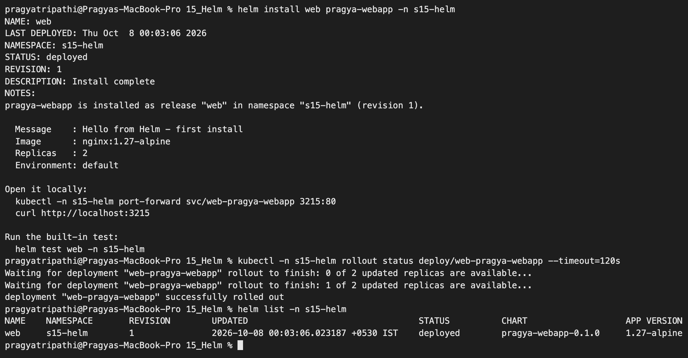

```text
$ helm install web pragya-webapp -n s15-helm
NAME: web
LAST DEPLOYED: Thu Oct  8 00:03:06 2026
NAMESPACE: s15-helm
STATUS: deployed
REVISION: 1
DESCRIPTION: Install complete
NOTES:
pragya-webapp is installed as release "web" in namespace "s15-helm" (revision 1).

  Message    : Hello from Helm - first install
  Image      : nginx:1.27-alpine
  Replicas   : 2
  Environment: default

Open it locally:
  kubectl -n s15-helm port-forward svc/web-pragya-webapp 3215:80
  curl http://localhost:3215

Run the built-in test:
  helm test web -n s15-helm

$ kubectl -n s15-helm rollout status deploy/web-pragya-webapp --timeout=120s
Waiting for deployment "web-pragya-webapp" rollout to finish: 0 of 2 updated replicas are available...
Waiting for deployment "web-pragya-webapp" rollout to finish: 1 of 2 updated replicas are available...
deployment "web-pragya-webapp" successfully rolled out

$ helm list -n s15-helm
NAME	NAMESPACE	REVISION	UPDATED                             	STATUS  	CHART              	APP VERSION
web 	s15-helm 	1       	2026-10-08 00:03:06.023187 +0530 IST	deployed	pragya-webapp-0.1.0	1.27-alpine
```

(Helm 4 prints `helm list` / `helm history` with tab separators, which is why the columns look uneven.)

What the release created, plus Helm's own state secret:

```text
$ kubectl -n s15-helm get deploy,rs,pods,svc,cm,sa,secret -o wide | cut -c1-150
NAME                                READY   UP-TO-DATE   AVAILABLE   AGE   CONTAINERS      IMAGES              SELECTOR
deployment.apps/web-pragya-webapp   2/2     2            2           8s    pragya-webapp   nginx:1.27-alpine   app.kubernetes.io/instance=web,app.kube

NAME                                           DESIRED   CURRENT   READY   AGE   CONTAINERS      IMAGES              SELECTOR
replicaset.apps/web-pragya-webapp-57746b4468   2         2         2       8s    pragya-webapp   nginx:1.27-alpine   app.kubernetes.io/instance=web,ap

NAME                                     READY   STATUS    RESTARTS   AGE   IP            NODE               NOMINATED NODE   READINESS GATES
pod/web-pragya-webapp-57746b4468-7s5qw   1/1     Running   0          8s    10.244.1.69   devops-hw-worker   <none>           <none>
pod/web-pragya-webapp-57746b4468-ggm9p   1/1     Running   0          8s    10.244.1.70   devops-hw-worker   <none>           <none>

NAME                        TYPE        CLUSTER-IP     EXTERNAL-IP   PORT(S)   AGE   SELECTOR
service/web-pragya-webapp   ClusterIP   10.96.167.39   <none>        80/TCP    8s    app.kubernetes.io/instance=web,app.kubernetes.io/name=pragya-weba

NAME                                 DATA   AGE
configmap/kube-root-ca.crt           1      17s
configmap/web-pragya-webapp-config   3      8s
configmap/web-pragya-webapp-page     1      8s

NAME                               AGE
serviceaccount/default             17s
serviceaccount/web-pragya-webapp   8s

NAME                               TYPE                 DATA   AGE
secret/sh.helm.release.v1.web.v1   helm.sh/release.v1   1      8s
```

`sh.helm.release.v1.web.v1` is where Helm 3/4 keeps the release (chart, values and rendered manifest of revision 1, compressed). This replaced Tiller.

Checking the app through a port-forward on host port 3215, the env vars from the ConfigMap, and the chart's test:

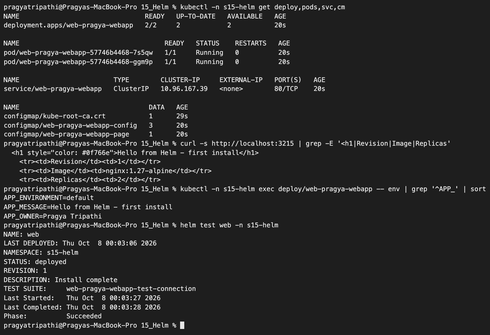

```text
$ kubectl -n s15-helm port-forward svc/web-pragya-webapp 3215:80 &
Forwarding from 127.0.0.1:3215 -> 80

$ curl -s http://localhost:3215 | grep -E '<h1|Revision|Image|Replicas'
  <h1 style="color: #0f766e">Hello from Helm - first install</h1>
    <tr><td>Revision</td><td>1</td></tr>
    <tr><td>Image</td><td>nginx:1.27-alpine</td></tr>
    <tr><td>Replicas</td><td>2</td></tr>

$ kubectl -n s15-helm exec deploy/web-pragya-webapp -- env | grep '^APP_' | sort
APP_ENVIRONMENT=default
APP_MESSAGE=Hello from Helm - first install
APP_OWNER=Pragya Tripathi

$ helm test web -n s15-helm
NAME: web
LAST DEPLOYED: Thu Oct  8 00:03:06 2026
NAMESPACE: s15-helm
STATUS: deployed
REVISION: 1
DESCRIPTION: Install complete
TEST SUITE:     web-pragya-webapp-test-connection
Last Started:   Thu Oct  8 00:03:27 2026
Last Completed: Thu Oct  8 00:03:28 2026
Phase:          Succeeded

$ kubectl -n s15-helm logs web-pragya-webapp-test-connection
Hello from Helm - first install
```

My test pod does `wget` on the Service and `grep`s for the configured message, so it fails if the Service is wrong **or** if the wrong page is being served.

The page in a browser (revision 1):

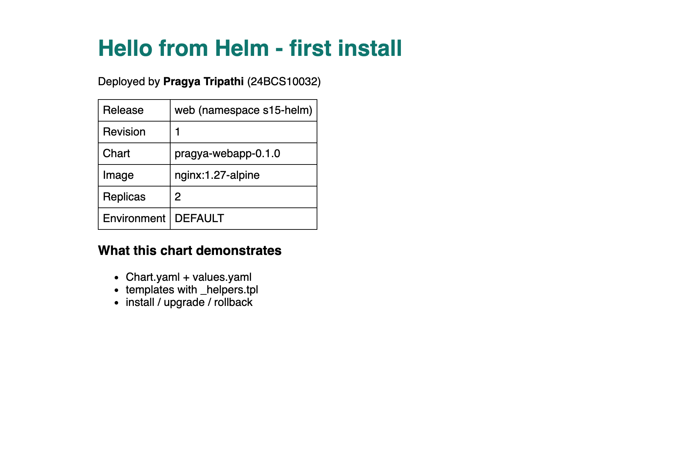

`helm get values` shows only what I supplied (nothing yet); `--all` shows the merged values:

```text
$ helm get values web -n s15-helm
USER-SUPPLIED VALUES:
null

$ helm get values web -n s15-helm --all | head -20     (first 12 lines shown)
COMPUTED VALUES:
app:
  colour: '#0f766e'
  environment: default
  features:
  - Chart.yaml + values.yaml
  - templates with _helpers.tpl
  - install / upgrade / rollback
  message: Hello from Helm - first install
  owner: Pragya Tripathi
  rollNo: 24BCS10032
fullnameOverride: ""
```

## 7. Upgrades and `helm history`

### Revision 2: more replicas and a new message (`--set`)

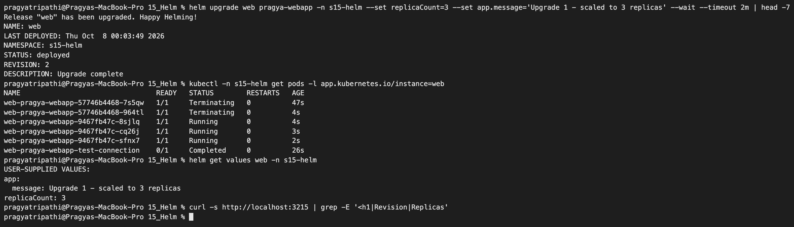

```text
$ helm upgrade web pragya-webapp -n s15-helm --set replicaCount=3 --set app.message='Upgrade 1 - scaled to 3 replicas' --wait --timeout 2m | head -7
Release "web" has been upgraded. Happy Helming!
NAME: web
LAST DEPLOYED: Thu Oct  8 00:03:49 2026
NAMESPACE: s15-helm
STATUS: deployed
REVISION: 2
DESCRIPTION: Upgrade complete

$ kubectl -n s15-helm get pods -l app.kubernetes.io/instance=web
NAME                                 READY   STATUS        RESTARTS   AGE
web-pragya-webapp-57746b4468-7s5qw   1/1     Terminating   0          47s
web-pragya-webapp-57746b4468-964tl   1/1     Terminating   0          4s
web-pragya-webapp-9467fb47c-8sjlq    1/1     Running       0          4s
web-pragya-webapp-9467fb47c-cq26j    1/1     Running       0          3s
web-pragya-webapp-9467fb47c-sfnx7    1/1     Running       0          2s
web-pragya-webapp-test-connection    0/1     Completed     0          26s

$ helm get values web -n s15-helm
USER-SUPPLIED VALUES:
app:
  message: Upgrade 1 - scaled to 3 replicas
replicaCount: 3

$ curl -s http://localhost:3215 | grep -E '<h1|Revision|Replicas'

```

- Only the message and replica count changed, but **all** pods were replaced (new ReplicaSet hash `9467fb47c`). That is the checksum annotation doing its job: new message → new ConfigMap hash → new pod template.
- The `curl` printed nothing. The port-forward log explained why:

  ```text
  E1008 00:03:53.100408   39019 portforward.go:522] "Unhandled Error" err="an error occurred forwarding 3215 -> 80: error forwarding port 80 to pod 1323fca5..., uid : failed to execute portforward in network namespace ...: failed to connect to localhost:80 inside namespace ...: connect: connection refused "
  error: lost connection to pod
  ```

  `kubectl port-forward svc/...` does not really go through the Service; it picks **one pod** behind it and sticks to it. When the upgrade deleted that pod, the forward died. I restarted it in a small `while true; do kubectl port-forward ...; done` loop and, for the rest of the terminal checks, used a `busybox` pod inside the namespace (`kubectl run curl --image=busybox:1.36 -- sleep 36000`) that talks to the real Service. After restarting:

  ```text
  $ curl -s http://localhost:3215 | grep -E '<h1|Revision|Replicas'
    <h1 style="color: #0f766e">Upgrade 1 - scaled to 3 replicas</h1>
      <tr><td>Revision</td><td>2</td></tr>
      <tr><td>Replicas</td><td>3</td></tr>
  ```

### A trap: `helm upgrade` forgets earlier `--set` values

Before the next upgrade I did two server dry-runs that only change the image tag:

```text
$ helm upgrade web pragya-webapp -n s15-helm --set image.tag=1.28-alpine --dry-run=server | grep -E "replicas:|<h1"
      <h1 style="color: #0f766e">Hello from Helm - first install</h1>
  replicas: 2

$ helm upgrade web pragya-webapp -n s15-helm --reuse-values --set image.tag=1.28-alpine --dry-run=server | grep -E "replicas:|<h1"
      <h1 style="color: #0f766e">Upgrade 1 - scaled to 3 replicas</h1>
  replicas: 3
```

Without `--reuse-values`, an upgrade starts again from the chart's `values.yaml` plus only the flags on **this** command, so my 3 replicas and message from revision 2 would have silently gone back to 2 and the default message. `--reuse-values` keeps the previous release's values. (This is a good reason to keep environment settings in values files in Git rather than in `--set` flags.)

### Revision 3: new image tag

```text
$ helm upgrade web pragya-webapp -n s15-helm --reuse-values --set image.tag=1.28-alpine --set app.message='Upgrade 2 - nginx 1.28-alpine' --wait --timeout 2m | head -7
Release "web" has been upgraded. Happy Helming!
NAME: web
LAST DEPLOYED: Thu Oct  8 00:04:28 2026
NAMESPACE: s15-helm
STATUS: deployed
REVISION: 3
DESCRIPTION: Upgrade complete
```

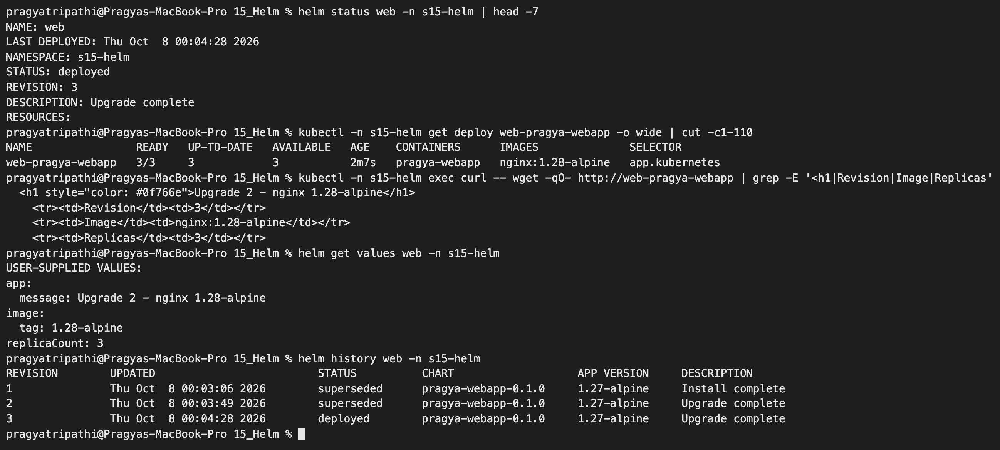

```text
$ kubectl -n s15-helm get deploy web-pragya-webapp -o wide | cut -c1-110
NAME                READY   UP-TO-DATE   AVAILABLE   AGE    CONTAINERS      IMAGES              SELECTOR
web-pragya-webapp   3/3     3            3           2m7s   pragya-webapp   nginx:1.28-alpine   app.kubernetes

$ kubectl -n s15-helm exec curl -- wget -qO- http://web-pragya-webapp | grep -E '<h1|Revision|Image|Replicas'
  <h1 style="color: #0f766e">Upgrade 2 - nginx 1.28-alpine</h1>
    <tr><td>Revision</td><td>3</td></tr>
    <tr><td>Image</td><td>nginx:1.28-alpine</td></tr>
    <tr><td>Replicas</td><td>3</td></tr>

$ helm get values web -n s15-helm
USER-SUPPLIED VALUES:
app:
  message: Upgrade 2 - nginx 1.28-alpine
image:
  tag: 1.28-alpine
replicaCount: 3

$ helm history web -n s15-helm
REVISION	UPDATED                 	STATUS    	CHART              	APP VERSION	DESCRIPTION
1       	Thu Oct  8 00:03:06 2026	superseded	pragya-webapp-0.1.0	1.27-alpine	Install complete
2       	Thu Oct  8 00:03:49 2026	superseded	pragya-webapp-0.1.0	1.27-alpine	Upgrade complete
3       	Thu Oct  8 00:04:28 2026	deployed  	pragya-webapp-0.1.0	1.27-alpine	Upgrade complete
```

`replicaCount: 3` survived because of `--reuse-values`. Only one revision is `deployed`; older ones become `superseded`.

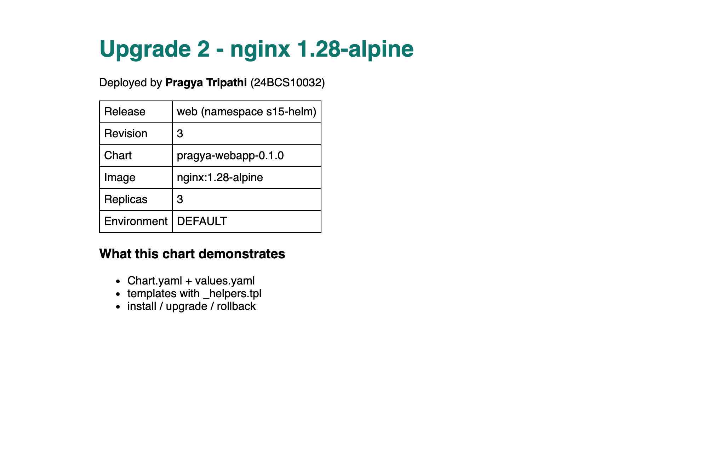

## 8. A broken upgrade, then rollback

### Revision 4: image tag that does not exist

```text
$ helm upgrade web pragya-webapp -n s15-helm --reuse-values --set image.tag=9.9.9-doesnotexist --set app.message='Upgrade 3 - broken image tag' | head -7
Release "web" has been upgraded. Happy Helming!
NAME: web
LAST DEPLOYED: Thu Oct  8 00:05:28 2026
NAMESPACE: s15-helm
STATUS: deployed
REVISION: 4
DESCRIPTION: Upgrade complete
```

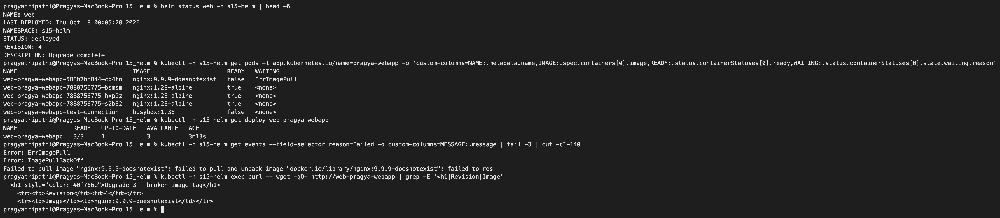

```text
$ helm status web -n s15-helm | head -6
NAME: web
LAST DEPLOYED: Thu Oct  8 00:05:28 2026
NAMESPACE: s15-helm
STATUS: deployed
REVISION: 4
DESCRIPTION: Upgrade complete

$ kubectl -n s15-helm get pods -l app.kubernetes.io/name=pragya-webapp -o 'custom-columns=NAME:.metadata.name,IMAGE:.spec.containers[0].image,READY:.status.containerStatuses[0].ready,WAITING:.status.containerStatuses[0].state.waiting.reason'
NAME                                 IMAGE                      READY   WAITING
web-pragya-webapp-588b7bf844-cq4tn   nginx:9.9.9-doesnotexist   false   ErrImagePull
web-pragya-webapp-7888756775-bsmsm   nginx:1.28-alpine          true    <none>
web-pragya-webapp-7888756775-hxp9z   nginx:1.28-alpine          true    <none>
web-pragya-webapp-7888756775-s2b82   nginx:1.28-alpine          true    <none>
web-pragya-webapp-test-connection    busybox:1.36               false   <none>

$ kubectl -n s15-helm get deploy web-pragya-webapp
NAME                READY   UP-TO-DATE   AVAILABLE   AGE
web-pragya-webapp   3/3     1            3           3m13s

$ kubectl -n s15-helm get events --field-selector reason=Failed -o custom-columns=MESSAGE:.message | grep 'Failed to pull'
Failed to pull image "nginx:9.9.9-doesnotexist": failed to pull and unpack image "docker.io/library/nginx:9.9.9-doesnotexist": failed to resolve reference "docker.io/library/nginx:9.9.9-doesnotexist": failed to do request: Head "https://registry-1.docker.io/v2/library/nginx/manifests/9.9.9-doesnotexist": dial tcp: lookup registry-1.docker.io on 192.168.65.254:53: server misbehaving

$ kubectl -n s15-helm exec curl -- wget -qO- http://web-pragya-webapp | grep -E '<h1|Revision|Image'
  <h1 style="color: #0f766e">Upgrade 3 - broken image tag</h1>
    <tr><td>Revision</td><td>4</td></tr>
    <tr><td>Image</td><td>nginx:9.9.9-doesnotexist</td></tr>
```

**What Helm reported vs what the cluster actually did:**

- Helm said `STATUS: deployed`, `Upgrade complete`, "Happy Helming!". Without `--wait`, Helm 4 uses the `hookOnly` wait strategy: it only checks that the API server **accepted** the new objects, not that the pods became healthy.
- In reality the new pod is stuck in `ErrImagePull` / `ImagePullBackOff`. (In my run the pull failed even earlier than "tag not found": the node's DNS lookup of `registry-1.docker.io` failed at that moment - Docker Hub was flaky on my network all day, see "Problems" below. Either way, the image can never be pulled.)
- The app did **not** go down: the rolling update made one new pod (`maxSurge`), saw it never became Ready, and so never removed any of the three `1.28-alpine` pods (`READY 3/3`, `UP-TO-DATE 1`).
- But the page **content** was already wrong: the old, healthy pods were serving "Upgrade 3 - broken image tag / Revision 4". Helm updated the `web-pragya-webapp-page` ConfigMap in place, and the kubelet refreshes ConfigMap volumes inside **already running** pods. So a bad upgrade can be half-applied: config from revision 4, binary from revision 3.

### `helm rollback` to revision 3

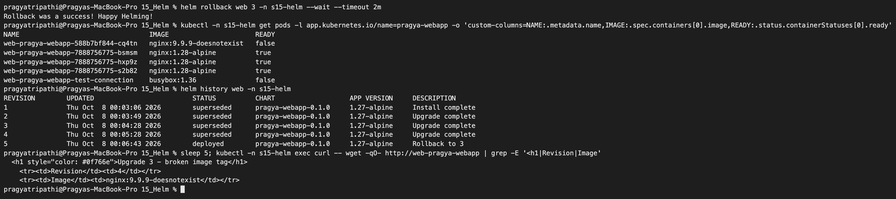

```text
$ helm rollback web 3 -n s15-helm --wait --timeout 2m
Rollback was a success! Happy Helming!

$ helm history web -n s15-helm
REVISION	UPDATED                 	STATUS    	CHART              	APP VERSION	DESCRIPTION
1       	Thu Oct  8 00:03:06 2026	superseded	pragya-webapp-0.1.0	1.27-alpine	Install complete
2       	Thu Oct  8 00:03:49 2026	superseded	pragya-webapp-0.1.0	1.27-alpine	Upgrade complete
3       	Thu Oct  8 00:04:28 2026	superseded	pragya-webapp-0.1.0	1.27-alpine	Upgrade complete
4       	Thu Oct  8 00:05:28 2026	superseded	pragya-webapp-0.1.0	1.27-alpine	Upgrade complete
5       	Thu Oct  8 00:06:43 2026	deployed  	pragya-webapp-0.1.0	1.27-alpine	Rollback to 3

$ sleep 5; kubectl -n s15-helm exec curl -- wget -qO- http://web-pragya-webapp | grep -E '<h1|Revision|Image'
  <h1 style="color: #0f766e">Upgrade 3 - broken image tag</h1>
    <tr><td>Revision</td><td>4</td></tr>
    <tr><td>Image</td><td>nginx:9.9.9-doesnotexist</td></tr>
```

- A rollback is **not** an undo of history: it created a **new revision 5** whose description is `Rollback to 3`. Revision 4 stays in the list as a record.
- Right after the rollback the page still said revision 4. The ConfigMap object was already correct:

  ```text
  $ kubectl -n s15-helm get cm web-pragya-webapp-page -o jsonpath='{.data.index\.html}' | grep -E '<h1|Revision'
    <h1 style="color: #0f766e">Upgrade 2 - nginx 1.28-alpine</h1>
      <tr><td>Revision</td><td>3</td></tr>
  ```

  but the files mounted inside the pods are refreshed by the kubelet on its own sync loop, so they lag behind for a short time. When I polled the Service every 15 s afterwards, it was already back to revision 3 at the first check:

  ```text
  t+15s:     <tr><td>Revision</td><td>3</td></tr>
  t+30s:     <tr><td>Revision</td><td>3</td></tr>
  ...
  t+120s:    <tr><td>Revision</td><td>3</td></tr>
  ```

- The page says "Revision 3" although Helm's current revision is 5. That is correct: a rollback re-applies the **stored, already-rendered manifest** of revision 3, and `.Release.Revision` was baked in as 3 when that manifest was rendered.

After the rollback everything is healthy again and the test passes:

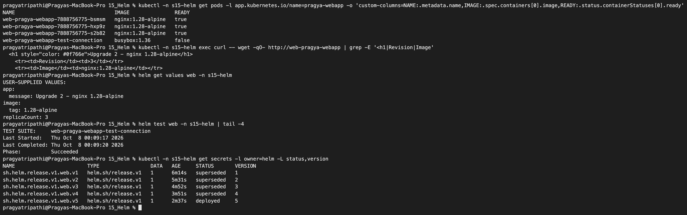

```text
$ kubectl -n s15-helm get pods -l app.kubernetes.io/name=pragya-webapp -o 'custom-columns=NAME:.metadata.name,IMAGE:.spec.containers[0].image,READY:.status.containerStatuses[0].ready'
NAME                                 IMAGE               READY
web-pragya-webapp-7888756775-bsmsm   nginx:1.28-alpine   true
web-pragya-webapp-7888756775-hxp9z   nginx:1.28-alpine   true
web-pragya-webapp-7888756775-s2b82   nginx:1.28-alpine   true
web-pragya-webapp-test-connection    busybox:1.36        false

$ helm get values web -n s15-helm
USER-SUPPLIED VALUES:
app:
  message: Upgrade 2 - nginx 1.28-alpine
image:
  tag: 1.28-alpine
replicaCount: 3

$ helm test web -n s15-helm | tail -4
TEST SUITE:     web-pragya-webapp-test-connection
Last Started:   Thu Oct  8 00:09:17 2026
Last Completed: Thu Oct  8 00:09:20 2026
Phase:          Succeeded

$ kubectl -n s15-helm get secrets -l owner=helm -L status,version
NAME                        TYPE                 DATA   AGE     STATUS       VERSION
sh.helm.release.v1.web.v1   helm.sh/release.v1   1      6m14s   superseded   1
sh.helm.release.v1.web.v2   helm.sh/release.v1   1      5m31s   superseded   2
sh.helm.release.v1.web.v3   helm.sh/release.v1   1      4m52s   superseded   3
sh.helm.release.v1.web.v4   helm.sh/release.v1   1      3m51s   superseded   4
sh.helm.release.v1.web.v5   helm.sh/release.v1   1      2m37s   deployed     5
```

The ReplicaSet `7888756775` (the 1.28 one) was simply scaled back as the active one; the broken `588b7bf844` ReplicaSet went to 0. One secret per revision is what makes rollback possible - and it is also where you look (`kubectl get secrets -l owner=helm`) if a release ever gets stuck in `pending-upgrade`.

### Doing it safely: `--rollback-on-failure` (Helm 4's name for `--atomic`)

The same broken tag again, but this time asking Helm to wait for readiness and roll back on its own:

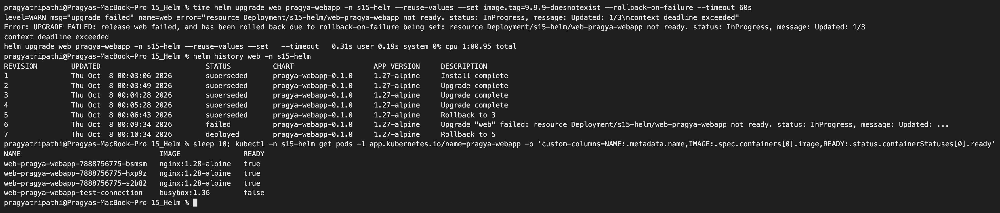

```text
$ time helm upgrade web pragya-webapp -n s15-helm --reuse-values --set image.tag=9.9.9-doesnotexist --rollback-on-failure --timeout 60s
level=WARN msg="upgrade failed" name=web error="resource Deployment/s15-helm/web-pragya-webapp not ready. status: InProgress, message: Updated: 1/3\ncontext deadline exceeded"
Error: UPGRADE FAILED: release web failed, and has been rolled back due to rollback-on-failure being set: resource Deployment/s15-helm/web-pragya-webapp not ready. status: InProgress, message: Updated: 1/3
context deadline exceeded
helm upgrade web pragya-webapp -n s15-helm --reuse-values --set   --timeout   0.31s user 0.19s system 0% cpu 1:00.95 total

$ helm history web -n s15-helm
REVISION	UPDATED                 	STATUS    	CHART              	APP VERSION	DESCRIPTION
...
5       	Thu Oct  8 00:06:43 2026	superseded	pragya-webapp-0.1.0	1.27-alpine	Rollback to 3
6       	Thu Oct  8 00:09:34 2026	failed    	pragya-webapp-0.1.0	1.27-alpine	Upgrade "web" failed: resource Deployment/s15-helm/web-pragya-webapp not ready. status: InProgress, message: Updated: ...
7       	Thu Oct  8 00:10:34 2026	deployed  	pragya-webapp-0.1.0	1.27-alpine	Rollback to 5

$ sleep 10; kubectl -n s15-helm get pods -l app.kubernetes.io/name=pragya-webapp -o 'custom-columns=NAME:.metadata.name,IMAGE:.spec.containers[0].image,READY:.status.containerStatuses[0].ready'
NAME                                 IMAGE               READY
web-pragya-webapp-7888756775-bsmsm   nginx:1.28-alpine   true
web-pragya-webapp-7888756775-hxp9z   nginx:1.28-alpine   true
web-pragya-webapp-7888756775-s2b82   nginx:1.28-alpine   true
web-pragya-webapp-test-connection    busybox:1.36        false
```

This time Helm told the truth: it waited the full 60 s (`1:00.95 total`), saw the Deployment stuck at `Updated: 1/3`, marked revision 6 as `failed`, and automatically created revision 7 = `Rollback to 5`. The command exits non-zero, which is exactly what a CI/CD pipeline needs. In Helm 4, `--rollback-on-failure` turns on `--wait=watcher` by itself.

## 9. One chart, two environments (`values-dev.yaml` / `values-prod.yaml`)

[values-dev.yaml](pragya-webapp/values-dev.yaml): 1 replica, `development`, blue title, small limits.
[values-prod.yaml](pragya-webapp/values-prod.yaml): 3 replicas, image pinned to `1.28-alpine`, `production` (which also switches on the red banner through an `if` in the template), bigger limits.

I installed the same chart twice with `helm upgrade --install` (installs if missing, upgrades if present - the form recommended for pipelines), each in its own namespace:

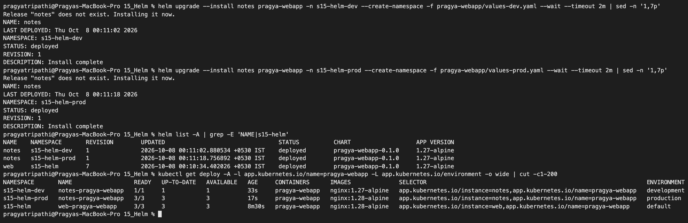

```text
$ helm upgrade --install notes pragya-webapp -n s15-helm-dev --create-namespace -f pragya-webapp/values-dev.yaml --wait --timeout 2m | sed -n '1,7p'
Release "notes" does not exist. Installing it now.
NAME: notes
LAST DEPLOYED: Thu Oct  8 00:11:02 2026
NAMESPACE: s15-helm-dev
STATUS: deployed
REVISION: 1
DESCRIPTION: Install complete

$ helm upgrade --install notes pragya-webapp -n s15-helm-prod --create-namespace -f pragya-webapp/values-prod.yaml --wait --timeout 2m | sed -n '1,7p'
Release "notes" does not exist. Installing it now.
NAME: notes
LAST DEPLOYED: Thu Oct  8 00:11:18 2026
NAMESPACE: s15-helm-prod
STATUS: deployed
REVISION: 1
DESCRIPTION: Install complete

$ helm list -A | grep -E 'NAME|s15-helm'
NAME 	NAMESPACE    	REVISION	UPDATED                             	STATUS  	CHART              	APP VERSION
notes	s15-helm-dev 	1       	2026-10-08 00:11:02.880534 +0530 IST	deployed	pragya-webapp-0.1.0	1.27-alpine
notes	s15-helm-prod	1       	2026-10-08 00:11:18.756892 +0530 IST	deployed	pragya-webapp-0.1.0	1.27-alpine
web  	s15-helm     	7       	2026-10-08 00:10:34.402026 +0530 IST	deployed	pragya-webapp-0.1.0	1.27-alpine

$ kubectl get deploy -A -l app.kubernetes.io/name=pragya-webapp -L app.kubernetes.io/environment -o wide | cut -c1-200
NAMESPACE       NAME                  READY   UP-TO-DATE   AVAILABLE   AGE     CONTAINERS      IMAGES              SELECTOR                                                                ENVIRONMENT
s15-helm-dev    notes-pragya-webapp   1/1     1            1           33s     pragya-webapp   nginx:1.27-alpine   app.kubernetes.io/instance=notes,app.kubernetes.io/name=pragya-webapp   development
s15-helm-prod   notes-pragya-webapp   3/3     3            3           17s     pragya-webapp   nginx:1.28-alpine   app.kubernetes.io/instance=notes,app.kubernetes.io/name=pragya-webapp   production
s15-helm        web-pragya-webapp     3/3     3            3           8m30s   pragya-webapp   nginx:1.28-alpine   app.kubernetes.io/instance=web,app.kubernetes.io/name=pragya-webapp     default
```

The same release name `notes` exists twice without conflict because a release name only has to be unique **inside a namespace**.

```text
$ curl -s localhost:3217 | grep -E '<h1|Environment|Replicas'        # dev, port-forward 3217
  <h1 style="color: #2563eb">pragya-webapp running in DEV</h1>
    <tr><td>Replicas</td><td>1</td></tr>
    <tr><td>Environment</td><td>DEVELOPMENT</td></tr>

$ curl -s localhost:3216 | grep -E '<h1|PRODUCTION|Environment|Replicas'   # prod, port-forward 3216
  <h1 style="color: #b91c1c">pragya-webapp running in PROD</h1>
  <p style="background:#fee2e2; padding:8px;"><b>PRODUCTION</b> - handle with care</p>
    <tr><td>Replicas</td><td>3</td></tr>
    <tr><td>Environment</td><td>PRODUCTION</td></tr>
```

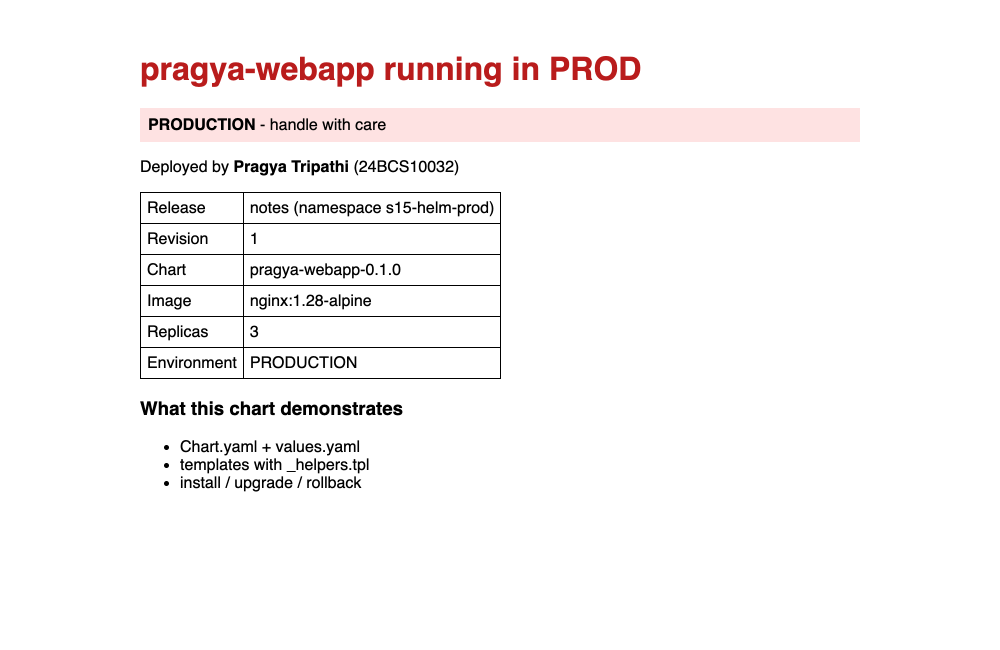

## 10. Packaging the chart

```text
$ helm package pragya-webapp -d <scratch dir>
Successfully packaged chart and saved it to: <scratch dir>/pragya-webapp-0.1.0.tgz

$ tar -tzf <scratch dir>/pragya-webapp-0.1.0.tgz
pragya-webapp/Chart.yaml
pragya-webapp/values.yaml
pragya-webapp/templates/NOTES.txt
pragya-webapp/templates/_helpers.tpl
pragya-webapp/templates/configmap.yaml
pragya-webapp/templates/deployment.yaml
pragya-webapp/templates/service.yaml
pragya-webapp/templates/serviceaccount.yaml
pragya-webapp/templates/tests/test-connection.yaml
pragya-webapp/.helmignore
pragya-webapp/values-dev.yaml
pragya-webapp/values-prod.yaml
```

(I wrote the package outside the repo and shortened that path above; `*.tgz` is in this folder's `.gitignore`.) The file name comes from `name` + `version` in `Chart.yaml`, which is why the chart version must be bumped for every change you publish. This `.tgz` is what a chart repository (or an OCI registry) serves when someone runs `helm install <repo>/<chart>`.

## 11. Uninstall and clean up

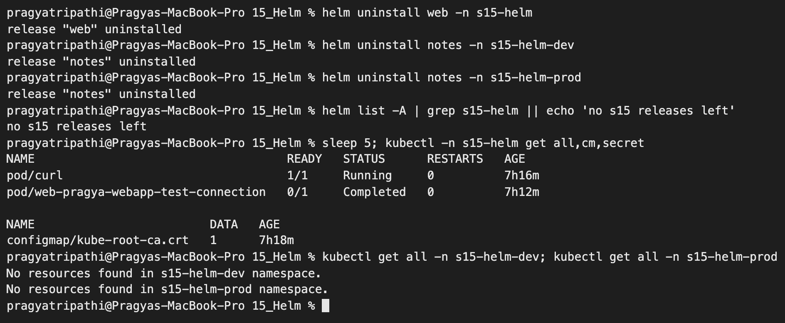

```text
$ helm uninstall web -n s15-helm
release "web" uninstalled
$ helm uninstall notes -n s15-helm-dev
release "notes" uninstalled
$ helm uninstall notes -n s15-helm-prod
release "notes" uninstalled

$ helm list -A | grep s15-helm || echo 'no s15 releases left'
no s15 releases left

$ kubectl -n s15-helm get all,cm,secret
NAME                                    READY   STATUS      RESTARTS   AGE
pod/curl                                1/1     Running     0          7h16m
pod/web-pragya-webapp-test-connection   0/1     Completed   0          7h12m

NAME                         DATA   AGE
configmap/kube-root-ca.crt   1      7h18m

$ kubectl get all -n s15-helm-dev; kubectl get all -n s15-helm-prod
No resources found in s15-helm-dev namespace.
No resources found in s15-helm-prod namespace.

$ kubectl delete namespace s15-helm s15-helm-dev s15-helm-prod --wait=true --timeout=120s
namespace "s15-helm" deleted
namespace "s15-helm-dev" deleted
namespace "s15-helm-prod" deleted
```

`helm uninstall` removed the Deployment, ReplicaSets, Service, both ConfigMaps, the ServiceAccount **and all 7 release secrets** (so the history is gone too). Two pods were left behind, and both make sense:

- `curl` - I created it with `kubectl run`, so Helm never knew about it.
- `web-pragya-webapp-test-connection` - test pods are **hooks**, not normal release resources. My hook only has `hook-delete-policy: before-hook-creation` (delete the old one before the next `helm test`), so nothing deletes it on uninstall. Adding `hook-succeeded` to the policy would remove it right after a passing test.

Deleting my three namespaces cleaned up the rest. The (7 h) ages are because the session was paused overnight between the tests and the clean-up.

---

## Problems I hit

| Problem | Cause | Fix |
|---|---|---|
| `docker pull nginx:1.27-alpine` failed with `TLS handshake timeout` against `auth.docker.io` | Docker Hub was slow / unreachable from my network | Pulled the same official images through Google's Docker Hub mirror (`mirror.gcr.io/library/nginx:1.27-alpine`, `...:1.28-alpine`, `busybox:1.36`), re-tagged them as `nginx:...` / `busybox:...` and loaded them into kind |
| `kind load docker-image` failed: `ctr: content digest sha256:...: not found` | kind imports with `--all-platforms`, but my local image only had the arm64 layers of the multi-arch image | `docker save --platform linux/arm64 -o img.tar <image>` then `kind load image-archive img.tar --name devops-hw`. With `imagePullPolicy: IfNotPresent` the pods then started without touching Docker Hub |
| `curl localhost:3215` empty after an upgrade | `port-forward` is bound to one pod, which the rollout deleted | Restart loop for the browser, in-cluster `busybox` pod for terminal checks |
| `zsh: no matches found: custom-columns=...[0]...` | zsh treats `[0]` as a glob | Quote the whole `-o '...'` argument |

## Command reference

| Command | What it does |
|---|---|
| `helm create <name>` | Generate a chart skeleton |
| `helm lint <chart> [-f vals]` | Static checks of chart + templates (exit 1 on error) |
| `helm template <rel> <chart> [-f] [--set] [--show-only file]` | Render YAML locally, no cluster |
| `helm install <rel> <chart> -n <ns> --dry-run=server` | Render and validate against the API server, create nothing |
| `helm install <rel> <chart> -n <ns> [--create-namespace]` | Create a release (revision 1) |
| `helm upgrade <rel> <chart> --set k=v [--reuse-values]` | New revision; without `--reuse-values` previous `--set` values are dropped |
| `helm upgrade --install ...` | Install or upgrade - idempotent, good for CI |
| `helm upgrade ... --wait [--rollback-on-failure] --timeout 60s` | Wait for readiness; roll back automatically on failure (was `--atomic`) |
| `helm list [-A]`, `helm status <rel>` | Releases / one release's state |
| `helm get values <rel> [--all]`, `helm get manifest <rel>` | What was supplied / what was applied |
| `helm history <rel>` | All revisions |
| `helm rollback <rel> <rev>` | Re-apply an old revision as a **new** revision |
| `helm test <rel>` | Run the chart's `helm.sh/hook: test` pods |
| `helm package <chart>` | Build `<name>-<version>.tgz` |
| `helm uninstall <rel>` | Delete release resources and its history secrets |

## What I understood

- A chart is just templated YAML plus defaults; the real skill is deciding **what goes into values** (things that differ per environment or per release) and keeping the templates boring and generic. Trimming the `helm create` skeleton down to what I actually use made the chart much easier to reason about.
- `_helpers.tpl` keeps names and labels consistent across every object. Selector labels must stay stable forever; everything that changes (version, environment) only goes into the normal labels.
- `helm template` and `helm lint` catch most mistakes before anything touches the cluster; `--dry-run=server` adds the API-server validation.
- Values priority is `values.yaml` < `-f` files < `--set`, and **each upgrade starts from the chart defaults again unless `--reuse-values` is given**. Keeping per-environment values in files (as with my dev/prod files) avoids that whole class of surprise.
- A plain `helm upgrade` only means "Kubernetes accepted the objects". My broken upgrade was reported as `deployed` while a pod was in `ErrImagePull`. The rolling update protected availability, but the ConfigMap change still leaked into the old pods. `--wait` / `--rollback-on-failure` makes Helm actually check health and undo the change itself.
- `helm rollback` writes a new revision from an old stored manifest; history is never rewritten, and it all lives in `sh.helm.release.v1.<release>.v<N>` Secrets in the release namespace.
- `helm test` turns "it deployed" into "it works": my test fails unless the page served through the Service contains the configured message.
