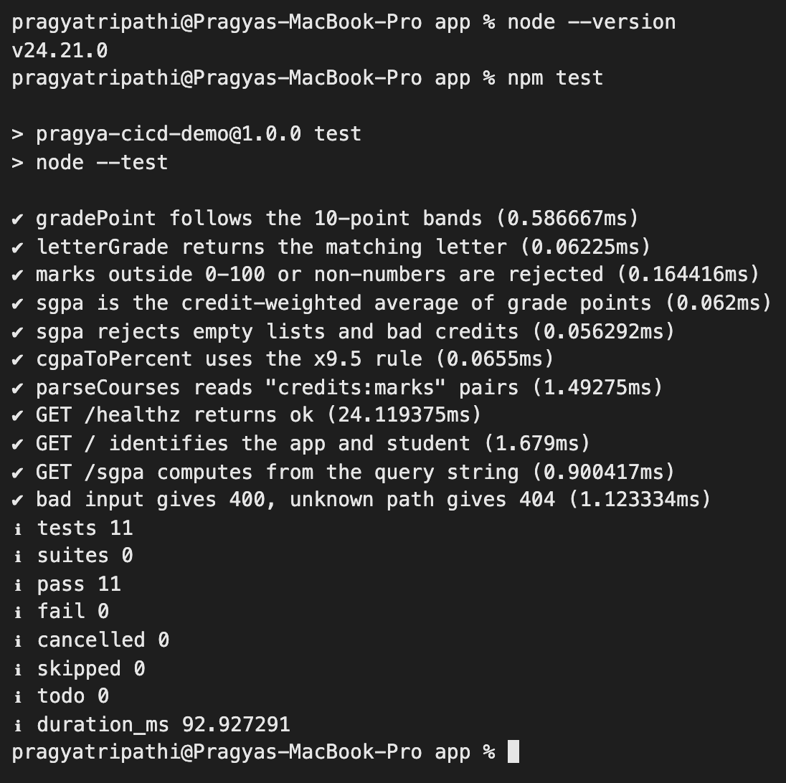
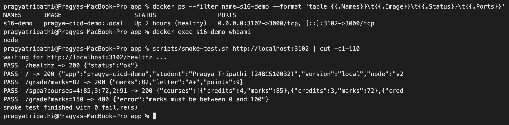
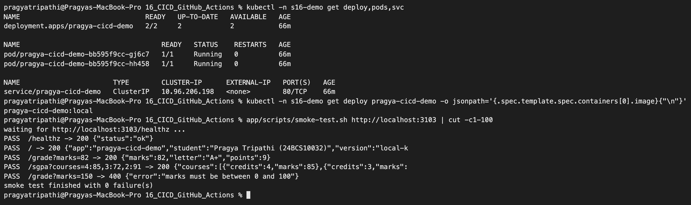
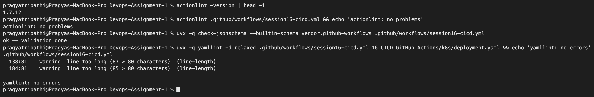

# CI/CD & GitHub Actions – Homework

**Name:** Pragya Tripathi
**Roll No:** 24BCS10032

For this session I wrote a small Node.js API, tests for it, a Dockerfile, a Kubernetes manifest and a complete GitHub Actions pipeline that tests it, packages it, pushes an image to GitHub Container Registry (GHCR) and deploys it to a Kubernetes cluster. The class repo ([session-16-github-actions](https://github.com/Nency-Ravaliya/devops-heros/tree/main/session-16-github-actions)) uses a Python calculator; I used Node so that the tests need nothing except Node itself (`node --test`).

Everything below the "Pipeline run on GitHub" section was run on my Mac and the outputs are copied from my terminal.

| Path | What it is |
|---|---|
| [app/src/gpa.js](app/src/gpa.js) | Pure functions: grade point and letter for marks, SGPA (credit-weighted), CGPA → % |
| [app/src/server.js](app/src/server.js) | HTTP API on the Node standard library: `/`, `/healthz`, `/readyz`, `/grade`, `/sgpa`, `/percent` |
| [app/test/](app/test) | 7 unit tests + 4 integration tests (the integration tests start the real server on a random port) |
| [app/scripts/smoke-test.sh](app/scripts/smoke-test.sh) | Calls a running copy of the API and checks real responses. The same script is used in CI, against Docker and after the k8s deploy |
| [app/Dockerfile](app/Dockerfile) | Two stages: stage 1 runs the tests, stage 2 is the small runtime image (non-root `node` user, health check) |
| [k8s/deployment.yaml](k8s/deployment.yaml) | Deployment (2 replicas, probes, limits) + ClusterIP Service. `IMAGE_PLACEHOLDER` is filled in by the CD job |
| [../.github/workflows/session16-cicd.yml](../.github/workflows/session16-cicd.yml) | The pipeline |

---

## CI vs CD (in my own words)

| | Continuous Integration | Continuous Delivery | Continuous Deployment |
|---|---|---|---|
| Goal | Find out quickly if a change broke something | Every green build is *ready* to release | Every green build *is* released |
| Runs on | Every push / pull request | After CI passes | After CI passes |
| Typical steps | checkout, install, lint, test, build | package, push image, deploy to staging | same, but all the way to production |
| Human needed? | No | Yes, someone presses "deploy" | No |
| In my pipeline | `Test (Node 22)`, `Test (Node 24)`, `Build artifact` | `Build & push image (GHCR)` | `Deploy to kind (ephemeral)` |

The deploy job uses `environment: kind-ephemeral`. If I add a "required reviewer" rule to that environment in the repo settings, GitHub pauses before the job and waits for approval, which turns continuous deployment back into continuous delivery without touching the YAML.

## The pipeline

```text
                 push to main / pull request (only if 16_CICD_GitHub_Actions/** or this workflow changed)
                 or "Run workflow" button (workflow_dispatch)
                                     │
            ┌────────────────────────┴────────────────────────┐
            ▼                                                 ▼
   Test (Node 22)                                     Test (Node 24)          ← matrix, run in parallel
   npm test + smoke test                              npm test + smoke test
            └────────────────────────┬────────────────────────┘
                                     ▼
                              Build artifact                                   ← npm pack + build-info.txt, uploaded
                                     ▼
                       Build & push image (GHCR)                               ← not on pull requests
                       ghcr.io/16pragyatripathi/pragya-cicd-demo:<sha7> + :latest (amd64 + arm64)
                                     ▼
                       Deploy to kind (ephemeral)                              ← kind cluster on the runner,
                       apply manifest → rollout status → smoke test via Service   pulls the image from GHCR
```

Workflow name: **`Session 16 CI/CD`**. Job names as they appear in the Actions tab:

| Job id | Display name | needs | What it does |
|---|---|---|---|
| `test` | `Test (Node 22)`, `Test (Node 24)` | – | `actions/setup-node`, `npm test`, start the server, run `scripts/smoke-test.sh` |
| `build-artifact` | `Build artifact` | `test` | `npm pack` into `dist/`, write `build-info.txt`, upload with `actions/upload-artifact` (kept 7 days) |
| `docker` | `Build & push image (GHCR)` | `test`, `build-artifact` | QEMU + Buildx, log in to GHCR with `GITHUB_TOKEN`, build both architectures, push `:<sha7>` and `:latest`, GitHub Actions layer cache |
| `deploy` | `Deploy to kind (ephemeral)` | `docker` | Create a kind cluster with `helm/kind-action`, add a GHCR pull secret, render + apply the manifest, wait for the rollout, smoke test through the Service |

### Workflow building blocks used

| Concept | Where in my YAML |
|---|---|
| **Triggers** | `push` and `pull_request` on `main` with a `paths:` filter, plus `workflow_dispatch` for a manual run. Commits that only touch other sessions do not start this pipeline |
| **Jobs / steps** | 4 jobs. Steps are either `uses:` (a ready-made action) or `run:` (shell). Steps in a job run one after another on the same machine |
| **Runner** | `ubuntu-24.04` (a GitHub-hosted VM). I pinned the version instead of `ubuntu-latest` so the image does not change under me |
| **`needs`** | Builds the order. Jobs without `needs` run in parallel; if a needed job fails, everything after it is skipped |
| **Matrix** | `node: ['22', '24']` with `fail-fast: false`, so a failure on one version does not cancel the other and I can see if a bug is version-specific |
| **Secrets** | Only `secrets.GITHUB_TOKEN` is used. GitHub creates it for each run and it expires when the run ends, so there is nothing to store or rotate. It is masked in logs |
| **Permissions** | Workflow default is `contents: read`. Only the `docker` job gets `packages: write`, and `deploy` gets `packages: read` (least privilege) |
| **Artifacts** | `pragya-cicd-demo-<sha>` (the npm tarball + build info). Jobs run on separate VMs, so artifacts are how files leave a job |
| **Caching** | `cache-from/cache-to: type=gha` stores Docker layers in the Actions cache for the next run |
| **Concurrency** | `group: session16-<ref>` with `cancel-in-progress`, so a newer push cancels an older run on the same branch |
| **Conditions** | `if: github.event_name != 'pull_request'` keeps pull requests from publishing images |

Why the deploy job makes its own cluster: my kind cluster runs on my laptop and has no public API endpoint, so a GitHub-hosted runner cannot reach it. Instead the job creates a fresh kind cluster **on the runner**, deploys the image that was just pushed (pulled from GHCR, exactly like a real cluster would) and checks it really serves traffic. It is thrown away when the job ends. Because GHCR packages start private, the job creates a `docker-registry` Secret from the run's `GITHUB_TOKEN` and attaches it to the `default` ServiceAccount.

---

## 1. Tests on my machine (Node 24) and on Node 22

```text
$ node --version
v24.21.0

$ npm test

> pragya-cicd-demo@1.0.0 test
> node --test

✔ gradePoint follows the 10-point bands (0.361875ms)
✔ letterGrade returns the matching letter (0.071417ms)
✔ marks outside 0-100 or non-numbers are rejected (0.1785ms)
✔ sgpa is the credit-weighted average of grade points (0.061875ms)
✔ sgpa rejects empty lists and bad credits (0.059042ms)
✔ cgpaToPercent uses the x9.5 rule (0.050125ms)
✔ parseCourses reads "credits:marks" pairs (1.035292ms)
✔ GET /healthz returns ok (29.056292ms)
✔ GET / identifies the app and student (1.390792ms)
✔ GET /sgpa computes from the query string (0.890291ms)
✔ bad input gives 400, unknown path gives 404 (0.990542ms)
ℹ tests 11
ℹ suites 0
ℹ pass 11
ℹ fail 0
ℹ cancelled 0
ℹ skipped 0
ℹ todo 0
ℹ duration_ms 98.295125
```

To try the other matrix entry without installing a second Node, I ran the same tests inside the `node:22-alpine` image:

```text
$ docker run --rm -v "$PWD:/app:ro" -w /app node:22-alpine node --version
v22.23.3

$ docker run --rm -v "$PWD:/app:ro" -w /app node:22-alpine sh -c 'node --test --test-reporter=spec' | tail -12
✔ GET /healthz returns ok (37.239458ms)
✔ GET / identifies the app and student (2.631916ms)
✔ GET /sgpa computes from the query string (1.732208ms)
✔ bad input gives 400, unknown path gives 404 (1.920208ms)
ℹ tests 11
ℹ suites 0
ℹ pass 11
ℹ fail 0
ℹ cancelled 0
ℹ skipped 0
ℹ todo 0
ℹ duration_ms 138.848709
```

(Without `--test-reporter=spec`, Node 22 printed TAP format because the output was not a terminal — same 11 passes, different look.)



## 2. Smoke test of the running server

This is what the `Smoke test the running server` step does in CI (there it uses port 3000):

```text
$ PORT=3101 node src/server.js &
$ curl -s -w ' [HTTP %{http_code}]\n' 'http://localhost:3101/grade?marks=82'
{"marks":82,"letter":"A+","points":9}
 [HTTP 200]
$ curl -s -w ' [HTTP %{http_code}]\n' 'http://localhost:3101/sgpa?courses=4:85,3:72,2:91'
{"courses":[{"credits":4,"marks":85},{"credits":3,"marks":72},{"credits":2,"marks":91}],"sgpa":8.89}
 [HTTP 200]
$ curl -s -w ' [HTTP %{http_code}]\n' 'http://localhost:3101/percent?cgpa=8.4'
{"cgpa":8.4,"percent":79.8}
 [HTTP 200]
$ curl -s -w ' [HTTP %{http_code}]\n' 'http://localhost:3101/grade?marks=150'
{"error":"marks must be between 0 and 100"}
 [HTTP 400]
$ curl -s -w ' [HTTP %{http_code}]\n' 'http://localhost:3101/nope'
{"error":"not found"}
 [HTTP 404]

$ scripts/smoke-test.sh http://localhost:3101
waiting for http://localhost:3101/healthz ...
PASS  /healthz -> 200 {"status":"ok"}
PASS  / -> 200 {"app":"pragya-cicd-demo","student":"Pragya Tripathi (24BCS10032)","version":"dev","node":"v24.21.0","host":"Pragyas-MacBook-Pro.local","try":["/healthz","/grade?marks=82","/sgpa?courses=4:85,3:72,2:91","/percent?cgpa=8.4"]}
PASS  /grade?marks=82 -> 200 {"marks":82,"letter":"A+","points":9}
PASS  /sgpa?courses=4:85,3:72,2:91 -> 200 {"courses":[{"credits":4,"marks":85},{"credits":3,"marks":72},{"credits":2,"marks":91}],"sgpa":8.89}
PASS  /grade?marks=150 -> 400 {"error":"marks must be between 0 and 100"}
smoke test finished with 0 failure(s)
```

The script exits with the number of failures, so in CI any failed check makes the step red.

## 3. Docker image – a failing test means no image

The first stage of the [Dockerfile](app/Dockerfile) runs `node --test`. Normal build:

```text
$ docker build --build-arg APP_VERSION=local -t pragya-cicd-demo:local .
...
#10 0.224 ℹ tests 11
#10 0.224 ℹ pass 11
#10 0.224 ℹ fail 0
...
#13 naming to docker.io/library/pragya-cicd-demo:local done

$ docker image ls pragya-cicd-demo:local
IMAGE                    ID             DISK USAGE   CONTENT SIZE   EXTRA
pragya-cicd-demo:local   d7db5377fbaf        238MB         62.1MB   U
```

To prove the test stage really protects the image, I copied the app to a scratch folder and broke the CGPA formula (`* 9.5` → `* 10`), then built again:

```text
$ grep -n 'cgpa \*' src/gpa.js
60:  return Math.round(cgpa * 10 * 100) / 100;

$ docker build -t pragya-cicd-demo:broken . 2>&1 | grep -E 'not ok|✖|fail|ERROR|expected|actual'
#10 0.159 ✖ cgpaToPercent uses the x9.5 rule (0.523625ms)
#10 0.231 ℹ fail 1
#10 0.232     actual: 84,
#10 0.232     expected: 79.8,
#10 ERROR: process "/bin/sh -c node --test" did not complete successfully: exit code: 1
ERROR: failed to build: failed to solve: process "/bin/sh -c node --test" did not complete successfully: exit code: 1
```

No image was produced. So even someone running `docker build` by hand (outside the pipeline) cannot get an image with failing tests.

Running the real image and smoke-testing it:

```text
$ docker run -d --name s16-demo -p 3102:3000 pragya-cicd-demo:local
$ scripts/smoke-test.sh http://localhost:3102
waiting for http://localhost:3102/healthz ...
PASS  /healthz -> 200 {"status":"ok"}
PASS  / -> 200 {"app":"pragya-cicd-demo","student":"Pragya Tripathi (24BCS10032)","version":"local","node":"v24.21.0","host":"96c444d12184","try":["/healthz","/grade?marks=82","/sgpa?courses=4:85,3:72,2:91","/percent?cgpa=8.4"]}
PASS  /grade?marks=82 -> 200 {"marks":82,"letter":"A+","points":9}
PASS  /sgpa?courses=4:85,3:72,2:91 -> 200 {"courses":[{"credits":4,"marks":85},{"credits":3,"marks":72},{"credits":2,"marks":91}],"sgpa":8.89}
PASS  /grade?marks=150 -> 400 {"error":"marks must be between 0 and 100"}
smoke test finished with 0 failure(s)

$ docker ps --filter name=s16-demo --format 'table {{.Names}}\t{{.Image}}\t{{.Status}}\t{{.Ports}}'
NAMES      IMAGE                    STATUS                   PORTS
s16-demo   pragya-cicd-demo:local   Up 6 seconds (healthy)   0.0.0.0:3102->3000/tcp, [::]:3102->3000/tcp

$ docker exec s16-demo whoami
node
```

`(healthy)` comes from the `HEALTHCHECK` in the Dockerfile, and the process runs as the unprivileged `node` user.



## 4. The build artifact

The `Build artifact` job runs `npm pack`. Locally it produces exactly the files listed in `"files"` in package.json — no tests, no Dockerfile:

```text
$ npm pack --pack-destination dist
npm notice
npm notice 📦  pragya-cicd-demo@1.0.0
npm notice Tarball Contents
npm notice 413B package.json
npm notice 2.1kB src/gpa.js
npm notice 2.0kB src/server.js
npm notice Tarball Details
npm notice name: pragya-cicd-demo
npm notice version: 1.0.0
npm notice filename: pragya-cicd-demo-1.0.0.tgz
npm notice package size: 2.0 kB
npm notice unpacked size: 4.6 kB
npm notice shasum: 3e932b6eb054ee9abcb6a5d13c0723dcbdceb268
npm notice integrity: sha512-a5nW0f4FsD5ij[...]lfaMjxm3wA1bw==
npm notice total files: 3
npm notice
pragya-cicd-demo-1.0.0.tgz

$ tar -tzf dist/*.tgz
package/src/gpa.js
package/src/server.js
package/package.json
```

## 5. Rehearsing the deploy job on a local kind cluster

Before pushing, I ran the deploy steps by hand on a throw-away kind cluster (`pragya-cicd`, API server on port 3150). The only difference from CI is where the image comes from: locally I used `kind load docker-image`, in CI the cluster pulls from GHCR.

```text
$ kind load docker-image pragya-cicd-demo:local --name pragya-cicd
Image: "pragya-cicd-demo:local" with ID "sha256:d7db5377fbafb3356952d95ee2a9c4d81c1f42fdc77eef87d920a39913d817ae" not yet present on node "pragya-cicd-control-plane", loading...

$ kubectl create namespace s16-demo
namespace/s16-demo created

$ sed -e "s|IMAGE_PLACEHOLDER|pragya-cicd-demo:local|" -e "s|VERSION_PLACEHOLDER|local-kind|" k8s/deployment.yaml > rendered.yaml
$ kubectl -n s16-demo apply -f rendered.yaml
deployment.apps/pragya-cicd-demo created
service/pragya-cicd-demo created

$ kubectl -n s16-demo rollout status deployment/pragya-cicd-demo --timeout=120s
Waiting for deployment "pragya-cicd-demo" rollout to finish: 0 of 2 updated replicas are available...
Waiting for deployment "pragya-cicd-demo" rollout to finish: 1 of 2 updated replicas are available...
deployment "pragya-cicd-demo" successfully rolled out

$ kubectl -n s16-demo get deploy,pods,svc -o wide
NAME                               READY   UP-TO-DATE   AVAILABLE   AGE   CONTAINERS   IMAGES                   SELECTOR
deployment.apps/pragya-cicd-demo   2/2     2            2           6s    app          pragya-cicd-demo:local   app=pragya-cicd-demo

NAME                                   READY   STATUS    RESTARTS   AGE   IP           NODE                        NOMINATED NODE   READINESS GATES
pod/pragya-cicd-demo-bb595f9cc-gj6c7   1/1     Running   0          6s    10.244.0.5   pragya-cicd-control-plane   <none>           <none>
pod/pragya-cicd-demo-bb595f9cc-hh458   1/1     Running   0          6s    10.244.0.6   pragya-cicd-control-plane   <none>           <none>

NAME                       TYPE        CLUSTER-IP      EXTERNAL-IP   PORT(S)   AGE   SELECTOR
service/pragya-cicd-demo   ClusterIP   10.96.206.198   <none>        80/TCP    6s    app=pragya-cicd-demo

$ kubectl -n s16-demo port-forward svc/pragya-cicd-demo 3103:80 &
$ app/scripts/smoke-test.sh http://localhost:3103
waiting for http://localhost:3103/healthz ...
PASS  /healthz -> 200 {"status":"ok"}
PASS  / -> 200 {"app":"pragya-cicd-demo","student":"Pragya Tripathi (24BCS10032)","version":"local-kind","node":"v24.21.0","host":"pragya-cicd-demo-bb595f9cc-gj6c7","try":["/healthz","/grade?marks=82","/sgpa?courses=4:85,3:72,2:91","/percent?cgpa=8.4"]}
PASS  /grade?marks=82 -> 200 {"marks":82,"letter":"A+","points":9}
PASS  /sgpa?courses=4:85,3:72,2:91 -> 200 {"courses":[{"credits":4,"marks":85},{"credits":3,"marks":72},{"credits":2,"marks":91}],"sgpa":8.89}
PASS  /grade?marks=150 -> 400 {"error":"marks must be between 0 and 100"}
smoke test finished with 0 failure(s)
```

`"version":"local-kind"` proves the `VERSION_PLACEHOLDER` substitution reached the Pod. Every request through `port-forward` landed on the same Pod (`...gj6c7`) — `kubectl port-forward` to a Service picks one Pod and sticks to it, it does not load-balance.



## 6. Checking the workflow before pushing

A typo in a workflow is only discovered after a push, so I validated it locally with three tools:

```text
$ actionlint .github/workflows/session16-cicd.yml && echo 'actionlint: no problems'
actionlint: no problems

$ uvx check-jsonschema --builtin-schema vendor.github-workflows .github/workflows/session16-cicd.yml
ok -- validation done

$ uvx yamllint -d relaxed .github/workflows/session16-cicd.yml 16_CICD_GitHub_Actions/k8s/deployment.yaml
.github/workflows/session16-cicd.yml
  138:81    warning  line too long (87 > 80 characters)  (line-length)
  184:81    warning  line too long (85 > 80 characters)  (line-length)
```

(Only two style warnings about long lines, no errors.)

I also checked that every action version I reference really exists, by asking the GitHub API for the newest release of each:

```text
$ for r in actions/checkout actions/setup-node actions/upload-artifact docker/login-action \
           docker/setup-buildx-action docker/build-push-action docker/setup-qemu-action helm/kind-action; do
    printf '%-28s %s\n' $r "$(curl -s https://api.github.com/repos/$r/releases/latest | jq -r .tag_name)"; done
actions/checkout             v7.0.1
actions/setup-node           v7.0.0
actions/upload-artifact      v7.0.2
docker/login-action          v4.6.0
docker/setup-buildx-action   v4.4.1
docker/build-push-action     v7.4.0
docker/setup-qemu-action     v4.4.0
helm/kind-action             v1.15.1
```

So the workflow uses `checkout@v7`, `setup-node@v7`, `upload-artifact@v7`, `login-action@v4`, `setup-buildx-action@v4`, `build-push-action@v7`, `setup-qemu-action@v4` and `kind-action@v1.15.0` (v1.15.1 came out the day before, so I stayed one release behind). All of these run on the Node 24 actions runtime, so the run should not show the "Node.js 20 actions are deprecated" warning.



---

## Pipeline run on GitHub

<!-- PIPELINE_RUN_PLACEHOLDER -->

---

## What I understood

- **A workflow is a graph of jobs.** Jobs run in parallel unless `needs:` connects them, and a failed job automatically skips everything that depends on it. That is the simplest "gate".
- **Every job is a new machine.** Nothing on disk survives between jobs; artifacts (or the registry, for images) are how results are passed on.
- **Test in more than one place.** The matrix covers two Node versions in CI, and the Dockerfile test stage covers the image build, even when someone builds it by hand.
- **`GITHUB_TOKEN` + `permissions:` is safer than a stored password.** It is created per run, scoped per job, and gone when the run ends.
- **Path filters matter in a monorepo.** This repo has 20 sessions; without `paths:` every commit would run every pipeline.
- **Tag images with the commit SHA.** `:latest` moves; `:<sha7>` tells me exactly which commit is running and is what the deploy job uses.
- **A deploy is only "done" when it is verified.** `kubectl apply` succeeding means nothing; the job waits for `rollout status` and then smoke-tests through the Service.
