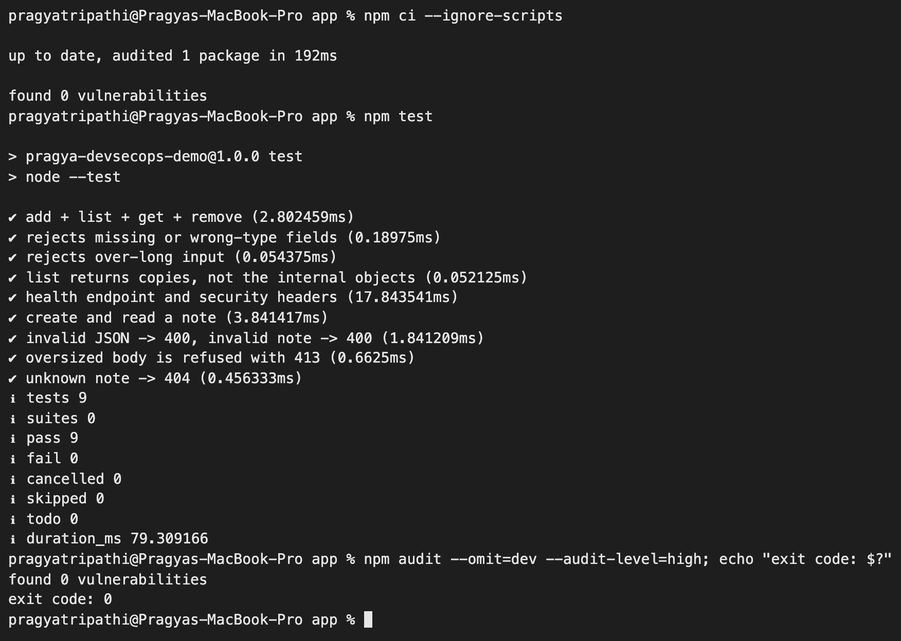
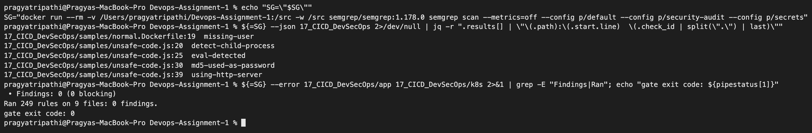
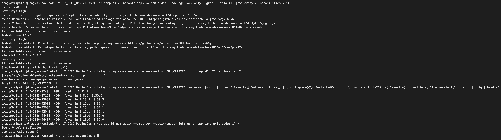
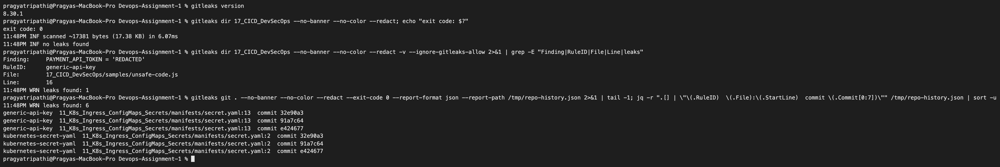
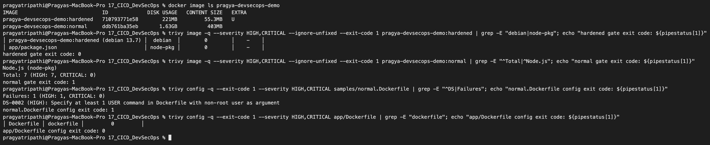
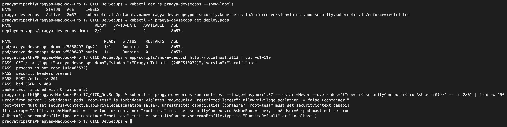
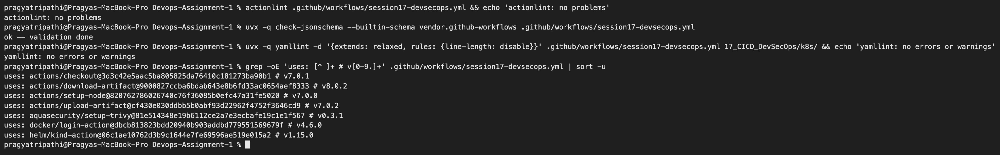
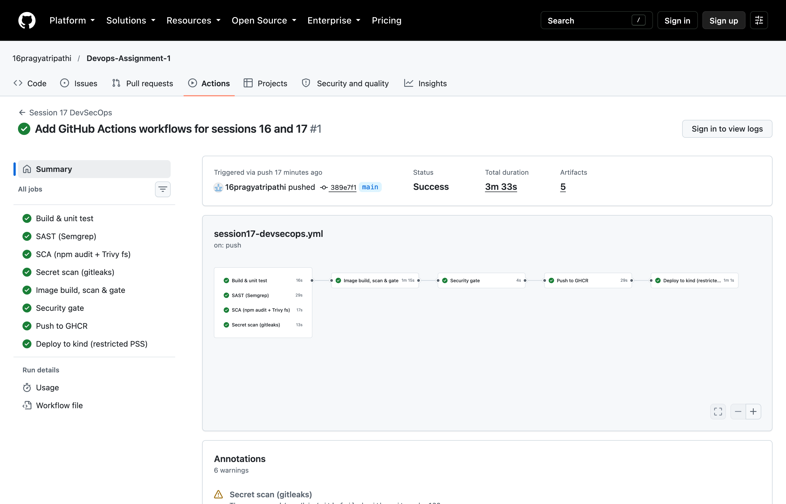

# Complete CI/CD & DevSecOps – Homework

**Name:** Pragya Tripathi
**Roll No:** 24BCS10032

Session 16 built a pipeline that tests, builds and deploys. This session adds security to every stage of it ("shift left"): the code, the dependencies, the git history, the container image and the Kubernetes manifests are all scanned, and a **security gate** decides whether the image is allowed to be published and deployed. The class repo ([session-17-devsecops](https://github.com/Nency-Ravaliya/devops-heros/tree/main/session-17-devsecops)) uses a Python app with CodeQL and pip-audit; I used a Node app with tools I can also run on my laptop (Semgrep, npm audit, Trivy, gitleaks), so every command in the pipeline was tried locally first.

All outputs below are from my Mac. The GitHub run is linked in the "Pipeline run on GitHub" section.

## What is in this folder

| Path | Ships? | What it is |
|---|---|---|
| [app/src/](app/src) | **yes** | Notice-board API on the Node standard library: input validation, 4 KB body limit, security headers, no stack traces in responses |
| [app/test/](app/test) | no (build stage only) | 4 unit + 5 integration tests (`node --test`) |
| [app/Dockerfile](app/Dockerfile) | **yes** | The **hardened** Dockerfile: digest-pinned bases, tests in a build stage, distroless runtime, uid 65532 |
| [app/scripts/smoke-test.sh](app/scripts/smoke-test.sh) | no | Calls the running API, checks it is **not root**, headers, POST, bad input |
| [k8s/namespace.yaml](k8s/namespace.yaml), [k8s/deployment.yaml](k8s/deployment.yaml) | **yes** | Namespace enforcing the `restricted` Pod Security Standard + a Deployment that satisfies it |
| [samples/unsafe-code.js](samples/unsafe-code.js) | **never** | **Intentionally insecure** code: command injection, `eval`, MD5 passwords, SQL injection, path traversal, reflected input, `Math.random` tokens, a hard-coded (made-up) token |
| [samples/vulnerable-deps/](samples/vulnerable-deps) | **never** | A lockfile with deliberately old `lodash 4.17.20`, `minimist 1.2.5`, `axios 0.21.1` |
| [samples/normal.Dockerfile](samples/normal.Dockerfile) | **never** | The "first attempt" Dockerfile: `node:24` full image, `COPY . .`, runs as root |
| [../.github/workflows/session17-devsecops.yml](../.github/workflows/session17-devsecops.yml) | – | The DevSecOps pipeline |

The sample files are there so each scanner has something real to find. They are outside `app/`, never imported by the server and never copied into the image that is pushed.

## The pipeline

Workflow name: **`Session 17 DevSecOps`**. Runs on pushes / pull requests to `main` that touch `17_CICD_DevSecOps/**` or the workflow file, and on `workflow_dispatch`.

```text
  Build & unit test ─────────┐
  SAST (Semgrep) ────────────┤
  SCA (npm audit + Trivy fs) ┼──► Image build, scan & gate ──► Security gate ──► Push to GHCR ──► Deploy to kind (restricted PSS)
  Secret scan (gitleaks) ────┘     (IaC scan, image scan,        (checks every      (the exact       (namespace refuses
   (4 jobs run in parallel)         SBOM, saves the image)       job result)        scanned image)    root Pods)
```

| Job id | Display name | Tool | Scans | Blocking part |
|---|---|---|---|---|
| `unit-test` | `Build & unit test` | `npm ci`, `node --test`, smoke test | app logic | any failing test |
| `sast` | `SAST (Semgrep)` | Semgrep 1.178.0 (`p/default`, `p/security-audit`, `p/secrets`) | source code, Dockerfiles, YAML | any finding in `app/` or `k8s/` |
| `sca` | `SCA (npm audit + Trivy fs)` | `npm audit`, `trivy fs` | dependency lockfiles | HIGH/CRITICAL in `app/` |
| `secrets` | `Secret scan (gitleaks)` | gitleaks 8.30.1 (checksum-verified download) | files **and full git history** | any leak in the history of `17_CICD_DevSecOps/` and `.github/workflows/` |
| `image` | `Image build, scan & gate` | `docker build`, `trivy config`, `trivy image`, CycloneDX SBOM | Dockerfile, k8s YAML, OS + npm packages in the image | HIGH/CRITICAL misconfig in the hardened Dockerfile or k8s YAML; **fixable** HIGH/CRITICAL CVE in the hardened image |
| `security-gate` | `Security gate` | `jq` over `toJSON(needs)` | results of all 5 jobs above | fails unless every one is `success` |
| `publish` | `Push to GHCR` | `docker load` + `docker push` | – | only runs if the gate passed, never on pull requests |
| `deploy` | `Deploy to kind (restricted PSS)` | kind, kubectl | – | rollout must finish, smoke test must pass, a root Pod must be **rejected** |

Every job uploads its reports (`sast-semgrep-reports`, `sca-reports`, `secret-scan-reports`, `image-scan-reports`) as artifacts, and writes a short table to the run summary.

### My gate policy (why the pipeline is green although the repo contains vulnerable code)

A gate that fails on every finding gets switched off within a week; a gate that never fails is just a report. I split each scan into two modes:

| | **Report mode** (`exit-code 0`, `|| true`) | **Gate mode** (`--error`, `--exit-code 1`) |
|---|---|---|
| Applies to | everything in the folder, including `samples/` and the `normal.Dockerfile` image, plus the whole repo's git history | only what is **shipped**: `app/`, `k8s/`, the hardened image, and the git history of this session + workflows |
| Result | findings are printed, saved as artifacts and counted in the summary | any finding over the threshold fails the job → `Security gate` fails → nothing is pushed or deployed |

Thresholds I chose:

1. **SAST:** zero Semgrep findings in shipped code. The app is small and new, so there is no "legacy debt" excuse.
2. **SCA:** no HIGH or CRITICAL advisory in the app's dependencies (`npm audit --audit-level=high`, `trivy fs --severity HIGH,CRITICAL`).
3. **Secrets:** zero leaks, scanned across **all commits**, because deleting a secret in a later commit does not un-leak it. The made-up token in `samples/unsafe-code.js` carries a `gitleaks:allow` comment — that is the reviewed, documented exception, and the report step deliberately runs with `--ignore-gitleaks-allow` so it is still shown every time.
4. **Image:** HIGH or CRITICAL **with a fix available** (`--ignore-unfixed`). If there is no patched version, failing the build gives the developer nothing to do; those are reported (and the base image is updated when Debian ships a fix).
5. **IaC:** no HIGH/CRITICAL Trivy misconfiguration in the hardened Dockerfile or the k8s manifests.
6. **Supply chain:** every action is pinned to a full commit SHA (a tag can be moved to malicious code, a SHA cannot), base images are pinned by digest, gitleaks is checksum-verified, and the image that is pushed is the **exact image that was scanned** (saved with `docker save`, loaded in the publish job — not rebuilt).

If someone moves the unsafe code into `app/`, adds a vulnerable dependency to the app, or commits a real-looking secret, the pipeline goes red and nothing is published. Section 1 shows this happening.

---

## 0. App tests

```text
$ npm ci --ignore-scripts

up to date, audited 1 package in 192ms

found 0 vulnerabilities

$ npm test

> pragya-devsecops-demo@1.0.0 test
> node --test

✔ add + list + get + remove (1.026625ms)
✔ rejects missing or wrong-type fields (0.178167ms)
✔ rejects over-long input (0.106416ms)
✔ list returns copies, not the internal objects (0.060833ms)
✔ health endpoint and security headers (20.312ms)
✔ create and read a note (4.321958ms)
✔ invalid JSON -> 400, invalid note -> 400 (1.9255ms)
✔ oversized body is refused with 413 (0.806875ms)
✔ unknown note -> 404 (0.533709ms)
ℹ tests 9
ℹ suites 0
ℹ pass 9
ℹ fail 0
ℹ cancelled 0
ℹ skipped 0
ℹ todo 0
ℹ duration_ms 80.797542
```



## 1. SAST – Semgrep

**First attempt – the ruleset matters.** I started with the language-specific packs and expected all of `unsafe-code.js` to light up:

```text
$ docker run --rm -v "$PWD:/src" -w /src semgrep/semgrep:1.178.0 semgrep scan --metrics=off \
    --config p/javascript --config p/nodejs --config p/owasp-top-ten --config p/secrets --json 17_CICD_DevSecOps \
    | jq -r '"findings: \(.results | length)", (.results[] | "\(.path):\(.start.line)  \(.check_id | split(".") | last)")'
findings: 1
17_CICD_DevSecOps/samples/normal.Dockerfile:19  missing-user
```

**Zero** findings in a file with seven planted bugs. Scanning only that file confirmed it (`Ran 107 rules on 1 file: 0 findings.`). Then I compared packs one by one on the same file (a loop running `semgrep scan --config <pack> --json samples/unsafe-code.js` and printing the number of results and the rule ids):

```text
=== p/default
4 [('detect-child-process', 20), ('eval-detected', 25), ('md5-used-as-password', 30), ('using-http-server', 39)] []
=== p/security-audit
1 [('detect-child-process', 20)] []
=== p/expressjs
0 [] []
```

So the pipeline uses `p/default + p/security-audit + p/secrets`. The report scan (whole folder) and the gate scan (only `app/` and `k8s/`), exactly as the `SAST (Semgrep)` job runs them:

```text
$ docker run --rm -v "$PWD:/src" -w /src semgrep/semgrep:1.178.0 semgrep scan \
    --config p/default --config p/security-audit --config p/secrets --metrics=off 17_CICD_DevSecOps
┌─────────────────┐
│ 5 Code Findings │
└─────────────────┘
    17_CICD_DevSecOps/samples/normal.Dockerfile
   ❯❯❱ dockerfile.security.missing-user.missing-user
          ❰❰ Blocking ❱❱
          By not specifying a USER, a program in the container may run as 'root'. This is a security hazard.
           19┆ CMD ["npm", "start"]
    17_CICD_DevSecOps/samples/unsafe-code.js
   ❯❯❱ javascript.lang.security.detect-child-process.detect-child-process
          Detected calls to child_process from a function argument `host`. This could lead to a command
          injection if the input is user controllable.
           20┆ exec('ping -c 1 ' + host, cb);
    ❯❱ javascript.browser.security.eval-detected.eval-detected
           25┆ return eval(expression);
    ❯❱ javascript.lang.security.audit.md5-used-as-password.md5-used-as-password
           30┆ return crypto.createHash('md5').update(password).digest('hex');
    ❯❱ problem-based-packs.insecure-transport.js-node.using-http-server.using-http-server
           39┆ http.createServer((req, res) => {
 • Findings: 5 (5 blocking)
 • Rules run: 249
 • Targets scanned: 14
Ran 249 rules on 14 files: 5 findings.

$ docker run ... semgrep scan --config p/default --config p/security-audit --config p/secrets --metrics=off \
    --error 17_CICD_DevSecOps/app 17_CICD_DevSecOps/k8s; echo "gate exit code: $?"
 • Findings: 0 (0 blocking)
Ran 249 rules on 9 files: 0 findings.
gate exit code: 0
```

(I shortened the long rule descriptions in the first block; the full text is in the screenshot / artifact.)



**Proof the gate blocks:** I copied `app/` to a scratch folder, dropped `unsafe-code.js` into it as `src/helpers.js`, and ran the gate command there:

```text
$ docker run --rm -v "$PWD:/src" -w /src semgrep/semgrep:1.178.0 semgrep scan --config p/default \
    --config p/security-audit --config p/secrets --metrics=off --error app > gate.txt 2>&1; echo "gate exit code: $?"
gate exit code: 1
$ grep -E 'Findings:|┆|❯' gate.txt
   ❯❯❱ javascript.lang.security.detect-child-process.detect-child-process
           20┆ exec('ping -c 1 ' + host, cb);
    ❯❱ javascript.browser.security.eval-detected.eval-detected
           25┆ return eval(expression);
    ❯❱ javascript.lang.security.audit.md5-used-as-password.md5-used-as-password
           30┆ return crypto.createHash('md5').update(password).digest('hex');
    ❯❱ problem-based-packs.insecure-transport.js-node.using-http-server.using-http-server
           39┆ http.createServer((req, res) => {
 • Findings: 4 (4 blocking)
```

What Semgrep **missed** in `unsafe-code.js`, even with the better packs: the SQL injection (it does not know `db.query` is a database call), the path traversal in `fs.readFile`, the reflected HTML, `Math.random()` tokens and the hard-coded token (gitleaks caught that one, section 3). A clean SAST result only means "none of these rules matched".

Two more things I learned here:
- Semgrep skips `test/` folders by default (`Files matching .semgrepignore patterns: 2` were my two test files).
- Semgrep did not recognise `Dockerfile.normal` / `Dockerfile.hardened` as Dockerfiles at all (0 Dockerfile findings until I renamed them). Semgrep and Trivy both detect `Dockerfile` and `*.Dockerfile`, so the hardened one is `app/Dockerfile` and the bad one is `samples/normal.Dockerfile`.

## 2. SCA – dependency vulnerabilities

The deliberately old sample, report mode:

```text
$ cd samples/vulnerable-deps
$ npm audit --package-lock-only > audit.txt; echo "exit code: $?"
exit code: 1
$ grep -E '^[a-z]+ +[<>=0-9]|^Severity|vulnerabilities \(' audit.txt
axios  <=0.32.0
Severity: high
lodash  <=4.17.23
Severity: high
minimist  1.0.0 - 1.2.5
Severity: critical
3 vulnerabilities (2 high, 1 critical)
```

npm audit exits with 1 here, which is why the report step in the workflow ends with `|| true`.

Trivy reads the same lockfile and lists every CVE with the version that fixes it — that "fixed in" column is what makes a finding actionable:

```text
$ trivy fs -q --scanners vuln --severity HIGH,CRITICAL . | grep -E 'Total|lock.json'
│ samples/vulnerable-deps/package-lock.json │ npm  │       14        │
samples/vulnerable-deps/package-lock.json (npm)
Total: 14 (HIGH: 13, CRITICAL: 1)

$ trivy fs -q --scanners vuln --severity HIGH,CRITICAL --format json . \
    | jq -r '.Results[].Vulnerabilities[] | "\(.PkgName)@\(.InstalledVersion)  \(.VulnerabilityID)  \(.Severity)  fixed in \(.FixedVersion)"' | sort -u
axios@0.21.1  CVE-2021-3749  HIGH  fixed in 0.21.2
axios@0.21.1  CVE-2025-27152  HIGH  fixed in 1.8.2, 0.30.0
axios@0.21.1  CVE-2026-25639  HIGH  fixed in 1.13.5, 0.30.3
axios@0.21.1  CVE-2026-42033  HIGH  fixed in 1.15.1, 0.31.1
axios@0.21.1  CVE-2026-42035  HIGH  fixed in 1.15.1, 0.31.1
axios@0.21.1  CVE-2026-42043  HIGH  fixed in 1.15.1, 0.31.1
axios@0.21.1  CVE-2026-44486  HIGH  fixed in 1.16.0, 0.32.0
axios@0.21.1  CVE-2026-44487  HIGH  fixed in 1.16.0, 0.32.0
axios@0.21.1  CVE-2026-44492  HIGH  fixed in 1.16.0, 0.32.0
axios@0.21.1  CVE-2026-44495  HIGH  fixed in 1.15.2, 0.31.1
axios@0.21.1  CVE-2026-44496  HIGH  fixed in 1.16.0, 0.32.0
lodash@4.17.20  CVE-2021-23337  HIGH  fixed in 4.17.21
lodash@4.17.20  CVE-2026-4800  HIGH  fixed in 4.18.0
minimist@1.2.5  CVE-2021-44906  CRITICAL  fixed in 1.2.6, 0.2.4
```

The gate runs against the app only:

```text
$ cd app && npm audit --omit=dev --audit-level=high; echo "exit code: $?"
found 0 vulnerabilities
exit code: 0

$ trivy fs --scanners vuln --severity HIGH,CRITICAL --exit-code 1 app
2026-10-07T23:40:09+05:30	WARN	[report] Supported files for scanner(s) not found.	scanners=[vuln]

Report Summary

┌────────┬──────┬─────────────────┐
│ Target │ Type │ Vulnerabilities │
├────────┼──────┼─────────────────┤
│   -    │  -   │        -        │
└────────┴──────┴─────────────────┘
```

The app has **no runtime dependencies at all** (the lockfile only contains the app itself), so Trivy has nothing to analyse and exits 0. Having zero dependencies is the strongest SCA result possible — every dependency added later will be checked by this same gate.



## 3. Secret scanning – gitleaks

```text
$ gitleaks version
8.30.1

$ gitleaks dir 17_CICD_DevSecOps --no-banner --redact; echo "exit code: $?"
exit code: 0
11:48PM INF scanned ~17381 bytes (17.38 KB) in 6.07ms
11:48PM INF no leaks found

$ cd 17_CICD_DevSecOps && gitleaks dir . --no-banner --redact -v --ignore-gitleaks-allow
Finding:     PAYMENT_API_TOKEN = 'REDACTED'
Secret:      REDACTED
RuleID:      generic-api-key
Entropy:     5.000000
File:        samples/unsafe-code.js
Line:        16
Fingerprint: samples/unsafe-code.js:generic-api-key:16

10:19PM WRN leaks found: 1
```

The token is found by the generic high-entropy rule (entropy 5.0), not by a provider-specific pattern. Normally the `gitleaks:allow` comment hides it; `--ignore-gitleaks-allow` is how the report step keeps it visible.

**History, not just files.** Before the coordinator push I rehearsed the gate in a throw-away clone of this repo with my files committed, so the history scan had something to look at:

```text
$ git log --oneline | head -2
997c54c rehearsal: session 17
2f9a3bc Update contact email to scaler address

$ gitleaks git . --no-banner --redact -v --log-opts="--all -- 17_CICD_DevSecOps .github/workflows"
10:38PM INF 1 commits scanned.
10:38PM INF scanned ~41938 bytes (41.94 KB) in 97.7ms
10:38PM INF no leaks found

$ gitleaks git . --no-banner --redact -v --ignore-gitleaks-allow --log-opts="--all -- 17_CICD_DevSecOps .github/workflows" \
    | grep -vE '^Link|^Email|^Author|^Date'
10:39PM INF Unknown SCM platform. Use --platform to include links in findings. host=
Finding:     PAYMENT_API_TOKEN = 'REDACTED'
Secret:      REDACTED
RuleID:      generic-api-key
Entropy:     5.000000
File:        17_CICD_DevSecOps/samples/unsafe-code.js
Line:        16
Commit:      997c54c086e4aa17807bf258cded31228726f0f5
Fingerprint: 997c54c086e4aa17807bf258cded31228726f0f5:17_CICD_DevSecOps/samples/unsafe-code.js:generic-api-key:16

10:39PM INF 1 commits scanned.
10:39PM INF scanned ~41938 bytes (41.94 KB) in 92.8ms
10:39PM WRN leaks found: 1
```

**A real finding elsewhere in the repo.** The whole-repository history scan (report mode) found something I did not plant:

```text
$ gitleaks git . --no-banner --redact --exit-code 0 --report-format json --report-path /tmp/repo-history.json 2>&1 | tail -1
11:48PM WRN leaks found: 6
$ jq -r '.[] | "\(.RuleID)  \(.File):\(.StartLine)  commit \(.Commit[0:7])"' /tmp/repo-history.json | sort -u
generic-api-key  11_K8s_Ingress_ConfigMaps_Secrets/manifests/secret.yaml:13  commit 32e90a3
generic-api-key  11_K8s_Ingress_ConfigMaps_Secrets/manifests/secret.yaml:13  commit 91a7c64
generic-api-key  11_K8s_Ingress_ConfigMaps_Secrets/manifests/secret.yaml:13  commit e424677
kubernetes-secret-yaml  11_K8s_Ingress_ConfigMaps_Secrets/manifests/secret.yaml:2  commit 32e90a3
kubernetes-secret-yaml  11_K8s_Ingress_ConfigMaps_Secrets/manifests/secret.yaml:2  commit 91a7c64
kubernetes-secret-yaml  11_K8s_Ingress_ConfigMaps_Secrets/manifests/secret.yaml:2  commit e424677
```

That is the Session 11 lab's Kubernetes `Secret` manifest (from the class material), which stores a demo Postgres password base64-encoded. Base64 is encoding, not encryption, and gitleaks treats it as a leaked credential — correctly. **Triage:** it is a classroom value that never protected anything real, so I did not rewrite history for it. In a real project the answer would be: rotate the password, move the value to a secret manager / Sealed Secrets / External Secrets, and keep only a template in git. Because this repository holds 20 unrelated labs, my blocking gate covers the history of this session and the workflows; the whole-repo scan stays in report mode so findings like this one are still shown on every run.



## 4. Hardened image vs normal image

[samples/normal.Dockerfile](samples/normal.Dockerfile) vs [app/Dockerfile](app/Dockerfile):

| | normal | hardened |
|---|---|---|
| Base | `node:24` (Debian 12, full toolchain) | build: `node:24-alpine@sha256:…`, runtime: `gcr.io/distroless/nodejs24-debian13:nonroot@sha256:…` |
| Tests | not run | run in the build stage, failure = no image |
| What is copied | everything (`COPY . .`) | only `package.json`, `node_modules`, `src/` |
| Shell / package manager / npm in runtime | yes / apt / yes | **none** |
| User | root (uid 0) | 65532 |

### A real build failure on the way

My first hardened build failed:

```text
#14 [build 7/7] RUN node --test
#14 0.195 ℹ tests 9
#14 0.195 ℹ pass 9
#14 0.195 ℹ fail 0
#16 [stage-1 4/5] COPY --from=build /app/node_modules ./node_modules
#16 ERROR: failed to calculate checksum of ref eqgsbelw89rzhnv5rdlqobptb::n7fokhb7lxtqsybiahdtl2qzn: "/app/node_modules": not found
```

Because the app has zero dependencies, `npm ci` never created `node_modules`, so there was nothing to copy. Fix: `RUN npm ci --omit=dev --ignore-scripts && mkdir -p node_modules` (the COPY then works whether or not dependencies are added later).

### Build, size and the "no shell" proof

```text
$ docker build -t pragya-devsecops-demo:normal -f ../samples/normal.Dockerfile .
$ docker build -t pragya-devsecops-demo:hardened --build-arg APP_VERSION=local .

$ docker image ls pragya-devsecops-demo
IMAGE                            ID             DISK USAGE   CONTENT SIZE   EXTRA
pragya-devsecops-demo:hardened   710793771e58        221MB         55.3MB   U
pragya-devsecops-demo:normal     ddb761ba35eb       1.63GB          403MB

$ docker run --rm --entrypoint sh pragya-devsecops-demo:hardened -c id
docker: Error response from daemon: failed to create task for container: failed to create shim task: OCI runtime create failed: runc create failed: unable to start container process: error during container init: exec: "sh": executable file not found in $PATH

$ docker run -d --rm --name s17-normal -p 3114:3000 pragya-devsecops-demo:normal
$ curl -s http://localhost:3114/
{"app":"pragya-devsecops-demo","student":"Pragya Tripathi (24BCS10032)","version":"dev","uid":0,"endpoints":["GET /notes","POST /notes","GET /notes/:id","DELETE /notes/:id"]}
$ docker exec s17-normal id
uid=0(root) gid=0(root) groups=0(root)
```

The hardened image is **7.4x smaller on disk (221 MB vs 1.63 GB) and 7.3x smaller to download (55.3 MB vs 403 MB)**. It has no shell, so even an attacker with code execution cannot `sh` into it. The normal one runs the app as root.

The hardened container also works with a read-only filesystem and no Linux capabilities:

```text
$ docker run -d --name s17-hardened --read-only --cap-drop ALL --security-opt no-new-privileges -p 3112:3000 pragya-devsecops-demo:hardened
53aa2b1b759eced04cd34295cfd4d4e41919b9db53bee8c24d0eaaa4003531f9
$ app/scripts/smoke-test.sh http://localhost:3112
PASS  GET / -> {"app":"pragya-devsecops-demo","student":"Pragya Tripathi (24BCS10032)","version":"local","uid":65532,"endpoints":["GET /notes","POST /notes","GET /notes/:id","DELETE /notes/:id"]}
PASS  process is not root (uid=65532)
PASS  security headers present
PASS  POST /notes -> 201
PASS  bad JSON -> 400
smoke test finished with 0 failure(s)
$ docker ps --filter name=s17-hardened --format '{{.Names}} {{.Status}}'
s17-hardened Up 9 seconds (healthy)
```

### Image scanning and the gate

```text
$ trivy image --no-progress --format json -o normal.json   pragya-devsecops-demo:normal
$ trivy image --no-progress --format json -o hardened.json pragya-devsecops-demo:hardened
$ for t in normal hardened; do echo "== $t: all severities / with a fix available"
    jq -r '[.Results[]?.Vulnerabilities[]?] | (group_by(.Severity) | map("\(.[0].Severity)=\(length)") | join("  ")),
      "fixable: " + ([.[] | select(.FixedVersion != null and .FixedVersion != "")] | group_by(.Severity)
      | map("\(.[0].Severity)=\(length)") | join("  "))' $t.json; done
== normal: all severities / with a fix available
CRITICAL=20  HIGH=471  LOW=1507  MEDIUM=2387  UNKNOWN=167
fixable: HIGH=7  LOW=1  MEDIUM=12
== hardened: all severities / with a fix available
LOW=8  MEDIUM=23
fixable:
```

| Image | CRITICAL | HIGH | MEDIUM | LOW | fixable HIGH/CRITICAL | Gate |
|---|---|---|---|---|---|---|
| normal (`node:24`) | 20 | 471 | 2387 | 1507 | 7 | **FAIL** (exit 1) |
| hardened (distroless) | 0 | 0 | 23 | 8 | 0 | **PASS** (exit 0) |

The gate command from the `Image build, scan & gate` job, on both images (Trivy's tables trimmed to the relevant rows and columns; the full output is in the screenshot and in the CI artifacts):

```text
$ trivy image --severity HIGH,CRITICAL --ignore-unfixed --exit-code 1 pragya-devsecops-demo:hardened; echo "exit code: $?"
Report Summary
│ pragya-devsecops-demo:hardened (debian 13.7) │  debian  │        0        │    -    │
│ app/package.json                             │ node-pkg │        0        │    -    │
exit code: 0

$ trivy image --severity HIGH,CRITICAL --ignore-unfixed --exit-code 1 pragya-devsecops-demo:normal; echo "exit code: $?"
Node.js (node-pkg)
Total: 7 (HIGH: 7, CRITICAL: 0)
│ brace-expansion (package.json) │ CVE-2026-102276 │ HIGH │ fixed │ 5.0.7  │ 5.0.10, 3.0.7, 2.1.5, 1.1.19 │
│                                │ CVE-2026-102278 │      │       │        │ 5.0.11, 3.0.8, 2.1.6, 1.1.20 │
│                                │ CVE-2026-14257  │      │       │        │ 5.0.8, 3.0.3, 2.1.3, 1.1.17  │
│                                │ CVE-2026-69152  │      │       │        │ 1.1.18, 2.1.4, 3.0.6, 5.0.9  │
│ ip-address (package.json)      │ CVE-2026-69192  │      │       │ 10.2.0 │ 10.3.1                       │
│ tar (package.json)             │ CVE-2026-73566  │      │       │ 7.5.19 │ 7.5.21                       │
│ undici (package.json)          │ CVE-2026-19534  │      │       │ 6.27.0 │ 6.28.1, 7.29.1, 8.10.2       │
exit code: 1
```

Two things surprised me:

- All 7 fixable HIGHs in the normal image live in `usr/local/lib/node_modules/npm/node_modules/...` — they are **npm's own dependencies**, not my app's. My app does not even use npm at runtime. The distroless image simply does not contain npm, so the whole class of finding disappears.
- The normal image's 20 CRITICALs (zlib, sqlite, libxml2, openssh-client, ...) have **no fixed version yet**, so `--ignore-unfixed` lets them through. That is the honest weakness of my threshold: it blocks what can be fixed, but a "CRITICAL, no fix" image would still pass. The real protection against those is choosing a base image that does not contain the packages at all, which is exactly what the hardened image does (its 31 remaining findings are MEDIUM/LOW in Debian base libraries, all without fixes).

### IaC / misconfiguration scan

(Summary tables trimmed to the data rows.)

```text
$ trivy config --severity HIGH,CRITICAL --exit-code 1 app/Dockerfile; echo "exit code: $?"
│ Dockerfile │ dockerfile │         0         │
exit code: 0

$ trivy config --severity HIGH,CRITICAL --exit-code 1 k8s; echo "exit code: $?"
│ deployment.yaml │ kubernetes │         0         │
│ namespace.yaml  │ kubernetes │         0         │
exit code: 0

$ trivy config --severity HIGH,CRITICAL --exit-code 1 samples/normal.Dockerfile; echo "exit code: $?"
normal.Dockerfile (dockerfile)
Tests: 20 (SUCCESSES: 19, FAILURES: 1)
Failures: 1 (HIGH: 1, CRITICAL: 0)

DS-0002 (HIGH): Specify at least 1 USER command in Dockerfile with non-root user as argument
exit code: 1
```



## 5. Deploy: the hardened image in a namespace that refuses root

[k8s/namespace.yaml](k8s/namespace.yaml) labels the namespace `pod-security.kubernetes.io/enforce: restricted`. The API server then rejects any Pod that could run as root, escalate privileges, keep capabilities or skip seccomp. My Deployment sets `runAsNonRoot`, `runAsUser: 65532`, `readOnlyRootFilesystem`, `allowPrivilegeEscalation: false`, `capabilities.drop: [ALL]`, `seccompProfile: RuntimeDefault` and `automountServiceAccountToken: false`.

I rehearsed the deploy job on my throw-away kind cluster (`pragya-cicd`), loading the local image instead of pulling from GHCR:

```text
$ kind load docker-image pragya-devsecops-demo:hardened --name pragya-cicd
Image: "pragya-devsecops-demo:hardened" with ID "sha256:710793771e583e459908f82d2b3b4c6b7953121310cf6fc3d509dc80021ec13a" not yet present on node "pragya-cicd-control-plane", loading...
$ kubectl apply -f k8s/namespace.yaml
namespace/pragya-devsecops created
$ sed "s|IMAGE_PLACEHOLDER|pragya-devsecops-demo:hardened|" k8s/deployment.yaml > rendered.yaml
$ kubectl apply -f rendered.yaml
deployment.apps/pragya-devsecops-demo created
service/pragya-devsecops-demo created
$ kubectl -n pragya-devsecops rollout status deployment/pragya-devsecops-demo --timeout=120s
Waiting for deployment "pragya-devsecops-demo" rollout to finish: 0 of 2 updated replicas are available...
Waiting for deployment "pragya-devsecops-demo" rollout to finish: 1 of 2 updated replicas are available...
deployment "pragya-devsecops-demo" successfully rolled out

$ kubectl -n pragya-devsecops port-forward svc/pragya-devsecops-demo 3113:80 &
$ app/scripts/smoke-test.sh http://localhost:3113
PASS  GET / -> {"app":"pragya-devsecops-demo","student":"Pragya Tripathi (24BCS10032)","version":"local","uid":65532,"endpoints":["GET /notes","POST /notes","GET /notes/:id","DELETE /notes/:id"]}
PASS  process is not root (uid=65532)
PASS  security headers present
PASS  POST /notes -> 201
PASS  bad JSON -> 400
smoke test finished with 0 failure(s)

$ kubectl -n pragya-devsecops run root-test --image=busybox:1.37 --restart=Never \
    --overrides='{"spec":{"securityContext":{"runAsUser":0}}}' -- id
Error from server (Forbidden): pods "root-test" is forbidden: violates PodSecurity "restricted:latest": allowPrivilegeEscalation != false (container "root-test" must set securityContext.allowPrivilegeEscalation=false), unrestricted capabilities (container "root-test" must set securityContext.capabilities.drop=["ALL"]), runAsNonRoot != true (pod or container "root-test" must set securityContext.runAsNonRoot=true), runAsUser=0 (pod must not set runAsUser=0), seccompProfile (pod or container "root-test" must set securityContext.seccompProfile.type to "RuntimeDefault" or "Localhost")
```

The same three checks (rollout, smoke test, root Pod rejected) are the last steps of the `Deploy to kind (restricted PSS)` job. In CI the cluster pulls `ghcr.io/16pragyatripathi/pragya-devsecops-demo:<sha7>` with an image-pull Secret made from the run's `GITHUB_TOKEN`.



## 6. Checking the workflow and pinning actions

If a workflow names an action version that does not exist, the job fails before it even starts. So I checked every version against the GitHub API before using it, then pinned the commit SHA that the tag points to:

```text
$ for rt in actions/checkout:v7.0.1 actions/setup-node:v7.0.0 actions/upload-artifact:v7.0.2 \
            actions/download-artifact:v8.0.2 docker/login-action:v4.6.0 aquasecurity/setup-trivy:v0.3.1 \
            helm/kind-action:v1.15.0; do r=${rt%%:*}; t=${rt##*:}
    printf '%-28s %-8s %s\n' $r $t "$(curl -s https://api.github.com/repos/$r/git/ref/tags/$t | jq -r .object.sha)"; done
actions/checkout             v7.0.1   3d3c42e5aac5ba805825da76410c181273ba90b1
actions/setup-node           v7.0.0   820762786026740c76f36085b0efc47a31fe5020
actions/upload-artifact      v7.0.2   cf430e030ddbb5b0abf93d22962f4752f3646cd9
actions/download-artifact    v8.0.2   9000827ccba6bdab643e8b6fd33ac0654aef8333
docker/login-action          v4.6.0   dbcb813823bdd20940b903addbd779551569679f
aquasecurity/setup-trivy     v0.3.1   81e514348e19b6112ce2a7e3ecbafe19c1e1f567
helm/kind-action             v1.15.0  06c1ae10762d3b9c1644e7fe69596ae519e015a2
```

Small things I found while doing this:
- `helm/kind-action`'s moving `v1` tag did **not** point to the latest v1.15.x commit, which is a good example of why a SHA is more trustworthy than a tag.
- `upload-artifact@v7` and `download-artifact@v8` are the matching pair (v8 is the downloader that understands v7's new "direct upload" artifacts).
- I used `aquasecurity/setup-trivy` and then plain `trivy` commands instead of `trivy-action`, so the CI commands are identical to the ones I ran locally (Trivy version pinned to `v0.75.0`, same as my Mac). Semgrep is pinned to the image tag `semgrep/semgrep:1.178.0`, whose digest I checked on Docker Hub matches the image I used locally (`sha256:32e45996…`).

```text
$ actionlint .github/workflows/session17-devsecops.yml && echo 'actionlint: no problems'
actionlint: no problems
$ uvx check-jsonschema --builtin-schema vendor.github-workflows .github/workflows/session17-devsecops.yml
ok -- validation done
$ uvx yamllint -d '{extends: relaxed, rules: {line-length: disable}}' .github/workflows/session17-devsecops.yml 17_CICD_DevSecOps/k8s/ && echo 'yamllint: no errors or warnings'
yamllint: no errors or warnings
```



---

## Pipeline run on GitHub



Run #1 of `session17-devsecops.yml`, triggered by pushing commit `389e7f1` to `main`. All eight jobs are green in 3m 33s, producing 5 artifacts (the scan reports). The graph shows the four checks that run first — `Build & unit test`, `SAST (Semgrep)`, `SCA (npm audit + Trivy fs)` and `Secret scan (gitleaks)` — feeding `Image build, scan & gate` and then `Security gate`, so nothing reaches GHCR or the cluster until every control has passed.

---

## Why each control exists

| Control | Catches | Does not catch |
|---|---|---|
| Unit tests | wrong logic, broken validation | any vulnerability the tests don't look for |
| SAST (Semgrep) | dangerous patterns in **my code** (`exec`, `eval`, MD5, root Dockerfile) | anything without a matching rule – it missed my SQL injection and path traversal |
| SCA (npm audit, Trivy fs) | known CVEs in **declared dependencies** | my own code; OS packages |
| Secret scan (gitleaks) | credentials in files **and the whole git history** | secrets that never touch git |
| IaC scan (trivy config) | root containers, missing security settings in Dockerfile/YAML | runtime behaviour |
| Image scan (Trivy) | CVEs in the **base image** and bundled tools (npm's own deps!) | logic bugs, unfixed CVEs under my threshold |
| Pod Security Admission | a root / privileged Pod at **deploy time**, even if every scan was skipped | anything inside a correctly configured Pod |
| Security gate job | turns all of the above into one yes/no before anything is published | – |

## What I understood

- **Scanners find, gates decide.** Without `--exit-code 1` / `--error` and the `Security gate` job, all of this is a report nobody reads.
- **A gate needs a written policy.** Mine: block on everything that ships, report on everything else, block CVEs only when a fix exists. The policy is what keeps the pipeline both strict and green.
- **SAST coverage = the rules you enable.** Four popular rule packs found nothing in a file with seven planted bugs; a different combination found four.
- **The smallest base image is the best patch.** Switching to distroless removed npm (all 7 fixable HIGHs), the shell and ~1.4 GB, with no code change.
- **Scan → then publish the same bytes.** The publish job pushes the image saved by the scanning job instead of rebuilding it.
- **Git history is part of the attack surface.** gitleaks found a real (classroom) credential from Session 11 in three commits.
- **Defence in depth.** Even if someone skipped every scan, the `restricted` namespace would still refuse to run a root container.
