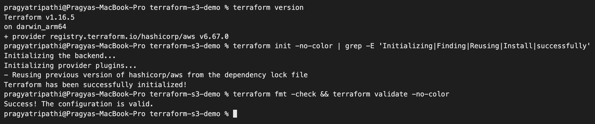
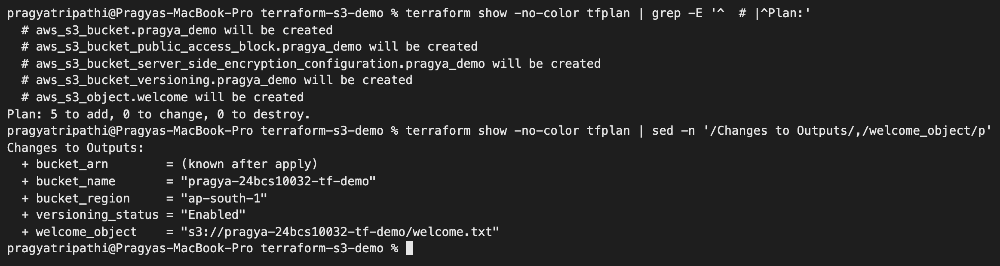
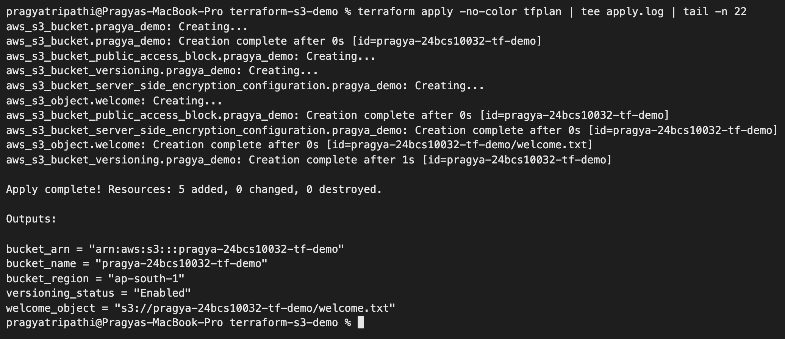
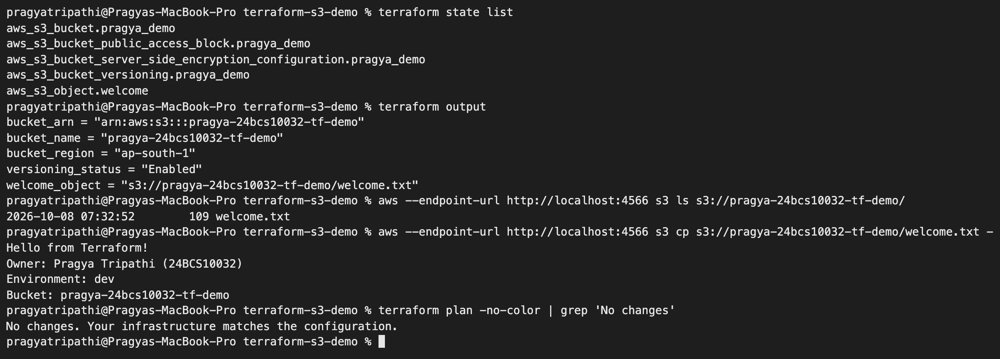
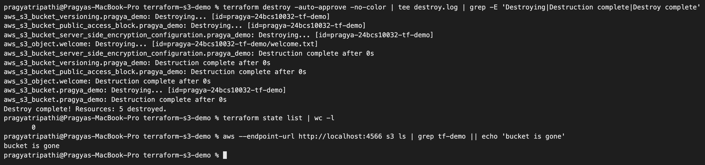
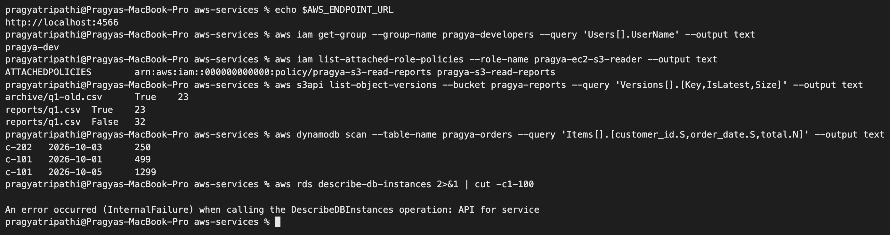

# Terraform & Infrastructure as Code – Homework

**Name:** Pragya Tripathi
**Roll No:** 24BCS10032

The class material for this session is [session18-terraform-iac](https://github.com/Nency-Ravaliya/devops-heros/tree/main/session18-terraform-iac). It has nine small labs (IaC basics, architecture, providers, resources, variables, outputs, init/plan/apply, destroy, state) and a `terraform-s3-demo`. I combined all of them into **one project**, [terraform-s3-demo/](terraform-s3-demo). Then I ran the full lifecycle on it: `init → fmt → validate → plan → apply → state → output → verify → drift → variables → destroy`. The second task, the AWS services research, is in [aws-services/](aws-services).

| Task | Where |
|---|---|
| Terraform S3 project (covers labs 01–09 + demo) | [terraform-s3-demo/](terraform-s3-demo), documented below |
| AWS services research: IAM, EC2, S3, VPC, DynamoDB & RDS | [aws-services/](aws-services) (one README per service) |

## Where this ran: LocalStack, not real AWS

I have **no AWS account credentials** on this laptop. So instead of skipping `apply` and `destroy`, I ran everything against **LocalStack 3.8**, an open-source emulator that serves the AWS APIs from a Docker container on `localhost:4566`. The Terraform resource code is the same code I would use on AWS. Only the provider block points somewhere else. Every output below is real output from my machine. Where LocalStack behaved differently from AWS, I say so.

```text
$ docker run -d --name ls-pragya -p 4566:4566 localstack/localstack:3.8
995229c0b76d82de9da75c287da22b4e9707bddc9159c7236e796bcd87f9d619

$ curl -s localhost:4566/_localstack/health | python3 -m json.tool
{
    "services": {
        "acm": "available",
        ...
        "dynamodb": "available",
        "ec2": "available",
        ...
        "iam": "available",
        ...
        "s3": "available",
        ...
        "sts": "available",
        ...
    },
    "edition": "community",
    "version": "3.8.1"
```

(I trimmed the service list to the ones I used. There are 35 in total. `rds` is not one of them; see the [DynamoDB & RDS page](aws-services/05-dynamodb-rds/README.md).)

I pinned the tag `3.8` because newer LocalStack images need an auth token. For the AWS CLI I installed `awscli` 1.46.1 with `uv tool install awscli` and pointed it at LocalStack with environment variables:

```text
export AWS_ACCESS_KEY_ID=test AWS_SECRET_ACCESS_KEY=test AWS_DEFAULT_REGION=ap-south-1
export AWS_ENDPOINT_URL=http://localhost:4566
```

### What would be different on real AWS

| Here (LocalStack) | Real AWS |
|---|---|
| `endpoints { s3 = "http://localhost:4566" ... }` in the provider | Delete the block. The provider uses the real regional endpoints. |
| `access_key = "test"`, `secret_key = "test"` (LocalStack's fixed dummy values) | Delete them. Credentials come from `aws configure`, env vars or SSO, **never** from a `.tf` file. |
| `skip_credentials_validation`, `skip_requesting_account_id`, `skip_metadata_api_check` | Delete them. The provider then checks the credentials with STS on startup. |
| `s3_use_path_style = true` | Not needed. AWS uses `bucket.s3.region.amazonaws.com` URLs. |
| Account `000000000000`, nothing costs money | A real account. S3 storage is billed, and the bucket name must be unique across all of AWS. |
| IAM policies are stored but not enforced | Every call is authorised by IAM. The Terraform user needs `s3:*` on this bucket. |

### Getting the AWS provider (slow network)
`terraform init` has to download the AWS provider: a 168 MB zip, 780 MB unpacked. On my connection it ran at about 10 KB/s and `init` timed out twice. To get it, I downloaded the zip once in parallel chunks and checked it against HashiCorp's published checksum:

```text
$ shasum -a 256 -c <(grep darwin_arm64 SHA256SUMS)
terraform-provider-aws_6.67.0_darwin_arm64.zip: OK
```

Then I gave Terraform a small CLI config file (`TF_CLI_CONFIG_FILE`) with a `provider_installation { filesystem_mirror { ... } }` block pointing at that folder. While this was going on, HashiCorp released v6.68.0. So the plugin-cache approach (`TF_PLUGIN_CACHE_DIR`) did not help: `~> 6.0` resolved to a version I did not have. The mirror only offers 6.67.0, so Terraform picked that. On a normal connection none of this is needed; plain `terraform init` downloads the provider itself.

---

## The project

```text
terraform-s3-demo/
├── terraform.tf               # required Terraform + provider versions
├── providers.tf               # AWS provider (LocalStack endpoints)
├── variables.tf               # inputs with types, defaults and validation
├── main.tf                    # the resources
├── outputs.tf                 # values printed after apply
├── terraform.tfvars.example   # copy to terraform.tfvars (not committed)
├── .terraform.lock.hcl        # exact provider version + checksum (committed)
└── .gitignore                 # keeps .terraform/, state, plans, tfvars out of git
```

What it creates (5 resources):

| Resource | Purpose |
|---|---|
| `aws_s3_bucket.pragya_demo` | The bucket `pragya-24bcs10032-tf-demo`, with tags |
| `aws_s3_bucket_versioning.pragya_demo` | Keeps old versions of objects |
| `aws_s3_bucket_server_side_encryption_configuration.pragya_demo` | AES-256 encryption at rest |
| `aws_s3_bucket_public_access_block.pragya_demo` | All four "block public access" switches on |
| `aws_s3_object.welcome` | A `welcome.txt` file built from variables |

How each class lab maps to the project:

| Class lab | Where it shows up |
|---|---|
| 01 IaC basics / 02 architecture | The whole workflow below: code → CLI → provider plugin → AWS API, with state on the side |
| 03 providers | [terraform.tf](terraform-s3-demo/terraform.tf) pins `hashicorp/aws ~> 6.0`; [providers.tf](terraform-s3-demo/providers.tf) configures it |
| 04 resources | [main.tf](terraform-s3-demo/main.tf): `resource "TYPE" "LOCAL_NAME" { ... }` blocks, tags exercise |
| 05 variables | [variables.tf](terraform-s3-demo/variables.tf) + `terraform.tfvars`, the dev → test exercise in section 9 |
| 06 outputs | [outputs.tf](terraform-s3-demo/outputs.tf), `terraform output` in section 5 |
| 07 init/plan/apply | Sections 1–4, including the saved plan `-out=tfplan` |
| 08 destroy | Section 10, with `plan -destroy` first |
| 09 state | Section 5 (`state list/show/pull`) and the tag-change exercise in section 9 |

Key parts of the code:

```hcl
# terraform.tf
terraform {
  required_version = ">= 1.6.0"
  required_providers {
    aws = {
      source  = "hashicorp/aws"
      version = "~> 6.0"     # any 6.x, never 7.0
    }
  }
}
```

```hcl
# variables.tf (excerpt): bad values fail at plan time, before any API call
variable "environment" {
  type    = string
  default = "dev"
  validation {
    condition     = contains(["dev", "test", "staging", "prod"], var.environment)
    error_message = "environment must be dev, test, staging or prod."
  }
}
```

```hcl
# main.tf (excerpt)
locals {
  common_tags = {
    Owner       = "Pragya Tripathi"
    RollNo      = "24BCS10032"
    Project     = var.project_name
    Environment = var.environment
    ManagedBy   = "Terraform"
    Session     = "18"
  }
}

resource "aws_s3_bucket" "pragya_demo" {
  bucket        = var.bucket_name
  force_destroy = true
  tags          = merge(local.common_tags, { Name = var.bucket_name })
}

resource "aws_s3_bucket_versioning" "pragya_demo" {
  bucket = aws_s3_bucket.pragya_demo.id      # this reference = dependency
  versioning_configuration {
    status = var.enable_versioning ? "Enabled" : "Suspended"
  }
}
```

Since AWS provider v4, versioning, encryption and public-access settings are **separate resources** that point at the bucket. Each one shows up separately in the plan and can be changed on its own.

---

## 1. `terraform init`

```text
$ cp terraform.tfvars.example terraform.tfvars

$ terraform init
Initializing the backend...

Initializing provider plugins...
- Finding hashicorp/aws versions matching "~> 6.0"...
- Installing hashicorp/aws v6.67.0...
- Installed hashicorp/aws v6.67.0 (unauthenticated)

Terraform has created a lock file .terraform.lock.hcl to record the provider
selections it made above. Include this file in your version control repository
so that Terraform can guarantee to make the same selections by default when
you run "terraform init" in the future.


Warning: Incomplete lock file information for providers

Due to your customized provider installation methods, Terraform was forced to
calculate lock file checksums locally for the following providers:
  - hashicorp/aws

The current .terraform.lock.hcl file only includes checksums for
darwin_arm64, so Terraform running on another platform will fail to install
these providers.

To calculate additional checksums for another platform, run:
  terraform providers lock -platform=linux_amd64
(where linux_amd64 is the platform to generate)
Terraform has been successfully initialized!

You may now begin working with Terraform. Try running "terraform plan" to see
any changes that are required for your infrastructure. All Terraform commands
should now work.

If you ever set or change modules or backend configuration for Terraform,
rerun this command to reinitialize your working directory. If you forget, other
commands will detect it and remind you to do so if necessary.
```

- `init` read the `required_providers` block, chose v6.67.0 (the newest 6.x it could see) and unpacked it into `.terraform/`.
- `(unauthenticated)` and the warning both come from my local mirror (see above). With a normal registry download, Terraform checks HashiCorp's signature and writes checksums for every platform into the lock file. So the committed [.terraform.lock.hcl](terraform-s3-demo/.terraform.lock.hcl) only works as-is on Apple-silicon Macs. Running `terraform providers lock -platform=linux_amd64` would add the Linux hash for CI.
- The lock file *is* committed. `.terraform/` is not: it is 780 MB of downloaded binaries.



## 2. `terraform fmt` and `terraform validate`

```text
$ terraform fmt -check -diff; echo "exit=$?"
exit=0
$ terraform validate
Success! The configuration is valid.
```

`fmt -check` exits non-zero if any file would be reformatted. Here it printed nothing and exited 0 because I had written the files in canonical style. (In session 19 it did catch a real misalignment.) `validate` checks syntax, types and references **without calling any API**. Both are cheap enough to run in CI on every push.

## 3. `terraform plan -out=tfplan`

The full plan is 166 lines. Here is the bucket part and the summary:

```text
$ terraform plan -out=tfplan

Terraform used the selected providers to generate the following execution
plan. Resource actions are indicated with the following symbols:
  + create

Terraform will perform the following actions:

  # aws_s3_bucket.pragya_demo will be created
  + resource "aws_s3_bucket" "pragya_demo" {
      + acceleration_status         = (known after apply)
      + acl                         = (known after apply)
      + arn                         = (known after apply)
      + bucket                      = "pragya-24bcs10032-tf-demo"
      + bucket_domain_name          = (known after apply)
      ...
      + force_destroy               = true
      ...
      + region                      = "ap-south-1"
      + request_payer               = (known after apply)
      + tags                        = {
          + "Environment" = "dev"
          + "ManagedBy"   = "Terraform"
          + "Name"        = "pragya-24bcs10032-tf-demo"
          + "Owner"       = "Pragya Tripathi"
          + "Project"     = "pragya-terraform-training"
          + "RollNo"      = "24BCS10032"
          + "Session"     = "18"
        }
      ...
    }

  # ... (the other four resources trimmed)

Plan: 5 to add, 0 to change, 0 to destroy.

Changes to Outputs:
  + bucket_arn        = (known after apply)
  + bucket_name       = "pragya-24bcs10032-tf-demo"
  + bucket_region     = "ap-south-1"
  + versioning_status = "Enabled"
  + welcome_object    = "s3://pragya-24bcs10032-tf-demo/welcome.txt"

─────────────────────────────────────────────────────────────────────────────

Saved the plan to: tfplan

To perform exactly these actions, run the following command to apply:
    terraform apply "tfplan"
```

- `+` means create. `(known after apply)` marks values that only AWS can tell us, like the ARN.
- `-out=tfplan` saves this exact plan. `terraform apply tfplan` then does exactly what was reviewed, with no new plan in between. This is how CI pipelines split "plan" and "apply" into two approved steps. The `tfplan` file is git-ignored.



## 4. `terraform apply tfplan`

This screenshot is the real apply (the screenshot tool runs the command). `tee` saved the full log, printed here:

```text
$ terraform apply tfplan
aws_s3_bucket.pragya_demo: Creating...
aws_s3_bucket.pragya_demo: Creation complete after 0s [id=pragya-24bcs10032-tf-demo]
aws_s3_bucket_public_access_block.pragya_demo: Creating...
aws_s3_bucket_versioning.pragya_demo: Creating...
aws_s3_bucket_server_side_encryption_configuration.pragya_demo: Creating...
aws_s3_object.welcome: Creating...
aws_s3_bucket_public_access_block.pragya_demo: Creation complete after 0s [id=pragya-24bcs10032-tf-demo]
aws_s3_bucket_server_side_encryption_configuration.pragya_demo: Creation complete after 0s [id=pragya-24bcs10032-tf-demo]
aws_s3_object.welcome: Creation complete after 0s [id=pragya-24bcs10032-tf-demo/welcome.txt]
aws_s3_bucket_versioning.pragya_demo: Creation complete after 1s [id=pragya-24bcs10032-tf-demo]

Apply complete! Resources: 5 added, 0 changed, 0 destroyed.

Outputs:

bucket_arn = "arn:aws:s3:::pragya-24bcs10032-tf-demo"
bucket_name = "pragya-24bcs10032-tf-demo"
bucket_region = "ap-south-1"
versioning_status = "Enabled"
welcome_object = "s3://pragya-24bcs10032-tf-demo/welcome.txt"
```

The bucket was created **first and alone**. Then the four resources that reference `aws_s3_bucket.pragya_demo.id` were created **in parallel**. I never wrote down an order; Terraform worked it out from the references.



## 5. State and outputs

```text
$ terraform state list
aws_s3_bucket.pragya_demo
aws_s3_bucket_public_access_block.pragya_demo
aws_s3_bucket_server_side_encryption_configuration.pragya_demo
aws_s3_bucket_versioning.pragya_demo
aws_s3_object.welcome

$ terraform state show aws_s3_bucket.pragya_demo
# aws_s3_bucket.pragya_demo:
resource "aws_s3_bucket" "pragya_demo" {
    acceleration_status         = null
    arn                         = "arn:aws:s3:::pragya-24bcs10032-tf-demo"
    bucket                      = "pragya-24bcs10032-tf-demo"
    bucket_domain_name          = "pragya-24bcs10032-tf-demo.s3.amazonaws.com"
    bucket_namespace            = "global"
    bucket_prefix               = null
    bucket_region               = "ap-south-1"
    bucket_regional_domain_name = "pragya-24bcs10032-tf-demo.s3.ap-south-1.amazonaws.com"
    force_destroy               = true
    hosted_zone_id              = "Z11RGJOFQNVJUP"
    id                          = "pragya-24bcs10032-tf-demo"
    object_lock_enabled         = false
    policy                      = null
    region                      = "ap-south-1"
    request_payer               = "BucketOwner"
    tags                        = {}
    tags_all                    = {}

    grant {
        id          = "75aa57f09aa0c8caeab4f8c24e99d10f8e7faeebf76c078efc7c6caea54ba06a"
        permissions = [
            "FULL_CONTROL",
        ]
        type        = "CanonicalUser"
        uri         = null
    }

    server_side_encryption_configuration {
        rule {
            bucket_key_enabled = false

            apply_server_side_encryption_by_default {
                kms_master_key_id = null
                sse_algorithm     = "AES256"
            }
        }
    }

    versioning {
        enabled    = false
        mfa_delete = false
    }
}

$ terraform output
bucket_arn = "arn:aws:s3:::pragya-24bcs10032-tf-demo"
bucket_name = "pragya-24bcs10032-tf-demo"
bucket_region = "ap-south-1"
versioning_status = "Enabled"
welcome_object = "s3://pragya-24bcs10032-tf-demo/welcome.txt"

$ terraform output -raw bucket_name; echo
pragya-24bcs10032-tf-demo

$ terraform state pull | python3 -c "import json,sys; s=json.load(sys.stdin); print('version', s['version'], '| terraform', s['terraform_version'], '| serial', s['serial'], '| resources', len(s['resources']))"
version 4 | terraform 1.16.5 | serial 6 | resources 5

$ ls -la terraform.tfstate
-rw-r--r--@ 1 pragyatripathi  staff  9767 Oct  8 07:32 terraform.tfstate

$ git check-ignore -v terraform.tfstate tfplan terraform.tfvars .terraform
18_Terraform_IaC/terraform-s3-demo/.gitignore:4:*.tfstate	terraform.tfstate
18_Terraform_IaC/terraform-s3-demo/.gitignore:7:tfplan	tfplan
18_Terraform_IaC/terraform-s3-demo/.gitignore:13:*.tfvars	terraform.tfvars
18_Terraform_IaC/terraform-s3-demo/.gitignore:2:.terraform/	.terraform
```

- State maps each address in my code (`aws_s3_bucket.pragya_demo`) to the real object (`id = pragya-24bcs10032-tf-demo`). Without it, Terraform would not know that the bucket already belongs to it.
- `terraform output -raw` prints a value without quotes, which is handy in scripts (`BUCKET=$(terraform output -raw bucket_name)`).
- `git check-ignore` proves that state, plan, tfvars and `.terraform/` can't be committed by accident. State can contain secrets in plain text. In a team it lives in a **remote backend**, for example an S3 bucket with versioning plus locking (`use_lockfile = true` on Terraform ≥ 1.10, or a DynamoDB table on older versions).

Two odd values above: `tags = {}` and `versioning { enabled = false }`, even though I set tags and versioning is on. The versioning block is an old read-only attribute captured when the bucket was created, before the separate `aws_s3_bucket_versioning` resource ran. The real status is in the `versioning_status` output (`Enabled`). The empty tags turned out to be a **real LocalStack incompatibility**:

### What I found: LocalStack 3.8 drops tags sent with CreateBucket

```text
$ aws s3api get-bucket-tagging --bucket pragya-24bcs10032-tf-demo

An error occurred (NoSuchTagSet) when calling the GetBucketTagging operation: The TagSet does not exist

$ terraform plan
...
  # aws_s3_bucket.pragya_demo will be updated in-place
  ~ resource "aws_s3_bucket" "pragya_demo" {
        id                          = "pragya-24bcs10032-tf-demo"
      ~ tags                        = {
          + "Environment" = "dev"
          + "ManagedBy"   = "Terraform"
          + "Name"        = "pragya-24bcs10032-tf-demo"
          + "Owner"       = "Pragya Tripathi"
          + "Project"     = "pragya-terraform-training"
          + "RollNo"      = "24BCS10032"
          + "Session"     = "18"
        }
      ...
Plan: 0 to add, 1 to change, 0 to destroy.
```

To find out why, I turned on the provider's debug log (`TF_LOG=debug`) and created a throwaway bucket `pragya-tagtest` from a tiny test config. The `CreateBucket` request body that AWS provider 6.67 sent was:

```text
<CreateBucketConfiguration xmlns="http://s3.amazonaws.com/doc/2006-03-01/"><LocationConstraint>ap-south-1</LocationConstraint><Tags><Tag><Key>Owner</Key><Value>pragya</Value></Tag></Tags></CreateBucketConfiguration>
```

New provider versions send the tags **inside the CreateBucket call** (a recent S3 API feature). LocalStack 3.8 is from 2024 and silently ignores that `<Tags>` element. When tags are *changed*, the provider uses the older `PutBucketTagging` call instead, and LocalStack supports that one. So running `terraform apply` once more (I targeted the bucket, with debug logging on) fixed it. The log showed `rpc.method=S3/PutBucketTagging ... http.status_code=204`, and afterwards:

```text
$ aws s3api get-bucket-tagging --bucket pragya-24bcs10032-tf-demo --output text
TAGSET	Project	pragya-terraform-training
TAGSET	Environment	dev
TAGSET	ManagedBy	Terraform
TAGSET	RollNo	24BCS10032
TAGSET	Session	18
TAGSET	Name	pragya-24bcs10032-tf-demo
TAGSET	Owner	Pragya Tripathi

$ terraform plan -no-color | tail -3

Terraform has compared your real infrastructure against your configuration
and found no differences, so no changes are needed.
```

Real AWS supports tags in CreateBucket, so this extra apply is only needed on the emulator. Lesson: `plan` right after `apply` should always say "No changes". When it doesn't, something does not match: the code, the provider or the API.

## 6. Verifying with the AWS CLI

Terraform saying "Apply complete" is Terraform's opinion. Asking the API directly is the proof:

```text
$ aws s3 ls
2026-10-07 23:57:20 pragya-reports
2026-10-08 07:32:52 pragya-24bcs10032-tf-demo

$ aws s3 ls s3://pragya-24bcs10032-tf-demo/
2026-10-08 07:32:52        109 welcome.txt

$ aws s3 cp s3://pragya-24bcs10032-tf-demo/welcome.txt -
Hello from Terraform!
Owner: Pragya Tripathi (24BCS10032)
Environment: dev
Bucket: pragya-24bcs10032-tf-demo

$ aws s3api get-bucket-versioning --bucket pragya-24bcs10032-tf-demo --output text
Enabled

$ aws s3api get-bucket-encryption --bucket pragya-24bcs10032-tf-demo --query 'ServerSideEncryptionConfiguration.Rules[0].ApplyServerSideEncryptionByDefault.SSEAlgorithm' --output text
AES256

$ aws s3api get-public-access-block --bucket pragya-24bcs10032-tf-demo --output text
PUBLICACCESSBLOCKCONFIGURATION	True	True	True	True

$ terraform plan -no-color | grep 'No changes'
No changes. Your infrastructure matches the configuration.
```

(`pragya-reports` is the bucket from my [S3 research](aws-services/03-s3/README.md). I deleted it later.) Every setting from the code is really there, and a second `plan` proposes nothing. That is **idempotency**: running the same code again does not create a second bucket. A shell script with `aws s3 mb` would fail on its second run.



## 7. Drift: a change made outside Terraform

I overwrote the file "by hand", as if someone had changed it in the console:

```text
$ echo 'edited by hand in the console' | aws s3 cp - s3://pragya-24bcs10032-tf-demo/welcome.txt

$ terraform plan -no-color | sed -n '/Terraform will perform/,/^Plan:/p'
Terraform will perform the following actions:

  # aws_s3_object.welcome will be updated in-place
  ~ resource "aws_s3_object" "welcome" {
      ~ content_type                  = "binary/octet-stream" -> "text/plain"
        id                            = "pragya-24bcs10032-tf-demo/welcome.txt"
      ~ tags                          = {
          + "Environment" = "dev"
          + "ManagedBy"   = "Terraform"
          + "Owner"       = "Pragya Tripathi"
          + "Project"     = "pragya-terraform-training"
          + "RollNo"      = "24BCS10032"
          + "Session"     = "18"
        }
      ~ tags_all                      = {
          + "Environment" = "dev"
          + "ManagedBy"   = "Terraform"
          + "Owner"       = "Pragya Tripathi"
          + "Project"     = "pragya-terraform-training"
          + "RollNo"      = "24BCS10032"
          + "Session"     = "18"
        }
      ~ version_id                    = "a_9orQAmM4J5ejaW0NYBRsZYHUcqviY8" -> (known after apply)
        # (24 unchanged attributes hidden)
    }

Plan: 0 to add, 1 to change, 0 to destroy.

$ terraform apply -no-color -auto-approve | grep -E 'Modifying|Modifications complete|Apply complete'
aws_s3_object.welcome: Modifying... [id=pragya-24bcs10032-tf-demo/welcome.txt]
aws_s3_object.welcome: Modifications complete after 0s [id=pragya-24bcs10032-tf-demo/welcome.txt]
Apply complete! Resources: 0 added, 1 changed, 0 destroyed.

$ aws s3 cp s3://pragya-24bcs10032-tf-demo/welcome.txt -
Hello from Terraform!
Owner: Pragya Tripathi (24BCS10032)
Environment: dev
Bucket: pragya-24bcs10032-tf-demo
```

During `plan`, Terraform refreshed the object's metadata from S3 and saw that it no longer matched the code. My manual upload had replaced the object, so its `content_type`, tags and version had changed. Terraform does not download object bodies; the metadata was enough to notice. `apply` uploaded the configured content again, and the hand edit was gone. This is why teams forbid console changes on Terraform-managed resources: the next `apply` silently reverts them.

## 8. Variable validation

```text
$ terraform plan -no-color -var environment=qa

Planning failed. Terraform encountered an error while generating this plan.


Error: Invalid value for variable

  on variables.tf line 24:
  24: variable "environment" {
    ├────────────────
    │ var.environment is "qa"

environment must be dev, test, staging or prod.

This was checked by the validation rule at variables.tf:29,3-13.
```

The typo is caught before any API call, with my own error message.

## 9. Changing a variable (class exercises 04, 05 and 09)

The labs ask to change `environment = "dev"` to `"test"` in `terraform.tfvars` (which changes a tag), then plan, apply and inspect the state:

```text
$ sed -i '' 's/^environment       = "dev"/environment       = "test"/' terraform.tfvars && grep environment terraform.tfvars
environment       = "test"

$ terraform plan -no-color -out=tfplan | grep -E '^  # |"Environment" = |Environment: |^Plan:'
  # aws_s3_bucket.pragya_demo will be updated in-place
          ~ "Environment" = "dev" -> "test"
          ~ "Environment" = "dev" -> "test"
  # aws_s3_object.welcome will be updated in-place
          - Environment: dev
          + Environment: test
          ~ "Environment" = "dev" -> "test"
          ~ "Environment" = "dev" -> "test"
Plan: 0 to add, 2 to change, 0 to destroy.

$ terraform apply -no-color tfplan | grep -E 'complete'
aws_s3_bucket.pragya_demo: Modifications complete after 0s [id=pragya-24bcs10032-tf-demo]
aws_s3_object.welcome: Modifications complete after 0s [id=pragya-24bcs10032-tf-demo/welcome.txt]
Apply complete! Resources: 0 added, 2 changed, 0 destroyed.

$ terraform state show -no-color aws_s3_bucket.pragya_demo | sed -n '/^    tags /,/^    }/p'
    tags                        = {
        "Environment" = "test"
        "ManagedBy"   = "Terraform"
        "Name"        = "pragya-24bcs10032-tf-demo"
        "Owner"       = "Pragya Tripathi"
        "Project"     = "pragya-terraform-training"
        "RollNo"      = "24BCS10032"
        "Session"     = "18"
    }

$ aws s3 cp s3://pragya-24bcs10032-tf-demo/welcome.txt - | grep Environment
Environment: test
```

`~` means update in place: the bucket is not recreated. Each `"Environment"` line appears twice per resource because of `tags` and `tags_all`. The object's text also changed, because its `content` uses `${var.environment}`.

## 10. `plan -destroy` and `destroy`

```text
$ terraform plan -destroy | grep -E "^  # |^Plan:"
  # aws_s3_bucket.pragya_demo will be destroyed
  # aws_s3_bucket_public_access_block.pragya_demo will be destroyed
  # aws_s3_bucket_server_side_encryption_configuration.pragya_demo will be destroyed
  # aws_s3_bucket_versioning.pragya_demo will be destroyed
  # aws_s3_object.welcome will be destroyed
Plan: 0 to add, 0 to change, 5 to destroy.

$ terraform destroy -auto-approve
...
aws_s3_bucket_versioning.pragya_demo: Destroying... [id=pragya-24bcs10032-tf-demo]
aws_s3_bucket_public_access_block.pragya_demo: Destroying... [id=pragya-24bcs10032-tf-demo]
aws_s3_bucket_server_side_encryption_configuration.pragya_demo: Destroying... [id=pragya-24bcs10032-tf-demo]
aws_s3_object.welcome: Destroying... [id=pragya-24bcs10032-tf-demo/welcome.txt]
aws_s3_bucket_server_side_encryption_configuration.pragya_demo: Destruction complete after 0s
aws_s3_bucket_versioning.pragya_demo: Destruction complete after 0s
aws_s3_bucket_public_access_block.pragya_demo: Destruction complete after 0s
aws_s3_object.welcome: Destruction complete after 0s
aws_s3_bucket.pragya_demo: Destroying... [id=pragya-24bcs10032-tf-demo]
aws_s3_bucket.pragya_demo: Destruction complete after 0s

Destroy complete! Resources: 5 destroyed.

$ terraform state list | wc -l
       0

$ aws s3 ls | grep tf-demo || echo 'bucket is gone'
bucket is gone
```

(I trimmed the destroy plan that `destroy` prints first; it is the same five resources as above.) The order is the creation order reversed: the four dependent resources go first, the bucket last. `plan -destroy` is the safe way to see the blast radius first. In production, the same command without `-auto-approve` asks for `yes`.



---

## Task 2: AWS services research

| Service | Page | Tried on LocalStack |
|---|---|---|
| IAM (governance) | [aws-services/01-iam](aws-services/01-iam/README.md) | users, groups, policies, roles, instance profile, `assume-role`; policy simulation not implemented |
| EC2 (compute) | [aws-services/02-ec2](aws-services/02-ec2/README.md) | AMIs, instance types, key pair, security group, run/stop/start/terminate, EBS volume |
| S3 (storage) | [aws-services/03-s3](aws-services/03-s3/README.md) | versioning, encryption, public access block, lifecycle, storage class, pre-signed URL |
| VPC (networking) | [aws-services/04-vpc](aws-services/04-vpc/README.md) | VPC, subnets, IGW, route table, NAT gateway built by hand |
| DynamoDB & RDS (databases) | [aws-services/05-dynamodb-rds](aws-services/05-dynamodb-rds/README.md) | DynamoDB table with partition + sort key, put/query/get/scan; RDS is Pro-only (error shown) |



After taking this screenshot, I deleted all research resources (IAM user/group/role/policy, bucket, table, key pair, security group, VPC). The versioned bucket needed its old versions deleted first, because `aws s3 rb --force` only removes the current versions.

---

## Practice questions from the labs

**What happens if 10 engineers manually create the same infrastructure?** You get 10 slightly different versions: different names, a missing tag, one open port somebody forgot. Nobody can say which is "correct", and nothing records who changed what. With IaC there is one definition in Git, and everyone applies the same thing.

**How can Git help with infrastructure?** Every change is a commit with an author and a reason. Changes are reviewed in pull requests (with the `terraform plan` output attached), and a bad change can be reverted. CI can run `fmt`, `validate` and `plan` automatically on every PR.

**What if we need the same infrastructure in another environment?** Apply the same code with different variable values (`environment = "test"`, a different bucket name), using a different tfvars file or workspace. I showed in section 9 that changing one variable changes the desired infrastructure, and `plan` shows exactly what will differ.

**Why does changing a variable change the desired infrastructure?** Resources are built from expressions like `"${var.environment}"`. A new value produces a new desired configuration. `plan` compares that with the state and the real resources, and whatever differs becomes an update or a replacement.

**Difference between `plan` and `apply`?** `plan` is read-only: it refreshes the state, compares it with the code and prints the actions. `apply` makes those API calls (from a fresh plan, or exactly from a saved `tfplan`) and updates the state.

**What does `destroy` do?** It plans the removal of every resource in the state and, after confirmation, deletes them in reverse dependency order. It only touches resources in *this* state. My research buckets were not affected.

**Why run `plan -destroy` before destroying production?** To see exactly what would be deleted: maybe the state includes more than you think, or you are in the wrong workspace or account. Deleting a database is not undoable. A plan costs nothing.

## What I understood

- Terraform is **declarative**: I describe the end result, and it figures out the API calls and their order from references between resources. The same graph, reversed, drives destroy.
- `init` (providers + lock file) → `fmt`/`validate` (no cloud needed) → `plan` (diff) → `apply` (change) → `destroy`. A saved plan makes what was reviewed exactly what gets applied.
- **State** is Terraform's memory. It must stay out of Git (my `.gitignore` proves it), and in a team it belongs in a locked remote backend.
- A `plan` straight after `apply` must say **No changes**. Twice it didn't: once because of LocalStack's CreateBucket tag gap, once (in section 7) because of a deliberate manual edit. Both times `plan` was the tool that showed the problem.
- An emulator is great for practising the workflow for free, but it is not AWS. I hit a tag bug, IAM policies that are stored but never enforced, and a missing RDS. Code that passes on LocalStack still needs a real-cloud test before production.
