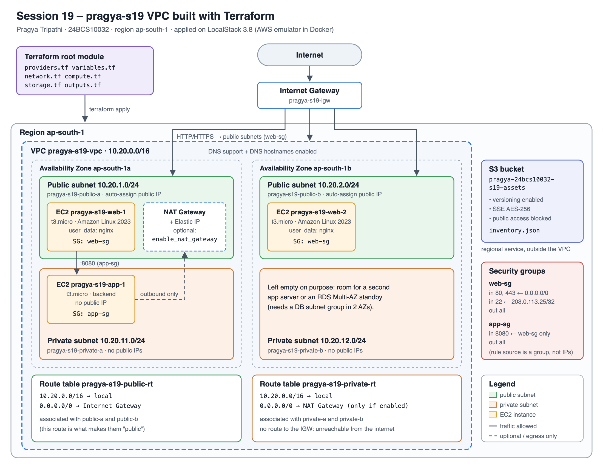
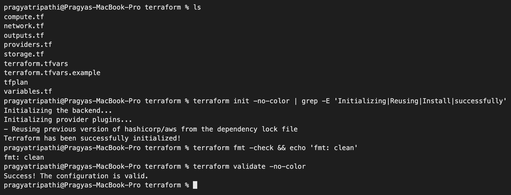
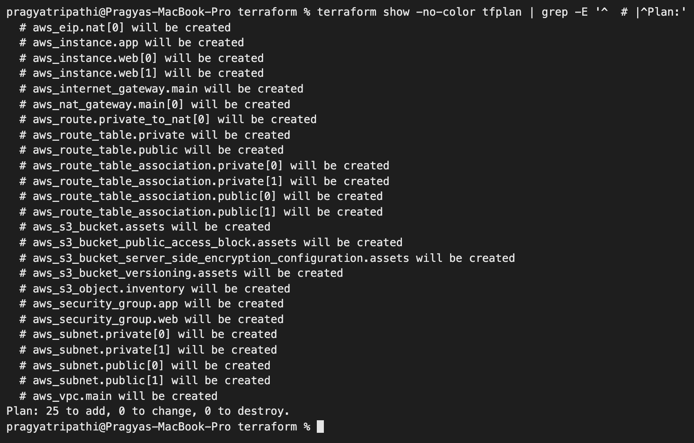
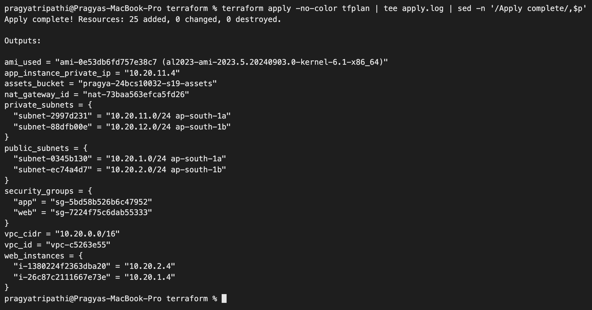
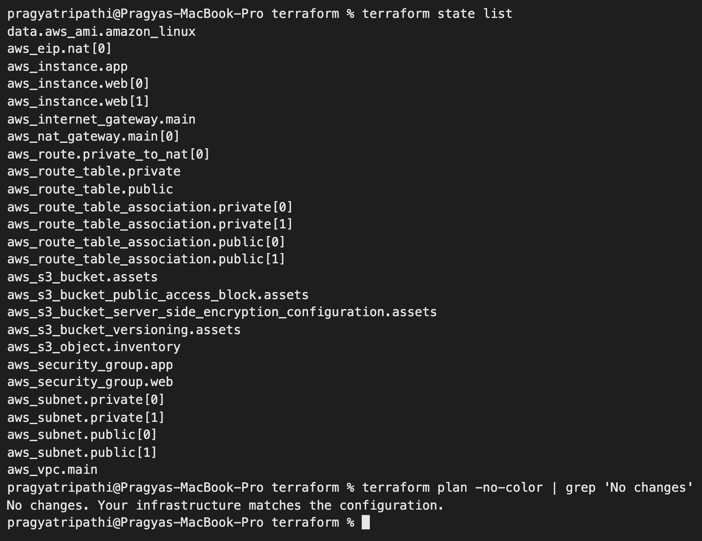
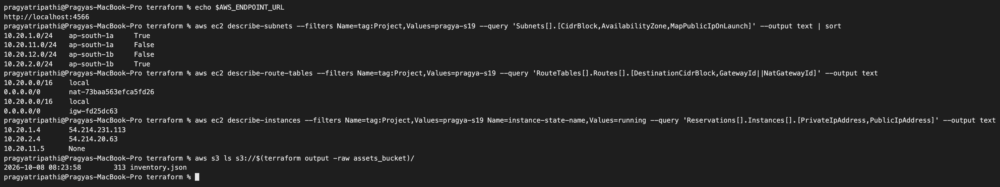
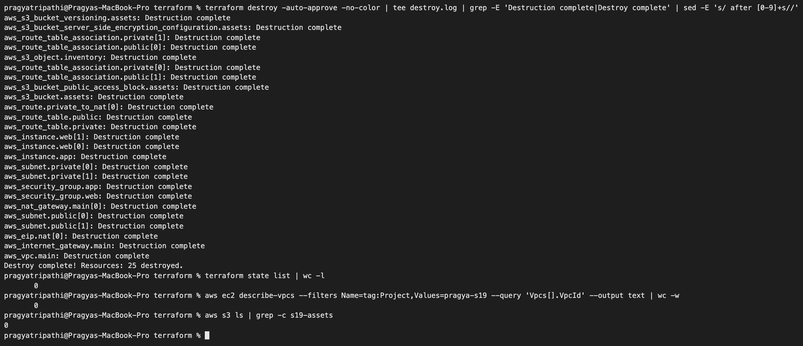

# Cloud & Terraform in Action – Homework

**Name:** Pragya Tripathi
**Roll No:** 24BCS10032

The class material ([session19-cloud-terraform](https://github.com/Nency-Ravaliya/devops-heros/tree/main/session19-cloud-terraform)) builds a VPC with one public subnet, an Internet Gateway, a route table and a web security group (labs 06 and 08). The optional extension adds an EC2 instance. I designed a slightly bigger, more realistic network around the same pieces and built all of it with **one `terraform apply`**:

- a VPC `10.20.0.0/16` (the mini-project's range) spread over **two Availability Zones**
- a **public and a private subnet in each AZ**
- Internet Gateway, public and private route tables, and an optional NAT gateway
- two security groups (web tier and app tier)
- **three EC2 instances**: a web server in each public subnet and a backend in a private subnet
- an **S3 bucket** (versioned, encrypted, private) holding an `inventory.json` built from the IDs of everything above

The code is in [terraform/](terraform). As in [session 18](../18_Terraform_IaC/README.md), it ran on **LocalStack 3.8** (AWS APIs emulated in Docker) because I have no AWS credentials on this machine. Every output below is real. LocalStack's EC2 is a *simulation*: the API calls work and return IDs and IPs, but no VM boots and nginx never runs. At the end there is a section on what would differ on real AWS.

## Architecture



Source: [diagrams/architecture.svg](diagrams/architecture.svg). I wrote it by hand as an SVG and rendered it to PNG with a headless browser.

Design decisions:

| Decision | Why |
|---|---|
| Two AZs (`ap-south-1a`, `ap-south-1b`) | If one data centre fails, the other web server and subnets keep working. One AZ = single point of failure. |
| Public subnets `10.20.1.0/24`, `10.20.2.0/24` | Only things that must face the internet go here: web servers, the NAT gateway (later a load balancer). |
| Private subnets `10.20.11.0/24`, `10.20.12.0/24` | Backend and databases. No route to the IGW, no public IPs, so they cannot be reached from the internet at all. |
| Subnet ranges computed with `cidrsubnet()` | Change `vpc_cidr` and every subnet moves with it (shown in the exercise below). |
| `web-sg`: 80/443 from anywhere, **22 only from one /32** | The class asks why SSH should not be open to `0.0.0.0/0`: bots scan the whole internet for port 22 within minutes. |
| `app-sg`: 8080 **only from `web-sg`** | The rule names a security group, not IP ranges, so it keeps working when web servers are added or replaced. |
| NAT gateway behind `enable_nat_gateway` (default `false`) | Private servers need outbound internet for updates. On AWS a NAT gateway costs about $0.05/hour plus per-GB charges, so it is opt-in. I switched it **on** for the LocalStack run because there it is free. |
| S3 outside the VPC | S3 is a regional service, not something that lives inside a subnet. Instances reach it over the internet/NAT, or privately through a VPC gateway endpoint. |
| `default_tags` on the provider | Owner/roll no/project/session tags land on every resource without repeating them in each block. |

## The code

| File | Contents |
|---|---|
| [providers.tf](terraform/providers.tf) | `terraform` block (aws `~> 6.0`), provider with `default_tags` and the LocalStack endpoints |
| [variables.tf](terraform/variables.tf) | region, project prefix, `vpc_cidr` (validated), `azs` (exactly 2), instance type, SSH CIDR, NAT switch, bucket name |
| [network.tf](terraform/network.tf) | VPC, IGW, 4 subnets, 2 route tables + 4 associations, optional EIP + NAT + route, 2 security groups |
| [compute.tf](terraform/compute.tf) | `aws_ami` data source (latest Amazon Linux 2023), 2 web instances with nginx `user_data`, 1 app instance |
| [storage.tf](terraform/storage.tf) | S3 bucket, versioning, encryption, public access block, `inventory.json` |
| [outputs.tf](terraform/outputs.tf) | VPC/subnet/SG/instance IDs, the AMI used, bucket name, NAT ID |
| [terraform.tfvars.example](terraform/terraform.tfvars.example) | copy to `terraform.tfvars` (git-ignored) |

Some parts worth explaining:

```hcl
# network.tf: one block, two subnets, ranges calculated from the VPC CIDR
resource "aws_subnet" "public" {
  count = length(var.azs)

  vpc_id                  = aws_vpc.main.id
  cidr_block              = cidrsubnet(var.vpc_cidr, 8, count.index + 1)   # 10.20.1.0/24, 10.20.2.0/24
  availability_zone       = var.azs[count.index]
  map_public_ip_on_launch = true
  tags = { Name = "${var.project}-public-${substr(var.azs[count.index], -1, 1)}", Tier = "public" }
}

# What makes a subnet "public" is this route, nothing else
resource "aws_route_table" "public" {
  vpc_id = aws_vpc.main.id
  route {
    cidr_block = "0.0.0.0/0"
    gateway_id = aws_internet_gateway.main.id
  }
}
```

```hcl
# network.tf: optional resources with count = condition ? 1 : 0
resource "aws_nat_gateway" "main" {
  count         = var.enable_nat_gateway ? 1 : 0
  allocation_id = aws_eip.nat[0].id
  subnet_id     = aws_subnet.public[0].id      # a NAT gateway sits in a PUBLIC subnet
  depends_on    = [aws_internet_gateway.main]  # the only dependency Terraform can't infer
}

# app tier only accepts traffic from the web tier's security group
  ingress {
    from_port       = 8080
    to_port         = 8080
    protocol        = "tcp"
    security_groups = [aws_security_group.web.id]
  }
```

```hcl
# compute.tf: find the AMI instead of hard-coding a region-specific ID
data "aws_ami" "amazon_linux" {
  most_recent = true
  owners      = ["amazon"]
  filter {
    name   = "name"
    values = ["al2023-ami-2023.*-x86_64"]
  }
}

resource "aws_instance" "web" {
  count                  = length(aws_subnet.public)      # one per public subnet = one per AZ
  ami                    = data.aws_ami.amazon_linux.id
  instance_type          = var.instance_type
  subnet_id              = aws_subnet.public[count.index].id
  vpc_security_group_ids = [aws_security_group.web.id]
  user_data              = <<-EOT ... dnf install -y nginx ... EOT
}
```

```hcl
# storage.tf: an object whose content depends on the network AND compute layers
resource "aws_s3_object" "inventory" {
  bucket  = aws_s3_bucket.assets.id
  key     = "inventory.json"
  content = jsonencode({
    vpc_id          = aws_vpc.main.id
    public_subnets  = aws_subnet.public[*].id
    private_subnets = aws_subnet.private[*].id
    web_instances   = zipmap(aws_instance.web[*].id, aws_instance.web[*].private_ip)
    app_instance    = { (aws_instance.app.id) = aws_instance.app.private_ip }
    ...
  })
}
```

The provider block is the same LocalStack setup as session 18 (dummy `test` keys, `skip_*` flags, `endpoints { ec2, s3, sts, iam }`), with `default_tags` added.

---

## 1. Variables, init, fmt, validate

```text
$ sed 's/^enable_nat_gateway = false/enable_nat_gateway = true # LocalStack: free to test/' terraform.tfvars.example > terraform.tfvars

$ cat terraform.tfvars
aws_region         = "ap-south-1"
project            = "pragya-s19"
vpc_cidr           = "10.20.0.0/16"
azs                = ["ap-south-1a", "ap-south-1b"]
instance_type      = "t3.micro"
ssh_allowed_cidr   = "203.0.113.25/32" # replace with your own public IP /32
enable_nat_gateway = true # LocalStack: free to test

$ terraform init
- Installing hashicorp/aws v6.67.0...
- Installed hashicorp/aws v6.67.0 (unauthenticated)
Warning: Incomplete lock file information for providers
Terraform has been successfully initialized!
```

(I kept only the key lines of `init`. It is the same provider, local mirror and lock-file warning as in session 18, where the full output is shown.)

`fmt` found a real formatting problem: my `sed` had added a comment that did not line up with the other comment in the file:

```text
$ terraform fmt -check -diff; echo "exit=$?"
terraform.tfvars
--- old/terraform.tfvars
+++ new/terraform.tfvars
@@ -4,4 +4,4 @@
 azs                = ["ap-south-1a", "ap-south-1b"]
 instance_type      = "t3.micro"
 ssh_allowed_cidr   = "203.0.113.25/32" # replace with your own public IP /32
-enable_nat_gateway = true # LocalStack: free to test
+enable_nat_gateway = true              # LocalStack: free to test
exit=3
$ terraform validate
Success! The configuration is valid.
$ terraform fmt
terraform.tfvars
$ terraform fmt -check && echo clean
clean
```

`-check` returns a non-zero exit code (3) when anything would change. That is the version to put in a CI pipeline.



## 2. Plan

```text
$ terraform plan -out=tfplan
data.aws_ami.amazon_linux: Reading...
data.aws_ami.amazon_linux: Read complete after 0s [id=ami-0e53db6fd757e38c7]
...
  # aws_subnet.public[0] will be created
  + resource "aws_subnet" "public" {
      + arn                                            = (known after apply)
      + assign_ipv6_address_on_creation                = false
      + availability_zone                              = "ap-south-1a"
      + availability_zone_id                           = (known after apply)
      + cidr_block                                     = "10.20.1.0/24"
      ...
      + map_public_ip_on_launch                        = true
      ...
      + tags                                           = {
          + "Name" = "pragya-s19-public-a"
          + "Tier" = "public"
        }
      + tags_all                                       = {
          + "ManagedBy" = "Terraform"
          + "Name"      = "pragya-s19-public-a"
          + "Owner"     = "Pragya Tripathi"
          + "Project"   = "pragya-s19"
          + "RollNo"    = "24BCS10032"
          + "Session"   = "19"
          + "Tier"      = "public"
        }
      + vpc_id                                         = (known after apply)
    }
...
Plan: 25 to add, 0 to change, 0 to destroy.

Changes to Outputs:
  + ami_used                = "ami-0e53db6fd757e38c7 (al2023-ami-2023.5.20240903.0-kernel-6.1-x86_64)"
  + app_instance_private_ip = (known after apply)
  + assets_bucket           = "pragya-24bcs10032-s19-assets"
  + nat_gateway_id          = (known after apply)
  + private_subnets         = (known after apply)
  + public_subnets          = (known after apply)
  + security_groups         = {
      + app = (known after apply)
      + web = (known after apply)
    }
  + vpc_cidr                = "10.20.0.0/16"
  + vpc_id                  = (known after apply)
  + web_instances           = (known after apply)
```

(I trimmed the plan to one resource. The full plan is long; the screenshot lists all 25 addresses.)

- The data source ran **during plan**. The AMI was looked up before anything was created.
- `tags` holds only what the resource sets. `tags_all` adds the provider's `default_tags`.
- 25 resources = 1 VPC + 1 IGW + 4 subnets + 2 route tables + 4 associations + 1 EIP + 1 NAT + 1 route + 2 SGs + 3 instances + 5 S3 resources.



## 3. Apply

The full log of the real apply (the screenshot shows the outputs part):

```text
$ terraform apply tfplan
aws_eip.nat[0]: Creating...
aws_vpc.main: Creating...
aws_s3_bucket.assets: Creating...
aws_eip.nat[0]: Creation complete after 0s [id=eipalloc-b0d2fa21]
aws_vpc.main: Creation complete after 0s [id=vpc-c5263e55]
aws_internet_gateway.main: Creating...
aws_route_table.private: Creating...
aws_subnet.private[1]: Creating...
aws_subnet.public[0]: Creating...
aws_subnet.public[1]: Creating...
aws_subnet.private[0]: Creating...
aws_security_group.web: Creating...
aws_s3_bucket.assets: Creation complete after 0s [id=pragya-24bcs10032-s19-assets]
aws_s3_bucket_versioning.assets: Creating...
aws_s3_bucket_server_side_encryption_configuration.assets: Creating...
aws_s3_bucket_public_access_block.assets: Creating...
aws_subnet.private[1]: Creation complete after 0s [id=subnet-88dfb00e]
aws_subnet.private[0]: Creation complete after 0s [id=subnet-2997d231]
aws_internet_gateway.main: Creation complete after 0s [id=igw-fd25dc63]
aws_s3_bucket_public_access_block.assets: Creation complete after 0s [id=pragya-24bcs10032-s19-assets]
aws_s3_bucket_server_side_encryption_configuration.assets: Creation complete after 0s [id=pragya-24bcs10032-s19-assets]
aws_route_table.public: Creating...
aws_route_table.private: Creation complete after 0s [id=rtb-c3b32c1c]
aws_route_table_association.private[1]: Creating...
aws_route_table_association.private[0]: Creating...
aws_route_table_association.private[1]: Creation complete after 0s [id=rtbassoc-7940d01d]
aws_route_table_association.private[0]: Creation complete after 0s [id=rtbassoc-a9428bce]
aws_security_group.web: Creation complete after 0s [id=sg-7224f75c6dab55333]
aws_security_group.app: Creating...
aws_route_table.public: Creation complete after 0s [id=rtb-8e7b5865]
aws_security_group.app: Creation complete after 1s [id=sg-5bd58b526b6c47952]
aws_instance.app: Creating...
aws_s3_bucket_versioning.assets: Creation complete after 1s [id=pragya-24bcs10032-s19-assets]
aws_subnet.public[1]: Still creating... [00m10s elapsed]
aws_subnet.public[0]: Still creating... [00m10s elapsed]
aws_subnet.public[0]: Creation complete after 10s [id=subnet-0345b130]
aws_subnet.public[1]: Creation complete after 10s [id=subnet-ec74a4d7]
aws_route_table_association.public[1]: Creating...
aws_route_table_association.public[0]: Creating...
aws_nat_gateway.main[0]: Creating...
aws_instance.web[0]: Creating...
aws_instance.web[1]: Creating...
aws_route_table_association.public[1]: Creation complete after 0s [id=rtbassoc-fa10d889]
aws_route_table_association.public[0]: Creation complete after 0s [id=rtbassoc-97250082]
aws_nat_gateway.main[0]: Creation complete after 0s [id=nat-73baa563efca5fd26]
aws_route.private_to_nat[0]: Creating...
aws_route.private_to_nat[0]: Creation complete after 0s [id=r-rtb-c3b32c1c1080289494]
aws_instance.app: Still creating... [00m10s elapsed]
aws_instance.app: Creation complete after 10s [id=i-7e545e4f3bd10de5f]
aws_instance.web[1]: Still creating... [00m10s elapsed]
aws_instance.web[0]: Still creating... [00m10s elapsed]
aws_instance.web[0]: Creation complete after 10s [id=i-26c87c2111667e73e]
aws_instance.web[1]: Creation complete after 10s [id=i-1380224f2363dba20]
aws_s3_object.inventory: Creating...
aws_s3_object.inventory: Creation complete after 0s [id=pragya-24bcs10032-s19-assets/inventory.json]

Apply complete! Resources: 25 added, 0 changed, 0 destroyed.

Outputs:

ami_used = "ami-0e53db6fd757e38c7 (al2023-ami-2023.5.20240903.0-kernel-6.1-x86_64)"
app_instance_private_ip = "10.20.11.4"
assets_bucket = "pragya-24bcs10032-s19-assets"
nat_gateway_id = "nat-73baa563efca5fd26"
private_subnets = {
  "subnet-2997d231" = "10.20.11.0/24 ap-south-1a"
  "subnet-88dfb00e" = "10.20.12.0/24 ap-south-1b"
}
public_subnets = {
  "subnet-0345b130" = "10.20.1.0/24 ap-south-1a"
  "subnet-ec74a4d7" = "10.20.2.0/24 ap-south-1b"
}
security_groups = {
  "app" = "sg-5bd58b526b6c47952"
  "web" = "sg-7224f75c6dab55333"
}
vpc_cidr = "10.20.0.0/16"
vpc_id = "vpc-c5263e55"
web_instances = {
  "i-1380224f2363dba20" = "10.20.2.4"
  "i-26c87c2111667e73e" = "10.20.1.4"
}
```

Reading the order back:

- The VPC, the EIP and the S3 bucket depend on nothing, so they started together in the first second.
- Everything that needs `aws_vpc.main.id` (IGW, subnets, route tables, `web-sg`) waited for the VPC. `app-sg` waited for `web-sg` because its rule references it.
- The NAT gateway waited for the public subnet, the EIP **and** the IGW (my one explicit `depends_on`). The `0.0.0.0/0 → NAT` route waited for the NAT.
- `inventory.json` was created **last**, because its content uses IDs from the network and compute layers. Nowhere did I write an order. It all comes from references.
- The instance IPs end in `.4`: AWS reserves `.0`–`.3` (network, router, DNS, future use) in every subnet.



## 4. State, and two problems the second plan found

```text
$ terraform state list
data.aws_ami.amazon_linux
aws_eip.nat[0]
aws_instance.app
aws_instance.web[0]
aws_instance.web[1]
aws_internet_gateway.main
aws_nat_gateway.main[0]
aws_route.private_to_nat[0]
aws_route_table.private
aws_route_table.public
aws_route_table_association.private[0]
aws_route_table_association.private[1]
aws_route_table_association.public[0]
aws_route_table_association.public[1]
aws_s3_bucket.assets
aws_s3_bucket_public_access_block.assets
aws_s3_bucket_server_side_encryption_configuration.assets
aws_s3_bucket_versioning.assets
aws_s3_object.inventory
aws_security_group.app
aws_security_group.web
aws_subnet.private[0]
aws_subnet.private[1]
aws_subnet.public[0]
aws_subnet.public[1]
aws_vpc.main

$ terraform state list | wc -l
      26

$ terraform state show -no-color 'aws_subnet.public[0]' | grep -E 'cidr_block |availability_zone |map_public_ip_on_launch|vpc_id|"Name"'
    availability_zone                              = "ap-south-1a"
    cidr_block                                     = "10.20.1.0/24"
    ipv6_cidr_block                                = null
    map_public_ip_on_launch                        = true
        "Name" = "pragya-s19-public-a"
        "Name"      = "pragya-s19-public-a"
    vpc_id                                         = "vpc-c5263e55"

$ terraform plan -no-color | grep -E '^  # |^Plan:|No changes'
  # aws_instance.app will be updated in-place
  # aws_s3_bucket.assets will be updated in-place
Plan: 0 to add, 2 to change, 0 to destroy.
```

26 entries = 25 managed resources + 1 data source. But the plan right after apply should have said "No changes", and it didn't:

```text
$ terraform plan -no-color | sed -n '/Terraform will perform/,/^Plan:/p'
Terraform will perform the following actions:

  # aws_instance.app will be updated in-place
  ~ resource "aws_instance" "app" {
        id                                   = "i-7e545e4f3bd10de5f"
        tags                                 = {
            "Name" = "pragya-s19-app-1"
        }
      ~ vpc_security_group_ids               = [
          + "sg-5bd58b526b6c47952",
        ]
        # (39 unchanged attributes hidden)

        # (2 unchanged blocks hidden)
    }

  # aws_s3_bucket.assets will be updated in-place
  ~ resource "aws_s3_bucket" "assets" {
        id                          = "pragya-24bcs10032-s19-assets"
      ~ tags                        = {
          + "Name" = "pragya-24bcs10032-s19-assets"
        }
      ~ tags_all                    = {
          + "ManagedBy" = "Terraform"
          + "Name"      = "pragya-24bcs10032-s19-assets"
          + "Owner"     = "Pragya Tripathi"
          + "Project"   = "pragya-s19"
          + "RollNo"    = "24BCS10032"
          + "Session"   = "19"
        }
        # (14 unchanged attributes hidden)

        # (3 unchanged blocks hidden)
    }

Plan: 0 to add, 2 to change, 0 to destroy.
```

**Bucket tags:** this is the same LocalStack 3.8 gap I tracked down in [session 18](../18_Terraform_IaC/README.md#what-i-found-localstack-38-drops-tags-sent-with-createbucket). Provider 6.x sends tags inside `CreateBucket`, which LocalStack ignores.

**App instance security group:** I asked the API directly:

```text
$ aws ec2 describe-instances --filters Name=tag:Project,Values=pragya-s19 --query 'Reservations[].Instances[].[Tags[?Key==`Name`]|[0].Value, SecurityGroups[0].GroupName, NetworkInterfaces[0].Groups[0].GroupName]' --output text
pragya-s19-app-1	None	pragya-s19-app-sg
pragya-s19-web-1	pragya-s19-web-sg	pragya-s19-web-sg
pragya-s19-web-2	pragya-s19-web-sg	pragya-s19-web-sg

$ aws s3api get-bucket-tagging --bucket pragya-24bcs10032-s19-assets

An error occurred (NoSuchTagSet) when calling the GetBucketTagging operation: The TagSet does not exist

$ terraform apply -no-color -auto-approve | grep -E 'Modif|Apply complete'
aws_s3_bucket.assets: Modifying... [id=pragya-24bcs10032-s19-assets]
aws_instance.app: Modifying... [id=i-7e545e4f3bd10de5f]
aws_instance.app: Modifications complete after 0s [id=i-7e545e4f3bd10de5f]
aws_s3_bucket.assets: Modifications complete after 0s [id=pragya-24bcs10032-s19-assets]
Apply complete! Resources: 0 added, 2 changed, 0 destroyed.

$ terraform plan -no-color | grep -E '^  # |^Plan:|No changes'
  # aws_instance.app will be updated in-place
Plan: 0 to add, 1 to change, 0 to destroy.

$ aws ec2 describe-instances --filters Name=tag:Name,Values=pragya-s19-app-1 --query 'Reservations[].Instances[].SecurityGroups[].GroupName' --output text

```

The app instance's **network interface** had `app-sg`, but the instance-level `SecurityGroups` list was empty, and a second apply did not fix it. The difference from the web servers was one line I had written in the first version of `compute.tf`:

```hcl
resource "aws_instance" "app" {
  ...
  vpc_security_group_ids      = [aws_security_group.app.id]
  associate_public_ip_address = false        # <- this line
```

Setting `associate_public_ip_address` makes the provider launch the instance with an explicit network-interface spec, and pass the security groups inside that spec. LocalStack stored them on the interface but never reported them on the instance. So Terraform kept seeing "no SG" and kept trying to add it. The line was **redundant** anyway: the private subnets have `map_public_ip_on_launch = false`, so instances there never get a public IP. I deleted the line (with a comment explaining why) and recreated only that instance:

```text
$ terraform fmt -check && terraform validate -no-color
Success! The configuration is valid.


$ terraform apply -no-color -auto-approve -replace=aws_instance.app | grep -E '^  # |Destr|Creat|Modif|Apply complete|app_instance_private_ip|inventory'
aws_s3_object.inventory: Refreshing state... [id=pragya-24bcs10032-s19-assets/inventory.json]
  # aws_instance.app will be replaced, as requested
  # aws_s3_object.inventory will be updated in-place
  ~ resource "aws_s3_object" "inventory" {
        id                            = "pragya-24bcs10032-s19-assets/inventory.json"
  ~ app_instance_private_ip = "10.20.11.4" -> (known after apply)
aws_instance.app: Destroying... [id=i-7e545e4f3bd10de5f]
aws_instance.app: Destruction complete after 10s
aws_instance.app: Creating...
aws_instance.app: Creation complete after 10s [id=i-6dbe20df47578a7b7]
aws_s3_object.inventory: Modifying... [id=pragya-24bcs10032-s19-assets/inventory.json]
aws_s3_object.inventory: Modifications complete after 0s [id=pragya-24bcs10032-s19-assets/inventory.json]
Apply complete! Resources: 1 added, 1 changed, 0 destroyed.
app_instance_private_ip = "10.20.11.5"

$ terraform plan -no-color | grep -E '^  # |^Plan:|No changes'
No changes. Your infrastructure matches the configuration.

$ aws ec2 describe-instances --filters Name=tag:Name,Values=pragya-s19-app-1 Name=instance-state-name,Values=running --query 'Reservations[].Instances[].[InstanceId,SecurityGroups[0].GroupName,PrivateIpAddress,PublicIpAddress]' --output text
i-6dbe20df47578a7b7	pragya-s19-app-sg	10.20.11.5	None
```

- `-replace=ADDRESS` forces Terraform to destroy and recreate one resource (it replaced the old `terraform taint`).
- `inventory.json` was **updated automatically**, because its content includes the app instance's ID. A changed ID ripples through every dependent resource.
- After that, the plan was clean and the instance reports `app-sg` with no public IP.



## 5. Verifying with the AWS CLI

```text
$ aws ec2 describe-vpcs --filters Name=tag:Name,Values=pragya-s19-vpc --query 'Vpcs[].[VpcId,CidrBlock,State]' --output table
-----------------------------------------------
|                DescribeVpcs                 |
+--------------+----------------+-------------+
|  vpc-c5263e55|  10.20.0.0/16  |  available  |
+--------------+----------------+-------------+

$ aws ec2 describe-subnets --filters Name=tag:Project,Values=pragya-s19 --query 'sort_by(Subnets,&CidrBlock)[].[Tags[?Key==`Name`]|[0].Value,CidrBlock,AvailabilityZone,MapPublicIpOnLaunch]' --output table
-------------------------------------------------------------------
|                         DescribeSubnets                         |
+-----------------------+-----------------+--------------+--------+
|  pragya-s19-public-a  |  10.20.1.0/24   |  ap-south-1a |  True  |
|  pragya-s19-private-a |  10.20.11.0/24  |  ap-south-1a |  False |
|  pragya-s19-private-b |  10.20.12.0/24  |  ap-south-1b |  False |
|  pragya-s19-public-b  |  10.20.2.0/24   |  ap-south-1b |  True  |
+-----------------------+-----------------+--------------+--------+

$ aws ec2 describe-route-tables --filters Name=tag:Project,Values=pragya-s19 --query 'RouteTables[].[Tags[?Key==`Name`]|[0].Value, join(`, `, Routes[].join(`->`, [DestinationCidrBlock, GatewayId || NatGatewayId])), length(Associations)]' --output table
-----------------------------------------------------------------------------------------
|                                  DescribeRouteTables                                  |
+------------------------+---------------------------------------------------------+----+
|  pragya-s19-private-rt |  10.20.0.0/16->local, 0.0.0.0/0->nat-73baa563efca5fd26  |  2 |
|  pragya-s19-public-rt  |  10.20.0.0/16->local, 0.0.0.0/0->igw-fd25dc63           |  2 |
+------------------------+---------------------------------------------------------+----+

$ aws ec2 describe-security-groups --filters Name=tag:Project,Values=pragya-s19 --query 'SecurityGroups[].[GroupName, join(`, `, IpPermissions[].join(`:`, [to_string(FromPort), join(`+`, [IpRanges[].CidrIp, UserIdGroupPairs[].GroupId][])]))]' --output table
--------------------------------------------------------------------------
|                         DescribeSecurityGroups                         |
+--------------------+---------------------------------------------------+
|  pragya-s19-web-sg |  22:203.0.113.25/32, 80:0.0.0.0/0, 443:0.0.0.0/0  |
|  pragya-s19-app-sg |  8080:sg-7224f75c6dab55333                        |
+--------------------+---------------------------------------------------+

$ aws ec2 describe-instances --filters Name=tag:Project,Values=pragya-s19 Name=instance-state-name,Values=running --query 'sort_by(Reservations[].Instances[],&PrivateIpAddress)[].[Tags[?Key==`Name`]|[0].Value,InstanceId,InstanceType,Placement.AvailabilityZone,PrivateIpAddress,PublicIpAddress]' --output table
--------------------------------------------------------------------------------------------------------
|                                           DescribeInstances                                          |
+------------------+----------------------+-----------+--------------+--------------+------------------+
|  pragya-s19-web-1|  i-26c87c2111667e73e |  t3.micro |  ap-south-1a |  10.20.1.4   |  54.214.231.113  |
|  pragya-s19-app-1|  i-6dbe20df47578a7b7 |  t3.micro |  ap-south-1a |  10.20.11.5  |  None            |
|  pragya-s19-web-2|  i-1380224f2363dba20 |  t3.micro |  ap-south-1b |  10.20.2.4   |  54.214.20.63    |
+------------------+----------------------+-----------+--------------+--------------+------------------+

$ aws ec2 describe-nat-gateways --filter Name=vpc-id,Values=vpc-c5263e55 --query 'NatGateways[].[NatGatewayId,State,SubnetId,NatGatewayAddresses[0].AllocationId]' --output text
nat-73baa563efca5fd26	available	subnet-0345b130	eipalloc-b0d2fa21

$ aws ec2 describe-internet-gateways --filters Name=tag:Project,Values=pragya-s19 --query 'InternetGateways[].[InternetGatewayId,Attachments[0].VpcId,Attachments[0].State]' --output text
igw-fd25dc63	vpc-c5263e55	available

$ aws s3api get-bucket-tagging --bucket pragya-24bcs10032-s19-assets --query 'TagSet[?Key==`Owner`||Key==`Project`]' --output text
Project	pragya-s19
Owner	Pragya Tripathi

$ aws s3 cp s3://pragya-24bcs10032-s19-assets/inventory.json - | python3 -m json.tool
{
    "app_instance": {
        "i-6dbe20df47578a7b7": "10.20.11.5"
    },
    "owner": "Pragya Tripathi (24BCS10032)",
    "private_subnets": [
        "subnet-2997d231",
        "subnet-88dfb00e"
    ],
    "public_subnets": [
        "subnet-0345b130",
        "subnet-ec74a4d7"
    ],
    "vpc_id": "vpc-c5263e55",
    "web_instances": {
        "i-1380224f2363dba20": "10.20.2.4",
        "i-26c87c2111667e73e": "10.20.1.4"
    }
}
```

The API agrees with the diagram:

- 4 subnets across 2 AZs. Only the public ones auto-assign public IPs.
- The public route table sends `0.0.0.0/0` to the IGW and the private one to the NAT. Each table has 2 subnet associations.
- `web-sg` allows SSH only from `203.0.113.25/32`. `app-sg`'s only rule points at `web-sg`'s **ID**, not at an IP range.
- The web servers have public IPs. The app server has `None`.
- The NAT gateway sits in `subnet-0345b130`, which is public-a.
- `inventory.json` holds the replaced app instance's new ID and IP.

A note on the NAT command: I first filtered it by tag (`--filter Name=tag:Project,Values=pragya-s19`) and got **three** NAT gateways. LocalStack ignored that tag filter. The list included the deleted one from my [VPC research](../18_Terraform_IaC/aws-services/04-vpc/README.md) and a third one that belonged to a *different* Terraform project running on the same LocalStack container at the same time. Filtering by `vpc-id`, as above, returned only mine. On a shared account, always filter by something unique like the VPC ID.

Screenshot of a shorter version of these checks:



## 6. Class exercise: change the VPC CIDR (plan only)

The lab says: change `10.20.0.0/16` to `10.10.0.0/16`, run plan, and **don't apply until you understand it**. I passed the value on the command line instead of editing the file:

```text
$ terraform plan -no-color -var vpc_cidr=10.10.0.0/16 | grep -E 'must be replaced|^Plan:|cidr_block .*->'
  # aws_instance.app must be replaced
  # aws_instance.web[0] must be replaced
  # aws_instance.web[1] must be replaced
  # aws_nat_gateway.main[0] must be replaced
  # aws_route.private_to_nat[0] must be replaced
  # aws_route_table.private must be replaced
  # aws_route_table.public must be replaced
  # aws_route_table_association.private[0] must be replaced
  # aws_route_table_association.private[1] must be replaced
  # aws_route_table_association.public[0] must be replaced
  # aws_route_table_association.public[1] must be replaced
  # aws_security_group.app must be replaced
  # aws_security_group.web must be replaced
  # aws_subnet.private[0] must be replaced
      ~ cidr_block                                     = "10.20.11.0/24" -> "10.10.11.0/24" # forces replacement
  # aws_subnet.private[1] must be replaced
      ~ cidr_block                                     = "10.20.12.0/24" -> "10.10.12.0/24" # forces replacement
  # aws_subnet.public[0] must be replaced
      ~ cidr_block                                     = "10.20.1.0/24" -> "10.10.1.0/24" # forces replacement
  # aws_subnet.public[1] must be replaced
      ~ cidr_block                                     = "10.20.2.0/24" -> "10.10.2.0/24" # forces replacement
  # aws_vpc.main must be replaced
      - assign_generated_ipv6_cidr_block     = false -> null
      ~ cidr_block                           = "10.20.0.0/16" -> "10.10.0.0/16" # forces replacement
Plan: 18 to add, 2 to change, 18 to destroy.

$ terraform plan -no-color -var vpc_cidr=10.10.0.0/33 2>&1 | grep -E 'Error|vpc_cidr must'
Error: Invalid value for variable
vpc_cidr must be a valid IPv4 CIDR, for example 10.20.0.0/16.
```

This is exactly why the lab says not to apply blindly. A VPC's CIDR **cannot be changed in place** (`# forces replacement`), so a one-character change means **destroying and rebuilding 18 resources**: the VPC, every subnet, route table, security group and all three servers. Thanks to `cidrsubnet()`, every subnet followed the new range automatically (`10.10.1.0/24`, `10.10.11.0/24`, ...). The `-/+` replacements of the web/app instances would mean downtime in real life. (I did not print the two in-place changes. From the code they should be the `inventory.json` object, whose content contains the VPC ID, and the Internet Gateway, which can be re-attached to a new VPC without being replaced.) The second command shows the `cidrnetmask()` validation rejecting `/33`.

Turning the optional NAT gateway off shows how `count = 0` removes resources:

```text
$ terraform plan -no-color -var enable_nat_gateway=false | grep -E '^  # |^Plan:'
  # aws_eip.nat[0] will be destroyed
  # (because index [0] is out of range for count)
  # aws_nat_gateway.main[0] will be destroyed
  # (because index [0] is out of range for count)
  # aws_route.private_to_nat[0] will be destroyed
  # (because index [0] is out of range for count)
Plan: 0 to add, 0 to change, 3 to destroy.
```

I did not apply either of these.

## 7. Destroy

```text
$ terraform plan -destroy | grep "^Plan:"
Plan: 0 to add, 0 to change, 25 to destroy.

$ terraform destroy -auto-approve
...
aws_route_table_association.private[1]: Destroying... [id=rtbassoc-7940d01d]
aws_s3_object.inventory: Destroying... [id=pragya-24bcs10032-s19-assets/inventory.json]
aws_route_table_association.public[1]: Destroying... [id=rtbassoc-fa10d889]
aws_s3_bucket_server_side_encryption_configuration.assets: Destroying... [id=pragya-24bcs10032-s19-assets]
aws_route_table_association.private[0]: Destroying... [id=rtbassoc-a9428bce]
aws_route_table_association.public[0]: Destroying... [id=rtbassoc-97250082]
aws_s3_bucket_versioning.assets: Destroying... [id=pragya-24bcs10032-s19-assets]
aws_s3_bucket_public_access_block.assets: Destroying... [id=pragya-24bcs10032-s19-assets]
aws_route.private_to_nat[0]: Destroying... [id=r-rtb-c3b32c1c1080289494]
aws_s3_bucket_versioning.assets: Destruction complete after 0s
aws_s3_bucket_server_side_encryption_configuration.assets: Destruction complete after 0s
aws_route_table_association.private[1]: Destruction complete after 0s
aws_route_table_association.public[0]: Destruction complete after 0s
aws_s3_object.inventory: Destruction complete after 0s
aws_route_table_association.private[0]: Destruction complete after 0s
aws_route_table_association.public[1]: Destruction complete after 0s
aws_s3_bucket_public_access_block.assets: Destruction complete after 0s
aws_instance.web[0]: Destroying... [id=i-26c87c2111667e73e]
aws_instance.app: Destroying... [id=i-6dbe20df47578a7b7]
aws_instance.web[1]: Destroying... [id=i-1380224f2363dba20]
aws_route_table.public: Destroying... [id=rtb-8e7b5865]
aws_s3_bucket.assets: Destroying... [id=pragya-24bcs10032-s19-assets]
aws_s3_bucket.assets: Destruction complete after 0s
aws_route.private_to_nat[0]: Destruction complete after 0s
aws_route_table.private: Destroying... [id=rtb-c3b32c1c]
aws_nat_gateway.main[0]: Destroying... [id=nat-73baa563efca5fd26]
aws_route_table.public: Destruction complete after 0s
aws_route_table.private: Destruction complete after 0s
aws_instance.web[1]: Destruction complete after 10s
aws_instance.web[0]: Destruction complete after 10s
aws_instance.app: Destruction complete after 10s
aws_subnet.private[1]: Destroying... [id=subnet-88dfb00e]
aws_subnet.private[0]: Destroying... [id=subnet-2997d231]
aws_security_group.app: Destroying... [id=sg-5bd58b526b6c47952]
aws_subnet.private[0]: Destruction complete after 0s
aws_subnet.private[1]: Destruction complete after 0s
aws_security_group.app: Destruction complete after 0s
aws_security_group.web: Destroying... [id=sg-7224f75c6dab55333]
aws_security_group.web: Destruction complete after 0s
aws_nat_gateway.main[0]: Destruction complete after 20s
aws_internet_gateway.main: Destroying... [id=igw-fd25dc63]
aws_eip.nat[0]: Destroying... [id=eipalloc-b0d2fa21]
aws_subnet.public[1]: Destroying... [id=subnet-ec74a4d7]
aws_subnet.public[0]: Destroying... [id=subnet-0345b130]
aws_subnet.public[0]: Destruction complete after 0s
aws_subnet.public[1]: Destruction complete after 0s
aws_eip.nat[0]: Destruction complete after 0s
aws_internet_gateway.main: Destruction complete after 0s
aws_vpc.main: Destroying... [id=vpc-c5263e55]
aws_vpc.main: Destruction complete after 0s

Destroy complete! Resources: 25 destroyed.

$ terraform state list | wc -l
       0

$ aws ec2 describe-vpcs --filters Name=tag:Project,Values=pragya-s19 --query 'Vpcs[].VpcId' --output text | wc -w
       0

$ aws s3 ls | grep -c s19-assets
0
```

I trimmed the start of the log (25 "Refreshing state..." lines and the destroy plan) and 5 "Still destroying..." progress lines. The screenshot shows the real run.

The destroy order is creation reversed. The leaves went first (associations, S3 sub-resources, the NAT route), then the instances. Only after the **instances** were gone could their subnets and security groups go. Only after the **NAT gateway** was gone (it took the longest, 20 s) could its EIP, the public subnets and the IGW go. The **VPC was last**. AWS refuses to delete a VPC that still contains anything, and Terraform never tries, because it walks the same dependency graph backwards.



---

## What would be different on real AWS

| Topic | LocalStack run | Real AWS |
|---|---|---|
| Provider | `endpoints`, dummy `test` keys, `skip_*` flags | Remove them. Credentials from `aws configure` / SSO / an OIDC role in CI. |
| EC2 | Simulated: IDs and IPs are made up, no VM boots, `user_data` never runs | Real VMs. nginx would answer on the web servers' public IPs at port 80. |
| Public IPs | `54.214.x.x` invented by LocalStack | Real addresses that change on stop/start (use an Elastic IP or a load balancer for a stable address). |
| NAT gateway | Became `available` instantly, free | Takes 1–2 minutes and costs about $0.045–0.056/hour plus per-GB data processing. Production uses one per AZ. |
| Bucket tags | Needed a second apply (CreateBucket tag gap) | Set on the first apply. |
| Bucket name | Anything | Must be globally unique. |
| AMI | LocalStack's built-in copy of `al2023-ami-2023.5.20240903.0` | The data source would pick the newest AL2023 image in `ap-south-1`. |
| Cost | Free | 3 × t3.micro + NAT + EIP + S3: a few dollars per day, so **destroy after the lab**. |
| State | Local `terraform.tfstate` (git-ignored) | Remote S3 backend with locking, so teammates and CI share one state. |

What I would add for production (left out to keep the lab small, or because LocalStack community lacks it): an **Application Load Balancer** in the public subnets with the web servers moved into private subnets; an **RDS** database in the private subnets (RDS is Pro-only in LocalStack, see the [research page](../18_Terraform_IaC/aws-services/05-dynamodb-rds/README.md)); a **NAT per AZ**; an **IAM instance profile** for S3 access instead of keys; **SSM Session Manager** instead of SSH; and splitting the code into `network` / `compute` / `storage` **modules**.

## Optional extension questions (lab 08)

1. **Which subnet should the EC2 instance use?** A public subnet, if it must be reached directly from the internet. My web servers use `public-a` and `public-b`. Anything internal (my app server) goes in a private subnet.
2. **Which security group?** One that opens only the ports the service needs: `web-sg` (80/443 from anywhere, 22 from one admin IP).
3. **Why does a public subnet need a route to the IGW?** Without `0.0.0.0/0 → igw`, packets to and from the internet have nowhere to go. The subnet would be private even if instances had public IPs.
4. **What else is needed for an instance to be reachable?** A public IP (`map_public_ip_on_launch` or an EIP), a security group allowing the port, a NACL that does not block it (the default allows everything), and a service actually listening on the instance.
5. **Why not SSH from `0.0.0.0/0`?** Every IPv4 address is constantly scanned for port 22 and brute-forced. Limit it to your own `/32`, use a bastion host, or skip SSH and use SSM Session Manager.

## Interview questions (lab 08)

| Question | My answer |
|---|---|
| IaaS vs PaaS vs SaaS | **IaaS**: you rent raw infrastructure (EC2, VPC) and manage the OS upwards. **PaaS**: you bring code, and the provider runs the platform (Elastic Beanstalk, App Runner, Heroku). **SaaS**: you just use finished software (Gmail, Slack). Each step hands more responsibility to the provider. |
| Region vs Availability Zone | A **region** is a geographic area (`ap-south-1` = Mumbai). An **AZ** is one or more separate data centres inside it (`ap-south-1a/b/c`) with independent power and networking, linked by low-latency links. Spread across AZs for availability; across regions for disaster recovery or latency. |
| VPC vs Subnet | A **VPC** is your private network in a region (`10.20.0.0/16`). A **subnet** is a slice of it (`10.20.1.0/24`) that lives in exactly one AZ. |
| Public vs private subnet | Decided by the route table only: public = has a `0.0.0.0/0` route to an Internet Gateway; private = doesn't (it may route to a NAT for outbound-only access). |
| Route table | The list of "destination → target" rules for a subnet. Always contains `VPC-CIDR → local`. The most specific match wins. |
| Internet Gateway | The VPC's two-way door to the internet for resources with public IPs. One per VPC, highly available, free. |
| Security Group | Stateful, allow-only firewall on an instance's network interface. Return traffic is allowed automatically, and a rule can reference another security group. |
| Terraform | An open-source IaC tool. You declare resources in HCL, and it uses provider plugins to create, change and delete them through APIs, tracking them in state. |
| `plan` vs `apply` | `plan` shows the diff between code and reality without changing anything. `apply` executes it (optionally exactly a saved plan) and updates the state. |
| Terraform state | Terraform's record mapping each resource address to a real ID and its attributes. Needed to compute diffs. Sensitive, so store it remotely with locking, never in Git. |
| `terraform destroy` | Deletes everything in the current state in reverse dependency order, after showing a destroy plan and asking for confirmation. |

## What I understood

- **Public vs private is a routing decision.** The only difference between my `public-a` and `private-a` subnets is which route table they use and whether they auto-assign public IPs. The CLI output of the two route tables showed this directly.
- **`count`, `cidrsubnet()`, `default_tags` and `count = cond ? 1 : 0`** turn repetitive infrastructure into a few parameters: two AZs, an optional NAT, and tags everywhere, with no copy-pasted blocks.
- **The dependency graph is the whole engine.** Creation order, parallelism, destroy order, and even the inventory file updating itself after `-replace` all come from references between resources.
- **Read the plan before applying.** Changing one CIDR character planned 18 replacements, including every server. `plan` makes that visible before it hurts.
- **"No changes" after apply is the real success check.** It caught two emulator mismatches, and one of them led me to remove a redundant line from my own code.
- **Filter by something unique.** On a shared LocalStack (and on a shared AWS account), a tag filter that I assumed would work returned someone else's NAT gateway.
