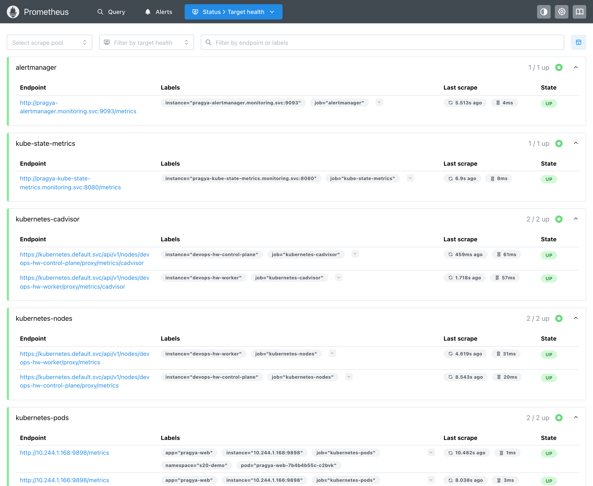
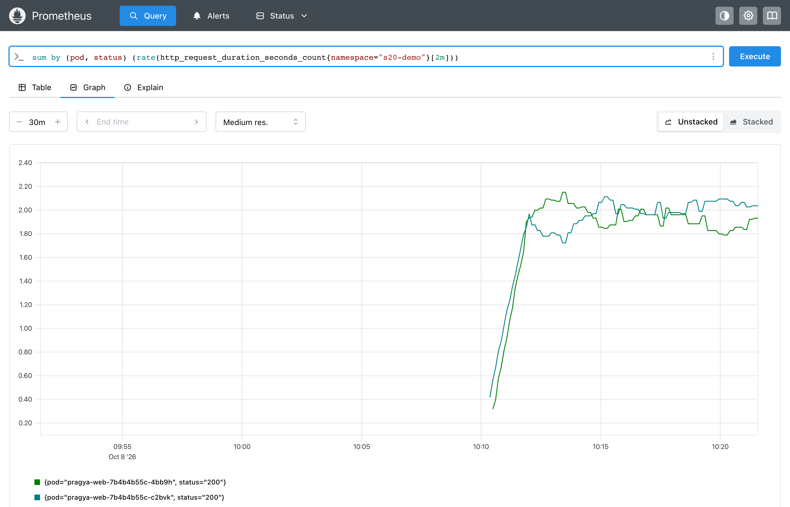
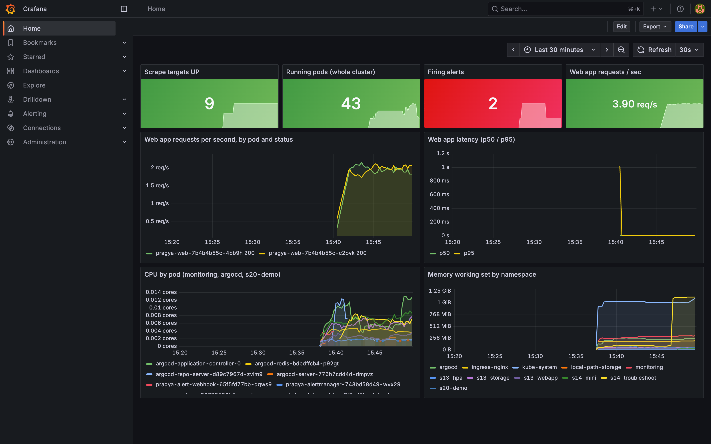
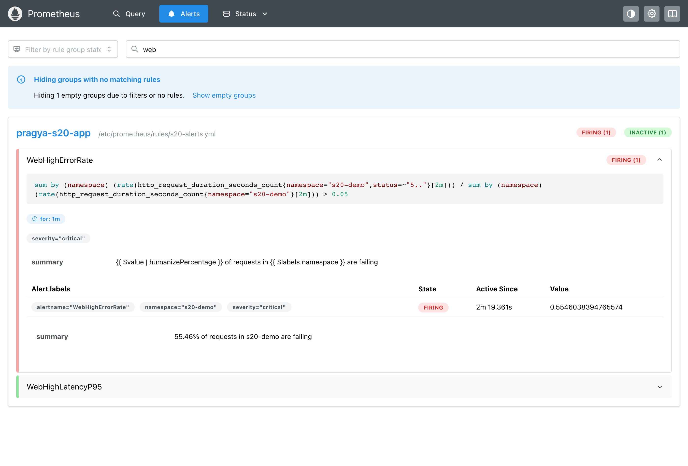
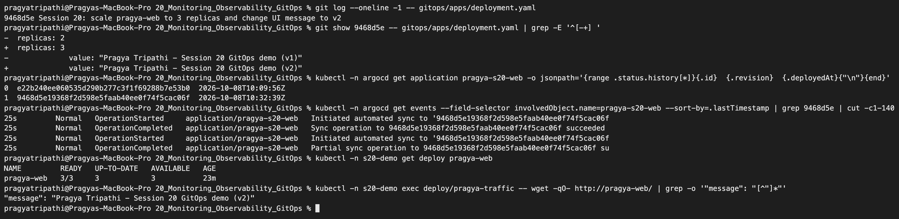
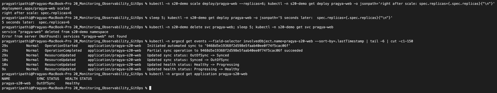
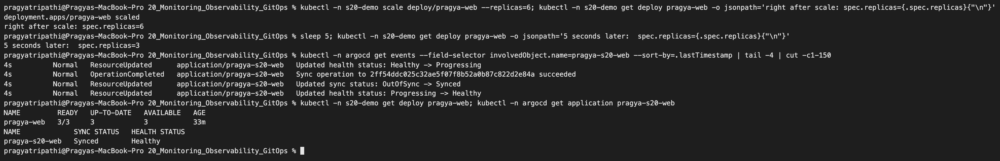
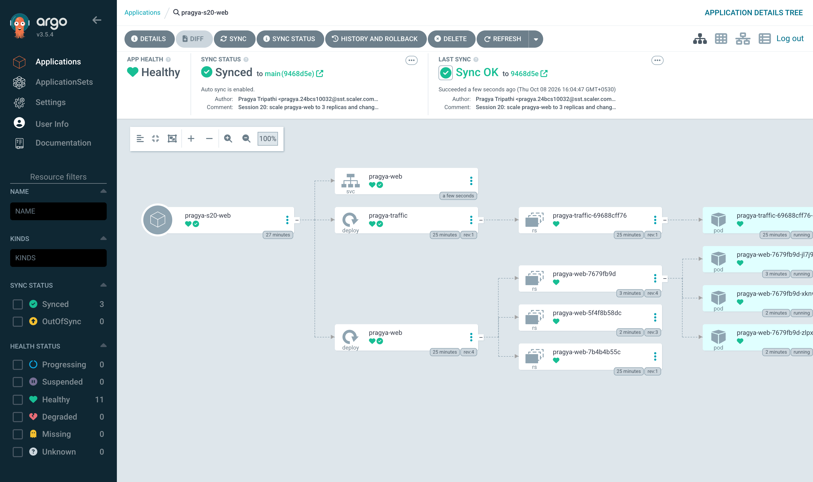

# Monitoring, Observability & GitOps – Homework

**Name:** Pragya Tripathi
**Roll No:** 24BCS10032

The class material ([session20-monitoring-observability-gitops](https://github.com/Nency-Ravaliya/devops-heros/tree/main/session20-monitoring-observability-gitops)) runs Prometheus and Grafana with Docker Compose and then installs Argo CD on a kind cluster. I did both parts **inside my 2-node kind cluster `devops-hw`**, so that Prometheus could watch real Kubernetes workloads, and I pointed Argo CD at **this GitHub repository**. Every output below was copied from my terminal.

| Part | What I built | Files |
|---|---|---|
| Monitoring | Prometheus v3.5, kube-state-metrics, Alertmanager + a webhook receiver, Grafana 12.1 | [manifests/](manifests) |
| Dashboards as code | Grafana datasource + dashboard loaded from ConfigMaps | [manifests/05-grafana.yaml](manifests/05-grafana.yaml), [manifests/grafana/](manifests/grafana) |
| Alerting | 7 alert rules, one fired for real and reached the webhook | [manifests/01-prometheus-config.yaml](manifests/01-prometheus-config.yaml) |
| Observability | metrics, logs and traces explained with my own cluster's data | section 5 |
| GitOps | Argo CD v3.5.4 syncing `20_Monitoring_Observability_GitOps/gitops/apps` from GitHub | [gitops/](gitops) |
| Helper | `scripts/promql.sh` - runs a PromQL query through the Prometheus HTTP API and prints one line per series | [scripts/promql.sh](scripts/promql.sh) |

---

## 1. Monitoring vs observability (in my words)

- **Monitoring** = watching numbers I already decided are important and getting told when they cross a line. It answers *"is something wrong?"*. Example from this homework: `WebHighErrorRate` fires when more than 5% of requests fail.
- **Observability** = the system gives out enough data (metrics, logs, traces) that I can work out *why* it is wrong, even for a problem I never planned for. In section 5 I used logs to explain an error that a metric only showed as a number.
- They are not competitors. Monitoring tells me *when* to look, observability lets me *understand* what I am looking at.

## 2. The monitoring stack

```text
 kubelet/cAdvisor (2 nodes) ─┐
 kube-state-metrics ─────────┤
 pods with prometheus.io/*  ─┼──scrape──> Prometheus ──alerts──> Alertmanager ──> webhook Pod (prints alerts)
 Alertmanager, Prometheus ───┘               │
                                             └──PromQL──> Grafana (datasource + dashboard from ConfigMaps)
```

Why each piece is there:

| Component | Gives me | Why it is separate |
|---|---|---|
| Prometheus | Stores metrics as time series, runs PromQL and alert rules | The core "pull and store" engine |
| cAdvisor (inside kubelet) | CPU / memory of every container | Only knows containers, not Deployments |
| kube-state-metrics | State of Kubernetes objects: ready pods, replicas, HPA, restarts | Without it, rules like "Pod not ready" have no data |
| Alertmanager | Grouping, de-duplication, routing of alerts | Prometheus only decides *that* an alert fires, not *who* gets told |
| Webhook Pod | A tiny Python HTTP server that prints each notification | Stands in for Slack / e-mail so I can see delivery with `kubectl logs` |
| Grafana | Dashboards | Humans read graphs faster than numbers |

Prometheus finds pods by itself (Kubernetes service discovery): any Pod with the annotation `prometheus.io/scrape: "true"` is scraped, so I never list Pod IPs by hand. RBAC in [00-namespace-rbac.yaml](manifests/00-namespace-rbac.yaml) lets it list nodes/pods and read kubelet metrics through the API server proxy.

### Install

Docker Hub and quay.io were very slow on my network, so I pulled the images on my laptop first and imported them into both kind nodes (same trick as earlier sessions). Then one `apply -k` installs everything; the Grafana dashboard ConfigMap is generated from the JSON file by kustomize.

```text
$ kubectl apply -k manifests/
namespace/monitoring created
serviceaccount/pragya-kube-state-metrics created
serviceaccount/pragya-prometheus created
clusterrole.rbac.authorization.k8s.io/pragya-kube-state-metrics created
clusterrole.rbac.authorization.k8s.io/pragya-prometheus created
clusterrolebinding.rbac.authorization.k8s.io/pragya-kube-state-metrics created
clusterrolebinding.rbac.authorization.k8s.io/pragya-prometheus created
configmap/pragya-alertmanager-config created
configmap/pragya-grafana-dashboard-provider created
configmap/pragya-grafana-dashboard-s20 created
configmap/pragya-grafana-datasources created
configmap/pragya-prometheus-config created
configmap/pragya-prometheus-rules created
service/pragya-alert-webhook created
service/pragya-alertmanager created
service/pragya-grafana created
service/pragya-kube-state-metrics created
service/pragya-prometheus created
deployment.apps/pragya-alert-webhook created
deployment.apps/pragya-alertmanager created
deployment.apps/pragya-grafana created
deployment.apps/pragya-kube-state-metrics created
deployment.apps/pragya-prometheus created

$ kubectl -n monitoring create secret generic pragya-grafana-admin --from-literal=admin-user=pragya --from-literal=admin-password="$GRAFANA_PASS"
secret/pragya-grafana-admin created
```

The Grafana login is **not** in any file in Git. I generated a random password into `$GRAFANA_PASS` and stored it only in a Secret (`admin-user=pragya`). The Grafana Pod waited until the Secret existed, then started.

```text
$ kubectl get pods -n monitoring
NAME                                         READY   STATUS    RESTARTS   AGE
pragya-alert-webhook-65f5fd77bb-dqws9        1/1     Running   0          17m
pragya-alertmanager-748bd58d49-wvx29         1/1     Running   0          17m
pragya-grafana-66779588b5-vxsqt              1/1     Running   0          31m
pragya-kube-state-metrics-6f7cd5fccd-kzz4p   1/1     Running   0          17m
pragya-prometheus-66cb6dfc8-mwg79            1/1     Running   0          17m
```

Port-forwards I used (host ports 3301-3304): Grafana `3301`, Prometheus `3302`, Argo CD `3303`, Alertmanager `3304`, e.g. `kubectl -n monitoring port-forward svc/pragya-prometheus 3302:9090`.

## 3. Prometheus: real targets and PromQL

The app being monitored is `pragya-web` (2, later 3 replicas of the podinfo web server) plus a small `pragya-traffic` Deployment that keeps calling it, so there is real request data. Both are deployed by Argo CD (section 6).

### Targets - all 9 are UP

```text
$ ./scripts/promql.sh 'up' job instance | sort
alertmanager  pragya-alertmanager.monitoring.svc:9093  =>  1
kube-state-metrics  pragya-kube-state-metrics.monitoring.svc:8080  =>  1
kubernetes-cadvisor  devops-hw-control-plane  =>  1
kubernetes-cadvisor  devops-hw-worker  =>  1
kubernetes-nodes  devops-hw-control-plane  =>  1
kubernetes-nodes  devops-hw-worker  =>  1
kubernetes-pods  10.244.1.166:9898  =>  1
kubernetes-pods  10.244.1.168:9898  =>  1
prometheus  localhost:9090  =>  1
```



`up` is a metric Prometheus creates for every scrape: `1` = the last scrape worked, `0` = it failed. The two `kubernetes-pods` targets are the two `pragya-web` Pods; Prometheus found them only through their annotations.

### PromQL queries I ran

```text
$ ./scripts/promql.sh 'sum by (pod) (rate(http_request_duration_seconds_count{namespace="s20-demo"}[2m]))' pod
pragya-web-7b4b4b55c-c2bvk  =>  1.9904
pragya-web-7b4b4b55c-4bb9h  =>  1.9619

$ ./scripts/promql.sh 'histogram_quantile(0.99, sum by (le) (rate(http_request_duration_seconds_bucket{namespace="s20-demo"}[5m])))'
{}  =>  2.1341

$ ./scripts/promql.sh 'sum by (path) (rate(http_request_duration_seconds_sum{namespace="s20-demo"}[5m])) / sum by (path) (rate(http_request_duration_seconds_count{namespace="s20-demo"}[5m]))' path
api_info  =>  0.0001
readyz  =>  0.0002
root  =>  0.0002
delay  =>  1.0011
healthz  =>  0.0001
metrics  =>  0.0021

$ ./scripts/promql.sh 'topk(5, sum by (pod) (rate(container_cpu_usage_seconds_total{container!="", namespace=~"monitoring|argocd|s20-demo"}[2m])))' pod
pragya-traffic-69688cff76-gp5m6  =>  0.0065
pragya-prometheus-66cb6dfc8-mwg79  =>  0.0051
pragya-grafana-66779588b5-vxsqt  =>  0.0051
argocd-redis-bdbdffcb4-p92gt  =>  0.0048
argocd-application-controller-0  =>  0.0047

$ ./scripts/promql.sh 'sum by (namespace) (container_memory_working_set_bytes{container!="", namespace=~"monitoring|argocd|s20-demo"}) / 1024 / 1024' namespace
monitoring  =>  425.4844
argocd  =>  245.8477
s20-demo  =>  50.7891

$ ./scripts/promql.sh 'kube_deployment_status_replicas_available{namespace="s20-demo"}' deployment
pragya-traffic  =>  1
pragya-web  =>  2
```

What these taught me:

- **`rate()` on counters.** `http_request_duration_seconds_count` only ever goes up, so its raw value is useless on a graph. `rate(...[2m])` turns it into requests per second: about 2 req/s per Pod, which matches the traffic generator (2 requests every 0.5 s spread over 2 Pods).
- **Average vs percentile.** The per-path average shows that `/delay` takes 1.0 s and everything else takes well under 1 ms. The traffic generator calls `/delay/1` on every 10th round, i.e. roughly 1 request in 21. That is why p99 is high (2.13 s) while p95 stays tiny - and the 2.13 s is not a real measured value but an estimate: `histogram_quantile` interpolates inside the bucket `1s - 2.5s` where the slow requests landed. Percentiles from a histogram are only as precise as its buckets.
- **Working-set memory.** `container_memory_working_set_bytes` is the number the kernel uses to decide OOM kills, so it is the right one to compare with memory limits.
- **Two sources.** CPU/memory come from cAdvisor; `kube_deployment_status_replicas_available` comes from kube-state-metrics.



## 4. Grafana - datasource and dashboard as code

The datasource (`uid: pragya-prom`, URL `http://pragya-prometheus.monitoring.svc:9090`) and the dashboard JSON are mounted from ConfigMaps, so a fresh Grafana comes up already configured. Checked through the Grafana API with my login:

```text
$ curl -s -u pragya:$GRAFANA_PASS localhost:3301/api/datasources | jq -c '.[] | {name,uid,url,isDefault}'
{"name":"Prometheus","uid":"pragya-prom","url":"http://pragya-prometheus.monitoring.svc:9090","isDefault":true}

$ curl -s -u pragya:$GRAFANA_PASS 'localhost:3301/api/search?type=dash-db' | jq -c '.[] | {title,uid,folderTitle}'
{"title":"Pragya - Session 20 Cluster & App Overview","uid":"pragya-s20-overview","folderTitle":"Pragya"}
```

Browser screenshot after logging in as `pragya` (it is also set as the home dashboard):



Panels: scrape targets up (9), running Pods in the whole cluster (43 - the cluster is shared with my other sessions' labs), firing alerts, request rate per Pod and status, p50/p95 latency, CPU per Pod and memory per namespace. The "Firing alerts = 2" at that moment was real: my rules had caught the deliberately crashing Pods of my Session 14 troubleshooting lab that were running on the same cluster (see 4.1).

### 4.1 Alerting - rules, a real firing alert, and delivery

Rules in [01-prometheus-config.yaml](manifests/01-prometheus-config.yaml):

| Alert | Expression (short) | `for` | Needs |
|---|---|---|---|
| `TargetDown` | `up == 0` | 1m | Prometheus |
| `PodNotReady` | `kube_pod_status_ready{condition="false"} == 1` | 2m | kube-state-metrics |
| `ContainerRestarting` | `increase(kube_pod_container_status_restarts_total[10m]) > 3` | - | kube-state-metrics |
| `DeploymentReplicasMismatch` | `spec_replicas != status_replicas_available` | 3m | kube-state-metrics |
| `ContainerMemoryNearLimit` | working set / memory limit > 0.9 | 2m | cAdvisor + KSM |
| `WebHighErrorRate` | 5xx rate / all requests > 5% | 1m | app metrics |
| `WebHighLatencyP95` | p95 > 0.5 s | 2m | app metrics |

The first real notifications came from Pods I did not create in this session - the Session 14 lab Pods that crash on purpose:

```text
$ curl -s localhost:3302/api/v1/alerts | jq -r '.data.alerts[] | "\(.state)\t\(.labels.alertname)\t\(.labels.namespace)/\(.labels.pod // .labels.deployment // "-")"'
firing	ContainerRestarting	s14-troubleshoot/fail-1-crashloop-pod
firing	ContainerRestarting	s14-troubleshoot/fail-5-oomkilled-pod

$ kubectl -n monitoring logs deploy/pragya-alert-webhook | tail -8
[FIRING  ] ContainerRestarting severity=warning ns=s14-troubleshoot :: s14-troubleshoot/fail-5-oomkilled-pod restarted 4 times in 10m
[FIRING  ] ContainerRestarting severity=warning ns=s14-troubleshoot :: s14-troubleshoot/fail-1-crashloop-pod restarted 4 times in 10m
[FIRING  ] PodNotReady severity=warning ns=s14-troubleshoot :: Pod s14-troubleshoot/fail-1-crashloop-pod is not Ready
[FIRING  ] PodNotReady severity=warning ns=s14-troubleshoot :: Pod s14-troubleshoot/fail-2-imagepull-pod is not Ready
[FIRING  ] PodNotReady severity=warning ns=s14-troubleshoot :: Pod s14-troubleshoot/fail-5-oomkilled-pod is not Ready
[RESOLVED] PodNotReady severity=warning ns=s14-troubleshoot :: Pod s14-troubleshoot/fail-1-crashloop-pod is not Ready
[RESOLVED] PodNotReady severity=warning ns=s14-troubleshoot :: Pod s14-troubleshoot/fail-2-imagepull-pod is not Ready
[RESOLVED] PodNotReady severity=warning ns=s14-troubleshoot :: Pod s14-troubleshoot/fail-5-oomkilled-pod is not Ready
```

Then I caused an application fault myself: a throw-away Pod that calls podinfo's `/status/500` endpoint 5 times a second.

```text
$ kubectl -n s20-demo run pragya-error-gen --image=busybox:1.36 --restart=Never -- sh -c 'while true; do wget -qO- http://pragya-web/status/500; sleep 0.2; done'
pod/pragya-error-gen created
```

Watching the alert state every 5 s (started 15:51:58):

```text
15:52:48 WebHighErrorRate=pending
15:53:48 WebHighErrorRate=firing
```

```text
$ ./scripts/promql.sh 'sum by (status) (rate(http_request_duration_seconds_count{namespace="s20-demo"}[2m]))' status
200  =>  3.9619
500  =>  4.9334

$ curl -s localhost:3302/api/v1/alerts | jq -r '.data.alerts[] | select(.labels.namespace=="s20-demo") | "\(.state)  \(.labels.alertname)  severity=\(.labels.severity)  value=\(.value)  activeAt=\(.activeAt)"'
firing  WebHighErrorRate  severity=critical  value=5.50911042654803e-01  activeAt=2026-10-08T10:22:30.805181366Z

$ curl -s localhost:3304/api/v2/alerts | jq -r '.[] | select(.labels.namespace=="s20-demo") | "\(.status.state)  \(.labels.alertname)  receivers=\([.receivers[].name]|join(","))"'
active  WebHighErrorRate  receivers=pragya-webhook

$ kubectl -n monitoring logs deploy/pragya-alert-webhook | grep WebHigh
[FIRING  ] WebHighErrorRate severity=critical ns=s20-demo :: 48.41% of requests in s20-demo are failing
```



Then I removed the fault:

```text
$ kubectl -n s20-demo delete pod pragya-error-gen
pod "pragya-error-gen" deleted from s20-demo namespace

$ kubectl -n monitoring logs deploy/pragya-alert-webhook | grep WebHigh
[FIRING  ] WebHighErrorRate severity=critical ns=s20-demo :: 48.41% of requests in s20-demo are failing
[RESOLVED] WebHighErrorRate severity=critical ns=s20-demo :: 11.95% of requests in s20-demo are failing
```

What I learned from this:

- **pending -> firing took one minute** because of `for: 1m`. A single bad scrape does not wake anyone up; the condition must stay true.
- **The whole chain works**: rule (Prometheus) -> Alertmanager (grouped by `alertname, namespace`, routed to `pragya-webhook`) -> receiver. The resolved message is sent because of `send_resolved: true`.
- **The RESOLVED message shows 11.95%**, which looks wrong at first. It is the value from the *last evaluation while the alert was still firing* (the 2-minute rate was still falling). Alert text is a snapshot, not live data.
- An alerting setup that has never fired is not really tested; this one has, for app metrics and for Kubernetes-state metrics.

## 5. The three pillars of observability

| | Metrics | Logs | Traces |
|---|---|---|---|
| What | Numbers over time, with labels | Timestamped events / lines | The path of one request through many services, with timings |
| Question | How much? How often? How fast? | What exactly happened? | Where did the time go? |
| In my cluster | Prometheus (sections 3-4) | `kubectl logs`, ingress-nginx access log | Not deployed (explained below) |
| Cost | Cheap, fixed size per series | Grows with traffic | Highest; usually sampled |

**Metrics** - shown above. One rule I now follow: labels must have few values (`pod`, `status`, `path`), never things like user id, because every new label value creates a new time series.

**Logs** - three real examples from my cluster:

```text
$ kubectl -n s20-demo logs deploy/pragya-web --tail=3 | cut -c1-200
Found 3 pods, using pod/pragya-web-7679fb9d-jl7j9
{"level":"info","ts":"2026-10-08T10:32:39.957Z","caller":"podinfo/main.go:170","msg":"Starting podinfo","version":"6.15.0","revision":"dd507173b7b75b2312a36cabe0de5f09c1ce69c8","port":"9898"}
{"level":"info","ts":"2026-10-08T10:32:39.957Z","caller":"http/server.go:273","msg":"Starting HTTP Server.","addr":":9898"}

$ kubectl -n s21-library logs -l app=pragya-library-backend -c backend --tail=500 --prefix | grep -E 'book created' | cut -c1-170
[pod/pragya-library-backend-76bd5844b9-pndmp/backend] 2026-10-08 10:50:45,727 INFO pragya-library book created id=6 title='Accelerate'

$ kubectl -n ingress-nginx logs deploy/ingress-nginx-controller --tail=2000 | grep 'POST /api/books HTTP' | tail -1 | cut -c1-230
192.168.65.1 - - [08/Oct/2026:10:50:45 +0000] "POST /api/books HTTP/1.1" 201 157 "-" "curl/8.7.1" 231 0.013 [s21-library-pragya-library-backend-8000] [] 10.244.1.213:8000 157 0.013 201 2b952004f83afa89b45069ec20134255
```

podinfo writes **structured JSON** logs (easy to filter by field). The last two lines are the same request seen by two components: ingress-nginx says it took 13 ms and went to Pod `10.244.1.213:8000`, and the backend Pod logged the book it created at the same second. The ingress line ends with a request id (`2b95...`). If that id were passed on in a header and printed by every service, I could join logs of one request across services - that is the first step towards tracing.

Logs also explained things metrics could not. In Session 21 a metric only told me "backend Pod not ready"; `kubectl logs --previous` showed `password authentication failed for user "library"`.

**Traces** - I did not install Jaeger/Tempo. A trace needs the application itself to create spans (OpenTelemetry SDK) and pass a trace id to the next service. My apps are a single web server and one API in front of one database, so a trace would have one or two spans and would not show anything new. What a trace would add in a real microservice system: for a slow checkout request it shows that e.g. 40 ms were spent in the API and 900 ms in one database call, which neither a latency metric (only the total) nor separate logs (no shared timeline) can show directly.

**Why observability matters on Kubernetes**: Pods are deleted and re-created all the time (their logs disappear with them), IPs change, and one user request passes Ingress -> Service -> Pod -> database. Without metrics collected centrally, alerting on them, and logs that outlive Pods, problems are only noticed by users.

## 6. GitOps with Argo CD

**GitOps** = Git holds the desired state; an agent *inside* the cluster keeps comparing the cluster with Git and fixes any difference. Deployments become commits, rollback becomes `git revert`, and the history of who changed what is simply `git log`.

| | Push style (`kubectl apply` from a laptop / CI) | Pull style (Argo CD) |
|---|---|---|
| Who changes the cluster | Whoever has kubeconfig | Only the controller in the cluster |
| Manual drift | Stays until someone notices | Detected and undone (self-heal) |
| Audit trail | Shell history / CI logs | Git history |
| Needs inbound access to cluster | Yes | No - the cluster pulls from GitHub |

The last row matters for me: in Session 16 GitHub Actions could not reach my kind cluster on my laptop. Argo CD inside the cluster just pulls from GitHub, so nothing has to reach in.

### 6.1 Install Argo CD (non-HA)

```text
$ kubectl create namespace argocd
namespace/argocd created

$ kubectl apply -n argocd --server-side --force-conflicts -f https://raw.githubusercontent.com/argoproj/argo-cd/v3.5.4/manifests/install.yaml > argocd-apply.txt; echo "exit=$?"
exit=0

$ cut -d' ' -f1 argocd-apply.txt | cut -d/ -f1 | sort | uniq -c
   3 clusterrole.rbac.authorization.k8s.io
   3 clusterrolebinding.rbac.authorization.k8s.io
   7 configmap
   3 customresourcedefinition.apiextensions.k8s.io
   6 deployment.apps
   7 networkpolicy.networking.k8s.io
   6 role.rbac.authorization.k8s.io
   6 rolebinding.rbac.authorization.k8s.io
   2 secret
   8 service
   7 serviceaccount
   1 statefulset.apps
```

(59 objects, all `serverside-applied`.) `--server-side` is used because the Argo CD CRDs are bigger than the 256 KB limit of the `last-applied-configuration` annotation that normal client-side `kubectl apply` writes.

To save memory on my 8 GB laptop I scaled the two parts I do not use to zero (Dex = SSO login, notifications controller) and made Argo CD poll Git every 60 s instead of the default ~120-180 s ([argocd-cm-patch.yaml](gitops/argocd-install/argocd-cm-patch.yaml)):

```text
$ kubectl -n argocd scale deploy argocd-dex-server argocd-notifications-controller --replicas=0
deployment.apps/argocd-dex-server scaled
deployment.apps/argocd-notifications-controller scaled

$ kubectl -n argocd patch configmap argocd-cm --type merge --patch-file gitops/argocd-install/argocd-cm-patch.yaml
configmap/argocd-cm patched
```

**A problem I hit: `imagePullPolicy: Always` during a network outage.** The polling interval is read from an environment variable at container start, so I restarted the application controller. The new Pod hung in `ContainerCreating` for minutes, although the image was already on the node. The upstream manifest uses `imagePullPolicy: Always`, so the kubelet insisted on contacting quay.io - and my internet connection had just dropped.

```text
$ kubectl -n argocd get sts argocd-application-controller -o jsonpath="{.spec.template.spec.containers[0].imagePullPolicy}"
Always

$ kubectl -n argocd patch sts argocd-application-controller --type json -p '[{"op":"replace","path":"/spec/template/spec/containers/0/imagePullPolicy","value":"IfNotPresent"}]'
statefulset.apps/argocd-application-controller patched
```

After that (and deleting the stuck Pod) the controller started from the local image. Lesson: `Always` makes every Pod start depend on the registry being reachable.

### 6.2 The Application - source is this repository

[gitops/argocd-application.yaml](gitops/argocd-application.yaml) is applied once by hand. It is kept **outside** `gitops/apps/` on purpose: it tells Argo CD where to look; it is not one of the workloads to deploy.

```yaml
  source:
    repoURL: https://github.com/16pragyatripathi/Devops-Assignment-1.git
    targetRevision: main
    path: 20_Monitoring_Observability_GitOps/gitops/apps
  destination:
    namespace: s20-demo
  syncPolicy:
    automated:
      prune: true      # delete objects whose files are removed from Git
      selfHeal: true   # undo manual changes made directly in the cluster
    syncOptions:
      - CreateNamespace=true
```

[gitops/apps/](gitops/apps) contains `deployment.yaml` (pragya-web, 2 replicas, Prometheus annotations), `service.yaml` and `traffic-generator.yaml`. I pushed them first (commit `387c385`), then created the Application:

```text
$ kubectl apply -f gitops/argocd-application.yaml
application.argoproj.io/pragya-s20-web created
t+5s  sync= health= rev=
t+10s  sync= health= rev=
t+15s  sync= health= rev=
t+20s  sync=Unknown health=Healthy rev=main
t+25s  sync=Unknown health=Healthy rev=main
...
t+45s  sync=Unknown health=Healthy rev=main
```

`sync=Unknown` meant Argo CD could not read the repo. The Application's condition said why:

```text
$ kubectl -n argocd get application pragya-s20-web -o jsonpath='{.status.conditions}'
[{"lastTransitionTime":"2026-10-08T10:08:12Z","message":"Failed to load target state: failed to generate manifest for source 1 of 1: rpc error: code = Unknown desc = failed to list refs: Get \"https://github.com/16pragyatripathi/Devops-Assignment-1.git/info/refs?service=git-upload-pack\": dial tcp: lookup github.com on 10.96.0.10:53: read udp 10.244.1.131:40731->10.96.0.10:53: i/o timeout","type":"ComparisonError"}]
```

A DNS timeout inside the cluster (`10.96.0.10` is CoreDNS) - again the flaky network, not my manifests. A minute later DNS answered (`getent hosts github.com` inside the repo-server returned `20.207.73.82`), so I asked Argo CD to refresh immediately instead of waiting for the next poll:

```text
$ kubectl -n argocd annotate application pragya-s20-web argocd.argoproj.io/refresh=hard --overwrite
application.argoproj.io/pragya-s20-web annotated
t+5s  sync=Unknown health=Healthy rev=main
...
t+35s  sync=Unknown health=Healthy rev=main
t+40s  sync=Synced health=Healthy rev=e22b240ee060535d290b277c3f1f6

$ kubectl get all -n s20-demo
NAME                                  READY   STATUS    RESTARTS   AGE
pod/pragya-traffic-69688cff76-gp5m6   1/1     Running   0          11s
pod/pragya-web-7b4b4b55c-4bb9h        1/1     Running   0          11s
pod/pragya-web-7b4b4b55c-c2bvk        1/1     Running   0          11s

NAME                 TYPE        CLUSTER-IP     EXTERNAL-IP   PORT(S)   AGE
service/pragya-web   ClusterIP   10.96.188.31   <none>        80/TCP    11s

NAME                             READY   UP-TO-DATE   AVAILABLE   AGE
deployment.apps/pragya-traffic   1/1     1            1           11s
deployment.apps/pragya-web       2/2     2            2           11s

NAME                                        DESIRED   CURRENT   READY   AGE
replicaset.apps/pragya-traffic-69688cff76   1         1         1       11s
replicaset.apps/pragya-web-7b4b4b55c        2         2         2       11s
```

I never ran `kubectl apply` on these files - the namespace and all objects were created by Argo CD from GitHub. (`e22b240` was simply the newest commit on `main` at that time; it does not touch my folder, so the manifests were the ones from `387c385`.)

### 6.3 Change Git -> Argo CD detects -> cluster changes

I changed the desired state in Git: 2 -> 3 replicas, and the UI message v1 -> v2.

```text
$ git diff gitops/apps/deployment.yaml
-  replicas: 2
+  replicas: 3
...
-              value: "Pragya Tripathi - Session 20 GitOps demo (v1)"
+              value: "Pragya Tripathi - Session 20 GitOps demo (v2)"

$ git commit -m "Session 20: scale pragya-web to 3 replicas and change UI message to v2"
[main 9468d5e] Session 20: scale pragya-web to 3 replicas and change UI message to v2
 6 files changed, 9 insertions(+), 2 deletions(-)
$ git push origin main
   6843207..9468d5e  main -> main
```

Pushed at 16:01:30. Watching without touching the cluster:

```text
$ watch: argocd app revision + deployment replicas (sampled every 10s)
16:01:37  argocd=Synced/Healthy rev=6843207  pragya-web ready=2/2
16:01:47  argocd=Synced/Healthy rev=6843207  pragya-web ready=2/2
16:01:57  argocd=Synced/Healthy rev=6843207  pragya-web ready=2/2
16:02:07  argocd=Synced/Healthy rev=6843207  pragya-web ready=2/2
16:02:17  argocd=Synced/Healthy rev=6843207  pragya-web ready=2/2
16:02:28  argocd=Synced/Healthy rev=6843207  pragya-web ready=2/2
16:02:38  argocd=Synced/Healthy rev=6843207  pragya-web ready=2/2
16:02:48  argocd=Synced/Healthy rev=9468d5e  pragya-web ready=3/3
```

```text
$ kubectl -n s20-demo exec deploy/pragya-traffic -- wget -qO- http://pragya-web/ | grep -o '"message": "[^"]*"'
"message": "Pragya Tripathi - Session 20 GitOps demo (v2)"

$ kubectl -n argocd get application pragya-s20-web -o jsonpath='{range .status.history[*]}{.id}  {.revision}  {.deployedAt}{"\n"}{end}'
0  e22b240ee060535d290b277c3f1f69288b7e53b0  2026-10-08T10:09:56Z
1  9468d5e19368f2d598e5faab40ee0f74f5cac06f  2026-10-08T10:32:39Z

$ kubectl -n argocd get events --field-selector involvedObject.name=pragya-s20-web --sort-by=.lastTimestamp | tail -6 | cut -c1-170
15s         Normal   OperationCompleted   application/pragya-s20-web   Sync operation to 9468d5e19368f2d598e5faab40ee0f74f5cac06f succeeded
15s         Normal   OperationStarted     application/pragya-s20-web   Initiated automated sync to '9468d5e19368f2d598e5faab40ee0f74f5cac06f'
15s         Normal   ResourceUpdated      application/pragya-s20-web   Updated sync status: OutOfSync -> Synced
15s         Normal   ResourceUpdated      application/pragya-s20-web   Updated health status: Healthy -> Progressing
15s         Normal   OperationCompleted   application/pragya-s20-web   Partial sync operation to 9468d5e19368f2d598e5faab40ee0f74f5cac06f succeeded
12s         Normal   ResourceUpdated      application/pragya-s20-web   Updated health status: Progressing -> Healthy
```

About 78 s from push to 3/3 Pods: up to 60 s waiting for the next poll, then a few seconds to sync and roll out. Because the Pod template changed (new env value), this was a rolling update to a new ReplicaSet, not just a scale.



### 6.4 Self-heal: manual changes are undone

First round - three kinds of drift, checked every 3 s:

```text
$ kubectl -n s20-demo scale deploy/pragya-web --replicas=1        # Git says 3
deployment.apps/pragya-web scaled
t+3s  spec.replicas=3  argocd=Synced
t+6s  spec.replicas=3  argocd=Synced
...

$ kubectl -n s20-demo set env deploy/pragya-web PODINFO_UI_MESSAGE="edited by hand"
deployment.apps/pragya-web env updated
t+3s  env=Pragya Tripathi - Session 20 GitOps demo (v2)
...

$ kubectl -n s20-demo delete svc pragya-web
service "pragya-web" deleted from s20-demo namespace
t+3s  pragya-web   ClusterIP   10.96.236.82   <none>   80/TCP   0s
...
```

All three were back to the Git state within 3 seconds. The deleted Service came back with a **new ClusterIP** (it was `10.96.188.31`): Argo CD re-created the object from Git, it did not "undelete" it.

Right after that I tried to record a screenshot of the same thing and self-heal seemed **not** to work:



```text
16:04:29 app=OutOfSync svc=
16:04:39 app=OutOfSync svc=
16:04:49 app=Synced svc=80/TCP
```

It did repair everything, just ~40 s later. I believe this is Argo CD's **self-heal back-off**: when the same app needs self-healing again and again in a short time, the controller waits longer before each new attempt so that it does not fight a person or another controller in a tight loop. I had triggered 4 self-heals in about 2 minutes. When I tried again ~10 minutes later, the repair was immediate again:



### 6.5 Argo CD UI

Logged in as `admin` (password from the `argocd-initial-admin-secret` Secret) through `kubectl -n argocd port-forward svc/argocd-server 3303:443`:



The UI shows the app **Healthy / Synced to main (9468d5e)** with the author and commit message from Git, and the resource tree that Argo CD built: Service, two Deployments, their ReplicaSets and Pods. There are three `pragya-web` ReplicaSets: `7b4b4b55c` (v1), `5f4f8b58dc` (the "edited by hand" env change that self-heal rolled back) and `7679fb9d` (v2, current) - the drift is visible in history.

## 7. What I understood

- Prometheus **pulls**. Service discovery + annotations means new Pods are monitored without editing any config.
- Counters need `rate()`; histograms give percentiles but only as precise as their buckets.
- cAdvisor (containers) and kube-state-metrics (Kubernetes objects) are different sources; many useful alerts need the second one.
- `for:` turns a spike into a decision; Alertmanager decides who is told; `send_resolved` closes the loop.
- Datasources, dashboards and alert rules are files in Git, so the monitoring itself can be rebuilt.
- Metrics say *that* something is wrong, logs say *what* happened, traces say *where* time went across services.
- GitOps = desired state in Git + a controller that reconciles. Changing the cluster by hand is undone; changing Git is a deployment.
- Self-heal is fast but has back-off; reconciliation also depends on the network (both of my install problems were network problems, not YAML problems).

## 8. What is installed / clean-up

Installed for this session: namespaces `monitoring` (Prometheus, kube-state-metrics, Alertmanager, webhook, Grafana), `argocd` (Argo CD v3.5.4 non-HA, Dex and notifications scaled to 0) and `s20-demo` (managed by Argo CD). Session 21 reuses the same monitoring stack and Argo CD. When I finished both sessions I removed them:

```text
kubectl delete -f gitops/argocd-application.yaml      # the Application has no finalizer, so its objects stay...
kubectl delete -k manifests/
kubectl delete ns s20-demo argocd                     # ...and are removed with the namespace
kubectl delete -n argocd -f install.yaml --ignore-not-found   # cluster-scoped Argo CD CRDs / ClusterRoles
```

Note: deleting an Argo CD Application does **not** delete the workloads it created unless the Application carries the `resources-finalizer.argocd.argoproj.io` finalizer. Mine did not, so `s20-demo` was still running after the Application was gone.
