# Final DevOps Project & Troubleshooting – Homework

**Name:** Pragya Tripathi
**Roll No:** 24BCS10032

The class capstone ([session21-python](https://github.com/Nency-Ravaliya/devops-heros/tree/main/session21-python)) shows a reference app (TaskBoard) and then asks each student to build **their own application** with the same DevOps architecture. My project is **Campus Library** - a small book tracker for a college library: add books, see how many copies are on the shelf, issue and return copies. The app is small on purpose; the point is the path from code on my laptop to a monitored Kubernetes deployment that is driven from Git. Every output below was copied from my terminal.

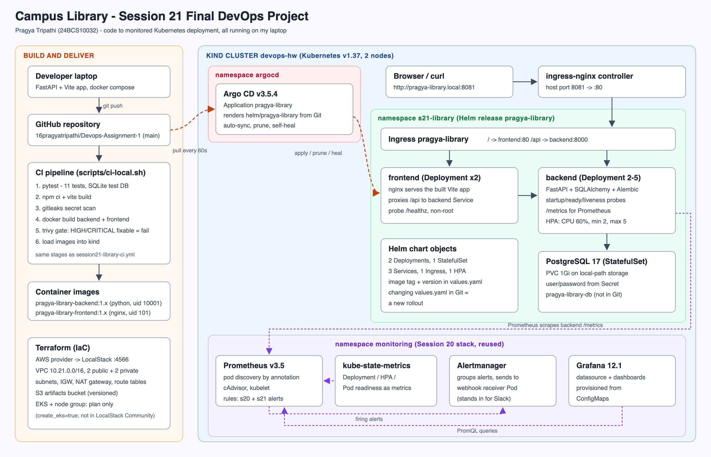

(hand-written SVG: [diagrams/architecture.svg](diagrams/architecture.svg), rendered to PNG with headless Chrome)

## Project overview

| Layer | What I used | Course session | Where |
|---|---|---|---|
| Backend | Python 3.12, FastAPI, SQLAlchemy 2, Alembic migrations, Prometheus metrics | - | [application/backend](application/backend) |
| Database | PostgreSQL 17 | - | compose / Helm StatefulSet |
| Frontend | Vite build of plain HTML/JS/CSS, served by nginx (non-root) | - | [application/frontend](application/frontend) |
| Tests | pytest, 11 tests, SQLite test database | 16 | [application/backend/tests](application/backend/tests) |
| Containers | 2 Dockerfiles (frontend multi-stage), Docker Compose for the full stack | 06-08 | [application/docker-compose.yml](application/docker-compose.yml) |
| CI pipeline | test -> build -> secret scan -> image build -> Trivy gate -> publish | 16, 17 | [.github/workflows/session21-library-ci.yml](../.github/workflows/session21-library-ci.yml), [scripts/ci-local.sh](scripts/ci-local.sh) |
| Security | Trivy (images + Helm misconfig), gitleaks, Semgrep | 17 | section 5 |
| Kubernetes | Deployments, StatefulSet + PVC, Services, Ingress, HPA, probes, Secret | 9-13 | [helm/pragya-library](helm/pragya-library) |
| Packaging | Helm chart `pragya-library` | 15 | [helm/pragya-library](helm/pragya-library) |
| IaC | Terraform: AWS VPC, subnets, NAT, S3 (applied on LocalStack), EKS (plan) | 18, 19 | [terraform](terraform) |
| GitOps | Argo CD Application that renders the Helm chart from this repo | 20 | [gitops/argocd-application.yaml](gitops/argocd-application.yaml) |
| Monitoring | Session 20 Prometheus/Grafana/Alertmanager + my rules and dashboard | 20 | [monitoring](monitoring) |
| Troubleshooting | 4 injected faults + 3 real problems I hit | 14 | section 9, [troubleshooting](troubleshooting) |

### API

| Method | Path | Purpose |
|---|---|---|
| GET | `/health` | liveness - process is up (does not touch the DB) |
| GET | `/ready` | readiness - returns 503 if PostgreSQL does not answer |
| GET | `/metrics` | Prometheus metrics (request count/latency per endpoint + my `library_loans_total` counter) |
| GET | `/api/info` | service name, version and the Pod's hostname (used to watch rollouts) |
| GET / POST | `/api/books` | list (optional `?category=`) / add a book |
| GET / PUT / DELETE | `/api/books/{id}` | read / update / delete (409 if copies are still issued) |
| POST | `/api/books/{id}/issue`, `/return` | lend or take back one copy (409 if none left / all returned) |
| GET | `/api/books/stats` | titles, total, on-shelf and issued copies |

The schema is created by Alembic ([0001_create_books.py](application/backend/alembic/versions/0001_create_books.py)); the container runs `alembic upgrade head` before starting Uvicorn.

---

## 1. Tests

The tests never touch PostgreSQL: [conftest.py](application/backend/tests/conftest.py) points `DATABASE_URL` at a temporary SQLite file and recreates the tables for each test.

```text
$ source .venv/bin/activate && pytest -v -p no:cacheprovider | grep -E 'PASSED|FAILED|passed|failed'
tests/test_books.py::test_health PASSED                                  [  9%]
tests/test_books.py::test_info_reports_version PASSED                    [ 18%]
tests/test_books.py::test_ready_checks_database PASSED                   [ 27%]
tests/test_books.py::test_create_and_get_book PASSED                     [ 36%]
tests/test_books.py::test_create_book_validation PASSED                  [ 45%]
tests/test_books.py::test_list_and_filter_by_category PASSED             [ 54%]
tests/test_books.py::test_update_book PASSED                             [ 63%]
tests/test_books.py::test_issue_and_return_rules PASSED                  [ 72%]
tests/test_books.py::test_stats PASSED                                   [ 81%]
tests/test_books.py::test_delete_book_and_404 PASSED                     [ 90%]
tests/test_books.py::test_metrics_endpoint PASSED                        [100%]
============================== 11 passed in 0.08s ==============================
```

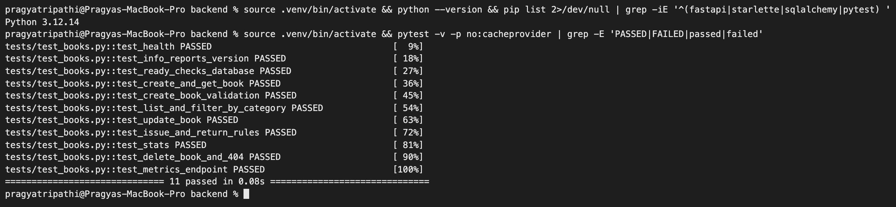

My first version of `test_metrics_endpoint` failed: it expected `library_loans_total{action="issue"} 1.0`, but the counter is global to the process and earlier tests had already issued books. The test now reads the value before and after one issue and checks it grew by exactly 1.

## 2. Docker and Docker Compose

- **Backend** ([Dockerfile](application/backend/Dockerfile)): `python:3.12-slim`, dependencies installed before the code is copied (layer caching), runs as uid `10001`, has a `HEALTHCHECK`.
- **Frontend** ([Dockerfile](application/frontend/Dockerfile)): multi-stage. Stage 1 `node:22-alpine` runs `npm ci && npm run build`; stage 2 is nginx with only the built files - no Node in the final image (76 MB vs ~200 MB for node:22-alpine alone). It runs as the `nginx` user, so it listens on 8080 (ports below 1024 need root) and writes its PID file to `/tmp`.
- [nginx.conf](application/frontend/nginx.conf) proxies `/api/` to `pragya-library-backend:8000`. I gave the Compose service and the Kubernetes Service **the same name**, so the same image works in both places.

**First run failed** - the backend container exited immediately:

```text
SERVICE                   STATUS
pragya-library-backend    Exited (1) 18 seconds ago
pragya-library-frontend   Up 19 seconds
pragya-library-postgres   Up 23 seconds (healthy)
  File "/app/alembic/env.py", line 6, in <module>
    from app import models  # noqa: F401  (registers the tables on Base.metadata)
    ^^^^^^^^^^^^^^^^^^^^^^
ModuleNotFoundError: No module named 'app'
```

`pytest` had worked because `pytest.ini` sets `pythonpath = .`. The `alembic` command does not add the working directory to `sys.path`, so `env.py` could not import my package. Fix: `prepend_sys_path = .` in [alembic.ini](application/backend/alembic.ini). After that:

```text
$ docker compose -p pragya-library up -d --build 2>&1 | grep -E 'Built|Started|Healthy'
 Image pragya-library-backend:1.0.0 Built
 Image pragya-library-frontend:1.0.0 Built
 Container pragya-library-pragya-library-postgres-1 Healthy
 Container pragya-library-pragya-library-backend-1 Started
$ docker compose -p pragya-library ps --format 'table {{.Service}}\t{{.Status}}\t{{.Ports}}'
SERVICE                   STATUS                            PORTS
pragya-library-backend    Up 6 seconds (health: starting)   0.0.0.0:3321->8000/tcp, [::]:3321->8000/tcp
pragya-library-frontend   Up 47 seconds                     0.0.0.0:3320->8080/tcp, [::]:3320->8080/tcp
pragya-library-postgres   Up 51 seconds (healthy)           5432/tcp
$ curl -s localhost:3321/health; echo; curl -s localhost:3321/ready; echo
{"status":"UP"}
{"status":"READY"}
$ curl -s -X POST localhost:3320/api/books -H 'Content-Type: application/json' -d '{"title":"The Phoenix Project","author":"Gene Kim","category":"DEVOPS","total_copies":3}'; echo
{"id":1,"title":"The Phoenix Project","author":"Gene Kim","category":"DEVOPS","total_copies":3,"available_copies":3,"created_at":"2026-10-08T10:13:29.372990Z"}
$ curl -s -X POST localhost:3320/api/books/1/issue | jq -c '{id,title,available_copies,total_copies}'
{"id":1,"title":"The Phoenix Project","available_copies":2,"total_copies":3}
$ curl -s localhost:3320/api/books/stats; echo
{"titles":1,"total_copies":3,"available_copies":2,"issued_copies":1}
$ docker compose -p pragya-library exec -T pragya-library-postgres psql -U library -d library -c 'select id,title,category,available_copies,total_copies from books;'
 id |        title        | category | available_copies | total_copies
----+---------------------+----------+------------------+--------------
  1 | The Phoenix Project | DEVOPS   |                2 |            3
(1 row)
```

The POST went to the **frontend** port (3320) and nginx forwarded it to the backend, exactly like the browser does. (Compose ran before the dependency upgrade in section 5, so it used the first image build.)

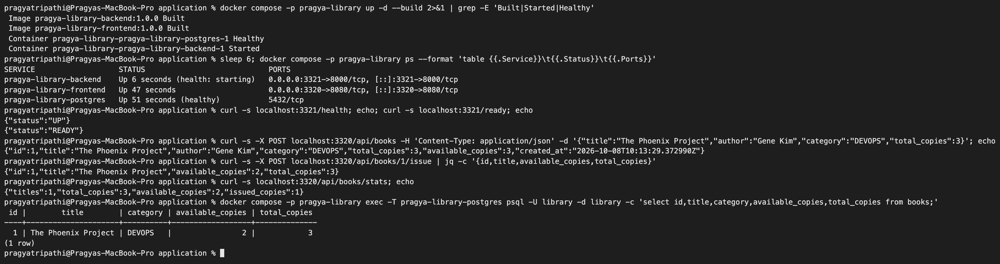
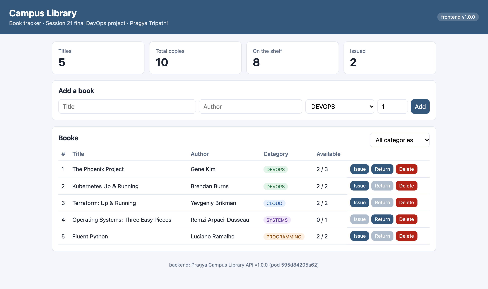

## 3. Git

Commits for this project, all on `main` of this repository:

| Commit | What |
|---|---|
| `67f239a` | Session 21 project: app, tests, Docker, Helm chart, Terraform, monitoring, CI pipeline |
| `5cd317c` | release 1.1.0 - highlight unavailable books, wait-for-db init container |
| `2ff54dd` | fix wait-for-db init container (pg_isready needs PGUSER) |

[.gitignore](.gitignore) keeps `.venv`, `__pycache__`, `node_modules`, `dist`, `.env`, `*.db` and Terraform state/`.terraform` out of Git.

## 4. CI pipeline

[.github/workflows/session21-library-ci.yml](../.github/workflows/session21-library-ci.yml) is the GitHub Actions pipeline for this project: pytest + frontend build and a gitleaks scan of the project folder -> build both images tagged with the commit SHA -> Trivy misconfiguration report + Trivy gate on both images -> push to GHCR -> **preview the image-tag change in the Helm values** (shown in the run summary). The tag change is not committed by CI, so every commit in the repo stays mine; Argo CD deploys whatever tag is committed to Git, and CI never talks to the cluster.

Before activating it on GitHub I ran the same stages locally with [scripts/ci-local.sh](scripts/ci-local.sh); locally, instead of pushing to a registry, the last stage imports the images into both kind nodes ([scripts/kind-load.sh](scripts/kind-load.sh) - plain `kind load docker-image` fails on Docker Desktop for multi-platform images with `content digest ... not found`). The run on GitHub is in [Pipeline run on GitHub](#pipeline-run-on-github) below.

The first full run **stopped at the Trivy gate**, before any image could be published:

```text
$ ./scripts/ci-local.sh 1.0.0 2>&1 | grep -E '==>|passed|built in|leaks|Total:|CVE-' | cut -c1-118; echo "pipeline exit code: ${pipestatus[1]}"
==> 1/6 backend tests
11 passed in 0.07s
==> 2/6 frontend build
✓ built in 265ms
==> 3/6 secret scan (gitleaks, project folder only)
3:47PM INF no leaks found
==> 4/6 build images
==> 5/6 trivy gate (HIGH,CRITICAL with a fix available => fail)
Total: 3 (HIGH: 3, CRITICAL: 0)
│ starlette (METADATA) │ CVE-2025-62727 │ HIGH     │ fixed  │ 0.41.3            │ 0.49.1        │ starlette: Starlette
│                      │ CVE-2026-48818 │          │        │                   │ 1.1.0         │ starlette: Starlette
│                      │ CVE-2026-54283 │          │        │                   │ 1.3.1         │ starlette: Starlette
pipeline exit code: 1
```

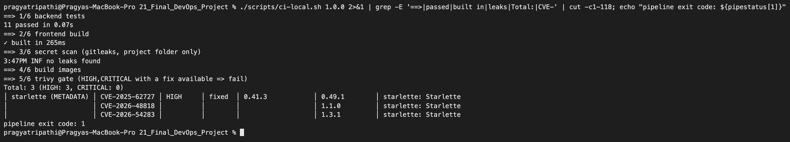

The backend failed first, so the frontend was never reached by the gate; scanning it separately showed it would have failed too:

```text
$ trivy image --quiet --severity HIGH,CRITICAL --ignore-unfixed pragya-library-frontend:1.0.0 | grep -E "^Total|alpine"
│ pragya-library-frontend:1.0.0 (alpine 3.21.3) │ alpine │       44        │    -    │
pragya-library-frontend:1.0.0 (alpine 3.21.3)
Total: 44 (HIGH: 42, CRITICAL: 2)
```

Fixes (section 5 explains the findings): FastAPI 0.115.6 -> 0.142.4 (which pulls Starlette 1.7.0) plus the other libraries raised to current versions, and the nginx base moved from `1.27-alpine` (Alpine 3.21) to `1.31-alpine` with `apk upgrade` at build time. Tests still passed on the new versions. Second run:

```text
$ ./scripts/ci-local.sh 1.0.0 2>&1 | grep -vE '^(transforming|rendering|computing|dist/|vite v|✓ 5)|^$' | cut -c1-110; echo "pipeline exit code: ${pipestatus[1]}"
==> 1/6 backend tests
...........                                                              [100%]
11 passed in 0.06s
==> 2/6 frontend build
✓ built in 200ms
==> 3/6 secret scan (gitleaks, project folder only)
3:48PM INF scanned ~203028 bytes (203.03 KB) in 15.6ms
3:48PM INF no leaks found
==> 4/6 build images
sha256:57939935d75f0a4c8cbbc17930682c7b3c332480cb6bafed530a479565350a2b
sha256:e0a351350c5cf6dde8b317e541fe61206e1a15ff89416bd2e1066f1ddb953daa
==> 5/6 trivy gate (HIGH,CRITICAL with a fix available => fail)
==> 6/6 load images into kind (stands in for 'push to registry')
loaded pragya-library-backend:1.0.0 into devops-hw-worker
loaded pragya-library-backend:1.0.0 into devops-hw-control-plane
loaded pragya-library-frontend:1.0.0 into devops-hw-worker
loaded pragya-library-frontend:1.0.0 into devops-hw-control-plane
pipeline passed for version 1.0.0
pipeline exit code: 0
```

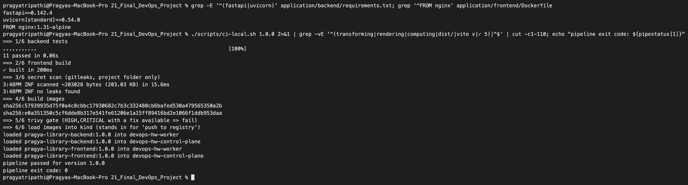

### Pipeline run on GitHub

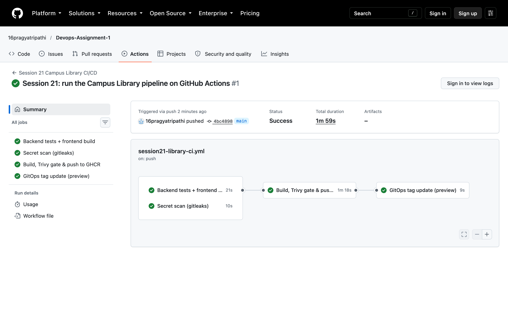

[Run #1](https://github.com/16pragyatripathi/Devops-Assignment-1/actions/runs/37795336595) of `session21-library-ci.yml`, triggered by pushing commit `4bc4898` to `main`. All four jobs are green in 1m 59s: `Backend tests + frontend build` (21s) and `Secret scan (gitleaks)` (10s) ran in parallel, then `Build, Trivy gate & push to GHCR` (1m 18s) built both images, passed the Trivy gate and pushed `pragya-library-backend` / `pragya-library-frontend` tagged `4bc4898`, and `GitOps tag update (preview)` (9s) printed the Helm values change into the run summary.

## 5. Security scanning

| Layer | Tool | Result on the final code |
|---|---|---|
| Container OS + libraries | Trivy image | 0 fixable HIGH/CRITICAL in both images |
| Kubernetes manifests (Helm) | Trivy config | 0 HIGH/CRITICAL misconfigurations |
| Secrets in files | gitleaks | no leaks |
| Code (SAST) | Semgrep `p/python` + `p/dockerfile` | 0 findings, 158 rules on 8 files |

```text
$ for i in backend frontend; do echo -n "pragya-library-$i:1.0.0  HIGH/CRITICAL fixable: "; trivy image -q --severity HIGH,CRITICAL --ignore-unfixed -f json pragya-library-$i:1.0.0 | jq '[.Results[].Vulnerabilities[]?] | length'; done
pragya-library-backend:1.0.0  HIGH/CRITICAL fixable: 0
pragya-library-frontend:1.0.0  HIGH/CRITICAL fixable: 0
$ trivy image -q -f json pragya-library-frontend:1.0.0 | jq -r '.Metadata.OS | "frontend base OS: \(.Family) \(.Name)"'
frontend base OS: alpine 3.24.2
$ trivy config --quiet --severity HIGH,CRITICAL --exit-code 1 helm/pragya-library | grep helm; echo "trivy config exit code: ${pipestatus[1]}"
│ templates/backend.yaml  │ helm │         0         │
│ templates/frontend.yaml │ helm │         0         │
│ templates/hpa.yaml      │ helm │         0         │
│ templates/ingress.yaml  │ helm │         0         │
│ templates/postgres.yaml │ helm │         0         │
trivy config exit code: 0
$ gitleaks dir . --no-banner --no-color --redact 2>&1 | tail -1
3:49PM INF no leaks found
$ docker run --rm -v "$PWD/application:/src" semgrep/semgrep:1.178.0 semgrep scan --config p/python --config p/dockerfile --metrics=off --disable-version-check /src/backend/app /src/backend/Dockerfile /src/frontend/Dockerfile 2>&1 | grep -E 'Findings|Rules run|Ran '
 • Findings: 0 (0 blocking)
 • Rules run: 158
Ran 158 rules on 8 files: 0 findings.
```

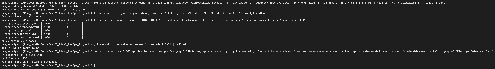

What the findings were and what I changed:

- **Starlette 0.41.3 (pulled in by FastAPI 0.115.6)**, e.g. CVE-2025-62727: a request with a crafted `Range` header can make the server spend a lot of CPU merging ranges - a denial-of-service. My app does not serve files with Starlette, so it was probably not exploitable here, but the gate cannot know that and I would rather upgrade than argue with the scanner. The fixed versions needed a newer FastAPI, which is why the dependency jump was large.
- **44 OS-package CVEs in nginx:1.27-alpine** (libssl3/libcrypto3, libexpat, libxml2, libpng, ...): the image itself was old. The base tag is pinned to `1.31-alpine` and `apk upgrade` pulls in fixes released after the base image was built.
- **Trivy config KSV-0014** on the first chart version: the frontend and PostgreSQL containers could write to their root filesystem.

```text
$ trivy config --quiet --severity HIGH,CRITICAL helm/pragya-library | grep -E '^templates|^Failures|^KSV'
templates/frontend.yaml (helm)
Failures: 1 (HIGH: 1, CRITICAL: 0)
KSV-0014 (HIGH): Container 'frontend' of Deployment 'pragya-library-frontend' should set 'securityContext.readOnlyRootFilesystem' to true
templates/postgres.yaml (helm)
Failures: 1 (HIGH: 1, CRITICAL: 0)
KSV-0014 (HIGH): Container 'postgres' of StatefulSet 'pragya-library-postgres' should set 'securityContext.readOnlyRootFilesystem' to true
```

  I set `readOnlyRootFilesystem: true` and gave each container small `emptyDir` volumes only where it really writes (`/var/cache/nginx` and `/tmp` for nginx; `/var/run/postgresql` and `/tmp` for PostgreSQL; the data directory is the PVC).
- No secrets in Git: the database password lives only in the Kubernetes Secret `pragya-library-db`, created with `kubectl` from a random value. All containers run as non-root with `allowPrivilegeEscalation: false` and all capabilities dropped.

## 6. Terraform

The class Terraform creates an AWS VPC + EKS cluster in `ap-south-1`. I wrote my own version with plain resources ([terraform/](terraform)) and pointed the AWS provider at **LocalStack** (container `ls-pragya`, port 4566) so I could really apply and destroy without an AWS bill. `use_localstack = false` switches to real AWS credentials.

- [network.tf](terraform/network.tf): VPC `10.21.0.0/16`, 2 public + 2 private subnets in two AZs (tagged for EKS load balancers), Internet Gateway, one NAT gateway, route tables
- [storage.tf](terraform/storage.tf): versioned S3 bucket with all public access blocked
- [eks.tf](terraform/eks.tf): IAM roles, EKS 1.33 control plane and a `t3.medium` node group (1-4 nodes) - created only when `create_eks = true`, because EKS is not part of LocalStack Community
- [terraform.tfvars.example](terraform/terraform.tfvars.example): example values, no credentials

```text
$ terraform init -no-color | grep -E "Installing|Installed|successfully"
Terraform has been successfully initialized!

$ terraform fmt -check -recursive && terraform validate -no-color
Success! The configuration is valid.

$ terraform plan -no-color -var create_eks=true | grep -E '^  # |Plan:'
  # aws_eip.nat[0] will be created
  # aws_eks_cluster.main[0] will be created
  # aws_eks_node_group.main[0] will be created
  # aws_iam_role.eks_cluster[0] will be created
  # aws_iam_role.eks_nodes[0] will be created
  # aws_iam_role_policy_attachment.eks_cluster[0] will be created
  # aws_iam_role_policy_attachment.eks_nodes["arn:aws:iam::aws:policy/AmazonEC2ContainerRegistryReadOnly"] will be created
  # aws_iam_role_policy_attachment.eks_nodes["arn:aws:iam::aws:policy/AmazonEKSWorkerNodePolicy"] will be created
  # aws_iam_role_policy_attachment.eks_nodes["arn:aws:iam::aws:policy/AmazonEKS_CNI_Policy"] will be created
  # aws_internet_gateway.main will be created
  # aws_nat_gateway.main[0] will be created
  # aws_route_table.private will be created
  # aws_route_table.public will be created
  # aws_route_table_association.private[0] will be created
  # aws_route_table_association.private[1] will be created
  # aws_route_table_association.public[0] will be created
  # aws_route_table_association.public[1] will be created
  # aws_s3_bucket.artifacts will be created
  # aws_s3_bucket_public_access_block.artifacts will be created
  # aws_s3_bucket_versioning.artifacts will be created
  # aws_subnet.private[0] will be created
  # aws_subnet.private[1] will be created
  # aws_subnet.public[0] will be created
  # aws_subnet.public[1] will be created
  # aws_vpc.main will be created
Plan: 25 to add, 0 to change, 0 to destroy.
```

Part of that plan for the node group:

```text
  # aws_eks_node_group.main[0] will be created
  + resource "aws_eks_node_group" "main" {
      + cluster_name           = "pragya-library-eks"
      + instance_types         = [
          + "t3.medium",
        ]
      + node_group_name        = "pragya-library-nodes"
      + scaling_config {
          + desired_size = 2
          + max_size     = 4
          + min_size     = 1
        }
```

Apply (default `create_eks = false`) - 17 resources on LocalStack:

```text
$ terraform apply -auto-approve -no-color | tail -22
aws_route_table.private: Creation complete after 0s [id=rtb-025780a8]
aws_route_table_association.private[0]: Creating...
aws_route_table_association.private[1]: Creating...
aws_route_table_association.private[1]: Creation complete after 0s [id=rtbassoc-ba844530]
aws_route_table_association.private[0]: Creation complete after 1s [id=rtbassoc-bc6c01e5]

Apply complete! Resources: 17 added, 0 changed, 0 destroyed.

Outputs:

artifacts_bucket = "pragya-library-artifacts-24bcs10032"
eks_cluster_name = "(not created - create_eks = false)"
kubeconfig_command = "n/a"
private_subnet_ids = [
  "subnet-690a5ff4",
  "subnet-88d86b76",
]
public_subnet_ids = [
  "subnet-34da44de",
  "subnet-13686cad",
]
vpc_id = "vpc-fe263a6f"
```

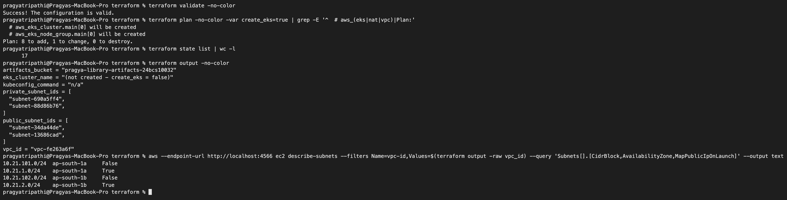

The screenshot also checks the subnets with the AWS CLI: the two `/24`s at `10.21.1.0` and `10.21.2.0` have `MapPublicIpOnLaunch=True`, the `10.21.10x.0` ones are private.

**Something LocalStack does differently:** after apply, `terraform plan` was never clean - it always wanted to "update" the S3 bucket's tags:

```text
  # aws_s3_bucket.artifacts will be updated in-place
  ~ resource "aws_s3_bucket" "artifacts" {
        id                          = "pragya-library-artifacts-24bcs10032"
        tags                        = {}
      ~ tags_all                    = {
          + "ManagedBy" = "Terraform"
          ...
Plan: 0 to add, 1 to change, 0 to destroy.

$ aws --endpoint-url http://localhost:4566 s3api get-bucket-tagging --bucket pragya-library-artifacts-24bcs10032
An error occurred (NoSuchTagSet) when calling the GetBucketTagging operation: The TagSet does not exist
```

The provider's `default_tags` are sent, but LocalStack 3.8 does not store them for the bucket, so Terraform sees drift on every plan. On real AWS this would be clean. That is also why the screenshot shows `1 to change`.

Destroy at the end:

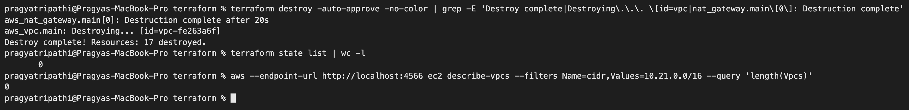

```text
aws_nat_gateway.main[0]: Destruction complete after 20s
aws_vpc.main: Destroying... [id=vpc-fe263a6f]
Destroy complete! Resources: 17 destroyed.
$ terraform state list | wc -l
       0
$ aws --endpoint-url http://localhost:4566 ec2 describe-vpcs --filters Name=cidr,Values=10.21.0.0/16 --query 'length(Vpcs)'
0
```

## 7. Kubernetes + Helm, deployed by Argo CD

### The chart

[helm/pragya-library](helm/pragya-library) (`helm lint`: 0 failures) renders:

| Object | Notes |
|---|---|
| Deployment `pragya-library-backend` | startup probe `/health` (time for migrations), readiness `/ready` (DB reachable), liveness `/health`; `prometheus.io/*` annotations; read-only root FS |
| Deployment `pragya-library-frontend` | 2 replicas, probe `/healthz` |
| StatefulSet `pragya-library-postgres` | PVC 1Gi from `volumeClaimTemplates` (local-path), user/password from Secret |
| 3 Services | ClusterIP for backend, frontend, postgres |
| Ingress `pragya-library` | host `pragya-library.local`: `/` -> frontend, `/api` -> backend |
| HPA | backend 2-5 replicas at 60% CPU |

The Ingress points `/api` straight at the backend (nginx in the frontend is only needed for Compose). The kind cluster maps host port 8081 to the ingress-nginx controller.

### Bootstrap, then Argo CD takes over

The namespace and the DB Secret are created once by hand (the password must not be in Git):

```text
$ kubectl apply -f kubernetes/namespace.yaml
namespace/s21-library created

$ kubectl -n s21-library create secret generic pragya-library-db --from-literal=username=library --from-literal=password="$DB_PASSWORD"
secret/pragya-library-db created

$ kubectl apply -k monitoring/
configmap/pragya-grafana-dashboard-s21 created
configmap/pragya-s21-prometheus-rules created

$ kubectl apply -f gitops/argocd-application.yaml
application.argoproj.io/pragya-library created
t+10s  sync=Synced health=Progressing rev=67f239a9111c34df3808c9d
t+20s  sync=Synced health=Degraded rev=67f239a9111c34df3808c9d5ae
t+30s  sync=Synced health=Degraded rev=67f239a9111c34df3808c9d5ae
t+40s  sync=Synced health=Degraded rev=67f239a9111c34df3808c9d5ae
t+50s  sync=Synced health=Degraded rev=67f239a9111c34df3808c9d5ae
t+60s  sync=Synced health=Degraded rev=67f239a9111c34df3808c9d5ae
t+70s  sync=Synced health=Healthy rev=67f239a9111c34df3808c9d5aec
```

[The Application](gitops/argocd-application.yaml) uses the Helm chart path in this repo as its source, so Argo CD runs `helm template` itself and applies the result. It ignores `/spec/replicas` of the backend Deployment because the HPA owns that field - otherwise Argo CD and the HPA would keep overwriting each other. (Because Argo CD renders the chart, `helm list -n s21-library` shows nothing; there is no Helm release object. `helm list` is used in section 9 where I installed a copy with Helm directly.)

The `Degraded` minute is explained in section 9 (real problem 1).

```text
$ kubectl -n argocd get application pragya-library
NAME             SYNC STATUS   HEALTH STATUS
pragya-library   Synced        Healthy

$ kubectl -n s21-library get hpa
NAME                     REFERENCE                           TARGETS       MINPODS   MAXPODS   REPLICAS   AGE
pragya-library-backend   Deployment/pragya-library-backend   cpu: 5%/60%   2         5         2          2m16s

$ kubectl -n s21-library get endpointslices
NAME                            ADDRESSTYPE   PORTS   ENDPOINTS                   AGE
pragya-library-backend-kbkbw    IPv4          8000    10.244.1.189,10.244.1.192   2m16s
pragya-library-frontend-74r26   IPv4          8080    10.244.1.190,10.244.1.191   2m16s
pragya-library-postgres-cvbm9   IPv4          5432    10.244.1.194                2m16s

$ curl -s -H 'Host: pragya-library.local' http://127.0.0.1:8081/api/info; echo
{"service":"Pragya Campus Library API","version":"1.0.0","hostname":"pragya-library-backend-6df9c95c86-tbhbh"}

$ kubectl -n s21-library exec pragya-library-postgres-0 -- psql -U library -d library -c 'select version_num from alembic_version;' -c 'select id, title, available_copies, total_copies from books order by id;'
    version_num
-------------------
 0001_create_books
(1 row)

 id |            title             | available_copies | total_copies
----+------------------------------+------------------+--------------
  1 | The Phoenix Project          |                2 |            3
  2 | Kubernetes Up & Running      |                2 |            2
  3 | Terraform: Up & Running      |                0 |            2
  4 | Site Reliability Engineering |                2 |            2
  5 | Fluent Python                |                1 |            1
(5 rows)
```

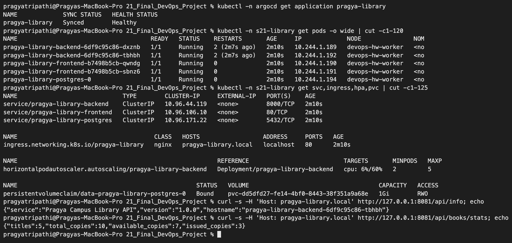

Through the Ingress in a browser (Chrome told to resolve `pragya-library.local` to 127.0.0.1):

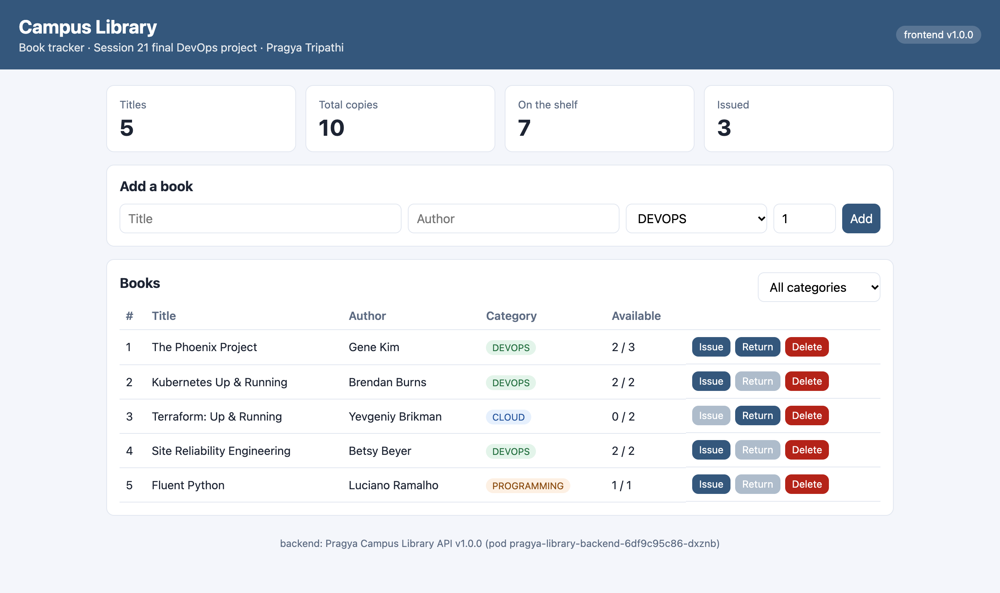

### Autoscaling under load

[scripts/load-test.sh](scripts/load-test.sh) sends parallel `GET /api/books` through the Ingress. A short run (8000 requests) finished before the HPA reacted - metrics-server only reports CPU every ~15 s and the HPA checks every 15 s:

```text
$ date +%T; ./scripts/load-test.sh 8000 40; date +%T
15:55:51
8000 200
15:56:17

$ kubectl -n s21-library get hpa pragya-library-backend
NAME                     REFERENCE                           TARGETS        MINPODS   MAXPODS   REPLICAS   AGE
pragya-library-backend   Deployment/pragya-library-backend   cpu: 26%/60%   2         5         2          3m
```

So I ran 60 000 requests with 60 in parallel in the background and sampled the HPA every 20 s:

```text
$ ./scripts/load-test.sh 60000 60          # ran in the background; its output when it finished:
 198 000
59802 200

$ kubectl -n s21-library get hpa pragya-library-backend   (sampled every 20s)
15:56:26  cpu: 362%/60% replicas=2
15:56:46  cpu: 1001%/60% replicas=4
15:57:06  cpu: 794%/60% replicas=5
15:57:26  cpu: 644%/60% replicas=5
15:57:46  cpu: 606%/60% replicas=5
15:58:06  cpu: 583%/60% replicas=5
15:58:26  cpu: 577%/60% replicas=5
15:58:46  cpu: 572%/60% replicas=5
15:59:06  cpu: 217%/60% replicas=5
15:59:26  cpu: 57%/60% replicas=5
15:59:46  cpu: 6%/60% replicas=5
16:00:06  cpu: 9%/60% replicas=5
```

```text
$ kubectl -n s21-library get events --sort-by=.lastTimestamp | grep SuccessfulRescale
7m56s       Normal    SuccessfulRescale              horizontalpodautoscaler/pragya-library-backend         New size: 2; reason: Current number of replicas below Spec.MinReplicas
4m55s       Normal    SuccessfulRescale              horizontalpodautoscaler/pragya-library-backend         New size: 4; reason: cpu resource utilization (percentage of request) above target
4m40s       Normal    SuccessfulRescale              horizontalpodautoscaler/pragya-library-backend         New size: 5; reason: cpu resource utilization (percentage of request) above target
```

- Utilisation is measured against the **request** (50m), so 1001% means about 0.5 CPU per Pod. Even at 5 Pods it stayed far above 60% - 5 is simply the maximum I allowed.
- After the load stopped it stayed at 5 replicas: the HPA waits 5 minutes before scaling down so that it does not flap.
- The long load test ended with `59802 200` and `198 000` - 198 requests got no HTTP answer at all (curl code `000`). I did not dig deeper; with 60 parallel curls on a laptop the client side (ephemeral ports / connection resets at the ingress) is the likely cause, since no 5xx appeared in the backend metrics.

## 8. Monitoring

The backend exposes Prometheus metrics; the Session 20 Prometheus discovers the Pods through their annotations:

```text
$ kubectl -n s21-library exec deploy/pragya-library-backend -- python -c "import urllib.request;print(urllib.request.urlopen('http://localhost:8000/metrics').read().decode())" | grep -E '^(http_requests_total|library_loans_total)' | head -8
library_loans_total{action="issue"} 1.0
http_requests_total{handler="/health",method="GET",status="2xx"} 8.0
http_requests_total{handler="/ready",method="GET",status="2xx"} 14.0
http_requests_total{handler="/api/books",method="POST",status="2xx"} 2.0
http_requests_total{handler="/api/books/{book_id}/issue",method="POST",status="2xx"} 1.0
http_requests_total{handler="/api/books/stats",method="GET",status="2xx"} 1.0
http_requests_total{handler="/api/info",method="GET",status="2xx"} 1.0
http_requests_total{handler="/api/books",method="GET",status="2xx"} 1.0
```

The `handler` label is the **route template** (`/api/books/{book_id}/issue`), not the real URL, so the number of time series stays small no matter how many books exist.

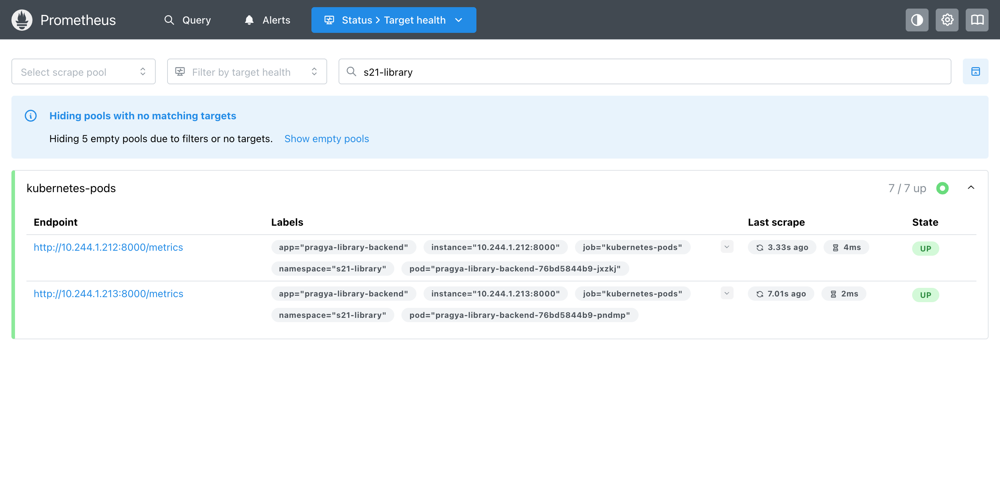

[monitoring/](monitoring) adds two ConfigMaps to the Session 20 stack: alert rules (`LibraryBackendDown`, `LibraryNoReadyBackend`, `LibraryHigh5xxRate`, `LibraryHighLatencyP95`, `LibraryHPAAtMaxReplicas`) and a Grafana dashboard. Grafana picked up the dashboard by itself; Prometheus needed a config reload to read the new rule file:

```text
$ kubectl -n monitoring exec deploy/pragya-prometheus -- ls /etc/prometheus/rules/
s20-alerts.yml
s21-alerts.yml

$ curl -s -X POST localhost:3302/-/reload -w 'reload HTTP %{http_code}\n'
reload HTTP 200

$ curl -s localhost:3302/api/v1/rules | jq -r '.data.groups[] | "\(.name)  \(.file)  rules=\(.rules|length)"'
pragya-s20-app  /etc/prometheus/rules/s20-alerts.yml  rules=2
pragya-s20-platform  /etc/prometheus/rules/s20-alerts.yml  rules=5
pragya-s21-library  /etc/prometheus/rules/s21-alerts.yml  rules=5
```

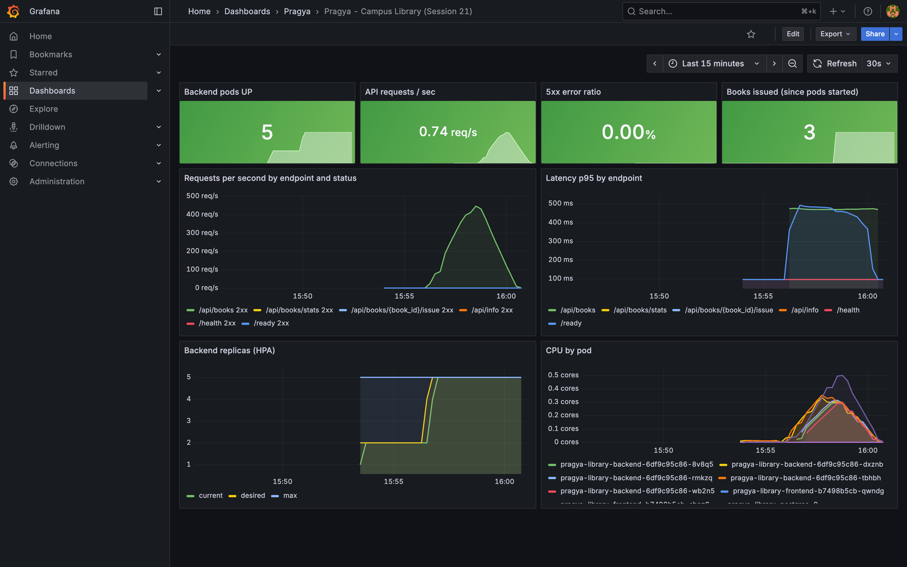

The dashboard shows the load test as one story: ~450 req/s on `/api/books`, p95 latency rising to ~500 ms, CPU per Pod going up, and the HPA line going 2 -> 4 -> 5 replicas. 5xx ratio stayed 0%.

The platform alerts from Session 20 also caught the problems in section 9 without any extra work:

```text
$ kubectl -n monitoring logs deploy/pragya-alert-webhook | grep -E "s21-"
[FIRING  ] PodNotReady severity=warning ns=s21-library :: Pod s21-library/pragya-library-backend-766cbbbdb8-zptql is not Ready
[RESOLVED] PodNotReady severity=warning ns=s21-library :: Pod s21-library/pragya-library-backend-766cbbbdb8-zptql is not Ready
[FIRING  ] TargetDown severity=critical ns=s21-troubleshoot :: Target kubernetes-pods / 10.244.1.223:8000 is down
[FIRING  ] ContainerRestarting severity=warning ns=s21-troubleshoot :: s21-troubleshoot/pragya-library-backend-567bfbbdc9-kwltn restarted 3 times in 10m
[RESOLVED] TargetDown severity=critical ns=s21-troubleshoot :: Target kubernetes-pods / 10.244.1.223:8000 is down
[FIRING  ] TargetDown severity=critical ns=s21-troubleshoot :: Target kubernetes-pods / 10.244.1.226:8000 is down
```

## 9. GitOps release and troubleshooting

### 9.1 Release 1.1.0 through Git

The change: rows with no copies left are highlighted in the UI, versions bumped to 1.1.0, and a `wait-for-db` init container added to the backend (because of real problem 1 below). CI built and loaded `1.1.0` images, then the only deployment step was a commit:

```text
$ git commit -m "Session 21: release 1.1.0 - highlight unavailable books, wait-for-db init container"
[main 5cd317c] Session 21: release 1.1.0 - highlight unavailable books, wait-for-db init container
 12 files changed, 28 insertions(+), 11 deletions(-)
$ git push origin main
   9468d5e..5cd317c  main -> main
```

Pushed at 16:06:13. Watching Argo CD, the image tags of the backend Pods and the version answered through the Ingress:

```text
$ watch: argocd revision, backend images, version answered through the Ingress (every 10s)
16:06:19  argocd=Synced/Healthy rev=9468d5e  api version=1.0.0  backend pod tags: 1.0.0 1.0.0
...
16:08:01  argocd=Synced/Healthy rev=9468d5e  api version=1.0.0  backend pod tags: 1.0.0 1.0.0
16:08:11  argocd=Synced/Progressing rev=5cd317c  api version=1.0.0  backend pod tags: 1.0.0 1.0.0 1.1.0
16:08:21  argocd=Synced/Progressing rev=5cd317c  api version=1.0.0  backend pod tags: 1.0.0 1.0.0 1.1.0
...
16:11:14  argocd=Synced/Progressing rev=5cd317c  api version=1.0.0  backend pod tags: 1.0.0 1.0.0 1.1.0
```

Argo CD picked up the commit in about 2 minutes, but the rollout **never finished**. This became real problem 2.

### 9.2 Real problems I hit (not planned)

**Real problem 1 - the backend crashed on the very first install.** The Application was `Degraded` for a minute and both backend Pods showed `RESTARTS 2`:

```text
$ kubectl -n s21-library logs pragya-library-backend-6df9c95c86-dxznb --previous | tail -3
sqlalchemy.exc.OperationalError: (psycopg.OperationalError) connection failed: connection to server at "10.96.171.22", port 5432 failed: Connection refused
	Is the server running on that host and accepting TCP/IP connections?
(Background on this error at: https://sqlalche.me/e/21/e3q8)
```

All Pods start at the same time; PostgreSQL needs a few seconds to initialise its data directory, Alembic tried to connect first and the container exited. Kubernetes restarted it until the database was up, so it healed itself, but crashing on purpose is not a design. Fix in 1.1.0: an init container that waits with `pg_isready`.

**Real problem 2 - the fix itself blocked the 1.1.0 rollout.**

```text
$ kubectl -n s21-library get pods
NAME                                       READY   STATUS     RESTARTS      AGE
pragya-library-backend-6df9c95c86-dxznb    1/1     Running    2 (18m ago)   18m
pragya-library-backend-6df9c95c86-tbhbh    1/1     Running    2 (18m ago)   18m
pragya-library-backend-766cbbbdb8-zptql    0/1     Init:0/1   0             3m32s
pragya-library-frontend-7f4fc6fcb6-24ckw   1/1     Running    0             3m30s
pragya-library-frontend-7f4fc6fcb6-cgpnf   1/1     Running    0             3m32s
pragya-library-postgres-0                  1/1     Running    0             18m

$ kubectl -n s21-library logs pragya-library-backend-766cbbbdb8-zptql -c wait-for-db --tail=5
waiting for database
pragya-library-postgres:5432 - no attempt
waiting for database
pragya-library-postgres:5432 - no attempt
waiting for database
```

The database was up, so "waiting for database" was a lie. `no attempt` means pg_isready did not even try to connect because its parameters looked invalid. Testing inside the init container:

```text
$ kubectl -n s21-library exec pragya-library-backend-766cbbbdb8-zptql -c wait-for-db -- id
uid=10001 gid=0(root) groups=0(root)

$ kubectl -n s21-library exec pragya-library-backend-766cbbbdb8-zptql -c wait-for-db -- sh -c 'pg_isready -h pragya-library-postgres -p 5432; echo exit=$?'
pragya-library-postgres:5432 - no attempt
exit=3

$ kubectl -n s21-library exec pragya-library-backend-766cbbbdb8-zptql -c wait-for-db -- sh -c 'pg_isready -h pragya-library-postgres -p 5432 -U library; echo exit=$?'
pragya-library-postgres:5432 - accepting connections
exit=0

$ curl -s -H 'Host: pragya-library.local' http://127.0.0.1:8081/api/info
{"service":"Pragya Campus Library API","version":"1.0.0","hostname":"pragya-library-backend-6df9c95c86-tbhbh"}
```

Root cause: the Pod runs as uid 10001, which has no entry in `/etc/passwd` of the postgres image, so libpq has no default user name and gives up before connecting. Giving it a user fixed it. Meanwhile users saw nothing wrong: the rolling update keeps the old ReplicaSet serving until new Pods are Ready (the last curl still got an answer from a 1.0.0 Pod). The `PodNotReady` alert fired for the stuck Pod (section 8).

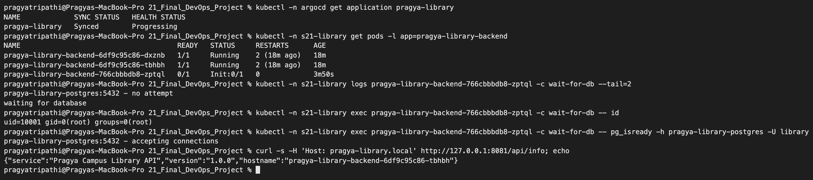

Fix through Git (`PGUSER` from the same Secret), then I asked Argo CD to refresh instead of waiting for the poll:

```text
$ git commit -m "Session 21: fix wait-for-db init container (pg_isready needs PGUSER)"
[main 2ff54dd] Session 21: fix wait-for-db init container (pg_isready needs PGUSER)
 3 files changed, 6 insertions(+), 1 deletion(-)
$ git push origin main
   5cd317c..2ff54dd  main -> main
$ kubectl -n argocd annotate application pragya-library argocd.argoproj.io/refresh=normal --overwrite
application.argoproj.io/pragya-library annotated

16:12:24  argocd=Synced/Progressing rev=2ff54dd  api version=1.0.0  backend pod tags: 1.0.0 1.0.0 1.1.0
16:12:34  argocd=Synced/Healthy rev=2ff54dd  api version=1.1.0  backend pod tags: 1.0.0 1.1.0 1.1.0

$ kubectl -n s21-library logs deploy/pragya-library-backend -c wait-for-db
Found 2 pods, using pod/pragya-library-backend-76bd5844b9-jxzkj
pragya-library-postgres:5432 - accepting connections

$ for i in 1 2 3 4; do curl -s -H 'Host: pragya-library.local' http://127.0.0.1:8081/api/info; echo; done
{"service":"Pragya Campus Library API","version":"1.1.0","hostname":"pragya-library-backend-76bd5844b9-jxzkj"}
{"service":"Pragya Campus Library API","version":"1.1.0","hostname":"pragya-library-backend-76bd5844b9-jxzkj"}
{"service":"Pragya Campus Library API","version":"1.1.0","hostname":"pragya-library-backend-76bd5844b9-pndmp"}
{"service":"Pragya Campus Library API","version":"1.1.0","hostname":"pragya-library-backend-76bd5844b9-pndmp"}

$ kubectl -n argocd get application pragya-library -o jsonpath='{range .status.history[*]}{.id}  {.revision}  {.deployedAt}{"\n"}{end}'
0  67f239a9111c34df3808c9d5aec6a14ee65c3203  2026-10-08T10:23:17Z
1  5cd317cf703f1eabd3e29e2f9055e2a90cf5d3da  2026-10-08T10:38:09Z
2  2ff54ddc025c32ae5f07f8b52a0b87c822d2e84a  2026-10-08T10:42:21Z
```

The books created before the release were still there (the StatefulSet's PVC is not touched by Deployment rollouts):

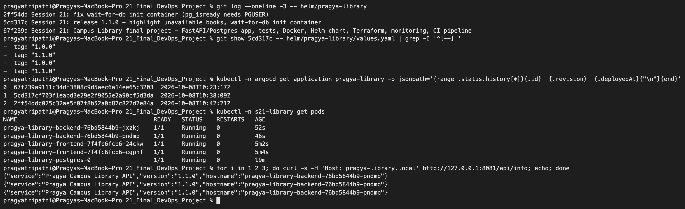
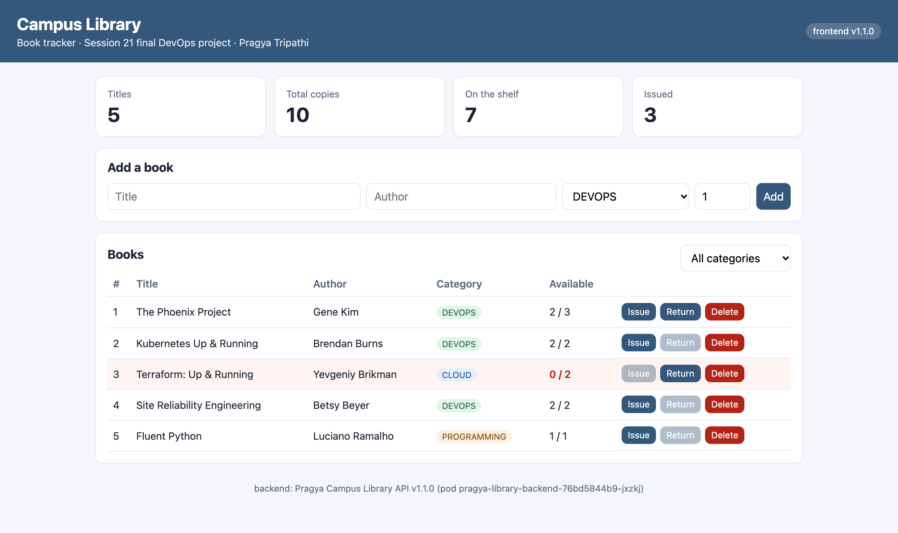
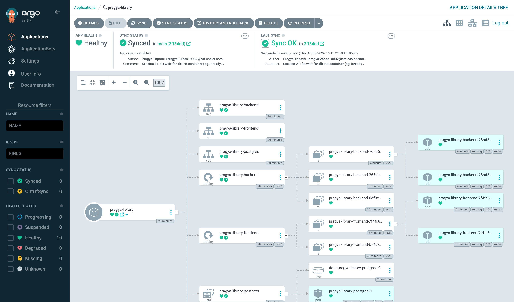

**Real problem 3 - two replicas ran the migration at the same time.** For the injected faults I installed a second copy of the chart with plain Helm into `s21-troubleshoot` (Argo CD's self-heal would undo faults in `s21-library`). On that fresh database one backend still restarted once, even with the init container:

```text
$ helm list -n s21-troubleshoot
NAME             	NAMESPACE       	REVISION	UPDATED                             	STATUS  	CHART               	APP VERSION
pragya-library-ts	s21-troubleshoot	1       	2026-10-08 16:13:56.531187 +0530 IST	deployed	pragya-library-1.1.1	1.1.0

$ kubectl -n s21-troubleshoot get pods
NAME                                       READY   STATUS    RESTARTS     AGE
pragya-library-backend-76bd5844b9-8kp4b    1/1     Running   0            25s
pragya-library-backend-76bd5844b9-bwtsw    1/1     Running   1 (7s ago)   25s
pragya-library-frontend-7f4fc6fcb6-b8vfp   1/1     Running   0            25s
pragya-library-postgres-0                  1/1     Running   0            25s

$ kubectl -n s21-troubleshoot logs pragya-library-backend-76bd5844b9-bwtsw --previous | grep -E "Error|error" | tail -3
Defaulted container "backend" out of: backend, wait-for-db (init)
psycopg.errors.UniqueViolation: duplicate key value violates unique constraint "pg_type_typname_nsp_index"
sqlalchemy.exc.IntegrityError: (psycopg.errors.UniqueViolation) duplicate key value violates unique constraint "pg_type_typname_nsp_index"
(Background on this error at: https://sqlalche.me/e/21/gkpj)
```

Both Pods passed `wait-for-db` at the same moment and both ran `alembic upgrade head`; one created the `alembic_version` table a moment before the other. Running migrations inside every replica's start command is a race. I did not change this in the project; the proper fix is to run the migration once per release (a Kubernetes Job as an Argo CD `PreSync` hook / Helm `pre-upgrade` hook) and let the app containers only start Uvicorn.

### 9.3 Injected faults

All four in namespace `s21-troubleshoot`, files in [troubleshooting/](troubleshooting).

| # | Fault | Symptom | Diagnosed with | Fix |
|---|---|---|---|---|
| 1 | Image tag typo `1.0.1` | `ErrImagePull`, rollout stuck | `describe pod` events | `helm rollback` |
| 2 | Service selector typo | 502 from nginx, Pods healthy | EndpointSlice empty, compare selector vs labels | patch selector |
| 3 | Wrong DB password in Secret | new Pod `CrashLoopBackOff` | `logs --previous`, PostgreSQL log | restore Secret, restart |
| 4 | Memory limit 40Mi | `OOMKilled`, exit 137 | `lastState.terminated`, `kubectl top` | `helm rollback` |

**Fault 1 - image that does not exist**

```text
$ helm upgrade pragya-library-ts helm/pragya-library -n s21-troubleshoot -f troubleshooting/values-troubleshoot.yaml -f troubleshooting/fault1-bad-image-tag.yaml | grep -E 'STATUS|REVISION'
STATUS: deployed
REVISION: 2

$ sleep 25; kubectl -n s21-troubleshoot get pods -l app=pragya-library-backend
NAME                                      READY   STATUS         RESTARTS      AGE
pragya-library-backend-6f76cfdf45-dnqg7   0/1     ErrImagePull   0             25s
pragya-library-backend-76bd5844b9-8kp4b   1/1     Running        0             64s
pragya-library-backend-76bd5844b9-bwtsw   1/1     Running        1 (46s ago)   64s

$ kubectl -n s21-troubleshoot get events --sort-by=.lastTimestamp | grep 'pragya-library-backend:1.0.1' | grep -m1 'Failed to pull'
Failed to pull image "pragya-library-backend:1.0.1": failed to pull and unpack image "docker.io/library/pragya-library-backend:1.0.1": failed to resolve reference "docker.io/library/pragya-library-backend:1.0.1": pull access denied, repository does not exist or may require authorization: server message: insufficient_scope: authorization failed

$ kubectl -n s21-troubleshoot rollout status deploy/pragya-library-backend --timeout=20s
Waiting for deployment "pragya-library-backend" rollout to finish: 1 out of 2 new replicas have been updated...
error: timed out waiting for the condition

$ kubectl -n s21-troubleshoot exec deploy/pragya-library-frontend -- wget -qO- http://pragya-library-backend:8000/api/info
{"service":"Pragya Campus Library API","version":"1.1.0","hostname":"pragya-library-backend-76bd5844b9-8kp4b"}

$ docker images pragya-library-backend --format '{{.Repository}}:{{.Tag}}'
pragya-library-backend:1.1.0
pragya-library-backend:1.0.0

$ helm history pragya-library-ts -n s21-troubleshoot
REVISION	UPDATED                 	STATUS    	CHART               	APP VERSION	DESCRIPTION
1       	Thu Oct  8 16:13:56 2026	superseded	pragya-library-1.1.1	1.1.0      	Install complete
2       	Thu Oct  8 16:14:34 2026	deployed  	pragya-library-1.1.1	1.1.0      	Upgrade complete

$ helm rollback pragya-library-ts 1 -n s21-troubleshoot --wait
Rollback was a success! Happy Helming!
```

A short image name means `docker.io/library/...`; the tag exists nowhere, and Docker Hub answers "does not exist **or** may require authorization" for both cases, so the message alone does not tell a typo from a private image - checking which tags really exist does. `helm upgrade` still said `deployed` because Helm (without `--wait`) only checks that the objects were accepted, not that Pods start. The old Pods kept serving the whole time.

**Fault 2 - Service selects no Pods**

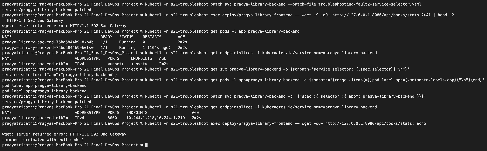

```text
$ kubectl -n s21-troubleshoot patch svc pragya-library-backend --patch-file troubleshooting/fault2-service-selector.yaml
service/pragya-library-backend patched
$ kubectl -n s21-troubleshoot exec deploy/pragya-library-frontend -- wget -S -qO- http://127.0.0.1:8080/api/books/stats 2>&1 | head -2
  HTTP/1.1 502 Bad Gateway
wget: server returned error: HTTP/1.1 502 Bad Gateway
$ kubectl -n s21-troubleshoot get pods -l app=pragya-library-backend
NAME                                      READY   STATUS    RESTARTS       AGE
pragya-library-backend-76bd5844b9-8kp4b   1/1     Running   0              2m2s
pragya-library-backend-76bd5844b9-bwtsw   1/1     Running   1 (104s ago)   2m2s
$ kubectl -n s21-troubleshoot get endpointslices -l kubernetes.io/service-name=pragya-library-backend
NAME                           ADDRESSTYPE   PORTS     ENDPOINTS   AGE
pragya-library-backend-dtk2m   IPv4          <unset>   <unset>     2m2s
$ kubectl -n s21-troubleshoot get svc pragya-library-backend -o jsonpath='service selector: {.spec.selector}{"\n"}'
service selector: {"app":"pragya-libary-backend"}
$ kubectl -n s21-troubleshoot get pods -l app=pragya-library-backend -o jsonpath='{range .items[*]}pod label app={.metadata.labels.app}{"\n"}{end}'
pod label app=pragya-library-backend
pod label app=pragya-library-backend
$ kubectl -n s21-troubleshoot patch svc pragya-library-backend -p '{"spec":{"selector":{"app":"pragya-library-backend"}}}'
service/pragya-library-backend patched
$ kubectl -n s21-troubleshoot get endpointslices -l kubernetes.io/service-name=pragya-library-backend
NAME                           ADDRESSTYPE   PORTS   ENDPOINTS                   AGE
pragya-library-backend-dtk2m   IPv4          8000    10.244.1.218,10.244.1.219   2m2s
$ kubectl -n s21-troubleshoot exec deploy/pragya-library-frontend -- wget -qO- http://127.0.0.1:8080/api/books/stats; echo

wget: server returned error: HTTP/1.1 502 Bad Gateway
command terminated with exit code 1
```

Pods healthy + Service has no endpoints = selector/label mismatch (`libary` vs `library`). The request made right after the fix still got 502; four seconds later it worked:

```text
$ kubectl -n s21-troubleshoot exec deploy/pragya-library-frontend -- wget -qO- http://127.0.0.1:8080/api/books/stats   (16:16:07)
{"titles":0,"total_copies":0,"available_copies":0,"issued_copies":0}
```

The EndpointSlice was already correct, but kube-proxy had not yet written the new rules on the node, so the connection to the Service IP was still refused (`connect() failed (111: Connection refused) while connecting to upstream` in the nginx log). Changes in Kubernetes are eventually consistent - wait a moment before deciding a fix did not work. (My first attempt at this test used `http://localhost:8080` and got "Connection refused" even before the fault: busybox resolved `localhost` to IPv6 `::1`, and nginx listens on IPv4 only because the read-only filesystem stops the nginx image from adding an IPv6 `listen` line. Using `127.0.0.1` fixed my test.)

**Fault 3 - wrong database password**

```text
$ kubectl -n s21-troubleshoot create secret generic pragya-library-db --from-literal=username=library --from-literal=password=wrong-password --dry-run=client -o yaml | kubectl apply -f -
Warning: resource secrets/pragya-library-db is missing the kubectl.kubernetes.io/last-applied-configuration annotation which is required by kubectl apply. kubectl apply should only be used on resources created declaratively by either kubectl create --save-config or kubectl apply. The missing annotation will be patched automatically.
secret/pragya-library-db configured

$ kubectl -n s21-troubleshoot rollout restart deploy/pragya-library-backend
deployment.apps/pragya-library-backend restarted
```

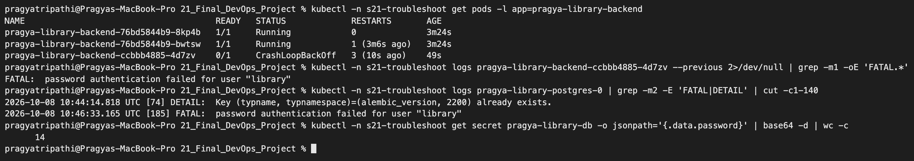

```text
$ kubectl -n s21-troubleshoot get pods -l app=pragya-library-backend
NAME                                      READY   STATUS             RESTARTS       AGE
pragya-library-backend-76bd5844b9-8kp4b   1/1     Running            0              3m24s
pragya-library-backend-76bd5844b9-bwtsw   1/1     Running            1 (3m6s ago)   3m24s
pragya-library-backend-ccbbb4885-4d7zv    0/1     CrashLoopBackOff   3 (10s ago)    49s
$ kubectl -n s21-troubleshoot logs pragya-library-backend-ccbbb4885-4d7zv --previous 2>/dev/null | grep -m1 -oE 'FATAL.*'
FATAL:  password authentication failed for user "library"
$ kubectl -n s21-troubleshoot logs pragya-library-postgres-0 | grep -m2 -E 'FATAL|DETAIL' | cut -c1-140
2026-10-08 10:44:14.818 UTC [74] DETAIL:  Key (typname, typnamespace)=(alembic_version, 2200) already exists.
2026-10-08 10:46:33.165 UTC [185] FATAL:  password authentication failed for user "library"
```

Things I noticed:
- The **old Pods kept working**: environment variables from a Secret are read only when a container starts, and PostgreSQL keeps the password it was initialised with. Changing a Secret breaks things only at the next restart - which can be days later and very confusing. `rollout restart` made it visible immediately.
- The init container still passed, because `pg_isready` only checks that the server accepts connections, not the password.
- The PostgreSQL log confirms the problem from the server side - and also still contains the migration race from real problem 3 (`alembic_version ... already exists`).

Fix: put the right password back and restart:

```text
$ kubectl -n s21-troubleshoot create secret generic pragya-library-db --from-literal=username=library --from-literal=password="$DB_PASSWORD" --dry-run=client -o yaml | kubectl apply -f -
secret/pragya-library-db configured
$ kubectl -n s21-troubleshoot rollout restart deploy/pragya-library-backend
deployment.apps/pragya-library-backend restarted
$ kubectl -n s21-troubleshoot rollout status deploy/pragya-library-backend --timeout=180s
...
deployment "pragya-library-backend" successfully rolled out
$ kubectl -n s21-troubleshoot get pods -l app=pragya-library-backend
NAME                                      READY   STATUS        RESTARTS        AGE
pragya-library-backend-658b99d9f5-9j9rs   1/1     Running       0               10s
pragya-library-backend-658b99d9f5-xrm2p   1/1     Running       0               4s
pragya-library-backend-76bd5844b9-bwtsw   1/1     Terminating   1 (3m23s ago)   3m41s
```

**Fault 4 - memory limit too small**

```text
$ helm upgrade pragya-library-ts helm/pragya-library -n s21-troubleshoot -f troubleshooting/values-troubleshoot.yaml -f troubleshooting/fault4-memory-limit.yaml | grep -E 'STATUS|REVISION'
STATUS: deployed
REVISION: 4
```

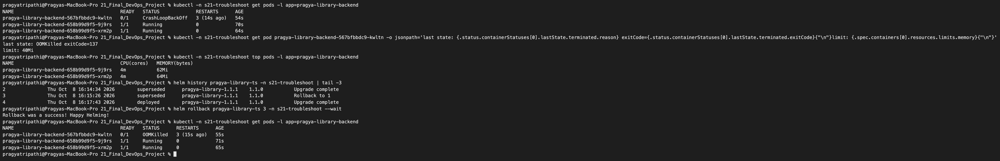

```text
$ kubectl -n s21-troubleshoot get pod pragya-library-backend-567bfbbdc9-kwltn -o jsonpath='last state: {.status.containerStatuses[0].lastState.terminated.reason} exitCode={.status.containerStatuses[0].lastState.terminated.exitCode}{"\n"}limit: {.spec.containers[0].resources.limits.memory}{"\n"}'
last state: OOMKilled exitCode=137
limit: 40Mi
$ kubectl -n s21-troubleshoot top pods -l app=pragya-library-backend
NAME                                      CPU(cores)   MEMORY(bytes)
pragya-library-backend-658b99d9f5-9j9rs   4m           62Mi
pragya-library-backend-658b99d9f5-xrm2p   4m           64Mi
$ helm history pragya-library-ts -n s21-troubleshoot | tail -3
2       	Thu Oct  8 16:14:34 2026	superseded	pragya-library-1.1.1	1.1.0      	Upgrade complete
3       	Thu Oct  8 16:15:26 2026	superseded	pragya-library-1.1.1	1.1.0      	Rollback to 1
4       	Thu Oct  8 16:17:43 2026	deployed  	pragya-library-1.1.1	1.1.0      	Upgrade complete
$ helm rollback pragya-library-ts 3 -n s21-troubleshoot --wait
Rollback was a success! Happy Helming!
```

Exit code 137 = 128 + 9 (SIGKILL from the kernel's OOM killer). The healthy Pods use 62-64 MiB just after start, so 40 MiB could never work. `kubectl logs` shows nothing useful here - the process is killed, it does not get to print an error; the Pod status is the evidence. Note how `helm rollback 3` goes back to the revision that was itself a rollback - Helm revisions only move forward.

## 10. Lessons learned

- **Gates must be able to fail.** The Trivy gate stopped my first build; without it those images would have run in the cluster.
- **Containers start in any order.** Databases are slow to start; apps must wait or retry (init container), and one-time steps like migrations must not run in every replica.
- **A new safety check needs its own test.** My `wait-for-db` fix broke the release because of a user-id detail; the rolling update protected users while I debugged.
- **Rolling updates and probes are what make mistakes cheap.** In every fault old Pods kept serving because new ones never became Ready.
- **Secrets are read at container start**, so a broken Secret can stay invisible for a long time.
- **GitOps changes the workflow**: release = commit, rollback = revert/new commit, and `kubectl` changes in `s21-library` would just be undone. For experiments I used a separate Helm-managed namespace.
- **Eventual consistency**: EndpointSlices, kube-proxy rules, HPA metrics and Argo CD polling all lag by seconds to minutes. Watching over time beats one-shot checks.
- **LocalStack is great for practising Terraform**, but it is not AWS (no EKS in Community, S3 tags not stored).

## 11. What is installed / clean-up

During this session the cluster had: namespace `s21-library` (Argo CD app `pragya-library`), `s21-troubleshoot` (Helm release `pragya-library-ts`), two extra ConfigMaps in `monitoring`, plus the Session 20 monitoring stack and Argo CD. LocalStack resources were destroyed with `terraform destroy` and the Compose stack with `docker compose -p pragya-library down -v`. At the end I removed the Kubernetes parts:

```text
kubectl delete -f gitops/argocd-application.yaml
helm uninstall pragya-library-ts -n s21-troubleshoot
kubectl delete -k monitoring/
kubectl delete ns s21-library s21-troubleshoot
```
